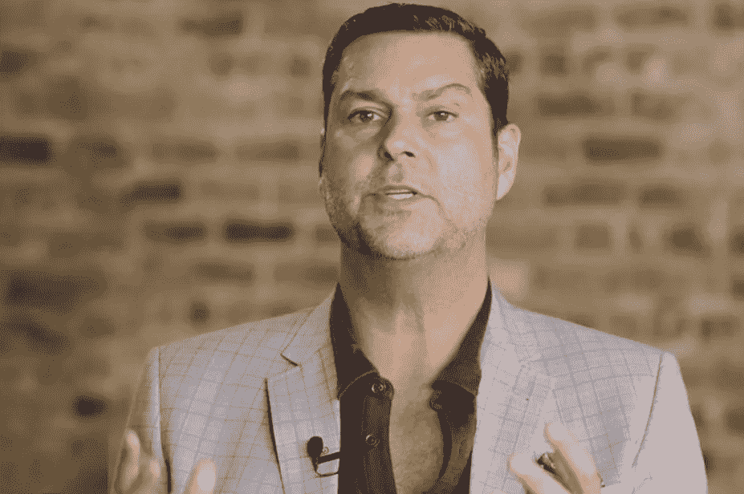
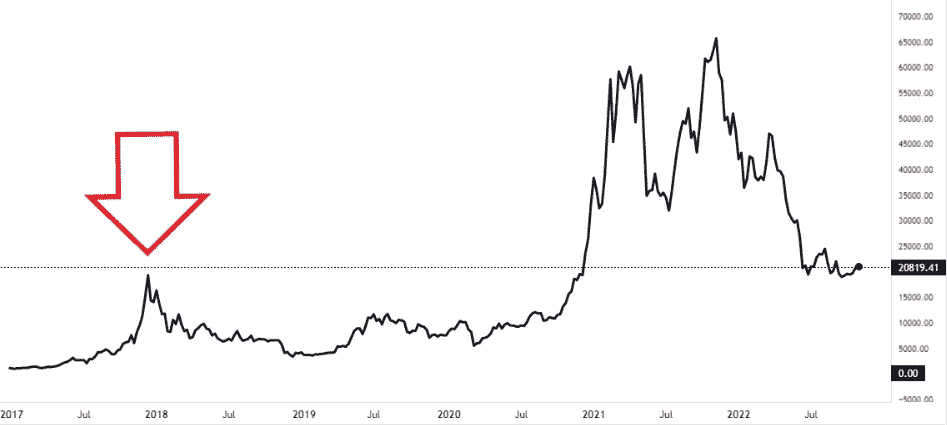

# 顶级经济史学家说，加密的冬天已经过去——你必须开始啃。

> 原文：<https://levelup.gitconnected.com/top-economic-historian-says-crypto-winter-is-over-you-must-start-nibbling-81962d50c343>

如果你避开其他人正在做的事情，那将是最好的。

来源— [真实视觉，公地](https://www.realvision.com/)

拉乌尔·帕尔是领先的商业周期经济学家、投资战略家和经济史学家。

他还对区块链技术有着不可否认的信念，打破复杂的想法，并使用巧妙的历史参考来准确描述加密货币未来可能发生的事情。

Pal 对当前加密货币格局的看法是，如果你在看今天的新闻，你需要交易六个月后的信息，因为它很可能已经在价格中反映出来了。

> 劳尔·帕尔:
> 
> “S&P 和 Crypto 已经反映了经济衰退的影响。价格中包含了很多因素。当然可以，还能再低一点吗？
> 
> 但作为一名投资者，你的蜘蛛侠审查人员应该介入并说，当每个人都害怕时，还有机会买入吗？
> 
> 我的前瞻性指标表明，经济将在明年(2023 年)第一季度回升，在这种情况下，市场将期待其中的一些。"

Pal 认为我们今天处于一个微妙的时刻。当一切收缩时，市场可能会陷入衰退，导致美联储银行和其他央行停止加息。

他认为事情有可能开始逆转，你想在别人没有准备好的时候做好准备。

他说，你希望能够购买，并准备好现金。

> 劳尔·帕尔:
> 
> “如果你年轻，你应该敢于冒险；年纪大了，就应该避险。就这么简单。
> 
> 你应该问，我如何利用加密领域的抛售，因为这些东西将在 20 年内获得最佳回报。"

# **以下是你需要问自己的问题。**

宏观市场推动加密。

你需要问自己，这种现状是永久的还是暂时的？

> 拉乌尔·帕尔:
> 
> “历史表明，商业周期有起有落，这是周期性的，所以几乎每次我们来到这里，加密市场都会比现在增长 10 到 20 倍”。

Pal 表示，这并不能保证下一次也会如此，但你的风险回报是非常有利的。

你已经看到了经济的转变，我们正从最大的痛苦走向看到中央银行改变路线，增加流动性，因为他们已经破坏了经济。

> 劳尔·帕尔:
> 
> “因此，当每个人都感到害怕，每个人都在吐他们的秘密，以太坊和比特币正在崩溃时，你应该集中精力。
> 
> 最好认为现在是积累的时候了”。

2018 年，我陷入了 ICO(首次发行硬币)崩盘的交叉火力之中。

我不需要卖掉我当时投资的任何少量加密货币，但我应该做的是在接下来的两年里当市场横向交易时积累。

下面是一张比特币图表，显示了市场在上次崩盘中的反应。

红箭是繁荣和萧条的象征

来源— [交易视图](http://tradingview.com)

# **拉乌尔·帕尔说你应该避免这些错误。**

帕尔认为，除非故事的基本面发生变化，比如国家禁止大规模加密，人们远离数字货币，否则抛售是你的朋友。

> 劳尔·帕尔:
> 
> “即使对我这样一个在金融市场摸爬滚打了 30 多年的人来说，我也经历了惨痛的教训，那就是当你拥有一项趋势如此强劲、波动如此剧烈的资产时，这些抛售就是你的朋友。”

他认为这些抛售与亚马逊上市时下跌 96%的相关性没有什么不同，然后上涨又下跌 80%。

> 拉乌尔·帕尔
> 
> “Crypto 的采用曲线与采用亚马逊网络的人相同，唯一成功坚持下来的人是杰夫·贝索斯”。

帕尔认为，市场是周期性的，我们非常接近或处于商业周期的底部，它可能会走低，但他认为大多数市场恐惧都已“消化”，所以现在是开始积累的绝佳时机。

> 劳尔·帕尔:
> 
> “如果加密市场的采用继续沿着同样的轨迹发展，投资者将会看到 10 至 20 倍的回报。”

# 这不会一帆风顺。

帕尔说，人们的工资没有上涨，但所有东西的价格都上涨了，人们会感到更穷。美联储可能会继续加息。

> 劳尔·帕尔:
> 
> “我们知道情况很糟糕。但在接下来的 6-9 个月里(截至出版时)，它们会变得很糟糕。
> 
> 当美联储提高利率时，他们从系统中取出流动性。
> 
> 他们告诉银行和其他人，我们将减少他们在系统中使用的资金。
> 
> 所以这意味着任何人都更难借到钱。
> 
> 你的抵押贷款已经上涨，你的租金已经上涨，每个人都停止消费，经济放缓，降低通货膨胀，因为对商品的需求减少。

他警告说，这将产生其他影响，主要是对就业市场的影响，所以在经济低迷时期大举投资加密之前，你应该考虑自己的选择。

> 劳尔·帕尔:
> 
> “另一个影响是人们将失去工作，与 Covid 期间保住的工作相同，但这一次，没有人想保住它们，因为美联储已经表示他们希望失业率上升。
> 
> 美联储希望你失业，这有点奇怪，但这就是他们想要的。

帕尔建议，现在是时候开始投资加密货币了，如果你有现金可用，而且它不会影响你的日常生活，因为所有东西的成本都在大幅增加。

他说有 3 亿人在投资加密货币，并且每年以 100%的速度增长，这是世界上有史以来最快的技术采用速度。

它正以几乎两倍于互联网的速度被采用。他最近在他的 YouTube 上重申了这条推文。

来源——[劳尔·帕尔推特](https://twitter.com/raoulgmi/status/1396837073202532357?lang=yo)

# **最后的想法。**

我在 2018 年 ICO 崩盘期间最大的错误是，在两年的大部分时间里，市场都在横向交易，但我没有持续增加我的加密投资组合。

你或我不能让时光倒流，但我们可以认识到一个伟大的机会。

当拉乌尔·帕尔说这些巨大的修正是你的朋友时，我相信他。它们给了你一个难以置信的进入市场的切入点，这个市场的采用率奇怪地增加了，但价格却下降了，就像他如何解释亚马逊的初始价格一样。

[平均成本](https://www.nerdwallet.com/article/investing/dollar-cost-averaging-2#:~:text=Dollar%2Dcost%20averaging%20is%20the,already%20be%20dollar%2Dcost%20averaging.)，不要过度举债，在别人害怕的时候享受建设。

> 如果你想在 Web3 上阅读更多我的观点，可以考虑成为会员。你的会员费直接支持你读的作家。如果你用我的链接 [*注册，我会赚一小笔佣金。点击这里*](https://medium.com/@jayden_levitt/membership) *。*

*本文仅供参考；不应将其视为财务、税务或法律建议。在做出任何重大财务决定之前，请咨询财务专家。*