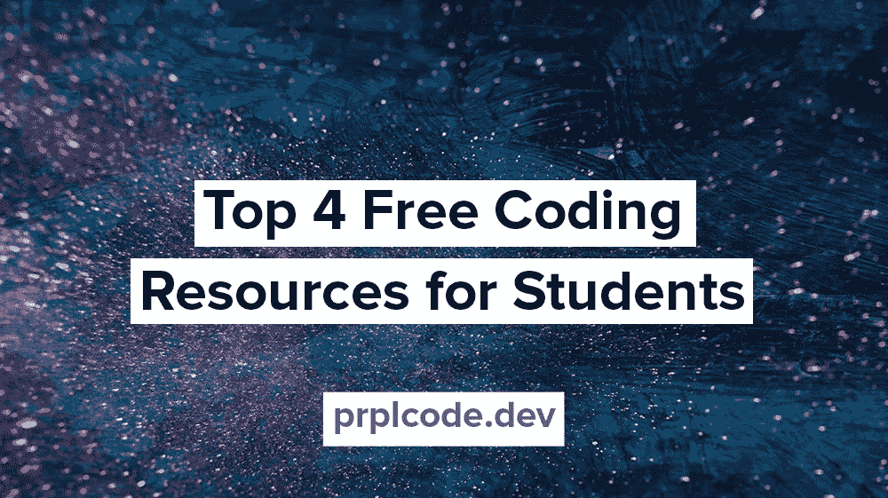
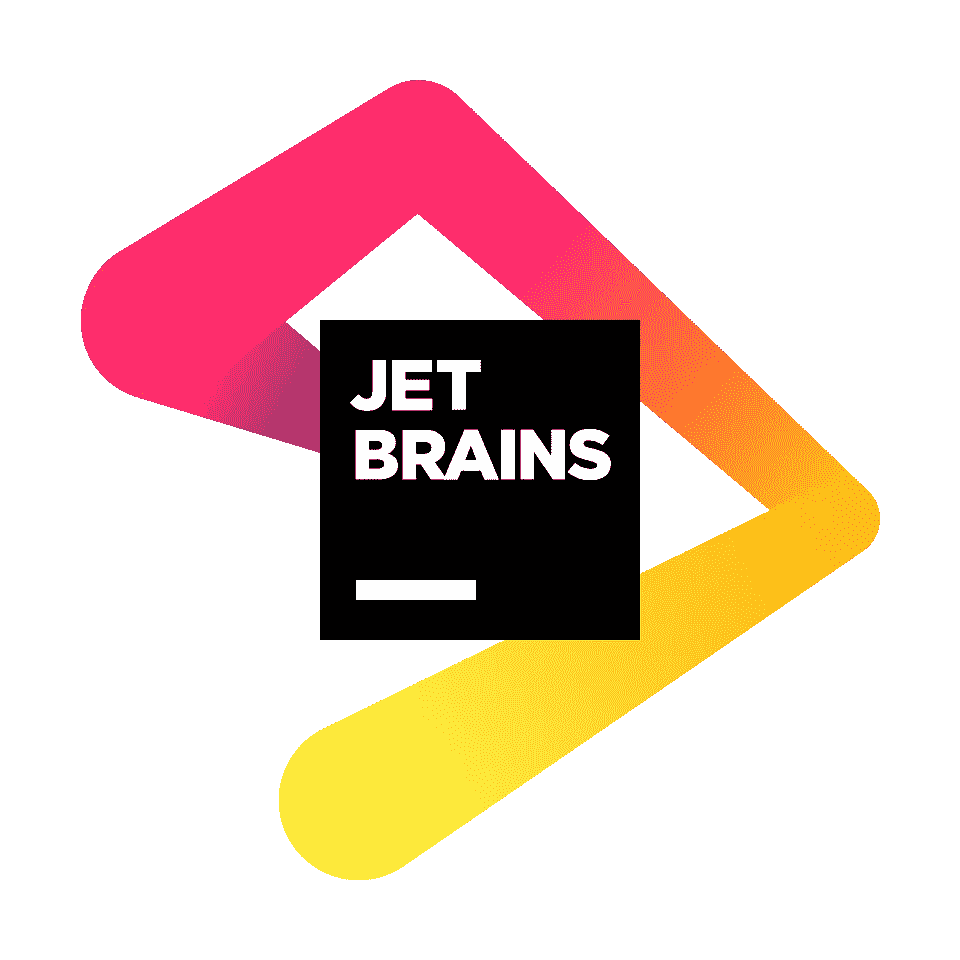
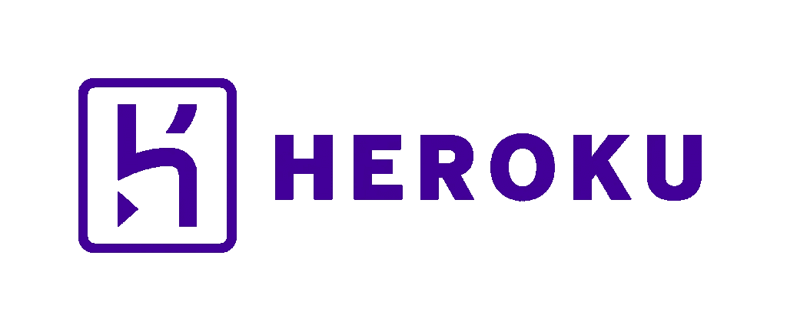
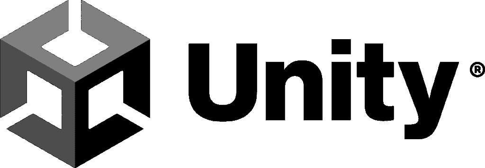

# 面向学生的 4 大免费编码资源

> 原文：<https://levelup.gitconnected.com/top-four-free-coding-resources-for-students-6cc7109f966a>

作为一名学生，免费的编码资源允许你尝试专业的工具和服务，否则你将不得不付费。幸运的是，有公司意识到让学生免费试用他们的服务的价值。如果你是学生，利用这个机会获得一些优质资源！

*(我与这些公司没有任何关联、联系、授权、认可或任何形式的官方联系)*

# 面向学生的免费编码资源

## [GitHub 学生开发者包](https://education.github.com/pack)

**这很可能是你能找到的对学生来说最好的免费编码资源。**您将获得大量服务、套餐和点数。获得免费域名、体验云提供商、免费高级课程等等。例如:

*   1 年期域名注册。我 TLD(名字便宜)
*   新用户可获得 100 美元的平台积分(数字海洋)
*   12 个月的 Canva Pro tier 订阅(Canva)
*   访问 25 个以上的 Microsoft Azure 云服务，外加 100 美元的 Azure 点数(Microsoft Azure)
*   6 个月参加所有课程和讲习班(FrontendMasters)
*   还有更多！

八爪猫

我在学生时代用这个部署了一个有自己域名的网站。去上一些很棒的课程。我学到了很多东西，这帮助我在 Spotify 找到了一份工作。

## [JetBrains 免费教育许可证](https://www.jetbrains.com/community/education/#students)

JetBrains 是流行创意背后的公司:IntelliJ、WebStorm、PyCharm 等等。作为一名学生(或教师)，你可以获得专业版本。

JetBrains

就我个人而言，这些是我最喜欢的想法，也是我日常使用的方法。当我还是学生的时候，我尝试过一些想法，但在我看来，JetBrains 的产品是最好的。我不会说为什么，但我建议你去拿个驾照。

## [Heroku](https://www.heroku.com/)

Heroku 是一个部署应用程序的平台。例如，您可以部署网站或后端服务。此外，Heroku 允许您附加资源，如数据库、监控等。他们提供一步一步的指导，这使它变得容易。

赫罗库

这些资源中的大部分可以与免费的爱好层一起使用，这使得它非常适合个人项目。我用 Heroku 很多年了。部署个人项目并使其在 web 上可用是我的首选服务。

**免费爱好层不是专门针对学生的，任何人都可以使用！**

## [团结学生计划](https://unity.com/products/unity-student)

游戏开发更适合你吗？那你应该去看看联合学生计划。Unity 是一个跨平台的游戏引擎，用于诸如 Overcooked、Disco Elysium、Hollow Knight 等游戏。我的意思是，看看[这份名单](https://en.wikipedia.org/wiki/List_of_Unity_games)！

一致

博彩业正在快速发展！随之而来的是对游戏开发者越来越多的需求。获得像 Unity 这样的应用程序的经验会让你更容易找到第一份工作。

# 结论

这是我为学生准备的四大免费编码资源。我记得当我还是学生的时候就发现了这些，并且发现它们都是免费的，这非常令人惊讶。如果你是学生，一定要去看看。这是一个尝试专业人员使用的工具和服务的机会。

*在* [*Twitter*](https://twitter.com/prplcode) *，*[*LinkedIn*](https://linkedin.com/in/simeg)*，或者* [*GitHub*](https://github.com/simeg)

*原载于*[*PRP lcode . dev*](https://prplcode.dev)