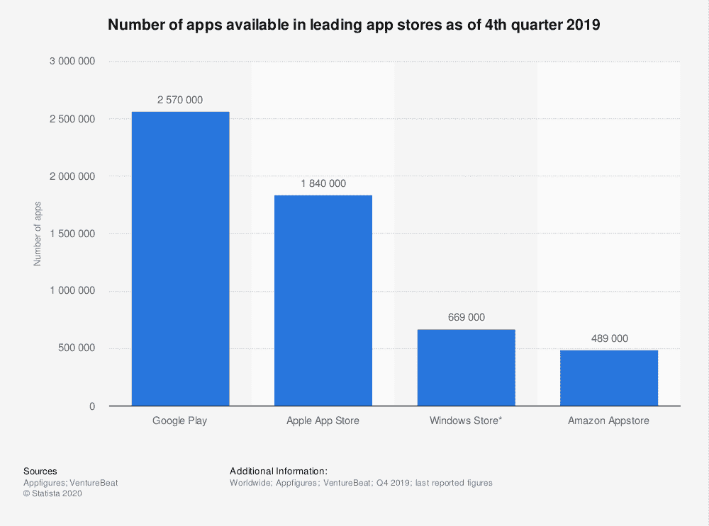

# Android 应用程序开发的顶级框架:Top 概述

> 原文：<https://levelup.gitconnected.com/top-frameworks-for-android-app-development-overview-of-top-dc95fcde75a0>

随着向移动设备的转移，越来越多的企业开始意识到应用程序对于与客户建立紧密联系至关重要。这就是为什么 Android 应用程序开发正在为不同类型的行业带来新的变化。

根据 Statista 的数据，截至 2019 年第四季度，谷歌 Play 商店上大约有 257 万个安卓应用程序，而且这个数字还在增加。时至今日，各种规模的许多公司都将移动应用纳入了他们的营销策略。

因此，面对这样的竞争，开发可靠的应用程序成为一项真正具有挑战性的任务。这里帮助开发者的是加速和优化整个过程的 Android 开发框架。

然而，为 Android 应用程序开发选择正确的框架并不容易。Android 框架的选择取决于你要开发什么类型的应用，以及你的项目的具体需求。

为了帮助你解决这个问题，我们创建了一个全面的概述和一些最好的 Android 框架的比较列表。

# 原生 Android 开发框架

原生 Android 开发是最受欢迎的一种。原生应用通常是用 [Kotlin](https://kotlinlang.org/) ，Java 或者 C++创建的。它为您提供了最大的灵活性，创造一个平滑的 UX 定制设计。有了它，您可以利用设备的硬件功能，包括麦克风、摄像头和传感器。这可以通过直接访问平台组件来实现。

## 本地开发工具包

[原生开发套件](https://developer.android.com/ndk)，或 NDK，被认为是最好的 Android 框架之一。它让开发者用 C 和 C++为 Android 设备编写代码。它很少用于整个项目。当开发人员必须处理应用程序中的性能问题时，他们经常使用它。

由于 NDK 旨在优化应用性能，它附带了大量用 C 和 C++编写的代码库。开发人员可以在构建新的应用程序时使用它们。

你可以在 Android Studio 中使用 NDK 将 C/C++代码编译成本机库。使用 Gradle，您还可以将其打包到您的 APK 中。

## IntelliJ- Kotlin

由 JetBrains 创建的 Kotlin 是最重要的静态类型编程框架之一。Android 开发者经常用它来开发应用程序。它结合了函数式编程和面向对象编程的特点。

2017 年，谷歌表示 Kotlin 可以作为 Android 开发的官方 IDE。它运行在 Java 虚拟机上。所以它完全可以与 Java 语言互操作。在许多情况下，它可以作为 Java 的替代品，因为它极大地统一了开发过程。许多程序员已经将 Kotlin 作为他们喜欢使用的 Android 主要框架之一。

由于字节码结构，用 Kotlin 开发的应用程序运行速度很快。

此外，如果您还没有尝试使用 Intellij-Kotlin，您应该考虑一下。根据最近的[栈溢出开发者调查](https://insights.stackoverflow.com/survey/2019#technology-_-most-loved-dreaded-and-wanted-languages)，Kotlin 被列为第四大最受欢迎的编程语言。

2020 年，许多大型企业正计划或正在搬迁到科特林。其中包括优步、Trello、Pinterest、Twitter、Basecamp、Airbnb 和网飞，它们更喜欢将 Kotlin 作为其 Android 应用程序的主要语言。自推出以来，Kotlin 已经证明了它是一个高度直观的 Android 应用程序开发平台。

## 煎茶触摸

[Sencha Touch](https://www.sencha.com/products/touch/) 是专为原生移动应用创建而设计的 Android 应用开发框架之一。它基于 HTML5 和 JavaScript，允许制作原生 Android 应用程序。

来源:[森查](https://www.sencha.com/products/gxt/)

Sencha Touch 带有近 50 个内置 UI 组件和原生主题。这使得开发人员能够创建引人注目和视觉愉悦的应用程序。该框架使用硬件加速方法，因此在它的帮助下创建的应用程序性能很高。

各大公司选择 Sencha Touch 是因为其高度的兼容性和灵活性、快速的执行时间和响应能力。用它构建的应用程序具有丰富的流体动画，滚动流畅，适应性强。其庞大的数据包、大量的主题集合、丰富的 UI 和集成的 MVC 系统使其成为 Android 开发的领先框架之一。

## jQuery Mobile

jQuery Mobile framework 是另一个帮助您构建可靠的 Android 应用程序的框架。它是一个基于 HTML5 的 UI 框架。它使你能够构建一个单独的、特别显著的响应性应用或网站。它几乎适用于所有平板电脑、手机和工作区。

为了简化特别修改的主题，jQuery mobile 创建了 ThemeRoller。有了它，您可以轻松地移动和下载自定义主题。对于没有膨胀的更清晰的视觉效果，你可以把它和 CSS3 属性一起使用，比如框阴影和内容阴影。

# Android 中的游戏开发框架

## 一致

Unity 广受欢迎，被认为是多平台 2D、3D、虚拟现实、增强现实游戏和人工智能驱动的应用程序的最佳 Android 架构框架。此外，Unity 被认为是游戏开发的顶级引擎，不仅适用于英国市场上的 Android 设备，根据 [Statista research 数据](https://www.statista.com/statistics/321059/game-engines-used-by-video-game-developers-uk/):

Unity 有免费版和专业版。

你可以很容易地在 C#和 UnityScript 中使用 Unity，这种 Unity 语言让人想起 JavaScript。这是一个跨平台的框架，允许开发者将其游戏扩展到多个平台，如 PlayStation、iOS、Web、Windows、Xbox 等。

这个框架的优点是可以使用大量的资产和工具，高度的灵活性和快速的创建。像许多软件开发工具一样，Unity 有一个内置的编辑器，可以让你通过“Animator”窗口改变图像和管理动画。除此之外，该框架提供了市场上最好的图形性能指标。

事实上，截至 2018 年，一半的最新手机游戏和超过 [60%的 AR/VR 体验内容都是用 Unity](https://unity.com/solutions/ar-and-vr-games) 创作的。这是一个易于使用的平台，允许开发者创建惊人的内容和强大的观众连接。

## Corona SDK

Corona SDK 于 2009 年开发，是构建快速游戏和即时体验应用程序的完美软件开发套件。它基于 Lua，一种开源的轻量级编程语言。由于这一点，它的开发速度比大多数其他 Android 应用程序框架快 10 倍。

来源:[科罗纳实验室](https://coronalabs.com/)

Corona 是一个跨平台的框架，但是在游戏开发者中非常流行。它完全免费，可用于 Windows 和 Mac OS X，并支持实时测试。这个框架有本地 UI 支持，超过 500 个 API，以及一个面向开发者的直观广告平台。

它的 API 套件有许多功能，包括网络、图形、小部件、粒子效果等等。Android 应用程序开发人员喜欢使用 Corona 框架，因为它对初学者友好且易于使用。

# 跨平台/混合 Android 框架

## 反应自然

React Native 是一个著名的开源框架，为其他开发工具及其 ide 提供平台支持。

来源:[到达原生](https://reactnative.dev/)

它基于 React，一个 JS 库，最近很受欢迎。像特斯拉、Instagram、沃尔玛和 Airbnb 这样的公司已经使用这种技术栈来开发他们的原生移动应用。它通常用于[构建单页面应用程序](/angular-vs-react-vs-vue-which-is-the-best-choice-for-2020-81f577697c7e)，以防您要开发 web 和移动版本。

除此之外，这个框架是 T2 MVP 开发和本地移动应用的流行选择。

该框架提供了一组核心的平台原生组件，包括视图、文本和图像，它们直接链接到平台的原生 UI 构建块。

由于大多数 React 本机 API 的跨平台支持，开发人员可以编写一次代码，然后在任何地方运行它。这提高了开发速度并降低了成本。

框架提供了一个热重新加载选项，开发人员可以链接更新的文件，同时保留当前的应用程序状态。React 本地编程社区的发展速度比最初推出时的预期要快得多。

## Xamarin

由微软 Xamarin 创建的是一个更受欢迎的 Android 开发框架。它提供了一个高级工具集，允许开发人员通过一个共享的 C#代码库为多个移动平台构建原生应用。

来源: [Xamarin](https://visualstudio.microsoft.com/xamarin/)

借助微软的云测试功能，使用 Xamarin 构建的应用程序可以在许多设备上进行测试。此外，它的代码共享特性使它成为人们的最爱，因为它减少了编码时间和开发人员必须处理的错误数量。

最近，Visual Studio IDE 开发了用于 Xamarin 的工具。有了它，你就有了开发工具包、云服务等等。因此，医疗保健和能源等行业的许多主要参与者都转向了 it。它已经存在了一段时间，但是与其他 Android 框架相比，最近使用它的开发者数量增加了很多。

## 加速钛

Appcelerator Titanium 是一个 Android 平台，可以用于 iOS 和 Windows。它使用了一个拖放面板，可以生成高质量的代码。它还具有双向更新的特性，允许代码和设计之间的无缝移动。

来源:[加速器](https://www.appcelerator.com/mobile-app-development-products/)

它让你可以跨操作系统和设备执行 UI 更改，还可以使用 JavaScript 直接访问每个 iOS 和 Android API。它还整合了第三方本地库，无需任何更改。

也许它最出名的是创造复杂的自定义效果，比如动态动画。您可以轻松地运行 Swift、Java 或 Objective C 代码以及 Titanium 代码。

## 离子的

Ionic 是一个由麻省理工学院认证的免费开源框架。它让开发者在 JavaScript、HTML5 和 CSS3 的帮助下构建渐进式混合应用。由于其跨平台功能和集成 AngularJS 的能力，它已经发展成为 Android 开发中最受欢迎的框架之一。

它承载一个 CLI(命令行界面),包括日志记录、模拟器和实时重新加载等功能。由于它是科尔多瓦和 Angular-based，它有一个大型和繁荣的社区。

## 摆动

由 Google 维护和开发的 [Flutter](https://flutter.dev/) 是一款多平台移动应用 SDK。它可以用来构建应用程序，但与其他 Android 应用程序框架不同。它加速了跨平台开发过程，并且是使用 Dart 编写的。Flutter 被很多人认为是混合应用开发的最佳选择。

来源: [Flutter.dev](https://flutter.dev/)

它的框架使用 2D 渲染引擎 Skia 来创建视觉效果。它类似于材料设计和库比蒂诺风格。它也是一个可靠的测试框架，使开发人员能够执行单元、UI 和功能测试。Flutter 具有出色的热重装功能。这允许无缝测试，无需重启应用程序。

## 科尔多瓦

没有 Cordova，排名前五的 Android 测试框架就不完整。这是另一个免费的开源 Android 框架。它允许开发者通过单一代码库构建多平台应用。这是一个混合框架，支持使用标准 web 技术进行应用程序开发。它与 JavaScript、HTML5 和 CSS3 配合得很好。Cordova 就像是移动应用和网络应用之间的桥梁。

它还可以访问本机设备 API，这使得识别应用程序是否是使用本机语言开发的非常困难。它主要是为开发在线应用程序而设计的，但它也为离线应用程序提供支持。这也使它成为开发桌面应用程序的完美平台。

## PhoneGap

PhoneGap 由 Apache 和 Adobe 支持，是一个开源的 Android 应用框架。它允许软件工程师使用 web 开发技术构建应用程序，并且可以与 HTML5、CSS3 和 JavaScript 一起工作。这是一个适用于原生 Android、iOS 和 web 应用程序的框架，因为它的多功能性而非常有用。

来源: [PhoneGap](http://docs.phonegap.com/tutorials/develop/1-embed-webview/ios/)

有了 PhoneGap，程序员可以跟踪应用开发过程中的任何变化。它通常用于开发混合移动应用程序。PhoneGap 提供一致的性能和不受硬件限制的工作自由。

你可以在 Android 上使用它，但它也有助于其他操作系统的应用程序开发。该框架的最新版本带有内置的 Cordova WebView，用于将 PhoneGap 代码集成到更复杂的本地应用程序中。它有一个扩展的集成插件库、第三方工具和一个快速发展的开发环境。

## 原生脚本

NativeScript 是混合应用程序开发的另一个框架。它的优点是免费和开源。

它使开发人员能够使用 Angular、Vue 和 TypeScript 创建应用程序。这个框架是由保加利亚软件公司 Telerik 设计的。从 CocoPods 到 Gradle，开发人员可以使用这个框架轻松地直接在他们的项目中重用各种插件。这是随着时间的推移越来越流行的 Android UI 测试框架之一。

它还使精通 JavaScript、HTML、CSS 和原生 UI 标记的 web 开发人员能够创建出色的渐进式应用程序。如此多的程序员选择 NativeScript 进行 Android 应用程序开发的原因之一是，它服务于原生平台的用户界面，例如，您将获得类似原生平台的性能和用户界面。

由于 JS 在 UI 线程上运行，该框架在所有本机平台 API 上实现了高性能。在所有用于 Android 的 Java 框架中，这可能是您使用起来受益最大的一个。

# 包扎

总之，为应用程序开发选择正确的 Android 框架可能是一个复杂的过程。适用于一家公司和一款应用的东西不一定适用于另一家公司。请记住，考虑您的特定应用程序和项目的需求，然后选择具有您需要的所有工具和功能的框架。祝你好运！