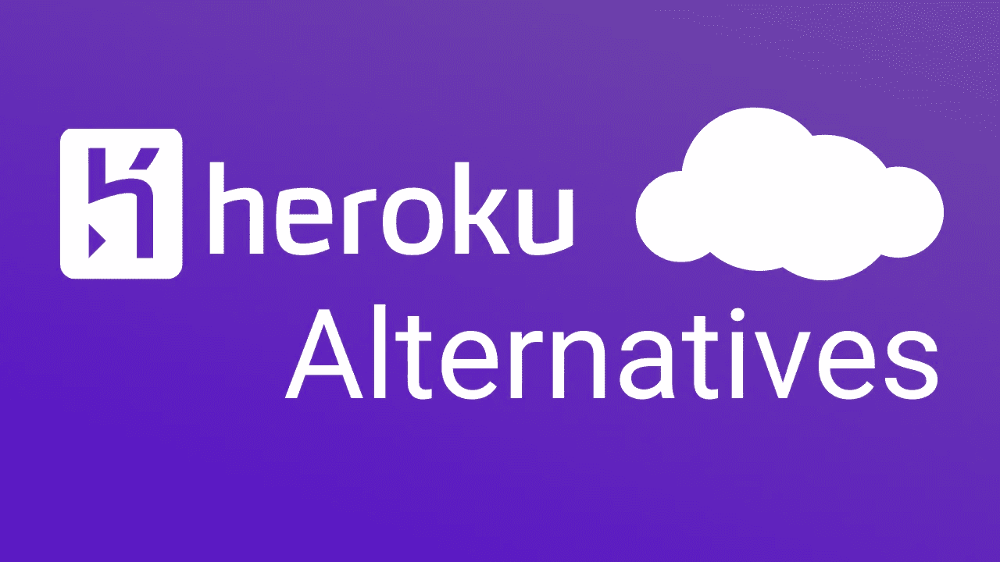

# Heroku 自由层备选方案

> 原文：<https://levelup.gitconnected.com/top-heroku-alternatives-73a758af8282>

嘿，各位，你们可能知道从 2022 年 11 月 28 日开始，Heroku [关闭了他们的免费层](https://blog.heroku.com/next-chapter)，这意味着免费的 Heroku Dynos、Postgres 和 Redis 服务器将不再可用。

出于这个原因，我们将着眼于 5 个最好的 Heroku 替代方案，您可以在其中托管您的全栈应用程序、后端 API 或网站，并且所有这些方案都提供免费计划。如果你有一个副业项目，你想主持，或者你只是想部署你的应用程序在某个地方免费测试，你可以在这些云平台之一部署它。

在这个 [GitHub 存储库](https://github.com/hayk-simonyan/basic-express-api) **中可以找到一个演示部署的示例应用程序。**这是一个简单的 Express.js 应用程序，因此我们可以验证我们的部署。

因此，让我们一个接一个地检查主机提供商并部署我们的测试应用程序，或者您可以部署您的真实应用程序(如果您有)。

# 提供；给予

第一个是[渲染](https://render.com/)。这是与 Heroku 最相似的服务，Heroku 在其[定价](https://render.com/pricing)页面上提供免费计划。

他们提供的服务包括

*   静态网站
*   网络服务
*   一种数据库系统
*   雷迪斯
*   克朗·乔布斯

[注册过程](https://dashboard.render.com/register?next=/)非常简单，只需选择你的 GitHub 或 GitLab 账户，注册就可以开始部署了。

## 部署

要在 Render 上部署 Node [Express](https://expressjs.com/) 应用程序，请遵循以下步骤

*   转到您的仪表板，单击“新建”按钮，然后选择“Web 服务”

*   提供对要部署的存储库的渲染访问权限，然后在此搜索该存储库并单击“连接”

*   选择它的名称、根目录、环境—您可以使用或不使用 Docker 来部署它，我将选择 Docker。对于第一个示例，选择您的区域和分支

*   在高级选项卡中，我将给出它的 Dockerfile 路径`./Dockerfile`

*   就这样，点击“创建 Web 服务”

Render 将通过克隆提供的 repo、构建 Docker 映像和运行容器来触发部署。这可能需要大约 5 分钟才能完成。

完成后，您可以在日志中看到您的服务正在运行。要验证它是否可以打开 Render 提供的 URL，您应该看到应用程序在该 URL 上启动并运行。

您可以在“日志”选项卡中监控应用程序。如果您有任何环境变量，请将它们添加到“环境”选项卡变量中。您可以在“事件”选项卡中查看您的最新部署。

## 限制

免费计划上的网络服务在渲染上有[限制](https://render.com/docs/free#free-web-services)。

*   在免费计划中，您将获得 512 MB 内存
*   CPU 是共享的
*   像 Heroku 的免费层一样，网络服务在 15 分钟不活动后会自动关闭。当有新的请求进来时，Render 会再次旋转它，以便它可以处理请求，这可能会导致长达 30 秒的响应延迟。
*   该免费计划允许您的帐户每月运行 750 小时的所有免费网络服务

# 循环的

接下来，我们有 [Cyclic](https://app.cyclic.sh/#/join/hayk-simonyan) ，一个专注于全栈应用的云平台。Cyclic 最好的一点是它没有睡眠，即使有一个免费层，这意味着应用程序不必睡眠(像 Heroku 和 Render)，唤醒，旋转或回收。所有前端和后端都随时准备就绪。

这是因为没有服务器，每个应用程序都完全部署在无服务器的云基础架构上。

## 部署

一旦代码的 GitHub 存储库连接到 Cyclic，代码就会被部署。Cyclic 将使用 GitHub 默认分支(main/master)来提取回购内容。对默认分支的每一次 git 推送或更改都会触发一次循环部署。这包括直接推送和拉取请求。

**注意:Cyclic 通过调用** `**npm start**` **来启动你的应用，这意味着你必须在你的** `**package.json**`中有一个开始命令

*   在你[注册 Cyclic](https://app.cyclic.sh/#/join/hayk-simonyan) (这个链接会在你注册后给你一张 10 美元的优惠券)后，你需要创建一个新的应用程序，然后点击“部署”按钮

*   转到“链接你自己的”选项卡，从你的 GitHub 帐户搜索资源库(第一次访问 Cyclic 时，你可能需要授权)

*   之后点击“连接”

*   在这里，您可以看到它安装了依赖项，部署了应用程序，并为您提供了可以访问应用程序的 URL。转到该 URL，您可以看到您的应用程序已成功部署

## **极限值**

循环应用在容量和使用上也有[限制](https://docs.cyclic.sh/overview/limits)。

他们的硬性限制是

*   30s 最大请求时间
*   6MB 最大 HTTP 请求/响应负载大小
*   没有请求或响应流
*   512MB 的临时磁盘空间安装在/tmp
*   S3 存储中单个文件大小为 5 TB

## 其他平台

Heroku 有更多的免费替代品，如

## 二亚乙基三胺

[Deta](https://www.deta.sh/) 是免费的，永远，是免费的云精雕细琢。

Deta Micros(服务器)是一个轻量级但可扩展的云运行时，与 HTTP 端点相关联。目前仅支持 Node.js 和 Python Micros。

他们提供了一个 CLI，将您的本地开发工作流与您的微云联系起来，请参见:[详细 CLI](https://docs.deta.sh/docs/home/#deta-cli)

要在 Deta 上部署您的 API，您需要安装和配置 Deta CLI，根据您是在 Mac、Windows 还是 Linux 上，该过程会有所不同，因此我将在这里留下 [CLI 配置](https://docs.deta.sh/docs/micros/getting_started)链接供您查看。

## 铁路

Railway 是一个部署平台，您可以在这里提供基础设施，在本地使用该基础设施进行开发，然后部署到云中。

Railway 提供了一个初始包和 500 小时的免费使用，之后你开始为你使用的 RAM 和 CPU 付费，每月 10 美元/ GB，每月 20 美元/ vCPU。

使用 [Railway CLI](https://docs.railway.app/develop/cli) 从命令行启动项目服务内的部署。铁路上的完整部署流程可在[这里](https://docs.railway.app/deploy/deployments)找到。

## Fly.io

Fly.io 也提供免费津贴

所有计划中免费包含的资源:

*   多达 3 个共享 cpu-1x 256mb 虚拟机
*   3GB 永久卷存储(总计)
*   160GB 出站数据传输

查看 Node.js 应用程序的[部署流程](https://fly.io/docs/languages-and-frameworks/node/)

## 资源

[https://blog.heroku.com/next-chapter](https://blog.heroku.com/next-chapter)

[https://render.com](https://render.com)

[https://render.com/pricing](https://render.com/pricing)

[https://www.cyclic.sh](https://www.cyclic.sh)

[https://www.cyclic.sh/pricing](https://www.cyclic.sh/pricing)

[https://www.cyclic.sh/vs-heroku](https://www.cyclic.sh/vs-heroku)

[https://fly.io](https://fly.io)

https://fly.io/docs/about/pricing

[https://www.deta.sh](https://www.deta.sh)

[https://railway.app](https://railway.app)

[https://railway.app/pricing](https://railway.app/pricing)