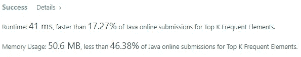
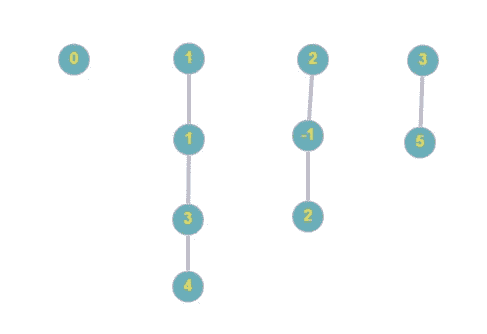
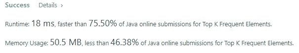

# 前 K 个常见元素盲 75 LeetCode 问题

> 原文：<https://levelup.gitconnected.com/top-k-frequent-elements-blind-75-leetcode-question-ebe5a29ceb7>


[**照片由 Bekir Dö nmez 在 Unsplash**](https://unsplash.com/photos/eofm5R5f9Kw) 上拍摄

## 任务描述:

给定一个整数数组`nums`和一个整数`k`，返回*`k`*最频繁出现的元素*。你可以按**任何顺序**返回答案。*

***例 1:***

```
***Input:** nums = [1,1,1,2,2,3], k = 2
**Output:** [1,2]*
```

***例二:***

```
***Input:** nums = [1], k = 1
**Output:** [1]*
```

***约束:***

*   *`1 <= nums.length <= 10^5`*
*   *`-10^4 <= nums[i] <= 10^4`*
*   *`k`在`[1, the number of unique elements in the array]`范围内。*
*   ***保证**答案**唯一**。*

***跟进:**你的算法的时间复杂度一定要比`O(n log n)`好，这里 n 是数组的大小。*

## *推理:*

*所以 task 要求我们计算前 K 个频繁元素，我们应该做的第一步是计算每个元素在给定数组中出现的次数。下面的代码解决了这个子问题:*

*计算每个元素的出现次数*

*收集了这些信息后，我们现在可以使用它来按照降序对元素进行计数排序，并返回前 K 个元素。首先，我们需要创建一个优先级队列，并为它提供逆序比较器，该比较器使用我们刚刚创建的 Map 中的信息*

*具有提供的比较器的优先级队列*

*接下来，我们将 valueToCount 映射中的所有键推送到我们的优先级队列中，这将强制它们根据计数按降序排序。之后，我们进行 K 次迭代，在每次迭代中，我们从优先级队列中移除顶部元素，并将其放入我们的答案中。*

*排序和挑选前 K 个元素逻辑*

*所以我们的解决方案应该是这样的:*

*第一种解决方案*

*它起作用并给我们以下结果:*

**

*虽然它有效，但结果看起来并不令人印象深刻，我们可以而且应该做得更好。此外，如果您仔细查看问题陈述，会发现它还有后续问题*

```
*Your algorithm's time complexity must be better than O(n log n), where n is the array's size.*
```

*现在是时候优化和加速我们的算法了。*

## *解决方案:*

*为了获得更好的性能，让我们从引入一个额外的变量开始，这个变量将保存所提供的数组中所有元素的最大出现次数。*

*更新了计算每个元素出现次数的逻辑*

*我们不能再使用我们的优先级队列，因为当我们添加 valueToCount 映射中的所有键时，它给了我们 **n log n** 时间复杂度。相反，我们希望做得更快。让我们引入整数列表的列表，称之为桶。不要害怕，我稍后会解释这个逻辑。*

*介绍存储桶*

*如您所见，我们做了一些小的优化—我们将存储桶的大小限制为计数阶段看到的最大值。*

*第一次尝试可能很难理解下一步，请给自己一些时间再读一遍。*

*让我们回顾一下我们的 valueToCount 映射，它保存代表给定数组中元素的键，值代表每个键出现的次数。记住这些信息，我们将遍历 valueToCount 映射的值，并将来自同一映射的键放入特定的位置。*

*让我们看看这个例子，试着想象一下我们所做的步骤。让我们来看看这个数组*

```
***[4,1,-1,2,-1,2,3,5,5,5]***
```

*数字 4、1、3 在每个数字中出现 1 次。数字-1，2 在每个数字中出现 2 次。数字 5 出现了 3 次。我们的地图应该包含以下信息*

```
*{-1=2, 1=1, 2=2, 3=1, 4=1, 5=3}*
```

*现在让我们想象一下桶*

**

*桶可视化*

*顶行反映出现的次数。只剩下一步了——我们需要收集并返回结果数组*

*收集结果逻辑*

*完整的解决方案应该是这样的*

*第二种解决方案*

*现在结果看起来好多了*

**