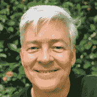
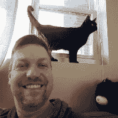
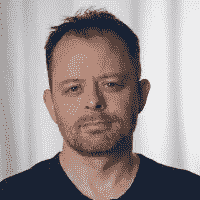
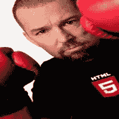

# 顶端。NET 开发人员和贡献者跟进

> 原文：<https://levelup.gitconnected.com/top-net-developers-contributors-to-follow-a2237f97d5c8>

## 提示和技巧

## 排行榜。NET 开发人员和贡献者联系，学习和获得新的技能。

Nubelson Fernandes 在 [Unsplash](https://unsplash.com/?utm_source=unsplash&utm_medium=referral&utm_content=creditCopyText) 上的照片

作为一名软件工程师，提高技术水平和获得新技能的最有效的方法之一，就是让你自己一直被你可以学习的优秀人才所包围。

这就是为什么在这篇文章中我会给你提供一份**顶级名人的名单。NET 开发者**，他们在**中以**巨大贡献**而闻名。NET** 软件世界。

为了充分利用这个列表，你可以**联系**并**关注**这里提到的伟人，我相信你会学到很多。

注:该列表按字母顺序排序**。**

 [## 🔥订阅艾哈迈德的时事通讯🔥

### 订阅艾哈迈德的时事通讯📰直接获得最佳实践、教程、提示、技巧和许多其他很酷的东西…

medium.com](https://medium.com/subscribe/@eng_ahmed.tarek) 

# 安德斯·海尔斯伯格

安德斯·海尔斯伯格

根据[维基百科](https://en.wikipedia.org/wiki/Anders_Hejlsberg):

> Anders hejlsberg(/ˈhaɪlzbɜːrɡ/，生于 1960 年 12 月 2 日)是一名丹麦软件工程师，他参与设计了多种编程语言和开发工具。他是 Turbo Pascal 的原始作者，也是 Delphi 的首席架构师。他目前在微软工作，是 C#的首席架构师和 TypeScript 的核心开发人员。

安德斯是《C#编程语言*的合著者。*

[**推特**](https://twitter.com/ahejlsberg)**|**[**GitHub**](https://github.com/ahejlsberg)

# 比尔·辛塞尔

比尔·辛塞尔

根据[微软](https://mvp.microsoft.com/en-us/PublicProfile/10317?fullName=Bil%20Simser):

> Bil Simser 是一名企业解决方案架构师，拥有超过 15 年的软件开发经验。一路走来，他帮助构建了许多大型关键任务系统。作为导师，他指导客户如何实现开发标准和指导方针，评估和推荐新的工具和技术，并帮助团队和项目进入。网络世界。Bil 还对指导客户敏捷和通用软件开发最佳实践特别感兴趣。
> 
> 比尔一直参与微软的。NET 平台，对优秀的架构和软件设计有着浓厚的兴趣。他专门研究 SharePoint。NET，敏捷，TDD，Windows Phone 7，还有电脑游戏编程。Bil 还运营着几个成功的开源项目。他为软件开发社区做出了贡献，花时间审阅和编辑 SharePoint 和 Agile 出版物，并在用户组、代码营和会议上发言，包括 TechEd、DevConnections、PDC 和 DevTeach。
> 
> 自 2004 年以来，比尔一直是微软 SharePoint 的 MVP，也是 MSDN 加拿大演讲协会的成员。比尔目前和他的妻子、女儿、一群贝奥武夫电脑、人类所知的每一台游戏机以及一个小型动物动物园在加拿大阿尔伯塔省生活和工作。

[**推特**](https://twitter.com/bsimser) **|** [**领英**](https://www.linkedin.com/in/bsimser/) **|** [**博客**](https://weblogs.asp.net/bsimser)

# 凯铁·麦卡弗里

凯铁·麦卡弗里

根据[财铁网站](https://caitiem.com/about-3/):

> Caitie McCaffrey 是后端和分布式系统天后。她目前是 Azure Sphere 安全服务的架构师和开发经理。自从 Azure Sphere 项目在微软研究的早期，她就一直参与其中，并有幸建立了服务和团队来帮助保护物联网。Caitie 的职业生涯是在 Twitter、343 Industries、微软游戏工作室和 HBO 构建大规模服务和系统。彩铁在几款视频游戏上都有积分，包括《战争机器 2》、《战争机器 3》、《光晕 4》和《光晕 5》。她在 CaitieM.com T21 有一个博客，并经常在推特上讨论技术。

[**Twitter**](https://twitter.com/caitie)**|**[**GitHub**](https://github.com/CaitieM20)**|**[**LinkedIn**](https://www.linkedin.com/in/caitie-mccaffrey-7831379b/)**|**[**博客**](https://medium.com/@caitiem20) **|** [**网站**](https://caitiem.com/)

# 查德·迈尔斯

查德·迈尔斯

燕尾软件公司的开发总监。奥斯汀的演讲者。网络用户组和 ADNUG 代码营。

[**Twitter**](https://twitter.com/chadmyers)**|**[**GitHub**](https://github.com/chadmyers)**|**[**LinkedIn**](https://www.linkedin.com/in/chadmyers/)

# 科里·海恩斯

科里·海恩斯

科里是赫肯公司的联合创始人兼首席技术官。他是一名演讲者、教师、Code Retreat 的联合创始人以及 MercuryApp 和 Slottd.com 的开发者。重点关注敏捷原则、技术和面向对象的开发实践。

****|**[**GitHub**](https://github.com/coreyhaines)**|**[**博客**](http://blog.coreyhaines.com/)**

****

# **达米安·爱德华兹**

****

**达米安·爱德华兹**

**根据[达米安的博客](https://damianedwards.wordpress.com/about/):**

> **我是微软 ASP.NET 团队的项目经理。我照看 ASP.NET 的核心(运进来的部分。NET)，以及构建在它之上的 Web 窗体框架。我还是 Web Forms MVP([http://webformsmvp.com](http://webformsmvp.com/))和 SignalR([http://signalr.net](http://signalr.net/))开源项目的创建者。**

**[**Twitter**](https://twitter.com/damianedwards)**|**[**GitHub**](https://github.com/DamianEdwards)**|**[**LinkedIn**](https://www.linkedin.com/in/damianpedwards/)**|**[**博客**](https://damianedwards.wordpress.com/)**

****

# **达米安警卫**

****

**达米安警卫**

**根据达米安的博客:**

> **我的名字叫达米安·嘉德，我在法国北部海岸边风景如画的根西岛上长大。(没错，就是牛来的地方)**
> 
> **我从 1983 年开始开发软件，那时我白天在学校的 Acorn BBC Micros 上学习，晚上学习我自己的辛克莱 ZX 光谱。我转而开发商业和互联网银行、电子商务、设备驱动程序、数据库、内部网、外部网、Windows 应用程序、内容管理和许多其他很酷的东西。**
> 
> **我目前正在开发下一代开发工具。**
> 
> **之前的一些职业亮点包括:**
> 
> **[GitHub](https://github.com/) 在做[原子编辑器](https://atom.io/)。**
> 
> ****Centurylink Cloud** —负责云产品的首席工程师，也是分析团队的一员**
> 
> ****攻击模式**——一家硅谷初创公司的首席技术官，为西部数据、微软、Xbox、Pinger 和蓝牙 SIG 开发应用程序**
> 
> ****网飞**——上海交通大学高级工程师。基于. NET 的平台。这包括网络视频播放器、Windows Phone 7x 和 Windows 8 应用程序**
> 
> ****Xbox**—Xbox web market place 和 xbox.com 更广泛服务的高级工程师，包括 Windows 8 的安全性和 JSON APIs**
> 
> ****微软**——从事 LINQ 到 SQL 和实体框架对象关系映射器的工作，是 Code First 的创始人之一**
> 
> ****理光** —国际分销商外部网订购系统的开发(1998 年)和后续扩展**
> 
> **在去美国之前，我积极参加了根西岛软件开发者论坛，在那里我做了很多关于 Subversion、Web 应用安全和微软语言集成查询(LINQ)的演讲。2020 年我回到了根西岛。**

**[**推特**](https://twitter.com/damienguard)**|**[**GitHub**](https://github.com/damieng)**|**[**LinkedIn**](https://www.linkedin.com/in/damieng/)**|**[**博客**](https://damieng.com/)**

****

# **大卫·艾博**

****

**大卫·艾博**

**David Ebbo 是微软开发 Windows Azure 网站的负责人，主要负责 Kudu 项目(OSS git 引擎)。他专攻 Azure 网站、ASP.NET、C#、软件设计和工程。**

**大卫现在在谷歌工作。**

**[**推特**](https://twitter.com/davidebbo)**|**[**GitHub**](https://github.com/davidebbo)**|**[**LinkedIn**](https://www.linkedin.com/in/davidebbo/)**|**[**博客**](http://blog.davidebbo.com/)**

****

# **大卫·福勒( [**推特**](https://twitter.com/davidfowl)**|**[**GitHub**](https://github.com/davidfowl)**|**[**LinkedIn**](https://www.linkedin.com/in/davidfowl/)**|**[**博客**](https://medium.com/@davidfowl)

# 德里克·科马丁

德里克·科马丁

根据德里克的说法:

> Derek Comartin 是一名软件开发人员和 Microsoft MVP，拥有二十年的专业经验，涉及企业、专业服务和产品开发。
> 
> 他为各种商业领域编写软件，如消费品、分销、运输、制造和会计。
> 
> 德里克经营着一个非常活跃的博客@ codeopinion.com 和 YouTube 频道，专注于软件架构和设计

[**推特**](https://twitter.com/codeopinion)**|**[**LinkedIn**](https://www.linkedin.com/in/dcomartin/)**|**[**YouTube**](https://www.youtube.com/channel/UC3RKA4vunFAfrfxiJhPEplw)**|**[**博客**](https://codeopinion.com/) **|** [**博客**](https://medium.com/@codeopinion)

# 德米特里·巴甫洛夫

德米特里·巴甫洛夫

据[德米特里的网站](https://dmitry-pavlov.com/):

> 我是拔尖的。全球网络开发者自由职业者。我已经编码 20 多年了。我主要处理 ASP.NET 核心和 Blazor (C#。NET Core)软件开发栈。我只会考虑 100%的远程机会。我运用 [SDLC](http://en.wikipedia.org/wiki/Software_development_process) 、[-面](https://en.wikipedia.org/wiki/Non-functional_requirement)、 [OOAD](https://en.wikipedia.org/wiki/Object-oriented_analysis_and_design) 、[固](http://en.wikipedia.org/wiki/SOLID_%28object-oriented_design%29)等工程功夫……但总是尽量用[吻](http://en.wikipedia.org/wiki/KISS_principle)原理。[栈上溢出前 1%](https://stackoverflow.com/users/story/804385) 。[自由职业开发者的前 3%](https://www.toptal.com/resume/dmitry-pavlov/XldPKX/worlds-top-talent) 。现役[微软 MVP](https://mvp.microsoft.com/en-us/PublicProfile/4020708) (8 个奖项)。计算机科学硕士学位。开源[作者](https://marketplace.visualstudio.com/publishers/dmitry-pavlov)和 35K+成员社区[协调员](https://www.facebook.com/groups/about.asp.net.core)。幽默感娴熟。

[**推特**](https://twitter.com/dr_dimaka)**|**[**GitHub**](https://github.com/dmitry-pavlov)**|**[**LinkedIn**](https://www.linkedin.com/in/dimaka/)**|**[**网站**](https://dmitry-pavlov.com/)|[**博客**](https://medium.com/@dmitry.pavlov)

# 德鲁·马什

德鲁·马什

德鲁是 Mimeo.com 的首席软件架构师。热衷于。NET，非常喜欢分布式系统架构。

[**Twitter**](https://twitter.com/drub0y)**|**[**GitHub**](https://github.com/drub0y)**|**[**LinkedIn**](https://www.linkedin.com/in/drew-marsh-9532174b/)

# 埃里克·劳伦斯

埃里克·劳伦斯

埃里克现在是微软的一名项目经理。众所周知，他是 Fiddler Web Debugger 的创始人，他用 C#开发了这个调试器，并在 2003 年至 2016 年期间是它的唯一维护者。Telerik 在 2012 年底收购了 Fiddler，他为他们工作到 2016 年。

[**推特**](https://twitter.com/ericlaw)**|**[**GitHub**](https://github.com/squaretone)**|**[**LinkedIn**](https://www.linkedin.com/in/eric-lawrence-08522b38/)**|**[**博客**](https://textslashplain.com/)

# 埃里克·利珀特

埃里克·利珀特

根据[埃里克的博客](https://ericlippert.com/about-eric-lippert/):

> 我在脸书设计和实现开发者工具。
> 
> 在 2016 年 2 月开始在脸书工作之前，我在 Coverity 从事 C#静态分析器的工作；在那之前，我是微软 C#编译器团队的主要开发人员，也是 C#语言设计团队的成员。在我为微软工作的 16 年中，我还参与了 VBScript、JScript、Windows Script Host 和 Visual Studio Tools for Office 的设计和实现。我也曾经是负责 JavaScript 语言标准化的 ECMA 委员会成员。
> 
> 我是几本编程书籍的作者，我把编辑编程书籍作为一种爱好。

****|**[**LinkedIn**](https://www.linkedin.com/in/eric-lippert-a3893485/)**|**[**博客**](https://ericlippert.com/)**

****

# **艾里斯·克拉森**

****

**艾里斯·克拉森**

**根据[微软](https://mvp.microsoft.com/en-us/PublicProfile/5000086?fullName=Iris%20Classon):**

> **Iris Classon 是一位受人尊敬的演讲者、作家、博客作者、微软 C# MVP 和 MEET(微软扩展专家团队)成员，对编程有着极大的热情。她有一条非凡的职业道路，证明了没有什么是不可能的——从一名有执照的注册临床营养师转变为一名拥有十几项认证的软件开发人员，并在知名公司担任全职开发人员。**
> 
> **她曾在 Hanselminutes、Computer Sweden 和 Developer Magazine 等报纸文章、在线文章和播客中出现。作为 TechDays、Scandinavian Developer Conference 和各种用户群等会议上广受欢迎的频繁发言人，她以其独特、富有创意和令人振奋的演讲风格而闻名。Iris 是起床和编码的女主人！播客，在业余时间，她作为营养师做公益工作，并积极参与开发人员社区。她也喜欢极限运动，比如赤脚跑步、山地自行车、举重和潜水，当然还有旅游。**

**[**推特**](https://twitter.com/irisclasson)**|**[**GitHub**](https://github.com/IrisClasson)**|**[**网站**](https://www.irisclasson.com/)**|**[**YouTube**](https://www.youtube.com/user/MrsIrisD)**

****

# **乔·梅奥**

****

**乔·梅奥**

**根据乔的 LinkedIn:**

> **Joe Mayo 是一名作家、讲师和独立顾问，他一直从事 C#和。NET 自 2000 年夏天发布以来。作为一名独立顾问，他与各种组织合作过，从初创企业到财富 500 强企业。他在这个旅程中的经历包括桌面、web、移动、云和人工智能技术。除了实际动手应用，他还教授 C#和。NET 多年来通过现场直播，视频和录制的视频课程。他的顶级开源项目是 LINQ 到 Twitter(在 GitHub 上)，NuGet 下载量超过 100 万次。当 Joe 不为有价值的客户服务时，他通过问答论坛、演示和写作(他最喜欢的消遣之一)为社区做出贡献。**

**[**推特**](https://twitter.com/JoeMayo)**|**[**LinkedIn**](https://www.linkedin.com/in/joemayo/)**|**[**博客**](https://joemayo.medium.com/) **|** [**网站**](http://www.mayosoftware.com/)**

****

# **乔·斯塔格纳**

****

**乔·斯塔格纳**

**Joe 在软件技术方面有 30 年的经验。他专攻 C++、Delphi、Java、JavaScript、Visual Basic、C#、PHP、Python、Ruby、Smalltalk，还有几门你不会听说过的语言。**

**[**推特**](https://twitter.com/misfitgeek) **|** [**领英**](https://www.linkedin.com/in/joestagner/)**

****

# **约翰爸爸( [**推特**](https://twitter.com/jonskeet)**|**[**GitHub**](https://github.com/jskeet)**|**[**LinkedIn**](https://www.linkedin.com/in/jon-skeet-ba3800/)**|**[**博客**](https://codeblog.jonskeet.uk/)

# 朱莉·勒曼

朱莉·勒曼

根据朱莉的博客:

> Julie Lerman 是微软数据访问技术:实体框架的主要独立权威。她从事编程工作已近 30 年，自 1989 年以来一直是一名独立顾问。Julie 是全球 150 位微软地区总监之一，他们是微软最高层员工的值得信赖的合作伙伴顾问。自 2003 年以来，她每年都被授予微软 MVP。

[**关于**](https://about.me/julielerman) **|** [**推特**](https://twitter.com/julielerman)**|**|[**GitHub**](https://github.com/julielerman)|[**博客**](http://thedatafarm.com/)|[**YouTube**](https://www.youtube.com/user/julievtgeek)

# 凯瑟琳·多拉德

凯瑟琳·多拉德

微软项目经理。NET 核心 CLI 和语言，包括 F#、C#和 Visual Basic。微软 MVP 和微软 [*代码生成的作者。净*](https://www.apress.com/us/book/9781590591376) *。*

[**Twitter**](https://twitter.com/kathleendollard)**|**[**GitHub**](https://github.com/KathleenDollard)**|**[**LinkedIn**](https://www.linkedin.com/in/kathleendollard/)

# 凯茜·安德森

凯茜·安德森

微软 Visual Studio 调试器的项目经理，经常在全国性的技术会议上发言。

[**推特**](https://twitter.com/kayceesue)

# 凯文·多克斯

凯文·多克斯

根据凯文的说法:

> 我是一名自由职业的解决方案架构师、Pluralsight 作者和顾问，住在安特卫普(比利时)，自 2003 年以来一直在这个领域工作。
> 
> 最近，我主要关注 RESTful 架构 web 应用程序和移动应用程序的安全性。也就是说，我仍然关注微软其他产品的新发展。网络堆栈。
> 
> 我是微软 MVP(类别: *Visual Studio 和开发技术*，其中包括 ASP.NET， *Windows 开发*，针对客户端 Windows 应用)和 RD MS 社区的董事会成员。我定期[为 Pluralsight](https://www.pluralsight.com/authors/kevin-dockx) 撰写课程，并且经常在各种国家和国际会议&用户团体活动上发言。
> 
> 其次，我是开源软件的热心支持者。我参与的项目，包括马文。JsonPatch.Dynamic 和微软。AspNet.JsonPatch(对 JsonPatch 标准的支持，AspNet 核心的一部分)可以在[我的 GitHub 页面](https://github.com/kevindockx)找到。
> 
> 请随时在 [Twitter](https://twitter.com/kevindockx) 上联系我，或者通过[联系表格](https://www.kevindockx.com/contact)联系我。

[**推特**](https://twitter.com/kevindockx)**|**|[**GitHub**](https://github.com/kevindockx)**|**[**网站**](https://www.kevindockx.com/)

# 克里斯蒂安·海兰

克里斯蒂安·海朗

根据[克里斯坦](https://mvp.microsoft.com/en-us/PublicProfile/5000587?fullName=Kristian%20Hellang):

> Kristian 是一名经验丰富的全栈开发人员，他喜欢使用各种技术——从后端数据库到前端用户界面设计。他对面向对象编程有着深刻的理解，并且总是关注最佳实践和原则。
> 
> Kristian 非常关心他的手艺，从不错过任何学习新事物或提高现有技能的机会——无论是通过阅读博客帖子、观看在线课程、参加会议和当地用户组，还是通过从事他的许多业余项目中的一个。当他不忙着学习新东西时，他喜欢教学和指导他人。你可以经常发现他在 StackOverflow 上回答问题，写博客，在当地的。NET 用户组，NNUG，或者在挪威开发者大会上。
> 
> 他是开源软件的坚定信徒，已经为 100 多个不同语言和社区的开源项目做出了贡献。这些项目中有一些最受欢迎的。NET 开源项目，如 scriptcs、Nancy 和 Serilog，他每天都维护这些项目。

[**Twitter**](https://twitter.com/khellang)**|**[**GitHub**](https://github.com/khellang)**|**[**LinkedIn**](https://www.linkedin.com/in/khellang/)

# 马尔滕·巴利奥

马尔滕·巴利奥

根据[马尔滕](https://about.me/maartenballiauw):

> 马尔滕·巴利欧喜欢构建网络和云应用。他的主要兴趣是 ASP.NET MVC、C#、微软 Azure 和应用程序性能。他是 JetBrains 的开发者倡导者。他是 ASP 内部人员，前微软 MVP。Maarten 经常在各种国家和国际活动中发言，并组织 www.azug.be 活动。闲暇时，他喜欢自己酿造啤酒。

[**推特**](https://twitter.com/maartenballiauw)**|**[**GitHub**](https://github.com/maartenba)**|**[**LinkedIn**](https://www.linkedin.com/in/maartenballiauw/)**|**[**博客**](https://blog.maartenballiauw.be/)

# 马克·格雷夫尔

马克·格雷夫尔

在微软工作的代码极客；栈溢出校友；C#风扇；前 MVPprotobuf-net 的作者；衣冠楚楚，东南。Redis 和其他一些东西。

[**推特**](https://twitter.com/marcgravell) **|** [**博客**](https://blog.marcgravell.com/)

# 玛丽亚·娜加加(AWS 认证开发人员助理证书
tensor flow、scikit-learn、PyTorch、JAX

[**推特**](https://twitter.com/DynamicWebPaige)**|**[**GitHub**](https://github.com/DynamicWebPaige)**|**[**LinkedIn**](https://www.linkedin.com/in/dynamicwebpaige/)**|**[**博客**](https://medium.com/@dynamicwebpaige)

# 菲尔·哈克

菲尔·哈克

据[菲尔](https://haacked.com/about/):

> 我在 [A Serious Business，Inc.](https://www.aseriousbusiness.com/) 开发软件，这是我和一个朋友共同创办的公司。我们是[方丈](https://ab.bot/)的创造者。一个托管聊天机器人，帮助团队实现聊天。你可以在[我介绍方丈](https://haacked.com/archive/2021/02/11/introducing-abbot/)的博文中了解更多。
> 
> 在我开始一个严肃的商业公司之前，我在 GitHub 工作，尽我所能让它变得更棒。在那之前，我在微软的 NuGet 和 ASP.NET MVC 工作，并帮助开创了微软的开源时代。
> 
> 我也是几本技术书籍的作者和定期的国际演讲人。

[**推特**](https://twitter.com/haacked)**|**[**GitHub**](https://github.com/Haacked)**|**[**LinkedIn**](https://www.linkedin.com/in/haacked/)**|**[**博客**](https://haacked.com/)|[**博客**](https://medium.com/@haacked)

# 里克·斯特拉尔

里克·斯特拉尔

西风科技公司的总裁。作家，演讲人，[代码杂志](http://www.codemag.com/Magazine)联合出版人，C# MVP。

[**推特**](https://twitter.com/RickStrahl)**|**[**GitHub**](https://github.com/RickStrahl)**|**[**博客**](https://west-wind.com/wconnect/weblog/) **|** [**博客**](https://medium.com/@RickStrahl_13614) **|** [**网站**](https://weblog.west-wind.com/)

# 斯科特·艾伦

斯科特·艾伦

根据斯科特的说法:

> 我开发软件已经超过 25 年了。我还通过我的公司 OdeToCode LLC 提供咨询和培训。我是一名 [Pluralsight 作者](https://app.pluralsight.com/profile/author/scott-allen)，是 [Medisolv Inc.](https://medisolv.com/) 的 CTO，是播客 [Herding Code](http://herdingcode.com/) 的共同主持人，也是微软地区总监和 MVP。

遗憾的是斯科特·艾伦去世了。他独特的教学风格和他清晰独特的声音，造就了一个伟大的教练。他对社区的贡献是他的遗产。我们肯定会想念他的。

****|**[**GitHub**](https://github.com/OdeToCode)**|**[**博客**](https://odetocode.com/)**

****

# **斯科特·格思里**

****

**斯科特·格思里**

**根据[斯科特](https://weblogs.asp.net/scottgu/about):**

> **作为微软云和企业集团的执行副总裁，Scott Guthrie 负责公司的云基础设施、服务器、数据库、管理和开发工具业务。他的工程团队构建了微软 Azure、Windows Server、SQL Server、Active Directory、System Center、Visual Studio 和. NET。**
> 
> **在领导云和企业集团之前，Guthrie 帮助领导了微软的公共云平台 Microsoft Azure。自 1997 年加入公司以来，他为微软的许多关键云、服务器和开发技术做出了重要贡献，并且是的最初创始人之一。NET 项目。Guthrie 毕业于杜克大学，获得计算机科学学士学位。他与妻子和两个孩子住在西雅图。**

**[**推特**](https://twitter.com/scottgu)**|**[**GitHub**](https://github.com/scottgu)**|**[**LinkedIn**](https://www.linkedin.com/in/guthriescott/)**|**[**博客**](https://weblogs.asp.net/scottgu)**

****

# **斯科特·汉塞尔曼**

****

**斯科特·汉瑟曼**

**据[斯科特](https://www.hanselman.com/about):**

> **我是一名程序员、教师和演讲者。我在俄勒冈州波特兰的家庭办公室为微软的网络平台团队工作，但是这个博客，它的内容和观点是我自己的。我写关于技术、文化、小工具、多样性、代码、网络、我们要去哪里和我们去过哪里的博客。我对社区、社会公平、媒体、企业家精神以及最重要的开放网络感到兴奋。**

**[**推特**](https://twitter.com/shanselman)**|**[**GitHub**](https://github.com/shanselman)**|**[**LinkedIn**](https://www.linkedin.com/in/shanselman/)**|**[**YouTube**](https://www.youtube.com/user/shanselman)**|**[**博客**](http://www.hanselman.com/blog/) **|** [**博客**](https://medium.com/@shanselman) **|****

****

# **谢尔盖·米加尔尼科夫**

****

**谢尔盖·米加尔尼科夫**

**Novanet 的高级顾问。对 DevOps 有特殊兴趣的 Fullstack 后端开发人员。稀有内容 Hero badger 的骄傲拥有者是社区的真正贡献者。**

******|**[**LinkedIn**](https://www.linkedin.com/in/sergey-migalnikov-4355b233/)**|**[**博客**](https://sergeydotnet.com/)****

********

# ****西蒙·基亚雷塔****

********

****西蒙·基亚雷塔****

****Simone 是一名软件开发人员/架构师。他在电脑上编码。NET 平台自从 2001 年的时候。NET 仍处于测试版。他还写了一本关于 ASP.NET MVC 的书。****

****[**推特**](https://twitter.com/simonech)**|**[**GitHub**](https://github.com/Simonech)**|**[**LinkedIn**](https://www.linkedin.com/in/simonech/)**|**[**博客**](http://codeclimber.net.nz/)****

********

# ****斯蒂芬·沃尔特****

********

****斯蒂芬·沃尔特****

****Stephen 专攻 ASP.NET、Meteor 和 JavaScript。他是关于 ASP.NET 的畅销书的作者，也是几家成功创业公司的创始人之一。****

****[**推特**](https://twitter.com/swalther) **|** [**领英**](https://www.linkedin.com/in/stephenwalther/) **|** [**博客**](http://stephenwalther.com/)****

********

# ****史蒂夫·桑德森****

********

****史蒂夫·桑德森****

****据史蒂夫称:****

> ****自 2010 年以来，我一直在微软从事网络技术工作。我最初在 MVC 3 时代加入了 spent 团队，然后花了几年时间完成了一系列项目，包括 JavaScript 库和新的 Azure 管理门户网站 T21。最近，我重新加入了 ASP.NET 团队，目标是让这个平台成为 JavaScript 开发人员的纯粹乐趣。****
> 
> ****除此之外，我对软件技术的其他方面也有浓厚的兴趣。我早在 2010 年就开始了 [Knockout.js](http://knockout.js/) 项目(*在客户端 MV*很酷*之前)，我也是不断在科技会议上作为演讲者出现的乏味面孔之一。****
> 
> ****之前我开发了。NET software 作为一名承包商/顾问为布里斯托尔和其他地方的客户服务，另外还为一家出版社写了一些书，如[Pro ASP.NET MVC 框架](http://www.amazon.com/ASP-NET-Framework-Experts-Voice-NET/dp/1430210079)及其各种续集。****

****[**推特**](https://twitter.com/stevensanderson) **|** [**博客**](http://blog.stevensanderson.com/)****

********

# ****史蒂夫·阿达斯·史密斯(。
</blockquote>
够了吗？我也需要 IMyInterface 吗？</t>

levelup.gitconnected.com](/a-best-practice-for-designing-interfaces-in-net-c-2c6ebdb4f1c1) ********