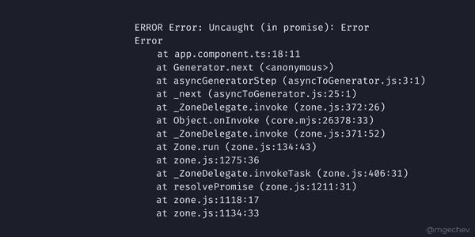

# Angular 中的顶级新功能

> 原文：<https://levelup.gitconnected.com/top-new-features-in-angular-f310b7aff36a>

## [👀VV] —有棱角的开发者不要错过！


作者:FAM

## 你好👋

希望你很棒，愿意学习新的东西！今天的小贴士是关于你不应该错过的新的棱角特征。

准备好了，我们走！

# 可访问性提升

当今网络应用的一个关注点是可访问性。Angular 的最新版本为此提供了许多新东西。

## 1-自定义页面标题

文档标题对于您的[页面可访问性](https://javascript.plainenglish.io/make-your-web-page-accessible-to-the-world-c99a867a750b?source=your_stories_page-------------------------------------&gi=8cded1f584a9)至关重要。之前，我们在 Angular 中创建了具有两个主要属性的路线:`***path***`和`***component***`:

```
const routes: [Routes](https://angular.io/api/router/Routes) = [   
  { 
      path: 'my-component', 
      component: MyComponent 
  }
];
```

有了 Angular 14，事情变得更加直观和简单。对于打开的路径或路线，你指定一个`***title***`，就这样。您的文档现在有标题了！

```
const routes: [Routes](https://angular.io/api/router/Routes) = [   
  { 
      path: 'my-component',
      ***title: 'my component',*** 
      component: MyComponent 
  }
];
```

## 2-优化图像

新的 Angular 指令`***NgOptimizedImage***` 通过实施最佳实践(如延迟加载非优先图像)来提高图像加载性能。如果属性`***width***` 和`***height***` 设置不正确，会给你一个警告。如果图像在渲染时会出现视觉失真，则向您发出警告。

要使用它，您需要将它导入到组件的模块中:

```
import { [NgOptimizedImage](https://angular.io/api/common/NgOptimizedImage) } from '@angular/common';@[NgModule](https://angular.io/api/core/NgModule)({  
    ...       ** *imports: [***[***NgOptimizedImage***](https://angular.io/api/common/NgOptimizedImage)***]***
})class AppModule {}
```

和

```

```

您也可以使用`***IMAGE_LOADER***` 令牌来加载您的图像。有关加载图像和指令使用的更多示例，请查看[角度文档](https://angular.io/api/common/NgOptimizedImage)。

## 3 -@ angular/CDK/a11y 封装

丰富的软件包，包含许多用于提高应用程序可访问性的功能。这是一种增强可访问性的更高级的方法。例如，它有一些功能，比如用于对比问题的样式工具。 [**LiveAnouncer**](https://material.angular.io/cdk/a11y/overview) 为屏幕阅读器宣布消息等等。

其他增强可访问性的新功能还包括棱角分明的材料。

# 用于角度调试的友好的 Chrome devTools 消息

V15 附带了一个令人兴奋的 Chrome devTools 功能，让您的开发人员在调试 Angular 应用程序时更加轻松。调试是一项令人头痛且耗时的任务。有了这个新功能，源问题马上就显示出来了！很高兴 Minko Gechev 最近在 Linkedin 上分享了这个新功能。



明科·格切夫

# 独立组件

这个预览功能将在未来推出，但你已经可以用 Angular 14 测试它了。当我了解到它的时候，我非常兴奋，因为它在创建小组件方面非常实用。创建一个组件有时需要导入、提供者和声明，但是如果你的组件是轻量级的，不需要很多依赖项和服务就能正常工作，那该怎么办呢？这个特性是一个节省时间和代码最小化的解决方案，非常适合这个用例。

它不止于此。也可以创建独立的指令和管道。

独立组件看起来是这样的:

```
@[Component](https://angular.io/api/core/Component)({   
   ***standalone: true,***   
   selector: 'photo-gallery',   
   **imports: [AnotherComponent],**
   template: `
      <h1>My first standalone component, yeaaah!</h1>
      <another-component></another-component>
   `,
 }) export class MyComponent {   
  ...
}
```

您可以导入模块、提供服务和导出内容，就像我们在经典模块中所做的一样。不同之处在于，组件工作的所有配置都可以在一个文件中完成，即组件类。

为大量进口、出口的重要零部件提供服务。我会用 NgModule 来代替传统的方法。否则，独立特性是简化和最小化代码并拥有更少文件的一种令人兴奋的方式。

今天就到这里，看阿雅🙋

如果你有任何问题或反馈，请点击评论或通过 LinkedIn 联系我— **我洗耳恭听！**

[**想请我喝杯咖啡吗？☕️**](https://www.buymeacoffee.com/fatimaamzil)

> 让我们为 2022 年打造一个更好的‘我们’！

> 如果你喜欢我的文章， [**订阅**](https://famzil.medium.com/subscribe) 获取我的最新。如果你自己喜欢体验媒介，可以考虑通过[**注册会员**](https://famzil.medium.com/membership) 来支持我和其他成千上万的作家。它每月仅花费 5 美元，它支持我们，作家，你也有机会通过你的写作赚钱。当然，你可以随时取消会员资格。通过注册[这个链接](https://famzil.medium.com/membership)，你将直接用你的一部分费用来支持我，不会花你更多的钱。如果你这样做了，万分感谢！

让我们在 [**上**取得联系****](https://medium.com/@famzil/)**[**Linkedin**](https://www.linkedin.com/in/fatima-amzil-9031ba95/)**[**脸书**](https://www.facebook.com/The-Front-End-World)**[**insta gram**](https://www.instagram.com/the_frontend_world/)**[**YouTube**](https://www.youtube.com/channel/UCaxr-f9r6P1u7Y7SKFHi12g)**或**[](http://www.twitter.com/fati_amzil)********

******[](https://famzil.medium.com/membership) [## 通过我的推荐链接——FAM 加入 Medium

### 作为一个媒体会员，你的会员费的一部分会给你阅读的作家，你可以完全接触到每一个故事…

famzil.medium.com](https://famzil.medium.com/membership)******