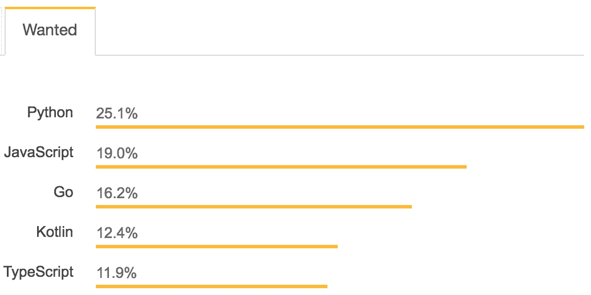

# 2018 年要学习的顶级编程语言

> 原文：<https://levelup.gitconnected.com/top-programming-languages-to-learn-in-2018-85038d36273a>

## 2018 年最受欢迎和最重要的编码语言，将帮助你发展职业生涯，使你成为更好的开发人员和软件工程师

当我们在 2018 年编码时，让我们看看对软件工程产生最大影响的编程语言。学习每一种创造出来的语言是不可能的，但是这篇文章揭示了一些可能增加你个人开发者快乐或者提供未来工作机会的语言。让我们来看看 2018 年的顶级编程语言。

TLDR: TypeScript，Go，Python，Kotlin + Swift，SQL，Rust，Elixir

# 以打字打的文件

不管你是喜欢还是讨厌 JavaScript，毫无疑问的是，这种语言会一直存在下去。TypeScript 旨在通过引入静态类型来解决 JavaScript 最大的抱怨之一。这意味着开发人员在编写代码时必须声明变量的类型。例如，我们在下面声明函数参数，以确保我们只传递字符串:

```
const sayHello = (name: string) => `Hello, ${name}`
```

根据 Stack Overflow 的数据，TypeScript 的受欢迎程度为 18%，在最受欢迎的语言中排名前 5(在 JavaScript 之上)，自创建以来仅 5 年时间，TypeScript 的受欢迎程度就直线上升。初创公司和科技巨头正在享受它的好处。2018 年的所有迹象都表明，TypeScript 只会越来越受欢迎。如果您是一名 JavaScript 爱好者，喜欢跟上不断变化的形势，那么深入研究一下 TypeScript 是有意义的。

[](https://gitconnected.com/learn/typescript) [## 学习 TypeScript -最佳 TypeScript 教程(2018) | gitconnected

### 打字稿的前 17 门课程。教程由开发者提交并投票，使您能够找到最好的…

gitconnected.com](https://gitconnected.com/learn/typescript) 

# 去

Go 只是接管了编程世界。这种语言是由 Google 在 2009 年创建的，它提供了 C/C++的许多好处，但是 Go 做了许多修改以提高简洁性、简单性和安全性。简而言之，围棋几乎什么都做得很好。该代码易于理解，但计算效率也令人难以置信。一个新的开发者可以很快学会它。它是一种静态类型和编译的语言，可以有效地管理并发性。


考虑到 Go 的诸多优势，选择众多用例是有意义的。它的速度使它成为 web 服务器的一个很好的选择，并且它足够简单来快速启动微服务。它很好地处理了网络，Go 作为系统语言也做得很好。Go 的一些实际实现是:

1.  [以太坊源代码](https://github.com/ethereum/go-ethereum)和 Hyperledger 区块链的主要语言
2.  Kubernetes 是用 Go 建造的
3.  顶级科技公司的无数网络服务器和工具

Go 可能是添加到开发人员工具箱中的完美语言。它有能力做好这么多事情，这意味着它将永远作为任何工作的工具出现在人们的谈话中。

[](https://gitconnected.com/learn/golang) [## 学习围棋-最佳围棋教程(2018) | gitconnected

### 围棋前 22 名。教程由开发人员提交并投票，使您能够找到最好的围棋课程…

gitconnected.com](https://gitconnected.com/learn/golang) 

# 计算机编程语言

Python 已经存在了将近 30 年，但它仍然是软件工程师的热门选择。这种语言经受住了时间的考验，表明它不仅值得了解，而且可能是一种期望，因为它无处不在。事实上，堆栈溢出调查显示，it [是最受欢迎的编程语言](https://insights.stackoverflow.com/survey/2018/#most-loved-dreaded-and-wanted)。



Python 是一种漂亮的脚本语言，已经发展到在许多领域支持开发者生态系统。它提供了 Django 和 Flask，使得构建 web 应用程序和 API 变得简单。该社区还为数据科学和学术编程提供了非常强大的工具。

Python 已经证明了它会存在很长一段时间。如果你投入时间去学习它，毫无疑问会有回报的。

[](https://gitconnected.com/learn/python) [## 学习 Python -最佳 Python 教程(2018) | gitconnected

### Python 的 86 门顶级课程。教程由开发者提交并投票，让你找到最好的 Python…

gitconnected.com](https://gitconnected.com/learn/python) 

# 科特林+斯威夫特

这些语言被普遍认为是对其前辈的改进。它们为在各自的平台上编写移动应用程序提供了更好的开发体验。

Kotlin 作为最受欢迎的编程语言排名第二，在过去的一年里得到了谷歌和 Android Studio 的官方支持。许多 Android 团队正在将他们的代码库从 Java 中转换出来。如果你是一个 Android 工程师，不要害怕潜入这里，拿起 Kotlin，因为它似乎将在可预见的未来需求很高。

Swift 是由苹果公司开发的，因此 iOS 工程师不再需要使用 Objective-C。该语言只有 4 年的历史，但已被迅速采用。Swift 4.0 于 2017 年发布，随着工程师们继续采用它，它没有表现出放缓的迹象。

[](https://gitconnected.com/learn/ios-swift) [## 学习 iOS 和 Swift -最佳 iOS 和 Swift 教程(2018) | gitconnected

### iOS 和 Swift 排名前 36 的课程。教程由开发者提交并投票，使您能够找到最好的…

gitconnected.com](https://gitconnected.com/learn/ios-swift) [](https://gitconnected.com/learn/kotlin) [## 学习科特林-最佳科特林教程(2018) | gitconnected

### 科特林的 15 大课程。教程由开发者提交并投票，让你找到最好的 Kotlin…

gitconnected.com](https://gitconnected.com/learn/kotlin) 

# 结构化查询语言

虽然它与我们列表中的其他语言不太一样(有些人可能认为它不属于这里)，但是理解 SQL 是非常重要的。几乎每一家科技公司都会有一些数据存储，目前最流行的方法仍然是 SQL 实现。理解数据存储和检索只会让你成为更好的软件开发人员。如果您是一名前端工程师，从未研究过您的数据来自哪里，那么请帮自己一个忙，了解一下 SQL。

[](https://gitconnected.com/learn/sql) [## 学习 SQL -最佳 SQL 教程(2018) | gitconnected

### SQL 的前 27 门课程。教程由开发人员提交并投票，使您能够找到最好的 SQL 课程…

gitconnected.com](https://gitconnected.com/learn/sql) 

# 锈

Rust 是一种由 Mozilla 赞助的系统编程语言。鉴于它的用例，每个工程师学习它是不必要的，但是如果你想做系统编码，你应该检查 Rust。在 2016 年、2017 年和 2018 年连续三年的 Stack Overflow 调查中，Rust 被评为最受欢迎的语言。分享这份爱，看看为什么这么多人开始生锈。

[](https://gitconnected.com/learn/rust) [## 学习 Rust -最佳 Rust 教程(2018) | gitconnected

### 生锈的前 14 道菜。教程由开发者提交并投票，让你找到最好的答案…

gitconnected.com](https://gitconnected.com/learn/rust) 

# 长生不老药

对于我认为会越来越受欢迎的语言来说，Elixir 更像是作者的选择。目前，它拥有一批对这种语言深信不疑的工程师，而且它也开始被一些著名的初创公司采用。函数式编程的流行正在迅速增长，随着工程师们朝着这个方向前进，Elixir 将成为一种被迅速采用的语言。

Elixir 是一种运行在 Erlang 虚拟机(BEAM)上的功能性、并发性、通用编程语言。除了软件工程师喜欢用它来构建之外，Elixir 还证明了它可以支持在巨大用户负载下运行良好的大型可伸缩系统。流行的聊天应用程序 Discord 写了一篇文章，介绍了他们如何通过使用 Elixir 在一个渠道中扩展到 5，000，000 个并发用户和数万个并发用户。相比之下，Slack 在一次聊天中可以处理大约 10，000 个并发用户。

[](https://blog.discordapp.com/scaling-elixir-f9b8e1e7c29b) [## Discord 如何将 Elixir 扩展到 500 万并发用户

### 从一开始，不和谐就是长生不老药的早期采用者。Erlang VM 是高度…

blog.discordapp.com](https://blog.discordapp.com/scaling-elixir-f9b8e1e7c29b) 

对长生不老药的热爱已经创造了一个强大的崇拜者群体，它有可能成为下一个大语言。

[](https://gitconnected.com/learn/elixir) [## 学习灵药-最佳灵药教程(2018) | gitconnected

### 长生不老药的 15 大课程。教程由开发者提交并投票，让你找到最好的灵丹妙药…

gitconnected.com](https://gitconnected.com/learn/elixir) 

# 结论

在一门语言上投入时间总是有风险的。当然，我们这样做是因为我们热爱它，但更好的是找到现实生活中的机会来使用我们学到的东西。我们都希望我们能学会所有的东西，但是如果你把重点放在这个列表中的语言上，它将确保你在你的技能组合中增加一些工具，这些工具将在未来几年中使用。