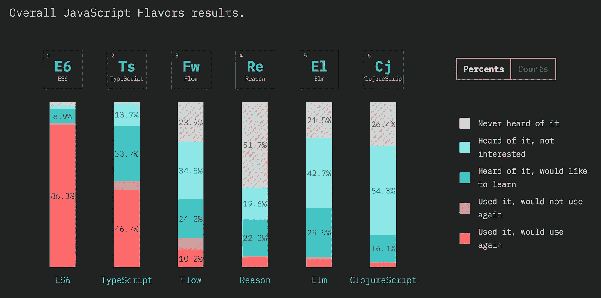
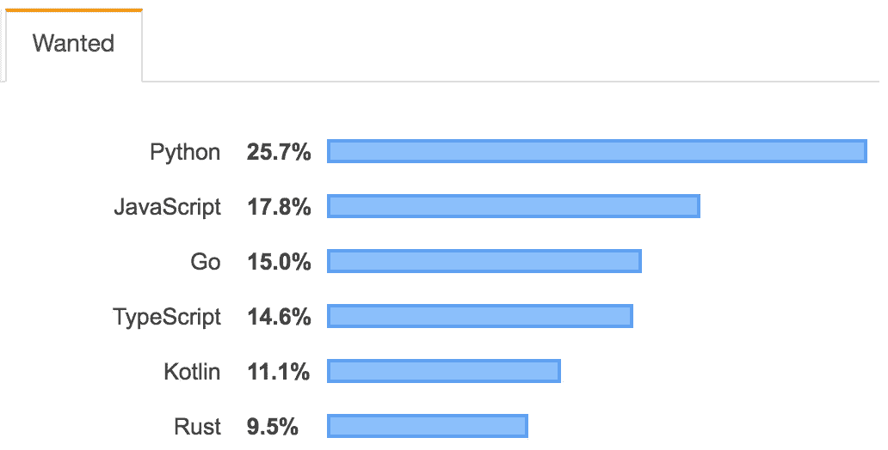
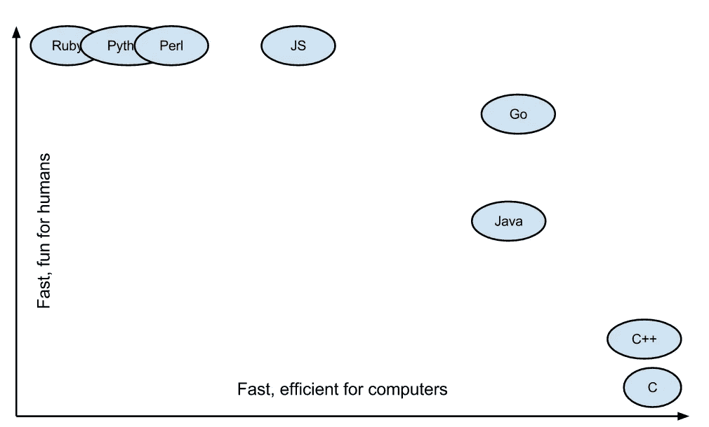
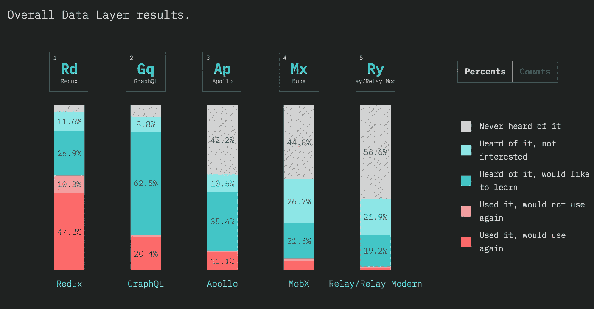

# 2019 年要学习的顶级编程语言

> 原文：<https://levelup.gitconnected.com/top-programming-languages-to-learn-in-2019-e1cad7ced3fb>

## 2019 年最受欢迎和最重要的编码语言，将帮助你发展职业生涯，使你成为更好的开发人员和软件工程师

决定学习哪种编程语言是我们作为软件工程师最喜欢做的事情之一，但它也对我们的职业生涯和我们能够找到的工作类型产生了难以置信的影响。学习一门编程语言的机会成本意味着它会占用学习其他东西的时间，所以我们必须高效地集中精力，确保我们现在和未来的成功。

这份名单根据语言目前的增长率以及对整个行业的影响进行了排名。它将介绍不同领域的语言——无论你想成为前端工程师、后端工程师还是移动开发人员，你都会找到有用的材料。让我们来看看 2019 年的顶级编程语言。

**TLDR: TypeScript/JavaScript，Python，Kotlin，Swift，Go，Rust，Elixir，SQL，GraphQL，Solidity**

> 注意: **JavaScript 是理解**的必备语言。然而，鉴于它已经被所有经验水平的人充分理解和教授，它被排除在这个列表之外，以便为开发人员提供额外的选项来扩展他们的知识和技能集。

 [## 组合 API -轻松发展您的编码事业| gitconnected

### 消除在每个单独位置手动更新您的详细信息的痛苦。只需在您的中更改一次数据…

gitconnected.com](https://gitconnected.com/portfolio-api) 

# 以打字打的文件

TypeScript 的发展已经接管了 JavaScript 世界，无数的初创公司和科技巨头将它作为使用 JS 的主要语言。不可否认 JavaScript 对应用程序开发的影响，许多人将 TypeScript 视为核心 ECMAScript 语言的必要扩展，它提供编译时静态类型检查以及对代码的可见性，这是标准 JavaScript 所不具备的。

TypeScript 已经成为 JS 的事实上的类型系统，击败了其他竞争对手，如 Flow，其采用率远远高于 ReasonML。[根据 Stackoverflow](https://insights.stackoverflow.com/survey/2019#technology-_-most-loved-dreaded-and-wanted-languages) 的数据，TypeScript 以 73.1%的分数位列最受喜爱的编程的第三位。这仅排在 Rust 和 Python 之后，比 Kotlin 高一位——所有这些都在这个列表中。

JavaScript State 调查显示，TypeScript 是仅次于 ES6 的第二种最常用的 JS 风格，有 80.4%的开发人员在使用它或想学习它。

虽然有些人试图争辩 TypeScript 可能成为下一个 CoffeeScript，但不可否认 TS 对 JS 生态系统的影响及其解决问题的独特性。TypeScript 问世仅 6 年，已经获得了社区的大力支持。在 JavaScript 中没有任何本机类型支持的迹象，看来 TypeScript 将在未来几年内继续存在。

 [## 学习 TypeScript -最佳 TypeScript 教程(2019) | gitconnected

### 18 大 TypeScript 教程-免费学习 TypeScript。课程由开发人员提交并投票，从而实现…

gitconnected.com](https://gitconnected.com/learn/typescript) 

# 计算机编程语言

开发者热爱 Python。年复一年，这个事实是真实的。Python 已经成为数据科学家的主要语言，R 是它唯一真正的竞争对手。此外，Python 广泛用于构建 web 应用程序 API 和通用脚本。

Python 已经存在了 30 多年，经受住了时间的考验。它将列为第二大最受欢迎的语言和第一大最受欢迎的语言。

Python 也达到了两个里程碑。最近，它在 StackOverflow 问题的总数上超过了 JavaScript，它正在贬低 Python 2.x，并通过 Python 3 全面走向未来。

Python 已经证明了它将继续作为软件工程师的顶级语言。如果你投入时间去学习它，毫无疑问会有回报的。

 [## 学习 Python -最佳 Python 教程(2019) | gitconnected

### 50 大 Python 教程-免费学习 Python。课程由开发人员提交并投票，使您能够…

gitconnected.com](https://gitconnected.com/learn/python) 

# 科特林

当 Kotlin 推出时，开发人员很快将其作为比 Java 更好的编写 Android 应用程序的替代方案。最近，谷歌甚至将其命名为 Android 应用程序开发的[首选方法](https://techcrunch.com/2019/05/07/kotlin-is-now-googles-preferred-language-for-android-app-development/)。

Kotlin 是一种跨平台语言，旨在完全与 Java 互操作，并在 JVM 上运行。这种语言是静态类型的，但比 Java 简洁得多。除了提供更好的代码可读性和开发人员体验，Kotlin 的其他改进包括空指针安全性、扩展函数和中缀符号。

根据 StackOverflow 的数据，Kotlin 被列为第四大最受欢迎的语言，并且已经巩固了它作为 Java 的更好替代品的地位。无论您是想为 Android 开发应用程序，还是想在 JVM 上拥有更好的语言，Kotlin 都是确保您为未来做好准备的绝佳选择。

 [## 学习科特林-最佳科特林教程(2019) | gitconnected

### 16 大科特林教程-免费学习科特林。课程由开发人员提交并投票，使您能够…

gitconnected.com](https://gitconnected.com/learn/kotlin) 

# 迅速发生的

Swift 由苹果公司推出，作为 Objective-C 的替代方案，为 iOS 和 Mac 编写应用程序。就像 Kotlin 取代了 Android 应用程序的 Java 一样，Swift 迅速成为 iPhone 开发者的首选编码语言。Swift 在最受欢迎的编程语言中排名第六，并且已经成为移动开发者的必备工具。

 [## 学习 Swift -最佳 Swift 教程(2019) | gitconnected

### 32 大 Swift 教程-免费学习 Swift。课程由开发人员提交并投票，使您能够…

gitconnected.com](https://gitconnected.com/learn/ios-swift) 

# 去

Golang 已经迅速成为构建微服务的顶级语言之一。这种语言是十年前由 google 创建的，它提供了 C/C++的许多好处，但是 Go 做了许多修改以提高简洁性、简单性和安全性。

简而言之，围棋几乎什么都做得很好。该代码易于理解，但计算效率也令人难以置信。一个新的开发者可以很快学会它。它是一种静态类型和编译的语言，可以有效地管理并发性。

Go 最著名的地方是它在开发者体验中的独特位置，同时它的速度也令人难以置信。代码写起来几乎像脚本语言，允许开发人员快速构建服务。然而，它的类型推断也提供了我们从更冗长的语言中所期望的对代码的可见性，以及同样的安全性。谷歌对 Go 进行了优化，使其在内存和超快的速度方面效率惊人。

鉴于围棋的诸多优势，它被迅速采用也就不足为奇了。它的速度使它成为 web 服务器的一个很好的选择，并且它足够简单来快速启动微服务。它很好地处理了网络，Go 作为系统语言也做得很好。Go 的一些实际实现是:

1.  Kubernetes 是用 Go 建造的
2.  以太坊源代码和 Hyperledger 区块链的主要语言
3.  为顶级科技公司(谷歌、优步、Twitch、Medium、Postmates 等等)提供无数的网络服务器和工具

Go 可能是添加到开发人员工具箱中的完美语言。它有能力做好这么多事情，这意味着它将永远作为任何工作的工具出现在人们的谈话中。

 [## 学习围棋-最佳围棋教程(2019) | gitconnected

### 22 大围棋教程-免费学习围棋。课程由开发者提交和投票，使您能够找到…

gitconnected.com](https://gitconnected.com/learn/golang) 

# 锈

如果不包括 Rust，这个列表将是不完整的。根据 StackOverflow 的数据，它连续第四年被评为 2019 年最受欢迎的编程语言。

Rust 主要是作为一种系统编程语言使用的，但是已经认识到它在这个领域之外的发展。有更多的教程弹出来使用 Rust 作为 web 服务器，它是可以编译成 WebAssembly 的语言之一。

分享这份爱，看看为什么这么多人开始生锈。

 [## 学习 Rust -最佳 Rust 教程(2019) | gitconnected

### 14 大铁锈教程-免费学习铁锈。课程由开发者提交并投票，使您能够找到…

gitconnected.com](https://gitconnected.com/learn/rust) 

# 药剂(或 Scala 或 Clojure)

随着函数式编程越来越受欢迎和被采用，一份顶级语言的列表如果不包括至少一种，将是不完整的。使用 Elixir、Scala 或 Clojure 不会出错——这三种语言都有很高的平均工资、相似的用法和开发人员采用率。

由于我需要选择一个，我的个人经历和轶事证据使我推荐长生不老药。它是一种较新的语言，而且似乎正在迅速发展。描述 Elixir 能力的一个故事是来自流行聊天应用 Discord 的文章，其中他们解释了如何通过利用 Elixir 将[扩展到 500 万并发用户。](https://blog.discordapp.com/scaling-elixir-f9b8e1e7c29b)

最终，如果你想学习函数式编程，选择 Elixir、Scala 或 Clojure 中的一个，你不会出错。

 [## 学习灵药-最佳灵药教程(2019) | gitconnected

### 15 大灵药教程-免费学习灵药。课程由开发人员提交并投票，使您能够…

gitconnected.com](https://gitconnected.com/learn/elixir) 

# 结构化查询语言

虽然它与我们列表中的其他语言不太一样(有些人可能认为它不属于这里)，但是理解 SQL 是非常重要的。几乎每一家科技公司都会有一些数据存储，目前最流行的方法仍然是 SQL 实现。理解数据存储和检索只会让你成为更好的软件开发人员。如果您是一名前端工程师，从未研究过您的数据来自哪里，那么请帮自己一个忙，了解一下 SQL。

 [## 学习 SQL -最佳 SQL 教程(2019) | gitconnected

### 27 大 SQL 教程-免费学习 SQL。课程由开发者提交并投票，使您能够找到…

gitconnected.com](https://gitconnected.com/learn/sql) 

# GraphQL

GraphQL 是一种查询语言，它完全改变了我们构建 API 的方式。表述性状态转移(REST)一直是 API 架构的主导方法，其中 URL 结构规定了它包含的数据。这要求客户端理解所有可用的端点和返回数据的形状。

GraphQL 通过使用单个端点来请求数据，颠覆了这种思维过程。数据本身必须在静态类型的模式中定义。通过一个 URL 提供一个定义良好的模式，API 完全是自文档化的。客户端可以准确地查看服务器上包含的数据。

此外，应用程序变得完全由数据驱动——客户端发送一个(可能是嵌套的)键对象来获取他们想要的数据。GraphQL 服务器用一个 JSON 对象响应，该对象包含来自请求的匹配键/值对。这允许客户端准确地请求给定页面所需的数据。

虽然 GraphQL 仍处于起步阶段，但它很快被初创公司和科技巨头所采用。脸书创造了这种语言，并在他们的应用程序中积极使用它。此外，GitHub、Pinterest、PayPal 等公司也在使用这项技术。根据 JavaScript State 的调查，惊人的 83%的开发人员已经使用或想要使用 GraphQL。

GraphQL 正在革新 API 开发，学习这项技术将为您提供未来几年的机会。

 [## 学习 GraphQL -最佳 GraphQL 教程(2019) | gitconnected

### 11 大 GraphQL 教程-免费学习 GraphQL。课程由开发人员提交和投票，使您能够…

gitconnected.com](https://gitconnected.com/learn/graphql) 

# 固态

区块链是炒作还是真正推动技术革命的力量？虽然这一争论伴随着硬币价格的每一次波动，但时间的考验和大型科技公司的采用表明，这一争论可能会持续多年。

区块链的承诺之一是，它可以引入 Web 3.0——一个完全去中心化的互联网，代码由个人执行，而不是存放在服务器中，由公司控制。这是一个理想主义的愿景，但却是一个真正赋予人民权力的愿景。

以太坊已经成为构建分散式应用程序(DApps)的领导者，其中数据存储在区块链上，代码在以太坊虚拟机(EVM)上执行，该虚拟机位于网络中个人运行的节点上。Solidity 已经成为以太坊开发中最流行的语言，它可以编译成在 EVM 上执行的字节码。Solidity 被比作 JavaScript，但也有其他流行语言的版本编译成相同的字节码，如类似于 Python 的 Vyper。

虽然 Solidity 比列表中的其他语言有更高的风险，但它也能让你站在科技的最前沿。

 [## 学习坚固性-最佳坚固性教程(2019) | gitconnected

### 14 大坚实教程-免费学习坚实。课程由开发人员提交和投票，使您能够…

gitconnected.com](https://gitconnected.com/learn/solidity) 

# 二等奖；荣誉奖；H 奖

*   许多人声称这是应用程序开发的未来。如果你正在寻找一个趋势的早期，这可能是你的道路。借助 Dart/Flutter，您可以使用单一代码库构建移动和桌面应用程序。
*   **PHP** :大量的网络是建立在 PHP 之上的，公平地说，这不会很快改变。新项目可能不会像以前那样频繁，但仍在使用 PHP 的网站数量是巨大的。
*   这是一种被广泛使用的流行语言。它是由微软在 2000 年创建的。NET 倡议。

# 结论

学习任何东西都需要时间，我们总是想确保我们有效地利用时间。作为软件工程师，我们学习新语言是因为我们热爱它，但我们也意识到我们所学的会影响我们的未来和职业。我们都想学习所有的东西，但是如果你把注意力放在这个列表中的语言上，这将确保你在你的技能组合中增加一些工具，这将在未来的几年中使你受益。