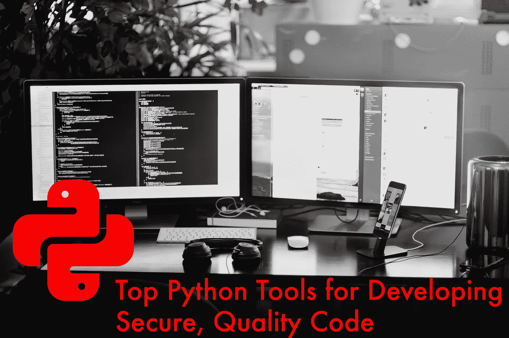
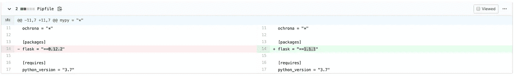
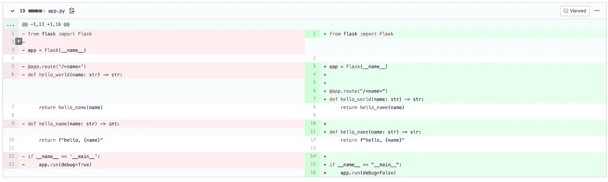

# 用于开发安全、高质量代码的顶级 Python 工具

> 原文：<https://levelup.gitconnected.com/top-python-tools-for-developing-secure-quality-code-4b3f5ec1e2de>

## 编写高质量、无错误的代码很难，让这些 python 工具为您做一些工作吧

基于[法扎德·纳兹菲](https://unsplash.com/@euwars?utm_source=unsplash&utm_medium=referral&utm_content=creditCopyText)在 [Unsplash](https://unsplash.com/s/photos/best-code?utm_source=unsplash&utm_medium=referral&utm_content=creditCopyText) 拍摄的照片

软件工程师每天都在使用无数的工具来提高代码的质量、安全性和可维护性。我将看看几个我最喜欢的 python 工具，并对它们的易用性进行评估:安装、运行和自动化的难易程度、质量影响、可维护性影响和安全性影响。

我还将简要介绍如何在 CI 管道中包含所有这些工具，以自动化它们的使用和有效性。

# 工具

## Pipenv

[Pipenv](https://github.com/pypa/pipenv) 是一个针对 python 的开发管理和依赖管理工具，最初由[请求](https://github.com/psf/requests)的作者 [Kenneth Reitz](https://www.kennethreitz.org/) 编写。

如果你使用 python 开发过一段时间，你可能也使用过 [virtualenv](https://virtualenv.pypa.io/en/latest/) 或 [venv](https://docs.python.org/3/library/venv.html) 来管理你的环境，以及可信赖的`pip freeze > requirements.txt`来进行依赖管理。这在很多情况下仍然完全有效，但是我发现 pipenv 更方便、更强大，而且它可以像 non via `Pipfile`和`Pipfile.lock`一样进行依赖固定，这在很大程度上取代了`requirements.txt`，可以带来更可靠的部署。

由于 [Python 软件基金会拨出资金用于改进 pip](http://pyfound.blogspot.com/2019/11/seeking-developers-for-paid-contract.html) 以及 pipenv 在 2019 年缺乏实质性进展，我对 pipenv 的未来有点担心，但我认为 pipenv 对于大多数 Python 用户来说仍然是一个优秀的工具。

网址:[https://pipenv.kennethreitz.org/en/latest/](https://pipenv.kennethreitz.org/en/latest/)

月下载量:2，111，976

备选方案:[诗词](https://python-poetry.org/)，[才女](https://virtualenv.pypa.io/en/latest/)，[才女](https://docs.python.org/3/library/venv.html)

## 奥克罗纳

我在这里有点偏见，因为 Ochrona 是我正在积极开发的工具，并希望在 2020 年发布，所以我也将看看这种类型工具的几个替代方案。

Ochrona 是一个依赖分析或软件组合分析工具，用于检查您的开源依赖关系是否存在已知漏洞。pyup.io 的 Safety[是这个领域另一个非常受欢迎的开源工具。我认为 Ochrona 优于竞争对手的地方在于。](https://pyup.io/safety/)

1.  它提供了一个免费的选项，不管它是用于开源项目还是商业项目。免费选项总是使用最新的漏洞信息。
2.  在磁盘使用和 IO 方面非常轻量级。它不是一个需要拉整个漏洞数据库的本地工具，而是 SaaS，所以它只需对一个公共 API 进行一次调用。
3.  出色的漏洞数据，每天而不是每月更新，提供比竞争对手更多的漏洞细节。即使是免费用户。

网址:[https://ochrona.dev/](https://ochrona.dev/)

每月下载量:未发布

替代品:[安全](https://pyup.io/safety/)， [snyk ($)](https://snyk.io/)

## 强盗

如果我必须推荐一个工具来提高你的 python 项目的安全性，那就是 [Bandit](https://bandit.readthedocs.io/en/latest/) 。Bandit 最初来自 OpenStack，尽管现在由 [PyCQA](https://github.com/PyCQA) 维护。Bandit 是一个开源的 SAST 工具，在某些方面，它的行为也像一个关注安全的 linter。这对于捕捉不安全的配置、已知的不安全模块使用、硬编码凭证、断言等问题非常有用。

Bandit 是免费的、可配置的、快速的。我想不出有什么令人信服的理由不将它添加到您的项目中。

网址:[https://github.com/PyCQA/bandit](https://github.com/PyCQA/bandit)

月下载量:575，101

替代品:[柴堆](https://pyre-check.org/)， [pyt](https://github.com/python-security/pyt) ，[dodge](https://github.com/landscapeio/dodgy)

## 黑色

Black 是一个基于通用 Pep-8 风格指南的固执己见的代码格式化工具。虽然 Pep-8 和许多用于检查 Pep-8 符合性的工具(如 pycodestyle 或 flake8)对于验证是否符合 Pep-8 指南非常优秀，但 Black 是一种代码格式化程序，会自动将您的代码更新为 Black 的样式，这是 Pep-8 的超集。

我以前写过关于黑色的文章，所以它出现在这个列表中并不奇怪。与传统的 linters 相比，Black 节省了时间，传统的 linters 通常要求您更新代码以符合标准，并且它在配置方面也非常有限，这意味着如果您以前使用过它，任何其他使用 Black 的项目都应该看起来非常熟悉。

 [## 黑色是出路

### Mando 说“格式化你的代码”

medium.com](https://medium.com/swlh/black-is-the-way-e034af9089ad) 

网址:[https://github.com/psf/black](https://github.com/psf/black)

月下载量:1，891，711

替代品: [flake8](https://github.com/PyCQA/flake8) ， [pylint](https://github.com/PyCQA/pylint)

## Mypy

Mypy 是 python 的可选静态类型检查器。python 中的类型提示是在 [PEP 484](https://www.python.org/dev/peps/pep-0484/) 中引入的，mypy 利用这些类型提示对您的项目进行静态类型检查。Python 仍然有动态鸭类型，但是添加静态类型检查可以帮助您更早地发现错误，减少测试和调试，并且增加了代码内文档的级别。

大公司也在支持 python 中的静态类型检查，Dropbox(在吉多·范·罗苏姆任期内)使用 mypy 检查了超过 400 万行 python 代码。其他主要的 python 用户，如 Instagram，也开始使用静态类型检查(尽管有他们自己的工具)。

网址:[http://mypy-lang.org/](http://mypy-lang.org/)

月下载量:2 487 228 次

替代品:[柴堆](https://pyre-check.org/)

# 把所有的放在一起

对于这个例子，我将使用 [Travis-CI](https://travis-ci.com/) ，但是配置您正在使用的任何 CI 工具应该是一个相似的过程，尽管使用不同的语法。对于这个例子，我将使用一个简单的故意不安全的、有问题的 flask 应用程序。

我们的`app.py`文件将如下所示。

我们的`Pipfile`会是这个样子。

最后，我们将在目录的根目录下创建一个`.travis.yml`文件，它包含以下内容。

如果您在这里查看构建[，您会看到每个工具要么标记了一个错误，要么指示需要修复。然而，如果我们做一些修改，正如在](https://travis-ci.com/beatsbears/vulnerable_flask/builds/149315498)[这个 PR](https://github.com/beatsbears/vulnerable_flask/pull/2) 中看到的，我们可以看到[我们得到了一个合格的版本](https://travis-ci.com/beatsbears/vulnerable_flask/builds/150167077)。

将 Flask 更新至没有已知漏洞的版本

修复类型批注、禁用调试模式和样式格式

虽然这个例子只处理了一个 CI 平台，但是集成到大多数其他平台中是非常相似的，我强烈推荐将 Travis-CI 用于开源项目。

你用什么工具来改进你的 python 代码？我很乐意听到任何建议或反馈。下面是我对提到的所有工具的排名。