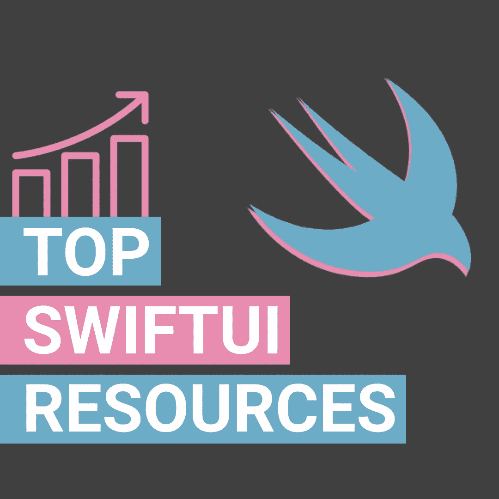

# 面向初学者的顶级 SwiftUI 资源

> 原文：<https://levelup.gitconnected.com/top-swiftui-resources-for-beginners-966e52e1402c>

## 从头开始学习 SwiftUI 的一些最佳资源列表

嗨！我叫 Finsi Ennes，目前是一名移动应用程序开发人员。我做 iOS 开发两年左右。除了我的工作，我正在开发我的第一个应用程序和一些打开的项目。

我真的很喜欢展示我正在学习的东西，所以我把它发布在我的 [Linkedin](https://www.linkedin.com/in/finsiennes/) 和 [Instagram](https://www.instagram.com/finsi.code/) 上。我通常有很多 DM 询问有关 iOS 开发的问题，但最常问的问题之一是:

> 你是用什么资源学习 SwiftUI 的？

好了，让我们来看看你在🧑学习 SwiftUI 的旅途中可以参考的资源🏻‍💻📲

# 1.苹果教程

这是迄今为止从零开始学习 SwiftUI 的最佳教程之一。它包括几个章节来指导你理解这个框架的关键概念。

您将学习如何构建**样本视图**，在它们之间设置**导航**，以及处理**数据流**。您将使用这些视图来创建复杂的结构，了解动画是如何工作的，或者如何将所有这些与 UIKit 集成。

一步一步地解释。这种格式使阅读更容易，在 5 个小时内你将学会 **SwiftUI 要点**。

 [## SwiftUI 教程

### Apple 开发者文档

developer.apple.com](https://developer.apple.com/tutorials/swiftui) 

# 2.WWDC 会议

以前的教程很棒，因为它们向您展示了 SwiftUI 是如何工作的。然而，它们只涵盖了基础知识，忽略了所有的技术细节。

在这一点上，我建议你观看 WWDC 会议。由苹果开发者呈现和**完成，它们真的设计得很好。它们还包括许多资源，如**幻灯片和示例代码**。这些对于理解这个框架是如何构建的至关重要。**

有许多会议，但以下是最重要的会议:

 [## SwiftUI Essentials - WWDC 2019 -视频-苹果开发者

### 使用 SwiftUI 首次深入构建应用程序。了解视图及其工作方式。从基本控制…

developer.apple.com](https://developer.apple.com/videos/play/wwdc2019/216)  [## SwiftUI 简介- WWDC 2020 -视频-苹果开发者

### 探索声明式编程的世界:探索如何从头开始构建一个全功能的 SwiftUI 应用程序…

developer.apple.com](https://developer.apple.com/videos/play/wwdc2020/10119/)  [## SwiftUI 简介:构建您的第一个应用程序- WWDC 2019 -视频-苹果开发者

### 查看 SwiftUI 的运行情况！观看 SwiftUI 团队的工程师从零开始构建全功能应用程序。理解…

developer.apple.com](https://developer.apple.com/videos/play/wwdc2019/204/)  [## 使用 SwiftUI 构建自定义视图- WWDC 2019 -视频-苹果开发者

### 了解如何在 SwiftUI 中使用高级合成、布局、图形和动画构建自定义视图和控件。看…

developer.apple.com](https://developer.apple.com/videos/play/wwdc2019/237)  [## 通过 SwiftUI 的数据流- WWDC 2019 -视频-苹果开发者

### SwiftUI 是从头开始构建的，让您可以编写漂亮而正确的用户界面，避免不一致…

developer.apple.com](https://developer.apple.com/videos/play/wwdc2019/226)  [## SwiftUI 中的数据要点- WWDC 2020 -视频-苹果开发者

### 数据是任何应用程序的复杂部分，但 SwiftUI 可以轻松确保流畅的数据驱动体验，来自…

developer.apple.com](https://developer.apple.com/videos/play/wwdc2020/10040/) 

# 3.SwiftUI 文档

Docs 包含了许多关于框架的有价值的信息。请注意，我在这里附上这个并不是为了让你全部阅读。只是**在你学习之前的资源时或者当你对一些概念有疑问时，把它作为参考**。

 [## Apple 开发者文档

### SwiftUI 框架

developer.apple.com](https://developer.apple.com/documentation/SwiftUI) 

# 4.保罗·哈德逊资源公司

《Swift 黑客》一书的作者 Paul Hudson 为初学者提供了最受欢迎的免费课程之一。

他们向你提出一个挑战:在 100 天里花**一个小时学习 SwiftUI。这种教学会让你很快学会新东西。章节中有大量的视频、教程和测试，它们直奔主题。此外，随着你的进步，难度也越来越高。**

 [## SwiftUI 黑客 100 天

### 欢迎来到 SwiftUI 的 100 天！这是一个免费的视频、教程、测试等的集合，全部来自…

www.hackingwithswift.com](https://www.hackingwithswift.com/100/swiftui)  [## SwiftUI 示例

### SwiftUI by Example 是世界上最大的 SwiftUI 示例、技巧和技术集合，为您提供了近 600 个…

www.hackingwithswift.com](https://www.hackingwithswift.com/quick-start/swiftui) 

# 5.SwiftUI by 教程(Raywenderlich 团队)

基本上这是我用来真正学习 SwiftUI 的书。我会把它放在前面，但这是针对那些已经有 iOS 开发经验的人。

虽然它涵盖了基础知识，但它侧重于更高级的主题，如状态、数据流、导航和数据显示。因此，这是一个深入研究复杂 SwiftUI 概念的好选择。

 [## SwiftUI by 教程

### 使用 SwiftUI，使用更少的代码为您的应用程序构建流畅且引人入胜的声明式 UI！SwiftUI by 教程是…

www.raywenderlich.com](https://www.raywenderlich.com/books/swiftui-by-tutorials/v3.0) 

# 6.构建网飞克隆

当我开始学习 SwiftUI 时，对我来说最困难的事情之一是创建复杂的界面，将它们与其他界面结合起来，并处理导航。您很快就习惯了构建样本视图，但是继续前进并不容易。

**构建真正的应用**是学习和理解新软件概念的最佳方式之一。在本课程中，您将围绕 UI 组件构建一个功能性的网飞克隆**。**

 [## SwiftUI 2 -构建网飞克隆版-iOS 14-Xcode 12-更新

### 构建真正的应用程序总是快速学习新的软件工程概念的最有效的方法。在本课程中…

www.udemy.com](https://www.udemy.com/course/swiftui-netflix/) 

# 7.SwiftUI 大师班

本课程完全侧重于实践练习。每章解释了如何构建一个特定的应用，同时涵盖了**个高级主题**，如 MVVM 架构、外部 REST APIs 集成、核心数据覆盖或组合框架等。

以前的资源教给你很多技术，但是他们完全忽略了**的设计**。这个课程考虑到了这一点，如果你在开发一个应用程序时想要一个**质量的产品**，这真的会对你有所帮助。

 [## SwiftUI 大师班 2021 - iOS 14 应用开发和 Swift 5

### 创建一个具有高质量生产价值的 50+小时课程需要大量时间。我不想让你久等，所以…

www.udemy.com](https://www.udemy.com/course/swiftui-masterclass-course-ios-development-with-swift/) 

# 8.(奖金)我自己的教程

正如我在本文开头所说，我喜欢写我所学到的东西，SwiftUI 也不例外。如果你查看我的个人资料，你会发现很多关于这个框架的教程，都是免费的。

我给你推荐以下几款。关于使用 SwiftUI + Combine + MVVM **架构从头开始构建一个 **iOS 应用****的完整教程**:**

 [## 使用 SwiftUI + Combine + MVVM 构建 iOS 应用程序(第 1 部分)

### 逐步了解如何使用全新的 Apple 框架构建 iOS 应用程序。

levelup.gitconnected.com](/building-an-ios-app-using-swiftui-combine-mvvm-architecture-part-1-7e5a1683a7aa)  [## 使用 SwiftUI + Combine + MVVM 构建 iOS 应用程序(第 2 部分)

### 逐步了解如何使用全新的 Apple 框架构建 iOS 应用程序。

levelup.gitconnected.com](/building-an-ios-app-using-swiftui-combine-mvvm-part-2-a0a703269907)  [## 使用 SwiftUI + Combine + MVVM 构建 iOS 应用程序[第 3 部分]

### 逐步了解如何使用全新的 Apple 框架构建 iOS 应用程序

finsi-ennes.medium.com](https://finsi-ennes.medium.com/building-an-ios-app-using-swiftui-combine-mvvm-part-3-c90dc6a32e0d) 

另一个关于入门的**状态和绑定(数据流)**:

 [## SwiftUI 中的数据流—状态和绑定入门

### 从头开始学习如何在 SwiftUI 中连接数据

medium.com](https://medium.com/swlh/data-flow-in-swiftui-getting-started-with-state-and-binding-da3ba97fb144) 

最后一个与**联合收割机基础知识**相关:

 [## 联合收割机框架的基础

### 带有图形示例

levelup.gitconnected.com](/basics-of-combine-framework-64dbd18da341) 

请注意，还有许多其他 SwiftUI 资源。事实上，我强烈推荐苹果资源，但其余的都是个人选择。如果你知道其他有用的课程或教程，欢迎评论和分享

如果你喜欢我的内容，想看更多，记得**拍拍**和**分享**🙂

# 分级编码

感谢您成为我们社区的一员！[订阅我们的 YouTube 频道](https://www.youtube.com/channel/UC3v9kBR_ab4UHXXdknz8Fbg?sub_confirmation=1)或者加入 [**Skilled.dev 编码面试课程**](https://skilled.dev/) 。

 [## 编写面试问题+获得开发工作

### 掌握编码面试的过程

技术开发](https://skilled.dev)