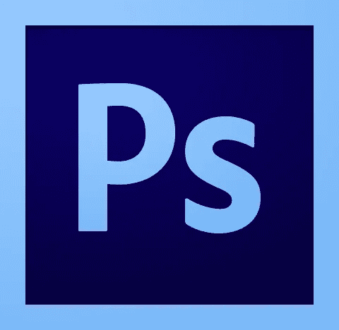
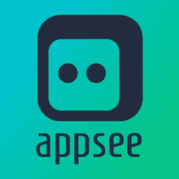
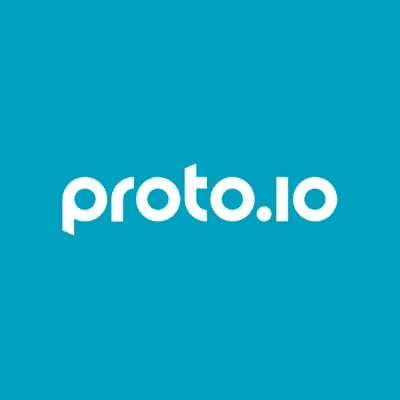
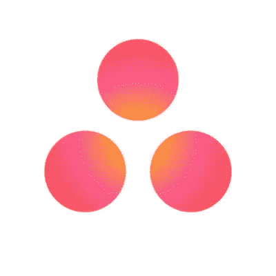

# 帮助您创建完美移动应用程序 UI 的顶级工具

> 原文：<https://levelup.gitconnected.com/top-tools-to-help-you-create-the-perfect-mobile-app-ui-82073a54ba8>

照片由 [rawpixel](https://unsplash.com/@rawpixel?utm_source=medium&utm_medium=referral) 在 [Unsplash](https://unsplash.com?utm_source=medium&utm_medium=referral) 上拍摄

## 创建移动应用产品设计和 UI 设计的 7 个基本工具

有一句老话是这样说的，一个工匠的好坏取决于他的工具，这一点在移动应用程序 UI 开发领域非常适用。构建一个应用程序的用户界面是一项大规模、长时间、高要求的工作。需要建立一个适当的团队。对于他们希望实现的目标，需要有一个清晰的愿景。他们需要能够轻松快速地交流。他们需要能够一起工作，这本身就具有挑战性，因为远程工作是当今的主流。需要质量分析和优化工具。我们只是触及了表面。

在这样一个世界里，拥有所有合适的工具很可能意味着成功与失败的区别。好消息是——有大量的工具可以帮助你。坏消息是——有大量的工具可以帮助你。如何选择合适的？你首先认为哪些是正确的？

我们来这里是为了减少寻找合适工具所需的时间。以下是我们推荐的七个工具，可以帮助移动用户界面设计者构建、优化和组织他们的工作。

不客气

# Photoshop CC 和 XD CC

每个界面设计工具列表都以 Photoshop CC 开头。作为所有移动应用用户界面需求的首选工具， [Photoshop CC](http://www.adobe.com/products/photoshop.html) 被认为简单而强大，易于使用，但功能强大。[评论者会告诉你](https://think360studio.com/9-best-tools-for-designing-a-mobile-app-ui/) Photoshop CC 给了应用程序专业人员更多的能力、速度和自由，提供了自动图像资源导出和切片或智能锐化等功能，帮助移动应用程序 UI 元素“脱颖而出”。

Photoshop CC 是 Adobe Creative Cloud suite 的一部分，所以如果你还没有尝试过，请确保也查看一下 [Adobe Experience Design CC](http://www.adobe.com/products/xd/features.html) (简称 XD CC，以前也称为 Project Comet)。该工具专注于设计和原型制作，允许应用程序专业人员为他们的移动应用程序的 UI 创建高保真原型。

作为云工具，需要订阅。单个应用程序(Photoshop 或 XD)每月花费 9.99 美元，而所有 CC 13 应用程序加起来每月花费 49.99 美元。

# [视觉应用](https://www.invisionapp.com/)

应用不仅仅是它们各部分的总和。构建一个移动应用 UI 不仅仅是设计一个界面或者消灭讨厌的 bug。与设计团队沟通、向客户发送草稿、对各种元素进行评论和分析、在旅途中进行数十、数百次调整，以及在大型团队中来回穿梭，这些事情有时会被淡化。

设计工具有时关注实际的执行(构建元素)，而不是对执行的构建。Invision 是那些关注整个移动应用程序 UI 构建过程的平台之一，这就是为什么它是最受欢迎的工具之一。客户端反馈轻而易举，版本历史和同步与 Google Drive 上的相似，这真的很酷，但也许最重要的是，它允许应用程序专业人员模仿移动手势，这通常是移动应用程序开发团队的较大痛点之一。

# [appetimize](https://apptimize.com/)

当应用程序到达应用程序商店时，应用程序的创建周期并没有结束。在这一点上，它大概是在它充满希望的漫长旅程的中间。现在是分析和优化占据中心舞台的时候了。Apptimize 是应用程序优化领域中最受欢迎和喜爱的应用程序之一。Apptimize 主要因其简单有效的 A/B 测试特性而受到称赞，它将迭代周期变成了所有应用专业人士都喜欢回来的游乐场。同样值得一提的是[功能标志](https://apptimize.com/blog/2016/03/feature-flags-for-mobile-apps/)工具，它让应用营销人员有可能在应用用户子集内进行测试。

Apptimize 的起价为每月 995 美元，一个支持每月 10 万活跃用户的包。对于定制计划，你需要给他们一个机会。

# [Appsee](https://www.appsee.com/?utm_source=medium &utm_medium=link&utm_campaign=7_tools_mobile_app_ui&utm_content=appsee_tool_description&cpnid=701b0000000Wd7c)

虽然传统的定量分析工具是分析和改进移动应用程序用户界面的合理选择，但如果将定性分析工具加入其中，还有更多的事情可以做和理解。与围绕数字和图形的定量分析不同，定性分析侧重于主观质量、背景和应用程序的无形资产。它可以帮助揭示用户对应用程序的感受和反应，帮助消除错误，但最重要的是，帮助理解 UI 的直观性和用户友好性。

在定性分析方面，Appsee 是行业领导者，也是这场竞赛中的明显赢家。Appsee 的触摸热图可以帮助应用专业人员准确地看到用户与应用程序交互的位置，使他们能够更深入地了解他们的应用程序的 UI 元素，这些元素获得了最多或最少的关注。

[触摸热图](https://www.appsee.com/features/touch-heatmaps)以视觉叠加的形式出现，基于聚集的手势数据。他们使用红色渐变代表最受关注的区域，蓝色渐变代表完全相反的区域。

有了这样一个工具，应用程序专业人员可以比较他们的移动应用程序 UI 的不同元素，并就如何改进 UI 以及整体 UX 做出明智的决策。

# [Proto.io](http://www.proto.io/)

在应用模型和原型的微观世界中，有一场大公司之间的争霸大战。像 Moqups，Fluid 或 UXPin 这样的应用程序都被认为是非常有效的选择，但是它是 Proto.io 的冠军。它允许应用程序专业人员在不知道任何代码的情况下创建模型。它附带了大量的用户指南和视频教程，这使得它对所有熟练程度的应用程序专业人员都很友好。还有一个生动的社区，非常乐意回答任何问题。它的一些功能选项包括 [onboarding carousel](https://spaces.proto.io/project/E9A5313C-AC46-4739-DD38-F9A6AEC814AF/On-boarding-carousel/) ，滑入式横向菜单，或拉至刷新功能。

该应用程序提供了一个免费计划，允许一个项目和最多五个屏幕。如果你想有更多的项目(和屏幕)，有一个 24 美元的自由职业者计划，其中包括一个用户和 5 个活动项目。Proto.io 还提供每月 40 美元、80 美元和 160 美元的更大计划。

# [Lucidchart](https://www.lucidchart.com/)

绘制图表、流程图和线框是产品设计师、产品经理和其他各种移动应用程序专业人员日常工作的一部分。找到这项工作的完美平台意味着在灵活性、丰富的功能和有吸引力的价格之间取得平衡。在这个领域有很多值得一提的平台，如微软的 Visio 或 Creately，它们似乎在流程图应用程序列表中排名很高，但 Lucidchart 占据了至高无上的地位。应用程序专业人员可以创建无限数量的免费帐户，并可以使用它们来创建同样无限数量的图表。有什么问题吗？每个图表最多只能有 60 个对象。

它的主要优势是，这是一个基于云的应用程序，可以在所有流行的浏览器中工作，允许实时协作，共享和导出到矢量 pdf，JPEG 或 PNG 图像。它还以“企业级”安全和管理控制为傲。

关于价格，你必须[直接联系公司](https://www.lucidchart.com/pages/enterprise)。

# [体式](http://www.asana.com/)

与团队沟通并恰当地分配任务和职责对于构建一个完美的移动应用程序 UI 至关重要。团队越大，组织工作流就变得越困难，使得元素更有可能从缝隙中溜走。拥有一款精心制作的沟通和协作应用有助于减轻这一负担。立刻想到了体式。一个基于云的组织平台，可以在桌面和移动设备上工作，目前是其行业中最受欢迎的工具之一(这是有充分理由的)。

体式是一个相当全面的工具，有许多突出的特点，但如果要突出一个，那就是它处理任务的方式。可以将任务分配给不同的团队成员，但也可以将他们添加为关注者，以便他们可以跟踪进度，并在发生不同的变化时通过电子邮件获得通知。该工具可以免费使用，有两个付费选项—高级版和企业版。Premium 将花费你每个成员每月 9.99 美元，而对于 Enterprise，你必须给公司[的男孩女孩们一点鼓励。](https://asana.com/enterprise)

其他值得一提的还包括 Trello 和 Podio。

# 最后的想法

由于移动应用程序 UI 构建是一个如此大的挑战，很容易陷入开发、协作、交流、分析和优化任务的网络中。借助合适的工具，应用程序专业人员可以消除生活中的混乱，简化应用程序 UI 设计流程，并确保他们在最少的时间内获得最好的结果，并且在这个过程中几乎没有挫折。

这听起来像一个梦，但是有了上面提到的工具，这个梦就离现实更近了。

