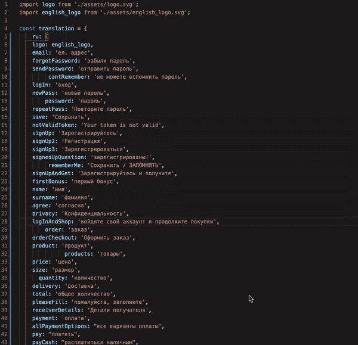
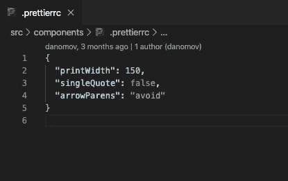
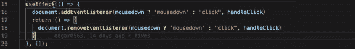
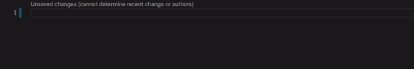
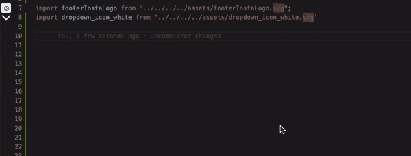
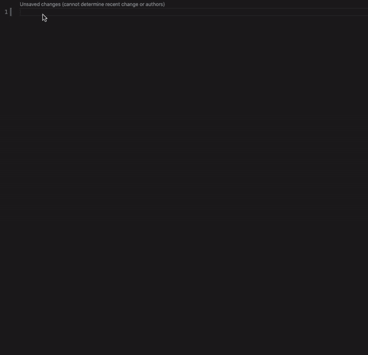
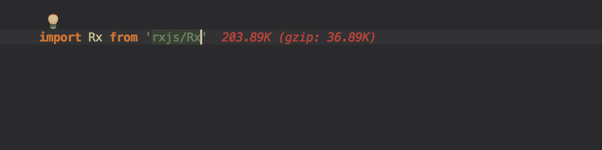

# 应该安装的顶级 Visual Studio 代码扩展

> 原文：<https://levelup.gitconnected.com/top-visual-studio-code-extensions-you-should-install-161faa68952c>

[陈英利](https://unsplash.com/@cylee0119?utm_source=unsplash&utm_medium=referral&utm_content=creditCopyText)在 [Unsplash](https://unsplash.com/?utm_source=unsplash&utm_medium=referral&utm_content=creditCopyText) 上的照片

Visual Studio Code 是微软为 Windows、Linux 和 macOS 开发的代码编辑器。它包括对调试、嵌入式 Git 控件和 GitHub、语法高亮、智能代码完成、代码片段和代码重构的支持。

在这个故事中，我们将看到 7 个很酷的扩展，它们可以帮助你编写更干净的代码，并变得更有效率。

所以，让我们开始形成我们的名单。

# 较美丽

这个格式化程序扩展是必须的，因为你不想浪费时间手工格式化代码。它可以将你杂乱的代码格式化，在几秒钟内将其转换成一个干净的结构化代码。

这张 gif 演示了 beauty 是如何工作的。

你可以创建一个配置文件(**)。prettierrc** )用于这个扩展，在这里你可以指定你的代码结构规则，所以 Prettier 可以按照你想要的来格式化它。

我更漂亮的配置文件如下所示。

您可以在这里找到大量的配置选项👇

 [## 选项更漂亮

### Prettier 附带了一些可定制的格式选项，可以在 CLI 和 API 中使用。

更漂亮. io](https://prettier.io/docs/en/options.html) 

此外，您可以将**更漂亮的**与 **ESLint** 和**编程风格** ( *风格指南*)集成在一起。

ESLint 是一个静态代码分析工具，用于识别 JavaScript 代码中的问题模式。它是由尼古拉斯·c·扎卡斯在 2013 年创建的。ESLint 中的规则是可配置的，并且可以定义和加载定制规则。ESLint 涵盖了代码质量和编码风格问题。

**编程风格**，也称为**代码风格**，是为计算机程序编写源代码时使用的一套规则或准则。人们经常声称，遵循特定的编程风格将有助于程序员阅读和理解符合该风格的源代码，并有助于避免引入错误。

你可以在这个[环节](https://blog.echobind.com/integrating-prettier-eslint-airbnb-style-guide-in-vscode-47f07b5d7d6a)中找到如何将强三和弦整合在一起。

# 括号对着色程序(v1 和 v2)

[括号对上色器](https://marketplace.visualstudio.com/items?itemName=CoenraadS.bracket-pair-colorizer)对于找到匹配的括号非常有用。

新版本使用与 VSCode 相同的括号解析引擎，大大提高了速度和准确性。

# 吉特朗斯

对于 [git](https://git-scm.com/) 用户来说，GitLens 是一个强大的工具。

以下是 GitLens 提供的部分**功能**:

*   一个不显眼的**当前行错误**注释位于行尾，详细的错误信息可通过悬停访问
*   **作者身份代码镜头**显示最近提交和作者数量到文件顶部和/或代码块上
*   一个**状态栏责备**注释显示当前行的作者和日期
*   许多丰富的侧栏视图
*   一个 ***存储库*视图**来可视化、导航和探索 Git 存储库
*   一个 ***文件历史*视图**用于可视化、导航和浏览当前文件的修订历史
*   一个 ***行历史*视图**用于可视化、导航和浏览当前文件中所选行的修订历史
*   一个 ***搜索提交*视图**通过消息、作者、文件、id 等搜索和浏览提交历史
*   一个 ***比较*视图**可视化分支、标签、提交等之间的比较
*   按需**地沟怪**注释，包括一个热图，用于整个文件
*   按需 **gutter heat map** 注释，显示相对于文件中的所有其他更改以及到目前为止(热与冷)行的最新更改
*   按需**最近更改**注释，用于突出显示最近提交所更改的行
*   许多**强大的命令**用于探索提交和历史，比较和导航修订，存储访问，存储库状态等
*   用户定义的**模式**用于在设置组之间快速切换

# Visual Studio 智能代码

[Visual Studio intelli Code](https://go.microsoft.com/fwlink/?linkid=872679)扩展为 Visual Studio 代码中的 Python、TypeScript/JavaScript 和 Java 开发人员提供人工智能辅助开发功能，其洞察力基于对代码上下文的理解并结合了机器学习。

对于 Visual Studio IDE 中的 C#、C++、TypeScript/JavaScript 和 XAML 支持，请查看 Visual Studio Marketplace 上的 [IntelliCode 扩展](https://marketplace.visualstudio.com/items?itemName=VisualStudioExptTeam.VSIntelliCode)。

# npm 智能感知

Visual Studio 代码[插件](https://marketplace.visualstudio.com/items?itemName=christian-kohler.npm-intellisense)自动完成导入语句中的 [npm](https://www.npmjs.com/) 模块。

# 图像预览

如果您在组件中使用图像，并且想要快速查看哪个图像是目标图像，那么这个[扩展](https://marketplace.visualstudio.com/items?itemName=kisstkondoros.vscode-gutter-preview)非常有用。

# ES7 React/Redux/graph QL/React-本机代码片段

这个[扩展](https://marketplace.visualstudio.com/items?itemName=dsznajder.es7-react-js-snippets)可以帮助你轻松构建 React、GraphQL 或 React 本地应用组件。

键入快捷方式名称，并按下回车键，看看魔术💥

# 进口成本

该[扩展](https://marketplace.visualstudio.com/items?itemName=wix.vscode-import-cost)将显示导入包的尺寸。该扩展利用 webpack 和 Babili Webpack 插件来检测导入的大小。

# 额外的漂亮和疯狂的造型扩展*

 [## 材料图标主题

### 在你的 VS 代码中加入材质设计图标。

marketplace.visualstudio.com](https://marketplace.visualstudio.com/items?itemName=PKief.material-icon-theme)  [## 虚拟代码-图标

### 将图标添加到您的 Visual Studio 代码中(支持的最低版本:1.31.1)要安装该扩展，只需执行…

marketplace.visualstudio.com](https://marketplace.visualstudio.com/items?itemName=vscode-icons-team.vscode-icons)  [## 84 年合成波

### 你还记得 84 年那个漫长的夏天吗？在海洋公路上巡航，风在我们的…

marketplace.visualstudio.com](https://marketplace.visualstudio.com/items?itemName=RobbOwen.synthwave-vscode)  [## 材料主题

### 最史诗的主题遇上 Visual Studio 代码。您可以通过在此报告问题来提供帮助。你可以安装这个很棒的主题…

marketplace.visualstudio.com](https://marketplace.visualstudio.com/items?itemName=Equinusocio.vsc-material-theme)  [## 夜猫子

### 一个为夜猫子设计的 Visual Studio 代码主题。对于我们这些喜欢熬夜编码的人来说，这是一个很好的调整…

marketplace.visualstudio.com](https://marketplace.visualstudio.com/items?itemName=sdras.night-owl)  [## 德古拉官方

### 现在就去拿。

marketplace.visualstudio.com](https://marketplace.visualstudio.com/items?itemName=dracula-theme.theme-dracula)  [## 一个黑暗职业

### Atom 标志性的 One Dark 主题，也是 VS 代码安装最多的主题之一！GitHub 库变更日志。MD…

marketplace.visualstudio.com](https://marketplace.visualstudio.com/items?itemName=zhuangtongfa.Material-theme) 

感谢阅读👏保持健康💪

***喜欢这篇文章？你可以在下面找到更多有趣的。***

> [*JS 中的单链表*](/data-structures-linked-lists-in-javascript-es6-part-i-db9c83854d94)
> 
> [*JS 功能终极指南*](/ultimate-guide-to-tips-tricks-and-javascript-features-you-should-know-27e0a4a6ffdf)
> 
> [*如何成为更好的开发者*](/how-to-be-a-better-developer-717a2f9bd68e)
> 
> [*什么是 AI？是还是不是？*](https://medium.com/@danielmovsesyan/what-is-ai-yay-or-nay-781a5713b9cc)