# 每个开发人员都应该知道的顶级 VSCode 键盘快捷键

> 原文：<https://levelup.gitconnected.com/top-vscode-keyboard-shortcuts-every-developer-should-know-9e2118bbc2cb>

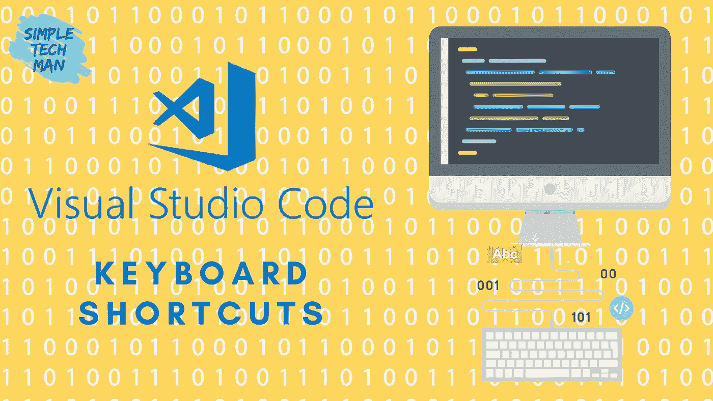

这里列出了一些基本的 VSCode 键盘快捷键，每天至少可以为您节省几分钟。

*   *上下移动线条-*

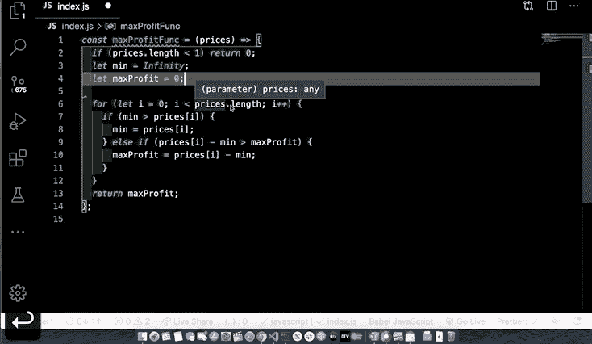

*   *跳转到匹配括号-*

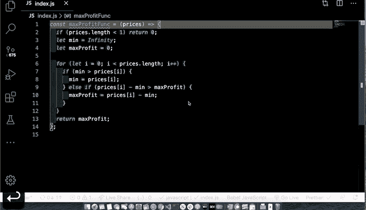

*   *替换下一个类似的词——*

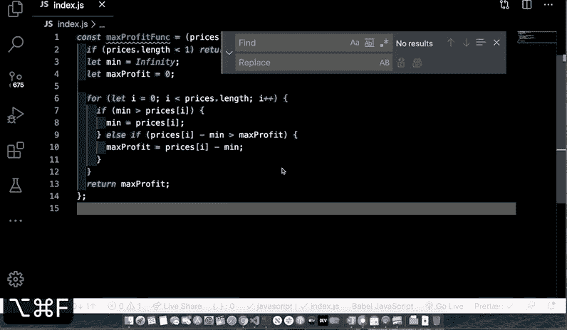

*   *向上/向下复制行-*

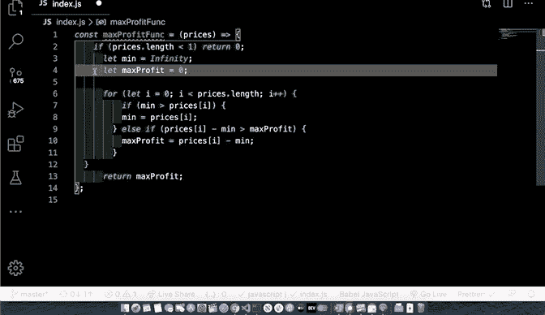

*   *代码折叠-* `*command + option + [*` *代码展开-* `*command + option + ]*`

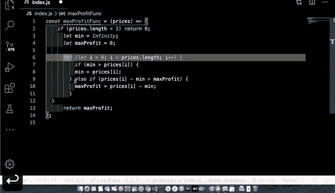

*   *选择下一场比赛-*-`*command + d*`

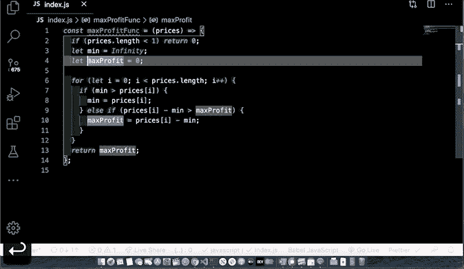

*   *取消选择下一个匹配-* `*command + u*`

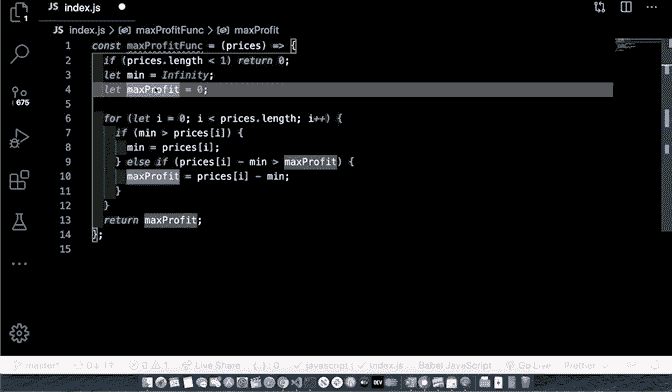

*   *打开和关闭侧栏-*

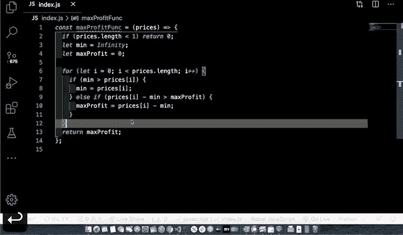

*   *添加光标上方/下方-*

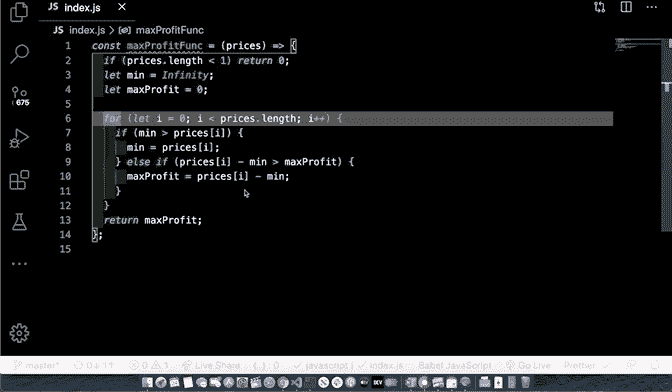

*   *添加多个光标-*

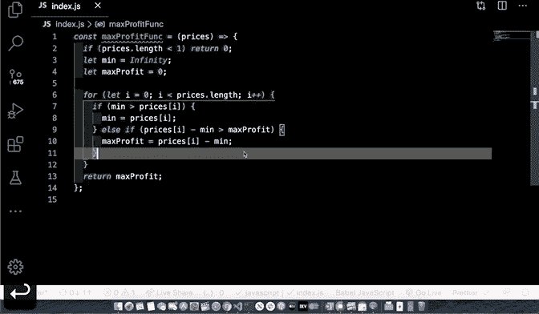

*   *删除行* - `shift + command + k`或`command + delete`

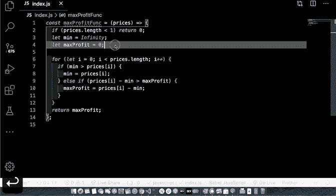

*   *在 finder/explorer 中打开当前文件* - `command + k`然后`r`

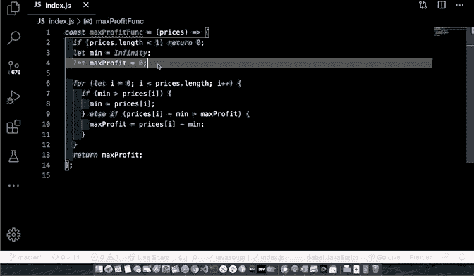

*   *禅模式-* `*command k*` *然后* `*z*`

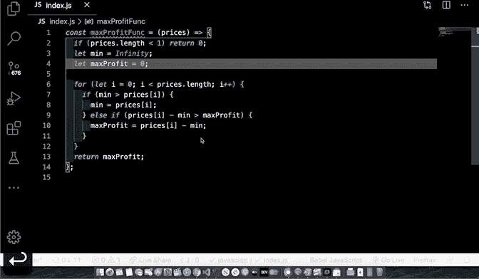

*   *注释代码-* `command + /`

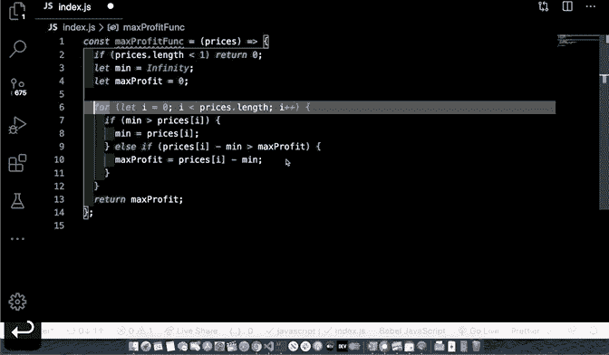

*   *将光标添加到所有选中的行* - `shift + option + drag mouse`

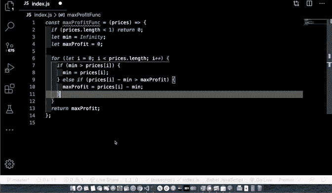

*   *分屏-* `command + \`
    *切换分屏水平和垂直视图* - `command + option + o`

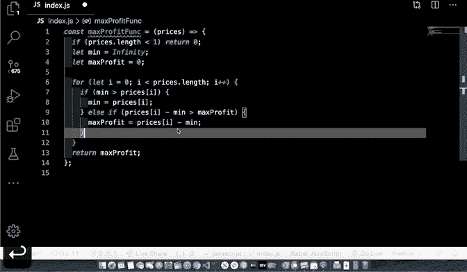

留下一个掌声或者几百个掌声:)如果你喜欢我的列表。如果你经常使用的快捷方式不在列表中，请在下面的评论中添加它。