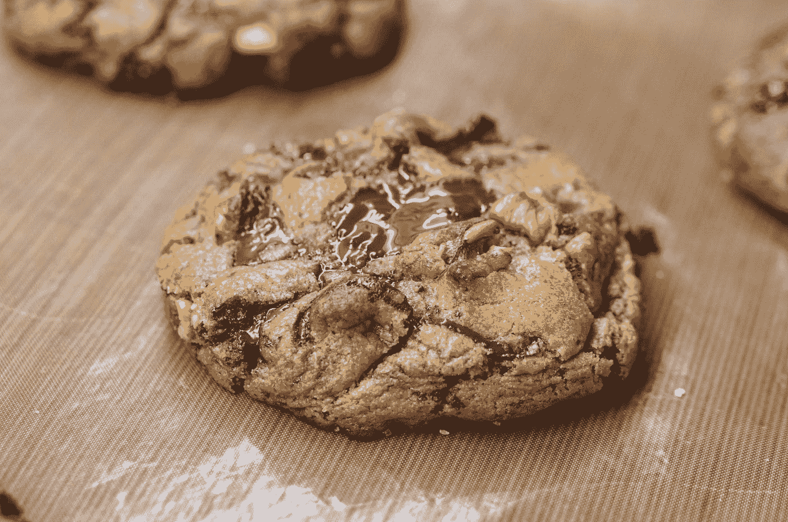

# 用于添加异步计算属性和轮播的顶级 Vue 包

> 原文：<https://levelup.gitconnected.com/top-vue-packages-for-adding-async-computed-properties-and-carousel-c2f0b30f756>


照片由 [Kira auf der Heide](https://unsplash.com/@kadh?utm_source=medium&utm_medium=referral) 在 [Unsplash](https://unsplash.com?utm_source=medium&utm_medium=referral) 上拍摄

Vue.js 是一个易于使用的 web 应用框架，我们可以用它来开发交互式前端应用。

在本文中，我们将看看添加分页按钮、异步计算属性和传送带的最佳包。

# vue-异步计算

Vue 组件不能有异步的计算属性。

然而，通过添加 vue 异步计算包，我们可以。

要安装它，我们运行:

```
npm i vue-async-computed
```

然后我们可以通过写来使用它:

`main.js`

```
import Vue from "vue";
import App from "./App.vue";
import AsyncComputed from "vue-async-computed";Vue.use(AsyncComputed);
Vue.config.productionTip = false;new Vue({
  render: h => h(App)
}).$mount("#app");
```

`App.vue`

```
`<template>
  <div>
    <div>{{product}}</div>
  </div>
</template><script>
export default {
  data() {
    return {
      x: 2,
      y: 3
    };
  },
  asyncComputed: {
    product() {
      return new Promise(resolve =>
        setTimeout(() => resolve(this.x * this.y), 1000)
      );
    }
  }
};
</script>
```

我们注册了软件包附带的插件。

然后在我们的组件中，我们返回一个承诺，该承诺解析为来自其他状态的值。

在我们的示例中，我们只取它们的乘积，并将其设置为承诺的解析值。我们可以显式设置要观察的属性。

为此，我们写道:

```
<template>
  <div>
    <div>{{product}}</div>
  </div>
</template><script>
export default {
  data() {
    return {
      x: 2,
      y: 3
    };
  },
  asyncComputed: {
    product: {
      get() {
        return new Promise(resolve =>
          setTimeout(() => resolve(this.x * this.y), 1000)
        );
      },
      watch: ["y"]
    }
  }
};
</script>
```

然后`this,y`的值被监视，如果它改变了，它的新值被重新计算。

# 虚拟弹击

vue-flicking 库让我们可以轻松地向我们的 vue 应用程序添加一个旋转木马。

要使用它，首先我们通过运行以下命令来安装它:

```
npm i @egjs/vue-flicking
```

然后我们可以通过写来使用它:

`main.js`

```
import Vue from "vue";
import App from "./App.vue";
import VueFlicking from "@egjs/vue-flicking";Vue.use(VueFlicking);
Vue.config.productionTip = false;new Vue({
  render: h => h(App)
}).$mount("#app");
```

`App.vue`

```
<template>
  <div>
    <flicking
      :options="{ gap: 10, moveType: 'freeScroll' }"
      :tag="'div'"
      :viewportTag="'div'"
      @need-panel="e => {}"
      @move-end="e => {}"
    >
      <div v-for="n in 10" :key="n">slide {{n}}</div>
    </flicking>
  </div>
</template><script>
import { Flicking } from "@egjs/vue-flicking";export default {
  components: {
    Flicking: Flicking
  }
};
</script>
```

我们以像素为单位设置幻灯片之间的`gap`。

`moveType`是幻灯片移动的方式。

`tag`是为滑块渲染的标签。

`viewportTag`是视口的标签。

我们也可以添加独立于软件包的插件。

为此，我们写道:

```
<template>
  <div>
    <flicking
      :options="{ gap: 10, moveType: 'freeScroll' }"
      :tag="'div'"
      :viewportTag="'div'"
      :plugins="plugins"
      @need-panel="e => {}"
      @move-end="e => {}"
    >
      <div v-for="n in 10" :key="n">slide {{n}}</div>
    </flicking>
  </div>
</template><script>
import { Flicking } from "@egjs/vue-flicking";
import { Fade, AutoPlay } from "@egjs/flicking-plugins";export default {
  components: {
    Flicking: Flicking
  },
  data() {
    return {
      plugins: [new Fade(), new AutoPlay(2000, "NEXT")]
    };
  }
};
</script>
```

我们安装了插件包:

```
npm i @egjs/flicking-plugins
```

然后我们添加了`Fade`和`AutoPlay`插件，分别添加了渐变效果和自动播放。

2000 是我们进入下一张幻灯片之前的毫秒数。

# vue-cookie-接受-拒绝

vue-cookie-accept-decline 包允许我们添加一个横幅，用于显示网站上常见的 cookie 消息。

要安装它，我们运行:

```
npm i vue-cookie-accept-decline
```

然后我们将 CSS 添加到 head 标签之间的`index.html`:

```
<link
  rel="stylesheet"
  type="text/css"
  href="https://unpkg.com/vue-cookie-accept-decline@5.2.3/dist/vue-cookie-accept-decline.css"
/>
```

然后，我们通过编写以下内容来注册该组件:

```
import Vue from "vue";
import App from "./App.vue";
import VueCookieAcceptDecline from "vue-cookie-accept-decline";
Vue.component("vue-cookie-accept-decline", VueCookieAcceptDecline);
Vue.config.productionTip = false;new Vue({
  render: h => h(App)
}).$mount("#app");
```

在`main.js`

接下来，我们通过书写来使用它:

```
<template>
  <div>
    <vue-cookie-accept-decline
      :ref="'myPanel1'"
      :elementId="'myPanel1'"
      :debug="false"
      :position="'bottom-left'"
      :type="'floating'"
      :disableDecline="false"
      :transitionName="'slideFromBottom'"
      :showPostponeButton="false"
      @status="cookieStatus"
      @clicked-accept="cookieClickedAccept"
      @clicked-decline="cookieClickedDecline"
    >
      <div slot="postponeContent">&times;</div> <div slot="message">
        We use cookies.
        <a href="https://example.com/" target="_blank">Learn More...</a>
      </div> <div slot="declineContent">OPT OUT</div> <div slot="acceptContent">GOT IT!</div>
    </vue-cookie-accept-decline>
  </div>
</template><script>
export default {
  methods: {
    cookieStatus() {},
    cookieClickedAccept() {},
    cookieClickedDecline() {}
  }
};
</script>
```

该按钮的设置将被存储在本地存储中，因此它不会再次显示。

我们将在显示的`message`槽中看到消息。

`acceptContent`槽有接受按钮。

`declineContent`槽有拒绝按钮。

还会为每个单击的按钮发出事件。

点击接受按钮时发出`clicked-accept`。

点击拒绝按钮时发出`clicked-decline`。

`status`在状态改变时发出。



在 [Unsplash](https://unsplash.com?utm_source=medium&utm_medium=referral) 上由[阿米拉里·米尔哈西米安](https://unsplash.com/@amir_v_ali?utm_source=medium&utm_medium=referral)拍摄的照片

# 结论

vue 异步计算包增加了异步计算属性。

vue-cookie-accept-decline 让我们添加一条接受 cookie 消息。

vue-flicking 让我们可以添加幻灯片。