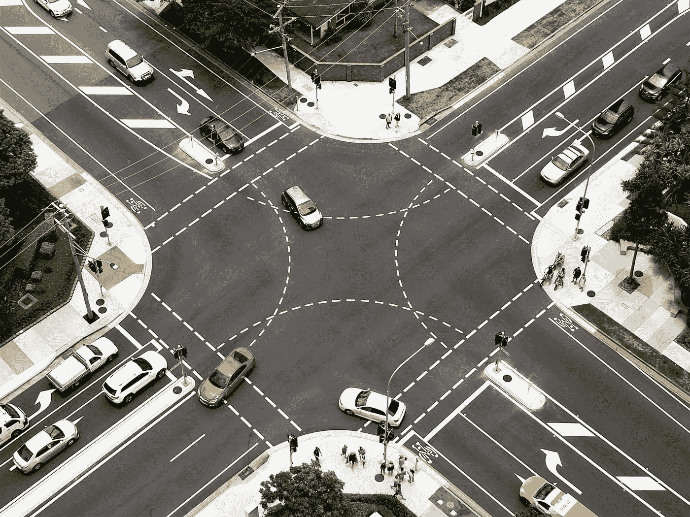

# 用于网格布局、观察交叉点、样式组件和标签输入的顶级 Vue 包

> 原文：<https://levelup.gitconnected.com/top-vue-packages-for-grid-layout-watching-intersections-styled-components-and-tag-input-3ed3105a49c7>



照片由 [Deb Dowd](https://unsplash.com/@fin777?utm_source=medium&utm_medium=referral) 在 [Unsplash](https://unsplash.com?utm_source=medium&utm_medium=referral) 上拍摄

Vue.js 是一个易于使用的 web 应用框架，我们可以用它来开发交互式前端应用。

在这篇文章中，我们将看看添加网格布局、观察交叉点、添加样式组件和添加标签的最佳包。

# vue 网格布局

vue-grid-layout 允许我们在应用程序中添加网格，单元格的大小可以调整。

要使用它，首先我们通过运行以下命令来安装它:

```
npm i vue-grid-layout
```

然后我们写道:

```
<template>
  <div>
    <grid-layout
      :layout.sync="layout"
      :col-num="12"
      :row-height="30"
      :is-draggable="true"
      :is-resizable="true"
      :is-mirrored="false"
      :vertical-compact="true"
      :margin="[10, 10]"
      :use-css-transforms="true"
    >
      <grid-item
        v-for="item in layout"
        :x="item.x"
        :y="item.y"
        :w="item.w"
        :h="item.h"
        :i="item.i"
        :key="item.i"
      >{{item.i}}</grid-item>
    </grid-layout>
  </div>
</template>

<script>
import VueGridLayout from "vue-grid-layout";
const layout = [
  { x: 0, y: 0, w: 2, h: 2, i: "0" },
  { x: 2, y: 0, w: 2, h: 4, i: "1" },
  { x: 4, y: 0, w: 2, h: 5, i: "2" }
];export default {
  components: {
    GridLayout: VueGridLayout.GridLayout,
    GridItem: VueGridLayout.GridItem
  },
  data() {
    return {
      layout
    };
  }
};
</script>
```

添加网格。

`grid-layout`有网格。

`grid-item`有网格项。

我们设置了`is-draggable`道具来使项目可拖动。

`is-resizable`道具可以调整物品的大小。

`is-mirrored`设置为`false`表示我们不想颠倒项目的顺序。

`row-height`有行高。

`use-css-transforms`设置为`true`意味着我们使用 CSS 来转换项目。

`col-num`有网格上的列数。

`layout`有布局数组。

我们用条目中同名的属性设置`x`和`y`坐标。

宽度和高度由`w`和`h`设定。

`i`有内容。

# Vue 相交

Vue Intersect 将交叉点观察器 API 添加到我们的 Vue 应用程序中。

要使用它，我们通过运行以下命令来安装它:

```
npm i vue-intersect
```

然后我们可以通过写来使用它:

```
<template>
  <intersect @enter="msg = 'Intersected'" @leave="msg = 'Not intersected'">
    <div>{{ msg }}</div>
  </intersect>
</template>

<script>
import Intersect from "vue-intersect";export default {
  components: { Intersect },
  data() {
    return {
      msg: ""
    };
  }
};
</script>
```

我们导入了组件，然后我们将看到元素是否如由`enter`和`leave`事件设置的消息所指示的那样与视口相交。

# vue 风格的组件

vue 样式组件让我们用几行代码创建样式组件。/

要安装它，我们运行:

```
npm i vue-styled-components
```

然后我们可以通过写来使用它:

```
<template>
  <div>
    <styled-title>hello</styled-title>
  </div>
</template>

<script>
import styled from "vue-styled-components";const StyledTitle = styled.h1`
  font-size: 1.5em;
  text-align: center;
  color: green;
`;export default {
  components: {
    "styled-title": StyledTitle
  }
};
</script>
```

我们通过将带有样式的字符串传递给`styled.h1`模板标签来创建`StyledTitle`组件。

样式组件可以接受道具来改变它们的样式:

```
<template>
  <div>
    <styled-title primary>hello</styled-title>
  </div>
</template>

<script>
import styled from "vue-styled-components";const h1Props = { primary: Boolean };const StyledTitle = styled("h1", h1Props)`
  font-size: 1em;
  margin: 1em;background: ${props => (props.primary ? "blue" : "white")};
  color: ${props => (props.primary ? "white" : "blue")};
`;export default {
  components: {
    "styled-title": StyledTitle
  }
};
</script>
```

我们让`StyledTitle`组件带着`primary`道具。

# vue-标签-输入

vue-tags-input 让我们输入标签。要安装它，我们运行:

```
npm i @johmun/vue-tags-input
```

然后我们可以通过注册组件并将`vue-tags-input`放入我们的模板来使用它:

```
<template>
  <div>
    <vue-tags-input v-model="tag" :tags="tags" @tags-changed="newTags => tags = newTags"/>
    <p>{{tag}}</p>
    <p>{{tags}}</p>
  </div>
</template>

<script>
import VueTagsInput from "@johmun/vue-tags-input";export default {
  components: {
    VueTagsInput
  },
  data() {
    return {
      tag: "",
      tags: []
    };
  }
};
</script>
```

它发出包含所有标签的`tags-changed`事件，我们将其设置为标签。

`tag`州有当前输入的标签。


[布拉登·科拉姆](https://unsplash.com/@bradencollum?utm_source=medium&utm_medium=referral)在 [Unsplash](https://unsplash.com?utm_source=medium&utm_medium=referral) 拍摄的照片

# 结论

vue-grid-layout 让我们可以轻松地添加一个可拖动和可调整大小的网格布局。

Vue Intersect 为我们的 Vue 应用程序带来了交叉点观察器 API。

vue 样式组件让我们可以很容易地添加样式组件。

vue-tags-input 是一个易于使用的标签输入。