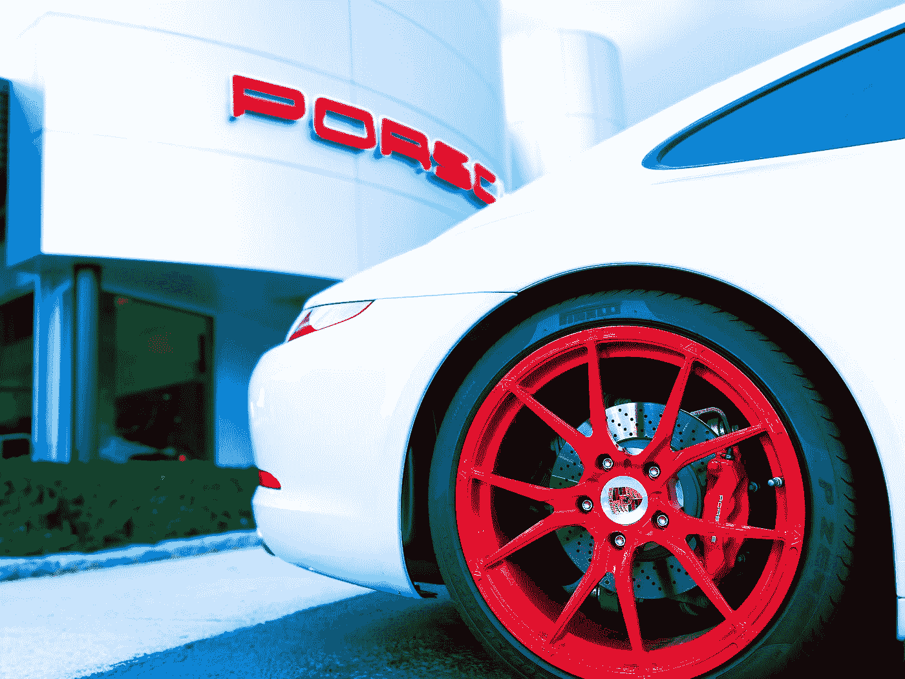

# 用于无限滚动、显示祝酒词和添加 Flexbox 网格的顶级 Vue 包

> 原文：<https://levelup.gitconnected.com/top-vue-packages-for-infinite-scrolling-displaying-toasts-and-add-a-flexbox-grid-b91a0bb8279c>


安德鲁·舒尔茨在 [Unsplash](https://unsplash.com?utm_source=medium&utm_medium=referral) 上拍摄的照片

Vue.js 是一个易于使用的 web 应用框架，我们可以用它来开发交互式前端应用。

在这篇文章中，我们将看看添加无限滚动、显示祝酒词和添加 flexbox 网格的最佳包。

# vue-无限负载

我们可以用 vue 无限加载包给我们的应用添加无限滚动。

为了添加它，我们运行以下命令来安装这个包:

```
npm i vue-infinite-loading
```

然后我们可以通过写来使用它:

```
<template>
  <div>
    <div v-for="n in num" :key="n">{{n}}</div>
    <infinite-loading @infinite="infiniteHandler"></infinite-loading>
  </div>
</template><script>
import InfiniteLoading from "vue-infinite-loading";export default {
  components: {
    InfiniteLoading
  },
  data() {
    return { num: 50 };
  },
  methods: {
    infiniteHandler($state) {
      this.num += 50;
      $state.loaded();
    }
  }
};
</script>
```

我们添加寄存器并使用`infinite-loading`组件来加载更多的数据。

它发出我们用`infiniteHandler`监听的`infinite`事件。

它有一个`$state`参数，我们称之为`loaded`,表示我们在滚动时加载了我们想要显示的内容。

我们只是从 0 到`num`循环一些数字，用`infiniteHandler`方法更新。

如果不想加载更多的项目，可以调用`$state.complete`。

所以我们可以写:

```
<template>
  <div>
    <div v-for="n in num" :key="n">{{n}}</div>
    <infinite-loading [@infinite](http://twitter.com/infinite)="infiniteHandler"></infinite-loading>
  </div>
</template><script>
import InfiniteLoading from "vue-infinite-loading";export default {
  components: {
    InfiniteLoading
  },
  data() {
    return { num: 50 };
  },
  methods: {
    infiniteHandler($state) {
      if (this.num === 200) {
        $state.complete();
        return;
      }
      this.num += 50;
      $state.loaded();
    }
  }
};
</script>
```

现在我们在`this.num`200 的时候停止更新。

这意味着`this.num`为 200 时不再有无限滚动。

# vue-grd

如果我们在使用 flexbox 时遇到问题，我们可以使用 vue-grd 通过我们的 vue 应用程序进行灵活的工作。

要安装它，我们运行:

```
npm i vue-grd
```

然后我们可以写:

```
<template>
  <div>
    <vue-grid align="stretch" justify="start">
      <vue-cell width="fill">fill</vue-cell>
      <vue-cell width="5of12">5of12</vue-cell>
      <vue-cell width="3of12">3of12</vue-cell>
    </vue-grid>
  </div>
</template><script>
import { VueGrid, VueCell } from "vue-grd";export default {
  components: {
    VueGrid,
    VueCell
  }
};
</script>
```

用`vue-grid`创建一个 flexbox 容器。

然后我们需要`vue-cell`将内容添加到 flexbox 容器中。

容器有 12 列，所以我们可以用字符串 5of12 或 3of12 来改变宽度，分别填充 12 列中的 5 列和 3 列。

`fill`用`vue-cell`中的内容填充剩余空间。

`justify`与 CSS 中的 justify 工作方式相同。

我们可以把时间安排在两端，中间留有空间，等等。

# vue-材料-复选框

vue-material-checkbox 让我们可以轻松地添加材质设计风格复选框。

为了安装它，我们编写:

```
npm i vue-material-checkbox
```

然后我们可以通过写来使用它:

```
<template>
  <div>
    <Checkbox v-model="val" :value="42">My Checkbox</Checkbox>
    <p>{{val}}</p>
  </div>
</template><script>
import Checkbox from "vue-material-checkbox";export default {
  components: { Checkbox },
  data() {
    return { val: undefined };
  }
};
</script>
```

`Checkbox`组件绑定到`val`状态。

如果勾选，则设置为`true`，否则设置为`false`。

我们可以设置颜色、禁用、必需属性、大小、字体大小和更多选项。

# vue-烘烤的

我们可以用 vue-toasted 插件显示祝酒词。

要安装它，我们运行:

```
npm i vue-toasted
```

然后我们可以通过写来使用它:

`main.js`

```
import Vue from "vue";
import App from "./App.vue";
import Toasted from "vue-toasted";Vue.use(Toasted);Vue.config.productionTip = false;new Vue({
  render: h => h(App)
}).$mount("#app");
```

`App.vue`

```
<template>
  <div></div>
</template><script>
export default {
  mounted() {
    this.$toasted.show("hello");
  }
};
</script>
```

我们注册了插件，然后显示一个祝酒词。

我们可以在祝酒词中加入动作。

例如，我们可以写:

```
<template>
  <div></div>
</template><script>
export default {
  mounted() {
    this.$toasted.show("hello", {
      action: [
        {
          text: "Cancel",
          onClick: (e, toastObject) => {
            toastObject.goAway(0);
          }
        },
        {
          text: "Undo",
          push: {
            name: "/",
            dontClose: true
          }
        }
      ]
    });
  }
};
</script>
```

我们传入一个对象，让我们添加一些链接到 toast。

第一个是取消按钮。

我们打电话给`goAway`让它消失。参数是以毫秒为单位的延迟。

第二个是让我们导航到一条路线。

`name`有来自 Vue 路由器的路由路径。



在 [Unsplash](https://unsplash.com?utm_source=medium&utm_medium=referral) 上[奥比·奥尼耶多尔](https://unsplash.com/@thenewmalcolm?utm_source=medium&utm_medium=referral)的照片

# 结论

vue-infinite-loading 是一个易于使用的包，可以让我们在应用程序中添加无限滚动。

vue-toasted 允许我们在应用程序中显示祝酒词。

vue-material-checkbox 让我们显示一个复选框。

vue-grd 让我们不用自己的 CSS 就能创建 flexbox 网格。