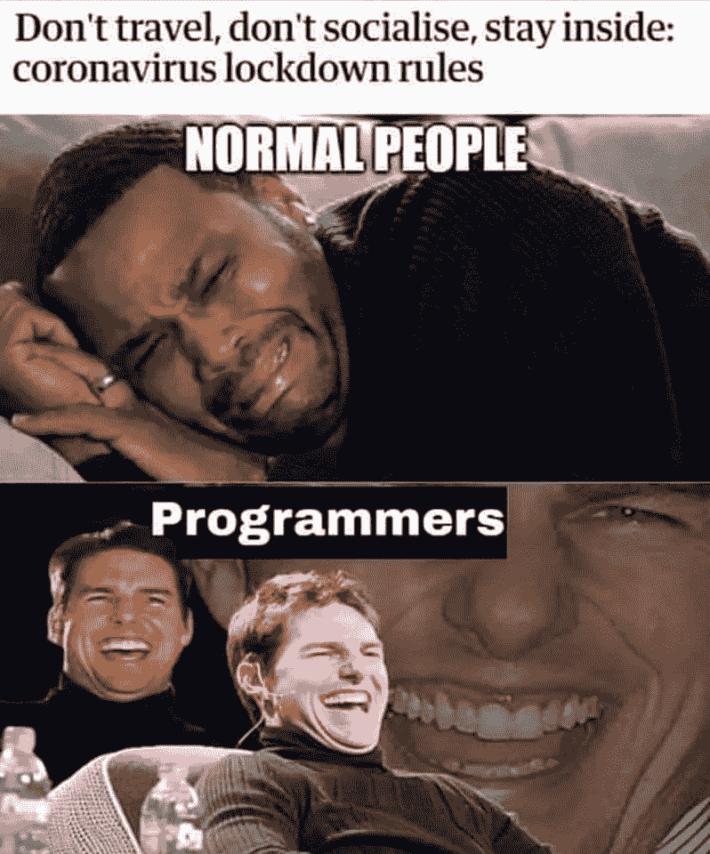

# 《苦差事》:技术与编码周刊——第一期

> 原文：<https://levelup.gitconnected.com/top-weekly-stories-in-tech-and-programming-the-grind-issue-1-a9e8cba175f4>

[***订阅 The Grind***](https://thegrind.news)**把本周最好的科技和编程故事发到你的收件箱里。**

*就是这个！你期待已久的一天！第一期来了！*

*嗯，这是我们热切期待的一天。我们希望有一天，当你收到最新一期的《磨砺》时，你也会有同样的感觉。我们真的很高兴有这个机会给你的生活带来一点额外的快乐、知识和乐趣。亲爱的读者，我们期待与你建立长久而愉快的关系。*

*我们都还在 COVID 时代。在这个奇怪的时刻，我们祝愿每个人一切顺利。虽然未来是不确定的，但我们知道我们现在就在这里。只要我们在这里，我们的大脑就需要喂养。幸运的是，互联网上充满了健脑食品。请享用我们精选的上周最好的健脑食物。*

# *📈**科技趋势***

*[**微软:Rust 是业界安全系统编程的“最佳机会”——新堆栈**](https://thenewstack.io/microsoft-rust-is-the-industrys-best-chance-at-safe-systems-programming/#)**(4 分 23 秒)***

***微软已经公开声明他们正在从 C++转向同样高性能的 Rust 语言。此前，苹果、谷歌、Dropbx、Cloudflare 和 AWS 等其他科技巨头也采取了类似的做法***

***[**脸书的代码转换器可以将代码转换成不同的编程语言**](https://venturebeat.com/2020/06/08/facebooks-transcoder-ai-converts-code-from-one-programming-language-into-another/)(5 分 7 秒)***

***翻译——将代码从一种语言翻译成另一种语言——一直是为多个平台开发应用程序或将应用程序从一个平台移植到另一个平台的必然结果。脸书的新工具可能是创建罗塞塔代码石的第一步，在这里语言可以无缝地相互交换。***

***[**OpenAI 推出 API 将其研究商业化**](https://venturebeat.com/2020/06/11/openai-launches-an-api-to-commercialize-its-research/)(5 分 13 秒)***

***OpenAI 公司已经创建了一个 API，这是他们向整个开发社区提供自然语言处理能力的目标迈出的一大步。你可以在这里申请加入 API 的候补名单。***

# ***🔐安全性***

***被网络攻击 T3(2 分 18 秒)后，本田停止了一些工厂的生产***

***由于勒索病毒感染，本田被迫暂停在美国和海外多家工厂的工厂运营，这与 2017 年使用现已臭名昭著的 WannaCry 蠕虫对该公司进行的类似攻击相呼应。***

***[**谷歌称伊朗、中国黑客瞄准川普，拜登竞选**](https://techcrunch.com/2020/06/04/google-china-iran-trump-biden/)(2 分 19 秒)***

***在谷歌的一份官方声明中，研究人员发现拜登竞选团队被一个中国团体盯上了，特朗普竞选团队被一个伊朗团体盯上了。虽然这两次攻击似乎都没有成功，但随着大选的临近，这肯定不是我们看到的针对美国政治活动的最后一次尝试。***

# ***📚**技术&社会*****

***[**研究人员在优步、Lyft 等人使用的“动态定价”算法中发现种族歧视**](https://venturebeat.com/2020/06/12/researchers-find-racial-discrimination-in-dynamic-pricing-algorithms-used-by-uber-lyft-and-others/)(7 分 11 秒)***

***事实证明，你最后一次通勤的成本可能与你的皮肤有很大关系，就像你旅行的距离或时间一样。一个有趣的道德故事，讲述了当机器学习应用于社会数据时会发生什么。***

***[**互联网最重要的——也是被误解的——法律，解释**](http://arstechnica.com/tech-policy/2020/06/section-230-the-internet-law-politicians-love-to-hate-explained/)(17 分 57 秒)***

***当 Twitter 最近决定开始对唐纳德·特朗普的推文进行事实核查时，Twitter 首席执行官杰克·多西对错误信息采取了大胆的立场。特朗普希望通过攻击 1996 年的第 230 号法律寻求法律报复，该法律赋予社交媒体公司对其平台上的内容几乎为零的责任。但有趣的是，乔·拜登对这部法律的看法和特朗普一样。深入了解这条定律是什么，它会如何变化，以及这些变化会如何影响你。***

***[**五角大楼文件透露美国已策划比特币叛乱**](https://www.forbes.com/sites/billybambrough/2020/06/10/pentagon-documents-reveal-the-us-has-planned-for-a-bitcoin-rebellion/#5da2cf184cc0)(2 分 46 秒)***

***Official documents from the U.S. Department of Defense describe a Robin Hood-esque organization called Zbellion, that converts stolen money into bitcoin. They then turn it around to fund a global anti-establishment movement.***

***[**Activists rally to save Internet Archive as lawsuit threatens site**](https://decrypt.co/31906/activists-rally-save-internet-archive-lawsuit-threatens) (4min 43sec)***

***The Internet Archive is a Non Profit organization, and the site hosts a treasure trove of culture artifacts of all sorts, including millions of movies, books, software, and audio recordings. When it temporarily suspended the waitlist feature to help address the problem of COVID-19 driven shut downs of public libraries, publishing giants Hachette, HarperCollins, Penguin Random House, and Wiley sued over it. And they’re seeking damages at $210,000,000,000 (that’s two hundred and ten billion dollars). That would be game over for the Archive.***

# ***🕴 **Tech Business*****

***[**Facebook establishing VC arm to invest in startups**](https://www.axios.com/facebook-establishing-a-venture-arm-to-invest-in-startups-91d9ee71-2282-4032-8f31-45b861a6ba9c.html) (3min 24sec)***

***Facebook is making a big push to fund startups, hoping to get the jump on the next big thing before it blows up.***

***[**Zoom closed account of U.S.-based Chinese activist “to comply with local law”**](https://www.axios.com/zoom-closes-chinese-user-account-tiananmen-square-f218fed1-69af-4bdd-aac4-7eaf67f34084.html) (2min 58sec)***

***Zoom shut down Chinese activists living in America, for holding a meeting to remember the Tiananmen Square Massacre. This was likely a move to appease China’s law prohibiting the discussing of the famous pro democracy Tiananmen protests that occurred in 1989.***

# ***⚕ **Health*****

***[**Is Dark Mode Such A Good Idea?**](https://kevq.uk/is-dark-mode-such-a-good-idea/) (4min 33sec)***

***I like dark mode. At this moment, I’m tying this on my laptop on an app using dark mode. Even though I haven’t come back from the dark side just yet, this short, educational read has me second guessing this choice for the first time since dark mode has been an option.***

***[**The Reality of Developer Burnout**](https://kenreitz.org/essays/the-reality-of-developer-burnout) (4min 48sec)***

***从几年前，但仍然高度相关的今天。我们大多数人以前都经历过精疲力尽。了解如何注意到它，以及如何在它成为问题之前处理它，可以将你从一大堆压力、疾病、疲劳和过早的白发中拯救出来。坚实的战略和伟大的实用建议在这里。***

# ***🛠 **开发工具*****

***[**Ikonate**](https://ikonate.com/) —完全可定制&无障碍矢量图标***

***这个网站是为你的下一个项目免费生成一组图标的极好工具。自定义大小、边框密度和颜色，以符合您的设计或想法。***

***[**Grid.js**](https://gridjs.io/) — Grid.js 是一个免费开源的 HTML 表格插件，用 TypeScript 编写***

***这是一个开源项目，旨在解决开发健壮的、响应迅速的、可重用的、数据驱动的表格的常见问题。Grid.js 提供了一个简单的 API，并拥有简单的可扩展性。***

***[**讨论**](https://news.ycombinator.com/item?id=23468193) :哪些工具让你成为了更好的程序员？***

***这是一个很棒的主题，来自各行各业的开发人员可以在这里讨论让他们达到现在位置的工具。这是一次很好的谈话，可以了解一种可能对你有很大影响的新工具，或者分享你在职业生涯中受益于哪些工具。***

# ***✨ **花式项目*****

***[**未来模式**](https://futuremood.com/)***

***我们不知道 AURAFLOW 5000 太阳镜是否真的能改变你的情绪(该公司承诺这已经过“科学验证”)😂)，但我们确信 Futuremood 知道如何制作一个吸引眼球的网站。***

***[**认为担当**](https://thinkbear.net/)***

***数码设计师 Jens Nielsen 的作品集拥有精美的极简主义现代设计。他使用迷人的 Bigilla 字体达到很好的效果，设置在一个克制的黑色和黄色调色板中。有魅力又优雅。***

# ***本周迷因***

******

***有人比程序员更擅长社交距离吗？大概不会。我们已经进行了大量的练习，我们能够迎接挑战。💪🤓***

***我们所有人在 *The Grind* 祝你保持安全，保持健康！愿你的代码保持干净，你的设计保持严谨，你的精神得到提升。***

***[***订阅研***](https://thegrind.news)**把本周最好的科技和编程故事送到你的收件箱。*****