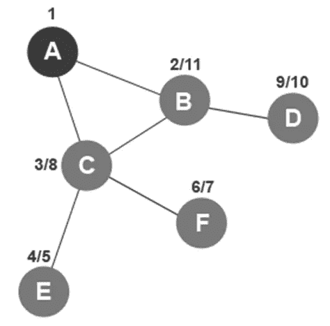

# 拓扑排序直观解释

> 原文：<https://levelup.gitconnected.com/topological-sorting-visually-explained-3c796dcf7ac4>

拓扑排序是按照完成时间递减的顺序对树进行排序的结果。这意味着您运行深度优先搜索算法，一旦它完成，您将有两组值:发现时间和完成时间。反向排序的结束时间将生成拓扑排序列表。

DFS 从顶点 a 开始遍历树，因为它已经被发现，我们将用数字 1 标记它。数字 1 用来表示先被发现。

该算法检查从顶点 A 开始的所有未访问的节点。顶点 A 连接到未访问的节点 B 和 DFS 算法接下来访问顶点 B。顶点 B 被标记为已访问，并接收发现时间 2。

该算法检查从顶点 B 开始的所有未访问的节点。顶点 B 连接到未访问的节点 C 和 DFS 算法接下来访问顶点 C。顶点 C 被标记为已访问，并接收发现时间 3。

该算法检查从顶点 C 开始的所有未访问的节点。顶点 C 连接到未访问的节点 E 和 DFS 算法接下来访问顶点 E。顶点 E 被标记为已访问，并接收发现时间 4。

顶点 E 没有任何连接到未访问节点的附加边。它回溯到顶点 c。随着回溯，顶点 E 接收到结束时间 5。结束时间 5 显示在发现时间 4 之后。

该算法再次检查从顶点 C 开始的所有未被访问的节点。顶点 C 连接到未访问的节点 DFS 算法接下来访问顶点 F。顶点 F 被标记为已访问，并且接收到的发现时间为 6。

顶点 F 没有任何连接到未访问节点的附加边。它回溯到顶点 c。通过回溯，顶点 F 得到的结束时间是 7。结束时间 7 显示在发现时间 6 之后。

顶点 C 没有任何连接到未访问节点的附加边。它回溯到顶点 b。通过回溯，顶点 C 得到的结束时间是 8。结束时间 8 显示在发现时间 3 之后。

该算法再次检查从顶点 B 开始的所有未被访问的节点。顶点 B 连接到未访问的节点 D，DFS 算法接下来访问顶点 D。顶点 D 被标记为已访问，并且收到的发现时间为 9。

顶点 D 没有任何连接到未访问节点的附加边。它回溯到顶点 b。通过回溯，顶点 D 得到的结束时间是 10。结束时间 10 显示在发现时间 9 之后。

顶点 B 没有任何连接到未访问节点的附加边。它回溯到顶点 a。随着回溯，顶点 B 接收到 11 的结束时间。结束时间 11 显示在发现时间 2 之后。

顶点 A 没有任何连接到未访问节点的附加边。它试图回溯，但没有额外的节点可以回溯。随着回溯，顶点 A 得到 12 的结束时间。结束时间 12 显示在发现时间 1 之后。DFS 算法完成。

要获得发现时间列表，请按发现时间的升序排列项目。

要获得按拓扑排序的列表，请按完成时间降序排列项目。a 是最后一个被标记为完成的项目，因此它首先进入，然后是 B 和 d。虽然前两个元素在两个列表中是相同的，但元素 3 从 C 变为 d。接下来，顶点 C 被标记为完成，然后是顶点 F 和 e。这完成了拓扑排序的列表。

如果你喜欢你所读的，我的书，**【算法的说明性介绍】，涵盖了这个算法和更多。**

**

*Dino Cajic 目前是 [LSBio(寿命生物科学公司)](https://www.lsbio.com/)、[绝对抗体](https://absoluteantibody.com/)、 [Kerafast](https://www.kerafast.com/) 、 [Everest BioTech](https://everestbiotech.com/) 、 [Nordic MUbio](https://www.nordicmubio.com/) 和 [Exalpha](https://www.exalpha.com/) 的 IT 负责人。他还是我的自动系统公司的首席执行官。他有十多年的软件工程经验。他拥有计算机科学学士学位，辅修生物学。他的背景包括创建企业级电子商务应用程序、执行基于研究的软件开发，以及通过写作促进知识的传播。*

*你可以在 [LinkedIn](https://www.linkedin.com/in/dinocajic/) 上联系他，在 [Instagram](https://instagram.com/think.dino) 上关注他，或者[订阅他的媒体出版物](https://dinocajic.medium.com/subscribe)。*

*阅读 Dino Cajic(以及 Medium 上成千上万的其他作家)的每一个故事。你的会员费直接支持迪诺·卡吉克和你阅读的其他作家。你也可以在媒体上看到所有的故事。*