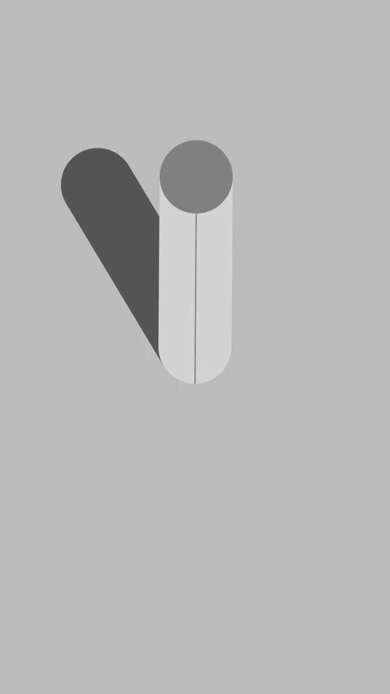
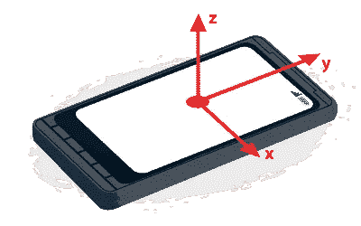
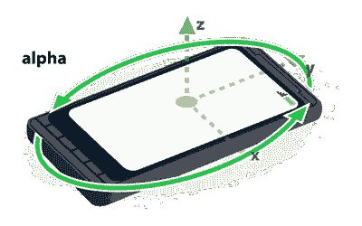
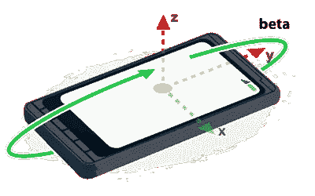
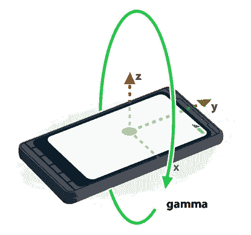
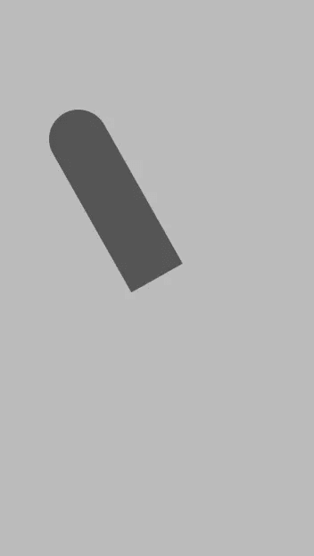
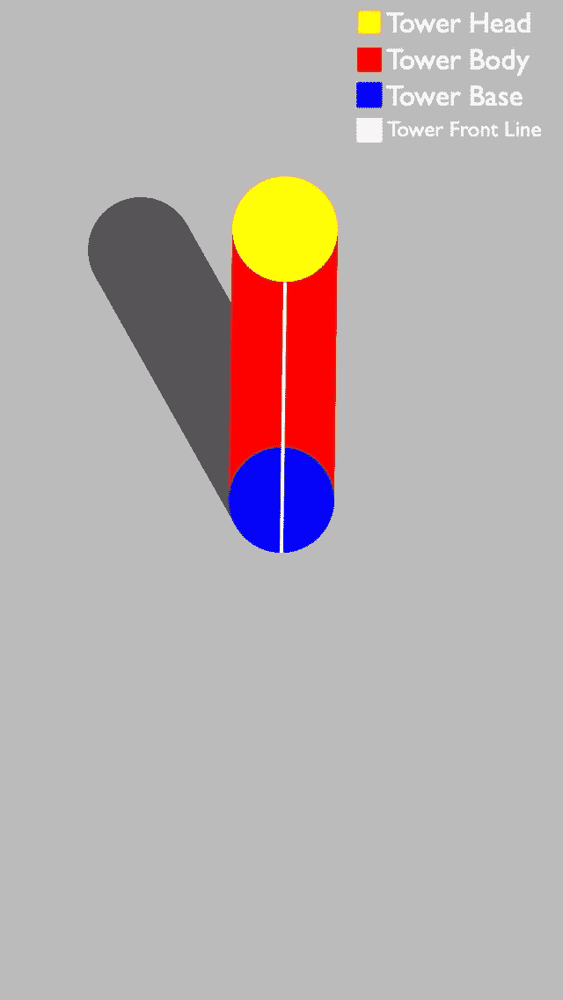

# Tower:一个 React-Native 设备运动示例应用程序

> 原文：<https://levelup.gitconnected.com/tower-a-react-native-device-motion-example-app-8a8e81d333c3>



Tower:一个 React-Native 设备运动示例应用程序

## 一个简单的例子，说明如何在 expo 中使用设备动作。

我在研究苹果的指南针应用程序，它也有调平功能。我想到创建相同的应用程序作为例子来理解移动设备运动的物理学。经过多次思考，我想创建一个应用程序，将显示一个圆柱塔的阴影，我们的运动是从不同角度看圆柱的相机视图。

从这个简单的项目开始，首先，让我们从我们将在项目中使用的不同库的概述开始。

# 反应-自然

React Native 是一个 JavaScript 框架，用于为 iOS 和 Android 编写真实的、本地呈现的移动应用程序。

# 世博会

[Expo](http://expo.io) 是一个通用 React 应用的框架和平台。它是一套围绕 React 原生和原生平台构建的工具和服务，帮助您从相同的 JavaScript/Typescript 代码库开发、构建、部署和快速迭代 iOS、Android 和 web 应用程序。

# Expo 传感器

[Expo-Sensors](https://docs.expo.io/versions/latest/sdk/sensors/) 提供各种 API 来访问设备传感器，以测量运动、方向、压力、磁场和步数。我们将使用这个库中的 [DeviceMotion](https://docs.expo.io/versions/latest/sdk/devicemotion/) 。

# 反应-原生-SVG

React-Native-SVG 为 iOS 和 Android 上的 React Native 提供了 SVG 支持，并为 web 提供了一个兼容层。我们将使用这个库通过圆和线来设计一个圆柱体的幻象。

# **创建项目文件夹**

如果您是一名 React-Native 开发人员，您已经知道如何创建 Expo 项目。

```
expo init tower
```

# 安装库

*   `react-native-svg` — [React-Native-SVG](https://github.com/react-native-community/react-native-svg)
*   `expo-sensors` — [曝光传感器](https://docs.expo.io/versions/latest/sdk/sensors/)

您必须使用 **expo install** 来确保您下载的包是与您的项目正在运行的 SDK 版本兼容的合适的包。

```
expo install react-native-svg expo-sensors
```

在向您展示代码之前，我必须解释如何使用 DeviceMotion 库。我们首先像这样从`expo-sensors`导入库:

```
import { DeviceMotion } from 'expo-sensors'; 
```

> `[DeviceMotion.addListener(listener)](https://docs.expo.io/versions/latest/sdk/devicemotion/#devicemotionaddlistenerlistener)`

DeviceMotion 提供了一个名为 addListener 的函数来订阅 DeviceMotion 的更新。这里我们添加了侦听器函数，它接收一个对象作为单个参数。

在这个对象中，我们感兴趣的是旋转对象，它是设备在空间中作为具有 alpha、beta、gamma 键的对象的方向，其中 alpha 表示绕 Z 轴旋转，beta 表示 X 轴旋转，gamma 表示 Y 轴旋转。

为了解释这些值和轴旋转，下面是来自 [developers.google](https://developers.google.com/web/fundamentals/native-hardware/device-orientation) 的文档:

# 设备坐标框架



设备坐标框架图

由值`x`、`y`和`z`描述的器件坐标框架基于器件中心对齐。

**注意:**在给定的文档和我们的 listener 对象中，alpha，beta & gamma 的值是不同的格式，取值范围从-π到π，因此浮点值为-3.14 到 3.14

## 希腊字母的第一个字母



设备坐标框架中 alpha 的图示

绕 z 轴的旋转。当设备顶部直接指向北方时，`alpha`值为 0。随着设备逆时针旋转，`alpha`值增加。

## 贝塔



器件坐标框架中的β图

绕 x 轴的旋转。当设备的顶部和底部与地球表面距离相等时,`beta`值为 0。该值随着设备顶部向地球表面倾斜而增加。

## 微克



设备坐标框架中的 gamma 图

绕 y 轴的旋转。当设备的左右边缘与地球表面距离相等时，`gamma`值为 0。该值随着右侧向地球表面倾斜而增加。

在这个项目中，我们只需要 beta 和 gamma 值，因为我们试图创建一个摄像头视图来查看位于屏幕中心的对象，所以 Z 轴上的数据没有用。

下面是如何添加侦听器并存储旋转数据:

我们将使用这些数据来渲染我们的圆柱体。为了绘制圆柱体，我们使用 react-native-svg 库，它提供了基本元素，如圆形、矩形、直线等等。我们将创建一个固定的阴影元素和一个移动的圆柱元素。



阴影元素

阴影元素是用一条线和一个圆绘制的。在绘制这个元素时，元素的堆叠并不重要，因为它们具有相同的颜色，并且是固定的元素。阴影将从中间投射到左上角的中间。

下面是阴影元素的代码:

对于圆柱体元素，我们将使用 beta 和 gamma 值来放置坐标系中的对象。在这里，我们如何定位对象中的元素很重要，因为它们处于运动中，并且具有不同的颜色。最上面的子元素位于绘制堆栈的底部。气缸中使用了四个元件:

*   充当塔身的线。
*   作为塔底的固定圆。
*   塔体上的细线，表明它是塔的前面。
*   一个充当塔顶的圆圈。

我已经改变了颜色，让你明白每个元素，否则真正的元素将看起来像在主图像的顶部。



以下是圆柱体元素的代码:

beta 和 gamma 值四舍五入到小数点后两位。只有当 beta 为正时，beta 也用于显示前线，这意味着从面向天空的屏幕到面向您屏幕的屏幕的角度。

还有一个 gamma align 布尔值来检查屏幕是否在顶视图上，如果不是，则屏幕会显示文本“保持屏幕在顶部！”。现在，结合所有的代码，这里是代码将如何。

塔式应用程序— App.js

# 结论

这就是这个项目的全部，但许多事情可以在这方面进一步工作，如使用 alpha 值根据太阳的位置来定位阴影，或使用 DeviceMotion 和 three.js 的 3D 模型。这只是一个例子，供初学者检查如何用简单详细的解释代码实现 DeviceMotion。

> 你可以在 GitHub 上查看这个项目。

[](https://github.com/tejas77/tower) [## tejas 77/塔

### 一个简单的例子，说明如何在 expo 中使用设备动作。我在看苹果的…

github.com](https://github.com/tejas77/tower) 

***谢谢。*🤗**