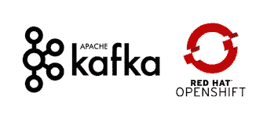
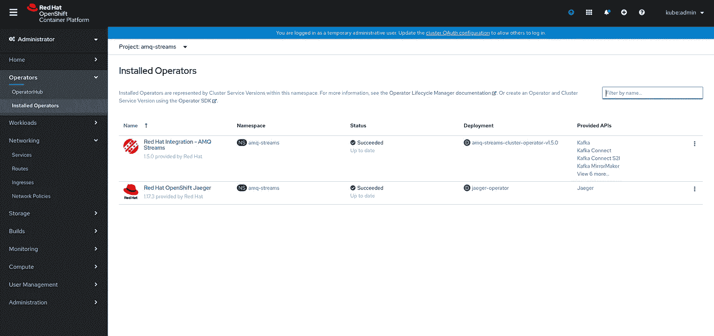
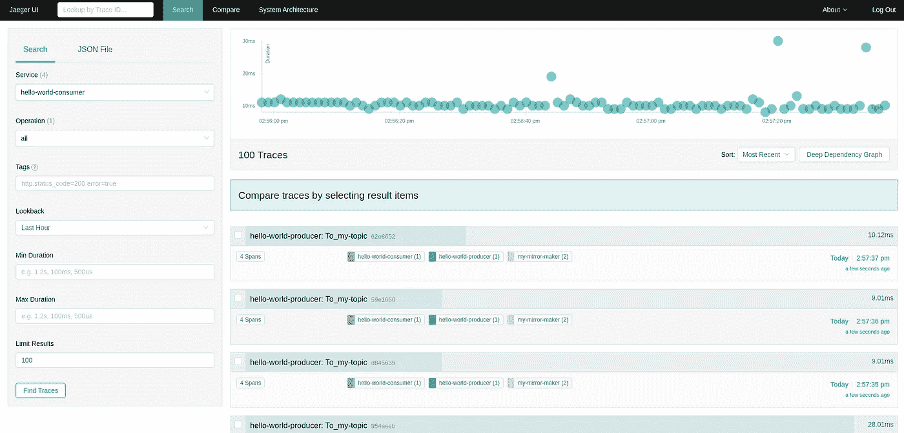
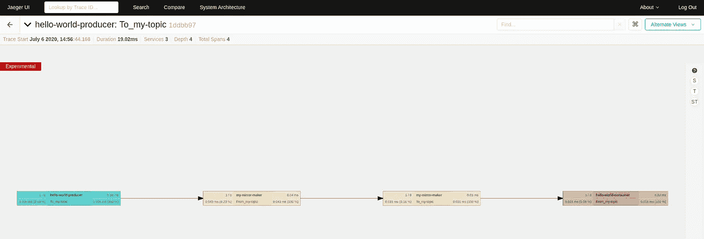

# 使用 AMQ 流镜像制造商和耶格运营商跟踪您复制跨区域数据

> 原文：<https://levelup.gitconnected.com/trace-you-replicated-cross-region-data-using-amq-streams-mirror-maker-and-jaeger-operators-d1c63a9c251>



随着 Apache Kafka 的大量采用，企业正在寻找一种跨不同站点复制数据的方法。Kafka 本身有自己的内部复制和自我修复机制，这些机制只与本地集群相关，不能容忍整个站点的故障。这个问题的解决方案是“镜像制作”功能，通过这个功能，您的本地 Kafka 集群可以异步复制到位于完全不同位置的不同外部/中央 Kafka 集群，以便持久化您的数据管道、日志收集和指标收集流程。

“镜像制造者”连接两个集群，因为其中一个是消费者集群，另一个是生产者集群。主题作为一个逻辑实体被复制，它们存储的所有内容都被复制到目标集群中，应用程序可以在目标集群中使用正在传输的数据。镜像生成器可以水平扩展，这意味着当它成为瓶颈时可以向外扩展。

在本文中，我们将使用 AMQ 流操作符在一个扩展的 Openshift 集群上部署 Kafka(其中的节点位于不同的站点上)，并且我们将使用“Mirror Maker”特性将正在写入源集群的所有消息镜像到目标集群中。此外，我们将使用 OCS RBD 来保存 Kafka logDirs，以了解 OCS 是拓扑无关的，并且可以为同一集群中不同区域的节点提供服务。

最后，我们将使用 Jaeger 跟踪整个管道的响应时间，在这里我们可以看到复制管道中每个组件的响应时间。

游戏开始。

# 先决条件

*   扩展的 Openshift 4.4.6 集群
*   充当存储平台的 OCS 4.4 集群
*   OCS RBD 作为默认存储类别

让我们首先为这个演示创建一个新项目:

```
$ oc new-project amq-streams
```

在我们设置好项目之后，让我们在`amq-streams`项目中安装 AMQ 操作符和耶格操作符来观察所有的集群名称空间:



现在我们已经安装了操作员，我们可以开始创建一些定制资源来部署我们的环境。首先，让我们创建两个集群，其中`europe-cluster`是源集群，`us-cluster`是目标集群。每个集群都将使用 OCS RBD 来保存其写入的数据。

```
$ oc create -f - <<EOF
apiVersion: kafka.strimzi.io/v1beta1
kind: Kafka
metadata:
  name: europe-cluster
spec:
  kafka:
    version: 2.4.0
    replicas: 3
    listeners:
      plain: {}
      tls: {}
    config:
      offsets.topic.replication.factor: 3
      transaction.state.log.replication.factor: 3
      transaction.state.log.min.isr: 2
      log.message.format.version: "2.4"
    storage:
      type: persistent-claim
      size: 20Gi
      deleteClaim: true
  zookeeper:
    replicas: 3
    storage:
      type: persistent-claim
      size: 10Gi
      deleteClaim: true
  entityOperator:
    topicOperator: {}
    userOperator: {}
---
apiVersion: kafka.strimzi.io/v1beta1
kind: Kafka
metadata:
  name: us-cluster
spec:
  kafka:
    version: 2.4.0
    replicas: 3
    listeners:
      plain: {}
      tls: {}
    config:
      offsets.topic.replication.factor: 3
      transaction.state.log.replication.factor: 3
      transaction.state.log.min.isr: 2
      log.message.format.version: "2.4"
    storage:
      type: persistent-claim
      size: 20Gi
      deleteClaim: true
  zookeeper:
    replicas: 3
    storage:
      type: persistent-claim
      size: 10Gi
      deleteClaim: true
  entityOperator:
    topicOperator: {}
    userOperator: {}
EOF
```

现在，让我们验证我们的群集确实已创建，并且他们已从我们的 OCS 群集申请了所需的存储:

```
$ oc get pods

NAME                                                  READY   STATUS    RESTARTS   AGE
amq-streams-cluster-operator-v1.5.0-f9dc58f75-bqbm8   1/1     Running   0          3m23s
europe-cluster-entity-operator-5b5f7d44f7-57dbj       3/3     Running   0          37s
europe-cluster-kafka-0                                2/2     Running   0          87s
europe-cluster-kafka-1                                2/2     Running   0          87s
europe-cluster-kafka-2                                2/2     Running   0          87s
europe-cluster-zookeeper-0                            1/1     Running   0          2m29s
europe-cluster-zookeeper-1                            1/1     Running   0          2m29s
europe-cluster-zookeeper-2                            1/1     Running   0          2m29s
us-cluster-entity-operator-84fbbf445f-k5kjz           3/3     Running   0          35s
us-cluster-kafka-0                                    2/2     Running   0          95s
us-cluster-kafka-1                                    2/2     Running   0          95s
us-cluster-kafka-2                                    2/2     Running   0          95s
us-cluster-zookeeper-0                                1/1     Running   0          2m29s
us-cluster-zookeeper-1                                1/1     Running   0          2m29s
us-cluster-zookeeper-2                                1/1     Running   0          2m29s
```

```
$ oc get pvc                                                                                                                         
NAME                              STATUS   VOLUME                                     CAPACITY   ACCESS MODES   STORAGECLASS                  AGE
data-europe-cluster-kafka-0       Bound    pvc-c8a7da6c-ca61-4a4f-b26b-d2a3e6ec5f37   20Gi       RWO            ocs-storagecluster-ceph-rbd   2m8s
data-europe-cluster-kafka-1       Bound    pvc-80ecaf91-cfbf-48d6-a37a-86c0737d2f06   20Gi       RWO            ocs-storagecluster-ceph-rbd   2m8s
data-europe-cluster-kafka-2       Bound    pvc-6cb0e5ec-1362-40be-8dbc-b9e1c5265804   20Gi       RWO            ocs-storagecluster-ceph-rbd   2m8s
data-europe-cluster-zookeeper-0   Bound    pvc-7993c0e1-1e2c-4c8f-ad34-51aaa104e6a8   10Gi       RWO            ocs-storagecluster-ceph-rbd   3m11s
data-europe-cluster-zookeeper-1   Bound    pvc-ac0aab81-9f54-45d2-b88d-ff9fcaf9f9d9   10Gi       RWO            ocs-storagecluster-ceph-rbd   3m10s
data-europe-cluster-zookeeper-2   Bound    pvc-5eb69362-a9c5-4248-bb15-253c0fa00c81   10Gi       RWO            ocs-storagecluster-ceph-rbd   3m10s
data-us-cluster-kafka-0           Bound    pvc-2b854633-b6f9-48ac-84d5-487e439f44d9   20Gi       RWO            ocs-storagecluster-ceph-rbd   2m16s
data-us-cluster-kafka-1           Bound    pvc-a1f62aa1-5718-47e9-831a-8a87515dcd0e   20Gi       RWO            ocs-storagecluster-ceph-rbd   2m16s
data-us-cluster-kafka-2           Bound    pvc-deb520d1-e822-4954-80f9-126fd95f09d2   20Gi       RWO            ocs-storagecluster-ceph-rbd   2m16s
data-us-cluster-zookeeper-0       Bound    pvc-6ca9d388-a037-471b-9e24-2d98d9125b33   10Gi       RWO            ocs-storagecluster-ceph-rbd   3m11s
data-us-cluster-zookeeper-1       Bound    pvc-56c7cb8e-ac06-4da2-8378-56c3057863fc   10Gi       RWO            ocs-storagecluster-ceph-rbd   3m10s
data-us-cluster-zookeeper-2       Bound    pvc-a99755a8-a3c5-44f2-b9fe-74d0c0a4bd0b   10Gi       RWO            ocs-storagecluster-ceph-rbd   3m10s
```

现在我们已经准备好了两个集群，让我们为将来要复制的源集群创建一个主题:

```
$ oc create -f - <<EOF
apiVersion: kafka.strimzi.io/v1beta1
kind: KafkaTopic
metadata:
  name: my-topic
  labels:
    strimzi.io/cluster: europe-cluster
spec:
  partitions: 12
  replicas: 3
  config:
    retention.ms: 7200000
    segment.bytes: 1073741824
EOF
```

这个主题有一个指向源集群的`strimzi.io/cluster`标签。现在让我们检查这个主题是否确实被创建了:

```
$ oc get kt  

NAME       PARTITIONS   REPLICATION FACTOR
my-topic   12           3
```

这个主题有 12 个复制因子为 3 的分区，这意味着每个 Kafka 节点将是 4 个分区的主节点，也是 8 个其他分区的次节点。

```
$ oc create -f - <<EOF 
apiVersion: kafka.strimzi.io/v1beta1
kind: KafkaUser
metadata:
  name: my-us-user
  labels:
    strimzi.io/cluster: us-cluster
spec:
  authentication:
    type: tls
  authorization:
    type: simple
    acls:
      - resource:
          type: topic
          name: my-topic
          patternType: literal
        operation: Read
        host: "*"
      - resource:
          type: topic
          name: my-topic
          patternType: literal
        operation: Describe
        host: "*"
      - resource:
          type: group
          name: my-group
          patternType: literal
        operation: Read
        host: "*"
      - resource:
          type: topic
          name: my-topic
          patternType: literal
        operation: Write
        host: "*"
      - resource:
          type: topic
          name: my-topic
          patternType: literal
        operation: Create
        host: "*"
      - resource:
          type: topic
          name: my-topic
          patternType: literal
        operation: Describe
        host: "*"
---
apiVersion: kafka.strimzi.io/v1beta1
kind: KafkaUser
metadata:
  name: my-europe-user
  labels:
    strimzi.io/cluster: europe-cluster
spec:
  authentication:
    type: tls
  authorization:
    type: simple
    acls:
      - resource:
          type: topic
          name: my-topic
          patternType: literal
        operation: Read
        host: "*"
      - resource:
          type: topic
          name: my-topic
          patternType: literal
        operation: Describe
        host: "*"
      - resource:
          type: group
          name: my-group
          patternType: literal
        operation: Read
        host: "*"
      - resource:
          type: topic
          name: my-topic
          patternType: literal
        operation: Write
        host: "*"
      - resource:
          type: topic
          name: my-topic
          patternType: literal
        operation: Create
        host: "*"
      - resource:
          type: topic
          name: my-topic
          patternType: literal
        operation: Describe
        host: "*"
EOF
```

现在，让我们验证我们已经使用`KafkaUser`自定义资源创建了用户:

```
$ oc get ku NAME             AUTHENTICATION   AUTHORIZATION
my-europe-user   tls              simple
my-us-user       tls              simple
```

我们看到，我们有两个用户，这两个用户已经创建，稍后将由应用程序使用。在创建了用于认证和授权的用户之后，让我们创建 Jaeger 实例。Jaeger 是一个分布式跟踪工具，它将帮助我们跟踪整个复制过程中的响应时间。我们将创建一个`Jaeger CR`，它将监视我们的名称空间，在我们的部署(镜像制造者和生产者/消费者)中，我们将添加 requires env 变量，以便 JAeger 可以跟踪这些服务。让我们创建 Jaeger 实例:

```
$ oc apply -f - <<EOF 
apiVersion: jaegertracing.io/v1
kind: Jaeger
metadata:
  name: my-jaeger
spec:
  strategy: allInOne
  allInOne:
    image: jaegertracing/all-in-one:latest
    options:
      log-level: debug
  storage:
    type: memory
    options:
      memory:
        max-traces: 100000
  ingress:
    enabled: true
  agent:
    strategy: DaemonSet
  annotations:
    scheduler.alpha.kubernetes.io/critical-pod: ""
EOF
```

这个 CR 也将为 Jaeger UI 创建一个路径，在那里我们可以找到需要的信息。这个部署应该部署一个带有两个容器的 pod，其中一个容器用于 Jaeger 实例，另一个用于 OAuth。

现在让我们创建镜像生成器 CR，一旦我们将部署消费者和生产者，并且集群将有一些数据，数据将被复制到目标集群(在我们的例子中，是`us-cluster`):

```
$ oc create -f - <<EOF
apiVersion: kafka.strimzi.io/v1beta1
kind: KafkaMirrorMaker
metadata:
  name: my-mirror-maker
spec:
  replicas: 1
  consumer:
    authentication:
      certificateAndKey:
        certificate: user.crt
        key: user.key
        secretName: my-europe-user
      type: tls
    bootstrapServers: europe-cluster-kafka-bootstrap:9093
    tls:
      trustedCertificates:
      - certificate: ca.crt
        secretName: "europe-cluster-cluster-ca-cert"
    groupId: my-group
  producer:
    authentication:
      certificateAndKey:
        certificate: user.crt
        key: user.key
        secretName: my-us-user
      type: tls
    bootstrapServers: us-cluster-kafka-bootstrap:9093
    tls:
      trustedCertificates:
      - certificate: ca.crt
        secretName: "us-cluster-cluster-ca-cert"
  whitelist: ".*"
  tracing:
    type: jaeger
  template:
    mirrorMakerContainer:
      env:
        - name: JAEGER_SERVICE_NAME
          value: my-mirror-maker
        - name: JAEGER_AGENT_HOST
          value: my-jaeger-agent
        - name: JAEGER_SAMPLER_TYPE
          value: const
        - name: JAEGER_SAMPLER_PARAM
          value: "1"
EOF
```

如您所见，我们告诉镜像创建者哪个集群是源集群，哪个集群是目标集群。我们使用 TLS 通过创建的证书来保护整个管道中的数据。在底部，你可以看到我们已经给了耶格参数，所以耶格可以为镜子制造商创建跟踪。

让我们将一些数据写入集群:

```
$ oc create -f - <<EOF                                                                                                                
apiVersion: apps/v1
kind: Deployment
metadata:
  labels:
    app: hello-world-producer
  name: hello-world-producer
spec:
  replicas: 1
  selector:
    matchLabels:
      app: hello-world-producer
  template:
    metadata:
      labels:
        app: hello-world-producer
    spec:
      containers:
      - name: hello-world-producer
        image: strimzi/hello-world-producer:latest
        env:
          - name: CA_CRT
            valueFrom:
              secretKeyRef:
                name: europe-cluster-cluster-ca-cert
                key: ca.crt
          - name: USER_CRT
            valueFrom:
              secretKeyRef:
                name: my-europe-user
                key: user.crt
          - name: USER_KEY
            valueFrom:
              secretKeyRef:
                name: my-europe-user
                key: user.key
          - name: BOOTSTRAP_SERVERS
            value: europe-cluster-kafka-bootstrap:9093
          - name: TOPIC
            value: my-topic
          - name: DELAY_MS
            value: "1000"
          - name: LOG_LEVEL
            value: "INFO"
          - name: MESSAGE_COUNT
            value: "1000000"
          - name: JAEGER_SERVICE_NAME
            value: hello-world-producer
          - name: JAEGER_AGENT_HOST
            value: my-jaeger-agent
          - name: JAEGER_SAMPLER_TYPE
            value: const
          - name: JAEGER_SAMPLER_PARAM
            value: "1"
EOF
```

我们创建一个生产者，它将数据写入位于`europe-cluster`的`my-topic`。生产者使用创建的用户来保护使用 TLS 的数据摄取，我们有 Jaeger 参数，这样 Jaeger 也可以跟踪生产者。

pod 运行后，检查其日志以验证其确实向`europe-cluster`写入了消息:

```
$ oc logs $(oc get pod -l app=hello-world-producer -o=jsonpath='{.items[0].metadata.name}') -f2020-07-06 15:15:55 INFO  KafkaProducerExample:35 - Sending messages "Hello world - 1"
2020-07-06 15:15:56 INFO  KafkaProducerExample:35 - Sending messages "Hello world - 2"
2020-07-06 15:15:57 INFO  KafkaProducerExample:35 - Sending messages "Hello world - 3"
2020-07-06 15:15:58 INFO  KafkaProducerExample:35 - Sending messages "Hello world - 4"
2020-07-06 15:15:59 INFO  KafkaProducerExample:35 - Sending messages "Hello world - 5"
2020-07-06 15:16:00 INFO  KafkaProducerExample:35 - Sending messages "Hello world - 6"
```

我们看到源集群收到了消息。现在让我们对消费者做同样的事情，消费者将消费来自目标服务器`us-cluster`的消息。让我们创建消费者部署:

```
$ oc create -f - <<EOF
apiVersion: apps/v1
kind: Deployment
metadata:
  labels:
    app: hello-world-consumer
  name: hello-world-consumer
spec:
  replicas: 1
  selector:
    matchLabels:
      app: hello-world-consumer
  template:
    metadata:
      labels:
        app: hello-world-consumer
    spec:
      containers:
      - name: hello-world-consumer
        image: strimzi/hello-world-consumer:latest
        env:
          - name: CA_CRT
            valueFrom:
              secretKeyRef:
                name: us-cluster-cluster-ca-cert
                key: ca.crt
          - name: USER_CRT
            valueFrom:
              secretKeyRef:
                name: my-us-user
                key: user.crt
          - name: USER_KEY
            valueFrom:
              secretKeyRef:
                name: my-us-user
                key: user.key
          - name: BOOTSTRAP_SERVERS
            value: us-cluster-kafka-bootstrap:9093
          - name: TOPIC
            value: my-topic
          - name: GROUP_ID
            value: my-group
          - name: LOG_LEVEL
            value: "INFO"
          - name: MESSAGE_COUNT
            value: "1000000"
          - name: JAEGER_SERVICE_NAME
            value: hello-world-consumer
          - name: JAEGER_AGENT_HOST
            value: my-jaeger-agent
          - name: JAEGER_SAMPLER_TYPE
            value: const
          - name: JAEGER_SAMPLER_PARAM
            value: "1"
EOF
```

至于生产者，消费者也使用 TLS，从它们那里消费`us-cluster`并使用 Jaeger 参数，以便 Jaeger 可以跟踪它的响应时间。让我们检查它的日志，看看镜像是否工作:

```
$ oc logs $(oc get pod -l app=hello-world-consumer -o=jsonpath='{.items[0].metadata.name}') -f2020-07-06 15:17:42 INFO  KafkaConsumerExample:43 - Received message:
2020-07-06 15:17:42 INFO  KafkaConsumerExample:44 - 	partition: 0
2020-07-06 15:17:42 INFO  KafkaConsumerExample:45 - 	offset: 99
2020-07-06 15:17:42 INFO  KafkaConsumerExample:46 - 	value: "Hello world - 99"
2020-07-06 15:17:42 INFO  KafkaConsumerExample:43 - Received message:
2020-07-06 15:17:42 INFO  KafkaConsumerExample:44 - 	partition: 0
2020-07-06 15:17:42 INFO  KafkaConsumerExample:45 - 	offset: 100
2020-07-06 15:17:42 INFO  KafkaConsumerExample:46 - 	value: "Hello world - 100"
2020-07-06 15:17:42 INFO  KafkaConsumerExample:43 - Received message:
2020-07-06 15:17:42 INFO  KafkaConsumerExample:44 - 	partition: 0
2020-07-06 15:17:42 INFO  KafkaConsumerExample:45 - 	offset: 101
2020-07-06 15:17:42 INFO  KafkaConsumerExample:46 - 	value: "Hello world - 101"
```

是啊！我们在目标集群中有我们的消息，这意味着镜像生成器完成了它的工作:)

现在让我们开始跟踪响应时间，看看我们是否有任何性能问题，使用浏览器中的路线打开 Jaeger UI:

```
$ oc get route

NAME        HOST/PORT                                    PATH   SERVICES          PORT    TERMINATION   WILDCARD
my-jaeger   my-jaeger-amq-streams.apps.ocp4.ocppaz.com          my-jaeger-query   <all>   reencrypt     None
```

在主页上，我们可以看到查询，它跟踪消费者服务的响应时间。可以对这些结果进行排序，以查看哪个响应花费的时间最长:



我们可以单击最高点，获得一个带有响应时间的体系结构视图，在这里我们可以看到整个管道的运行情况:



# 结论

我们看到了如何使用 Kafka“Mirror Maker”跨站点复制数据，其中镜像过程将在源集群中创建的主题复制到目标集群。感谢 OCS，我们已经为 Kafka logDirs 附加了 PVs，以便使用 OCS RBD 块存储在本地保存我们的数据。最后，我们跟踪了复制管道从向源集群写入消息的生产者到消费来自目标集群的写入消息的消费者的响应时间，所有这些都是在 Openshift 容器平台上使用 AMQ 流操作符完成的。

希望你喜欢这个演示，下次再见:)