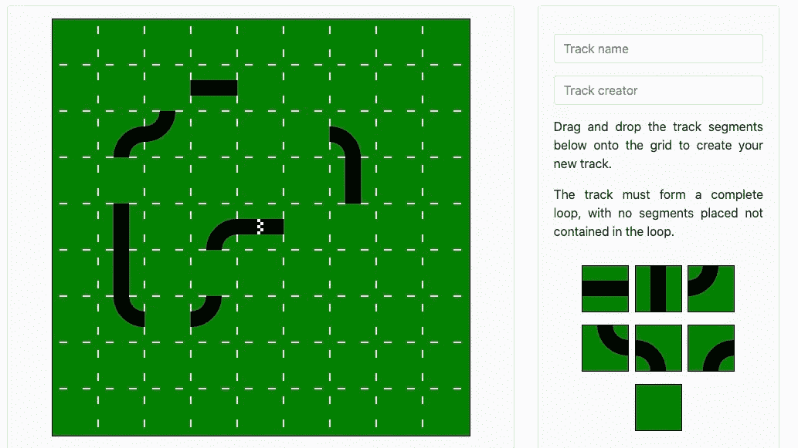

# Track Builder:一个单页、多人的 JavaScript web 应用程序

> 原文：<https://levelup.gitconnected.com/track-builder-a-single-page-multiplayer-javascript-web-application-bb5da2a25856>

*如何使用 WebSockets 和普通 JavaScript 以及 Rails 创建多人游戏*


在我与 FlatIron School 的最新项目中，我开发了单页 JavaScript web 应用程序 Track Builder。

在这个应用程序中，用户可以创建和查看赛道。当观看他们的时候，他们*订阅*一个频道，其他用户也观看该频道，以便能够与他们比赛。

您可以访问网站，在这里亲自测试一下[。请注意，在初始页面加载时，数据库可能需要一段时间来响应，因为它是在一个未付费的 Heroku 设置上运行的。](https://track-builder.netlify.app/)

为了实现上述功能，我在后端使用了 Rails 的 ActionCable 来响应消息。为了在生产中实现这一点，我使用了 Heroku 的 redis 插件。

许多应用程序利用这种 WebSocket 功能，不仅用于游戏，还用于聊天频道或用其他用户所做的实时更改来更新用户。

这篇文章将为你提供在开发中设置 ActionCable 的所有必要工具，并且我还将提供我发现的处理游戏场景中延迟问题的最佳方法。

## 入门指南

我最初在 Ruby 2.6.1 上开发这个项目。然而，当将后端推送到 Heroku 进行托管时，他们的最新应用程序需要最新版本。所以，如果你打算用 Heroku 做主机，我建议你现在更新以避免这个问题。

此外，为了最容易地过渡到 Heroku，请确保您的应用程序配置为使用 Postgres 数据库。

在本指南中，我假设您有一个用`rails new your-app-name — api`命令启动的 Rails API 后端应用程序。



## 为 WebSockets 配置后端

Rails 处理 WebSocket 集成的内置类是 ActionCable。当 WebSockets 被服务器接受时，一个连接对象被实例化，该对象成为创建的所有以下通道订阅的父对象。

ActionCable 由 ApplicationCable 连接和 Cable 类组成。

ApplicationCable::Connection 类可以访问与连接请求一起发送的 cookies，这可以用来处理登录或验证用户。但是，对于 Track Builder，这不是必需的。不需要逻辑来检查有效用户，我没有改变连接类。

Cable 类的操作与所有控制器都将继承的 ApplicationController 类非常相似，因此我的 TrackCable 设置如下:

```
class TrackChannel < ApplicationCable::Channel def subscribed
        stream_from(params[:id])
    end def receive(data)
        ActionCable.server.broadcast(params[:id], **{**content: data**}**)
    end def unsubscribed
        stop_all_streams
    endend
```

`subscribed`、`receive`和`unsubscribed`这三种方法对应于前端将要发送的消息中的命令。此消息中还包含构成可用参数的信息。

这里，`subscribed`将在发送消费者(app 用户)希望订阅的曲目 id 时响应命令‘subscribe’，`stream_from`方法将为频道打开一条路由以广播信息。

`stream_from`接受一个字符串作为流名的参数，我简单地使用了每个音轨的 id。如果您愿意，并且您的应用程序有一个与流相对应的类，那么可以使用`stream_for`，它接受一个模型实例，可以写成:

```
track = Track.find(params[:id])
stream_for track
```

打开流后，使用`ActionCable.server.broadcast`在 rails 应用程序中传输数据，如`receive`方法所示。`broadcast`有两个参数，广播名称和内容。

**注意，**在撰写本文时，ruby 要求第二个参数放在大括号{}中，这与文档的写法相反。

`receive`响应“消息”命令，接受消息中发送的属性。

在我的应用程序中，只有当用户发送频道信息时，数据才会广播给频道的所有订阅者，但该命令可以在任何需要的地方使用。

控制器创建、更新和销毁动作中的其他例子。在这里，当数据更新时，广播将与所有订阅的消费者进行通信，而不需要页面更新。只要有足够的 JavaScript 来处理它。

`unsubscribed`方法响应“取消订阅”命令。然后它调用`stop_all_streams`来取消用户订阅的所有广播。

这些方法的文档可以在[这里](https://guides.rubyonrails.org/action_cable_overview.html)找到。

有了这个配置，剩下唯一要做的事情就是将服务器安装到一个路由上，供您的前端参考。将以下内容添加到您的 config/routes.rb 文件中就可以了:

```
mount ActionCable.server => "/cable"
```

## 前端准备

为了在我的前端发送和接收数据，用下面的代码实例化了一个普通的 JavaScript WebSocket:

```
const socket = new WebSocket(webSocket);
```

这引用了之前在端口常量旁边定义的常量“webSocket ”:

```
const port = '[http:](http://localhost:3000)//localhost:3000';const webSocket = 'ws[:](http://localhost:3000)//localhost:3000/cable';
```

在 WebSocket 启动时，一个“握手”被发送到服务器以打开一个连接，服务器将从该连接做出响应。以下 JavaScript 代码可用于类似于事件监听器的行为:

```
socket.onopen = function(e) { // desired functionality here}
```

在这里可以打开任何通用的广播频道。

然而，在曲目生成器中，我只希望用户在查看曲目时订阅频道，所以我使用了以下代码:

```
function requestSubscribe() { const message: { command: "subscribe", identifier: JSON.stringify({
            channel: "TrackChannel", id: currentTrack.id
        }) }; socket.send(JSON.stringify(message));}
```

如后端部分所述，这将触发 TrackChannel 的`subscribed`方法，发送所需的曲目 id 作为参数。

发送完全相同的消息，但是将命令切换为‘unsubscribe’将会触发`unsubscribed`方法。

为了向服务器发送数据，数据的附加关键字被添加到消息散列中:

```
function updateCarLocation() { const message = { command: "message", identifier: JSON.stringify({
            channel: "TrackChannel", id: currentTrack.id
        }), data: JSON.stringify(myCar) }; socket.send(JSON.stringify(message));}
```

这将把关于用户汽车的信息发送到服务器，以便广播给订阅赛道频道的每个人。我将在下一节更详细地介绍汽车信息的组成。

将数据发送到指定的服务器后，我们将使用`onmessage`功能接收数据广播，如下所示:

```
socket.onmessage = function(e) { const data = JSON.parse(e.data); if (data.type === 'ping' || !data.message) return const carData = data.message.content; if (ip !== carData.ip) cars[carData.ip] = carData;}
```

每当消息被广播到 WebSocket 订阅的通道时，都会触发此操作。这些包括不需要在此应用程序中执行的“pings ”,这是第一个 if 语句的原因。

隐式发送给该函数的参数是消息事件。事件的数据属性包含消息的有效负载；这将在您的 Rails 通道的`receive`方法中设置。因此，我从消息中检索出了`.content`。


## 提高多人游戏环境性能的技巧

在这里，我分享一些我用来确保用户在这个应用程序中切换频道时体验流畅的技巧。如果您使用 WebSockets 来实现聊天功能，或者使用实时数据库更改来更新页面，那么可以跳过这一部分。

如果您访问过该站点并检查过该页面，您会注意到动画是使用 JavaScript canvas 对象呈现的。为了做到这一点，使用了`window.requestAnimationFrame()`函数，该函数在渲染后会调用自身。

这通常每秒发生 60 次左右。因此，我将它作为我的代码中调用之前定义的`updateCarLocation()`的点。这意味着有非常定期的更新正在广播，以便每辆车的信息将被所有用户很好地维护。

发送的数据包括汽车的位置、角度、颜色、用户的 ip 地址，以及汽车是否处于活动状态。这意味着当用户收到汽车信息时，他们可以比较 ip 地址，如果不是他们发送的信息，他们会将汽车添加到要在下一个动画帧中呈现的汽车对象中。

虽然这种高更新率有助于保持频道中所有汽车的准确日期，但当用户切换频道时，它确实开始引起不必要的行为。这种不想要的行为是汽车不能被正确地从它离开的通道中移除(将其活动属性设置为 false)。

这是因为在发送了取消订阅频道的请求后，应用程序帧被渲染。为了解决这个问题，我添加了一个“ready”常量，在取消订阅后的 30 毫秒内该常量将被设置为 false，因此不会有更新发送到之前的频道。

我还编写了代码，如果用户收到一条包含不活动汽车的消息，他们应该重置他们的汽车哈希，并在等待 30 毫秒后再次作为备份。

我添加的另一个安全措施是，不管人们是否切换频道，每个用户的 cars hash 都会每 15 秒重置一次。我已经试验过增加这个的频率，但是发现它开始在动画中引起闪烁。

最后一点，为了在用户刷新浏览器或关闭标签页时删除用户，我在窗口中添加了一个事件监听器:

```
window.addEventListener('beforeunload', (event) => { event.preventDefault(); removeCar(channel); unsubscribeFrom(channel);});
```

其中`removeCar()`将向通道发送汽车不活动的更新。


## 升级到生产

随着应用程序现在在开发和测试，我们准备发布！在这一节中，您会发现许多文档链接，如果遇到任何错误，这些链接应该是您的第一个求助对象。

我用他们的文档[在这里](https://devcenter.heroku.com/articles/getting-started-with-rails6)托管了 Heroku 的后端，按照他们的指示托管了 Netlify 的前端。

从开发阶段转移到生产阶段后，您的代码将需要进行大量的更改。首先我们将从后端开始。

## 后端- Heroku 和 redis

为了让 Heroku 正确运行您的后端服务器，必须在您的后端文件结构的根目录中添加一个 Procfile。

如果你熟悉托管服务器，尤其是 Sinatra，你可能已经使用了*瘦*来运行服务器。然而，Thin 不会在对 WebSocket 消息的响应中发送正确的头，因此应该使用 *Puma* 。您生成的配置文件应包含以下内容:

```
web: bundle exec puma -C config/puma.rbrelease: bundle exec rake db:migrate
```

这依赖于用 rails new 初始化的项目，它将生成所需的 puma.rb 文件。

为了让您的应用程序读取 Procfile，领班 gem 应添加到您的 gem 文件中:

```
gem 'foreman'
```

随着从开发到生产的转变，ActionCable 的适配器将从 async 升级到 redis。

我选择使用(并推荐)Heroku 的免费 redis 插件，它可以在 bash 中用 Heroku 命令初始化:

```
heroku addons:create heroku-redis:hobby-dev -a your-app-name
```

请注意，为了做到这一点，你需要附上一张银行卡到你的 Heroku 帐户。但是您可以通过在创建后输入以下命令来确认该附加组件是免费的:

```
heroku addons:info your-app-name
```

Heroku 的一个重要特性是，当附加组件完成时，一个新的配置变量将对您的后端可用，并且可以通过以下方式查看:

```
heroku config | grep REDIS
```

REDIS_URL 在这里很重要，我们需要修改 Rails 的默认 config/cable.yml 文件，如下所示:

```
development:
    adapter: asynctest:
    adapter: testproduction:
    adapter: redis **url: <%= ENV.fetch("REDIS_URL") %>** channel_prefix: backend_track_builder_production
```

以下 gem 也是 gem 文件中所必需的，并且应该可以作为 Rails 新命令的一部分注释掉:

```
gem 'redis', '~> 4.0'
```

最后一个后端准备步骤是更新 config/cors.rb 文件，只接受来自前端的请求。在 Netlify 上完成托管后，请返回此处进行修改:

```
Rails.application.config.middleware.insert_before 0, Rack::Cors do
    allow do
        **origins 'https://your-app-name.netlify.app'** resource '*', headers: :any,
        methods: [
            :get, :post, :put, :patch, :delete, :options, :head
        ]
    end
end
```

## **前端网络功能**

随着后端的运行，前端所需的唯一变化是更新您的端口和 websocket 变量，以反映您的 Heroku url:

```
const port = 'https://your-app-name.herokuapp.com';const webSocket = '**wss**://your-app-name.herokuapp.com/cable';
```

注意这里 **wss** 的重要性。开发中的 **ws** 与本地主机配合得非常好；然而，生产中需要安全连接。


## 越过这条线

遵循本指南后，您应该在生产中拥有一个完全可操作的应用程序！利用 ActionCable 和 redis，并提供向您的前端发送实时更新的通道。

我希望读完这篇文章后，你不会像我一样遇到控制台错误，并且有了这些额外的知识，你能够进一步提高你的 Javascript 和 Rails 技能。

所有的代码都可以在我的 github [前端](https://github.com/Shilcof/frontend-track-builder)和[后端](https://github.com/Shilcof/backend-track-builder)中找到。

请务必让我知道你是如何使用自己的应用程序的，并在休息时间建立一条赛道，挑战你的朋友完成最快圈速！