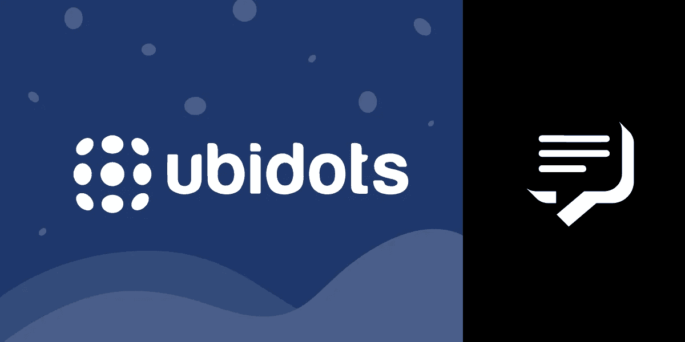
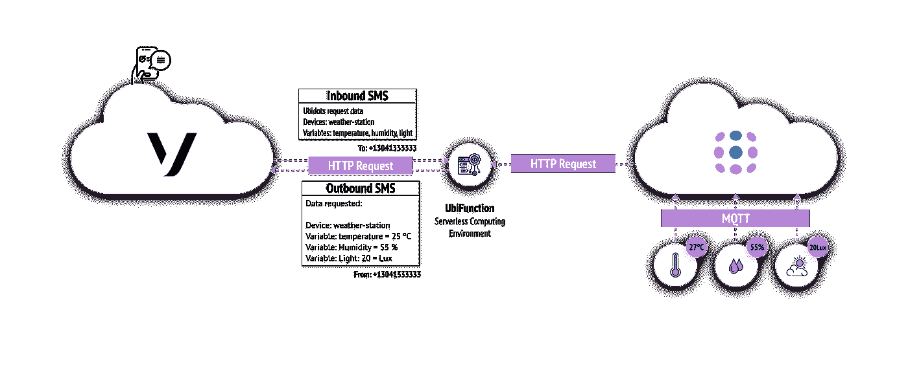
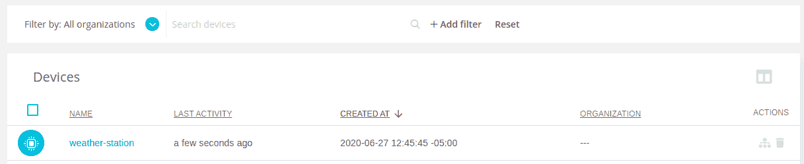
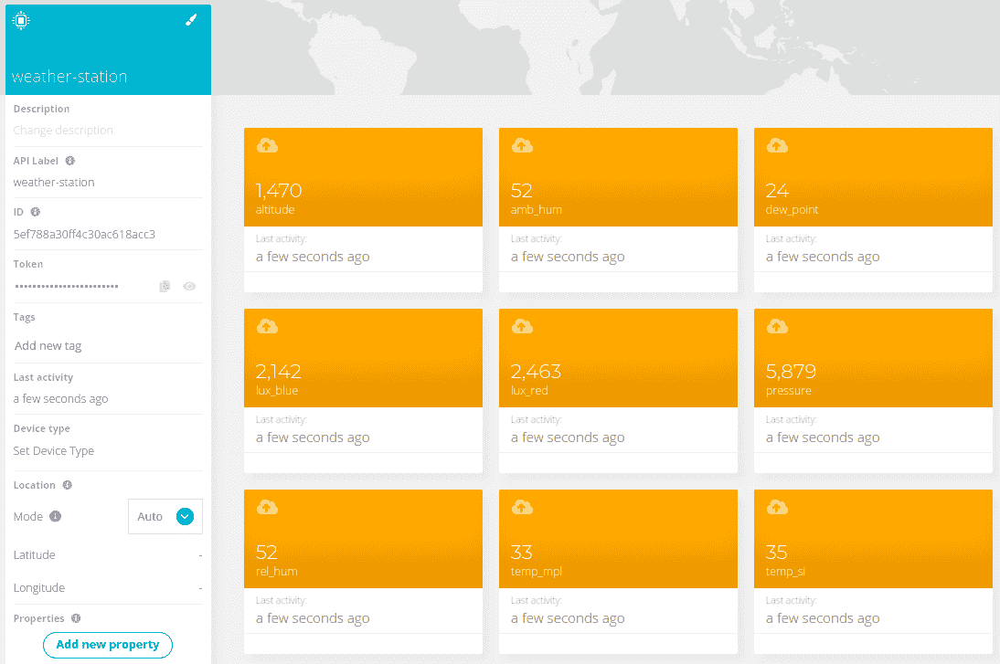
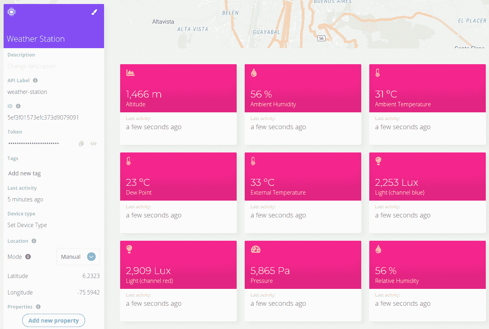
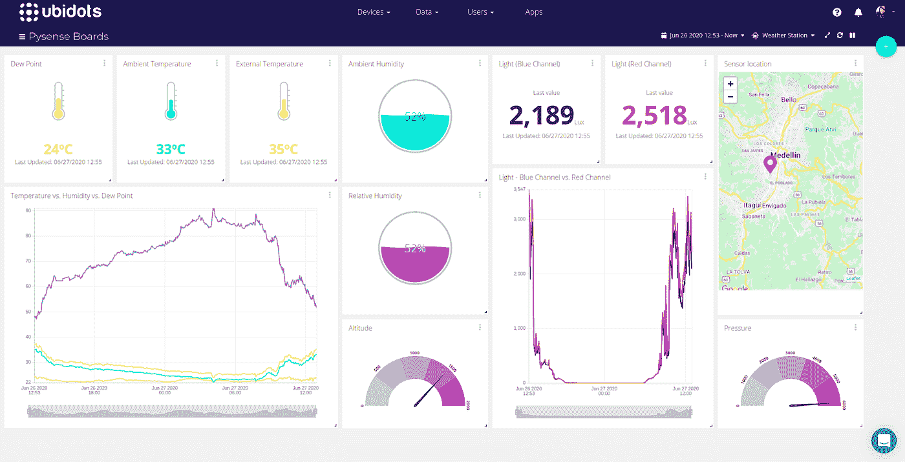
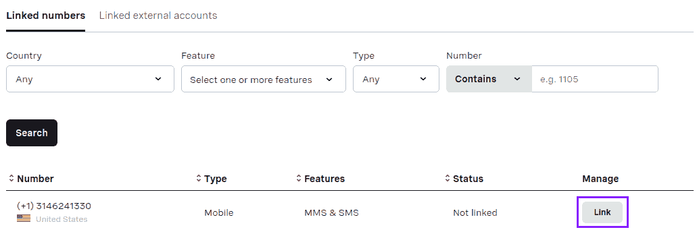
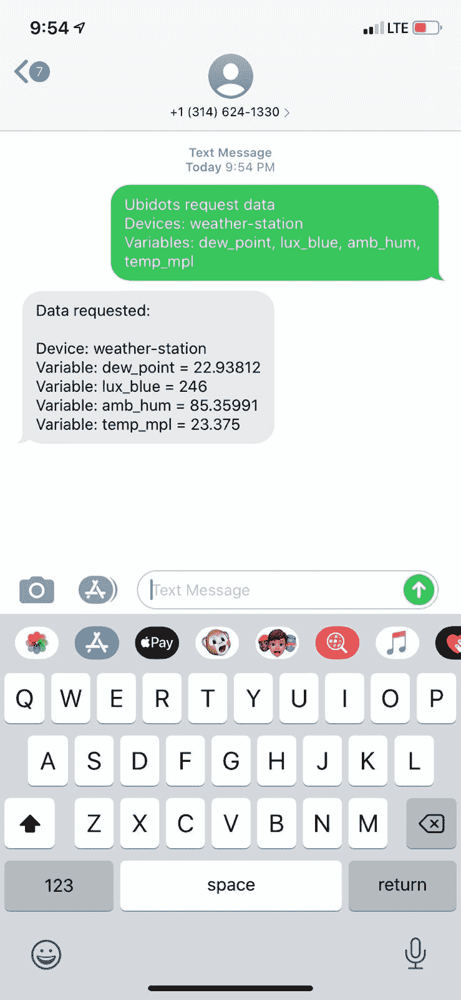
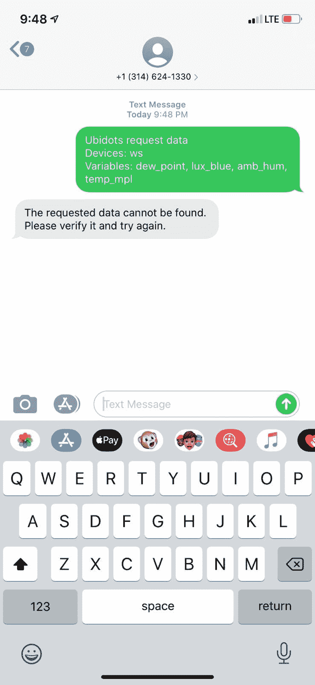
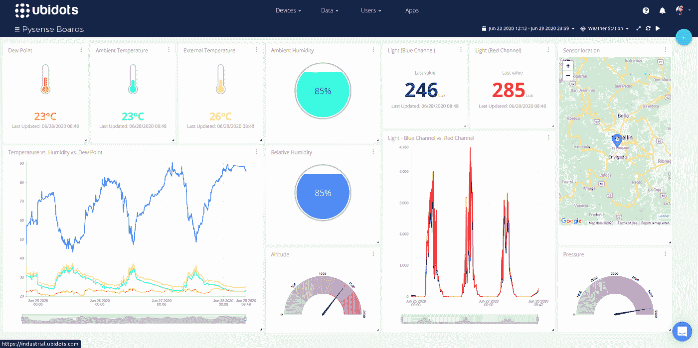

# 使用 Vonage 消息 API 和 Ubidots 实时跟踪设备数据

> 原文：<https://levelup.gitconnected.com/track-device-data-in-real-time-with-vonage-messages-api-and-ubidots-40b71ce1f060>

我认为**物联网(IoT)** 是一个超级英雄:几乎看不见，但它让我们的工作、社交和个人生活变得更好。超级英雄有巨大的力量在你需要他们的地方出现，无论是在城市、医院、教育机构、制造厂、农场，还是你能想到的任何地方。听起来很像物联网，你不觉得吗？

让我们站在娜塔莉亚的角度想想。娜塔莉亚在农业部门使用 [**猪视觉**](https://www.youtube.com/watch?v=WK_ReQbW1kg&feature=youtu.be) 工作，这是一种集成了人工智能和神经网络的智能相机。有了这个设备，她可以在不对猪施加压力的情况下获得农场称重过程的实时指标。如果 Natalia 需要访问数据，但当时没有互联网接入，该怎么办？这就是 [**Vonage 消息 API**](https://www.vonage.com/communications-apis/messages/) 的用武之地——如果 Natalia 通过 SMS 请求她需要的数据怎么办？

如今，有许多消息服务和可视化平台，使技术更容易为每个人所用；我们不需要成为专家工程师来创造创新的解决方案。此外，这些服务允许您在几个小时内部署完整的解决方案。以 Natalia 的使用案例为参考，以及所有可以跨行业存在的基于数据的需求，我认为拥有一个能够独立于互联网访问对设备数据进行实时监控的系统将非常棒。

在本教程中，我将分享使用[**Vonage Messages API**](https://www.vonage.com/communications-apis/messages/)作为消息服务，使用 [**Ubidots**](https://ubidots.com/) 作为物联网平台来构建这个系统的详细步骤。首先，让我们了解要实现的体系结构:

这些服务的整合是通过 UbiFunction 实现的，ubi function 是一种无服务器的计算环境，它允许我们接收通过 HTTP 请求发送给我们的虚拟号码的消息。然后，我们能够对其进行分析，以识别所请求的设备和变量，从而将收到的每个请求变量的最后值作为回复发送出去。

毫无疑问，这个系统将对不同的用例有用。发挥一点创造力，找出它对你正在做的项目有用的地方。事不宜迟，我们开始吧！

# 先决条件

*   [Ubidots 账户](https://industrial.ubidots.com/accounts/signup_industrial/)
*   任何可接入互联网的设备

# Vonage API 帐户

要完成本教程，您将需要一个 [Vonage API 帐户](http://developer.nexmo.com/ed?c=blog_text&ct=2020-08-06-track-device-data-in-real-time-with-vonage-messages-api-and-ubidots-dr)。如果你还没有，你可以[今天](http://developer.nexmo.com/ed?c=blog_text&ct=2020-08-06-track-device-data-in-real-time-with-vonage-messages-api-and-ubidots-dr)注册，开始用免费的信用点数建造。一旦你有了一个帐户，你可以在 [Vonage API 仪表板](http://developer.nexmo.com/ed?c=blog_text&ct=2020-08-06-track-device-data-in-real-time-with-vonage-messages-api-and-ubidots-dr)的顶部找到你的 API 密匙和 API 秘密。

本教程还使用了一个虚拟电话号码。要购买号码，请前往*号码* > *购买号码*并搜索符合您需求的号码。

# 物联网平台设置

Ubidots 允许您快速组装和启动物联网应用程序，而无需编写许多行代码——它简单而强大。要开始使用它，我们只需要[一个账户](https://industrial.ubidots.com/accounts/signup_industrial/)和任何可以连接互联网的设备来传输数据到 [Ubidots API](https://ubidots.com/docs) 。

## 设备设置

对于这个项目，我使用了一个 [Pycon SiPy](https://pycom.io/product/sipy/) 和 [PySense 1](https://pycom.io/product/pysense-2-0-x/) ，它允许我们监控环境变量，如温度、湿度、光照强度和压力。然而，如果你有任何其他支持 **HTTP** 、 **MQTT** 或 **TCP/UDP** 作为通信协议的硬件，它也可以被集成。你可以访问 [Ubidots 帮助中心](https://help.ubidots.com/en/collections/356477-connect-your-devices)获取关于如何使用任何物联网设备向平台发送和控制数据的教程。

Pycom 团队每周都在他们的产品上添加额外的功能，所以在你开始开发之前，确保你的主板运行在[最新固件更新](https://docs.pycom.io/pytrackpysense/installation/firmware/)下。此外，如果你使用 Windows 作为操作系统，你必须[安装所需的驱动](https://docs.pycom.io/pytrackpysense/installation/drivers/)。

***注意*** *:如果这是您第一次使用 Pycom 开发板进行开发，我强烈建议您查看* [*入门指南*](https://docs.pycom.io/gettingstarted/) *以熟悉所有细节。*

安装 [Pymakr](https://gist.github.com/DanyF-github/63af3ddc3778dad167a0644d0f8ce1e1) ，这是一个适用于 [Atom](https://atom.io/packages/pymakr) 和 [Visual Studio 代码](https://marketplace.visualstudio.com/items?itemName=pycom.Pymakr)的插件，可以在任何 Pycom 板上运行和同步项目。Pymakr 还在连接电路板的终端上增加了一个 REPL 控制台。

接下来，根据您的喜好，通过串口或 Telnet 在 Pymakr 和您的主板之间建立通信。查看基于您的代码编辑器的安装指南:

*   [原子](https://docs.pycom.io/pymakr/installation/atom/)
*   [Visual Studio 代码](https://docs.pycom.io/pymakr/installation/vscode/)

## 密码

这个项目需要几个外部库，必须下载并集中在一个地方才能正常工作。如果你想把它们和主要代码一起下载，你可以从这里下载。

如果你想从头开始，用你喜欢的名字创建一个新项目。我决定给它取名`**_pysense-ubidots-mqtt_**`。

在`**_pysense-ubidots-mqtt_**`项目中，我们将管理所需的库并添加主要代码。为了管理这个，创建一个名为`**_lib_**`的新文件夹，以及一个名为`**_main.py_**`的新文件

从 [**pycom 库仓库**](https://github.com/pycom/pycom-libraries) 中，下载以下库，并将其放入刚刚创建的`**_lib_**`文件夹中:

*   [PySense](https://github.com/pycom/pycom-libraries/blob/master/pysense/lib/pysense.py)
*   [LTR329ALS01](https://github.com/pycom/pycom-libraries/blob/master/pysense/lib/LTR329ALS01.py)
*   [MPL3115A2](https://github.com/pycom/pycom-libraries/blob/master/pysense/lib/MPL3115A2.py)
*   [SI7006A20](https://github.com/pycom/pycom-libraries/blob/master/pysense/lib/SI7006A20.py)
*   [pycorpc](https://github.com/pycom/pycom-libraries/blob/master/lib/pycoproc/pycoproc.py)
*   [umqtt.simple](https://github.com/micropython/micropython-lib/tree/master/umqtt.simple)
*   [umqtt.robuts](https://github.com/micropython/micropython-lib/tree/master/umqtt.robust)

下载这些库后，项目文件夹中应该有以下结构:

这些库允许我们与主板(在我的例子中是 SiPy)和 PySense 通信，并通过 MQTT 上的 Ubidots 管理数据。

将下面的代码复制到`main.py`文件中。该代码不断向 Ubidots 发布温度、湿度、压力和海拔值:

除了复制和粘贴，我们还可以看看代码是如何工作的。首先，必须导入所需的库:

然后在下面的变量中，我们分配网络凭证来建立连接:

为了通过 MQTT 建立与 Ubidots 帐户的通信，我们必须定义代理地址、客户端以及用于通信认证的用户名:

*   **MQTT 经纪人** : `industrial.api.ubidots.com`或`169.55.61.243`。
*   **MQTT 客户端**:客户端-服务器通信的唯一标识符。建议使用设备的 MAC 地址作为客户端的标识符，因为它是每个设备的唯一值。
*   **MQTT 用户名**:验证与代理的通信。在 Ubidots 的情况下，我们必须将[帐户令牌](https://help.ubidots.com/en/articles/590078-find-your-token-from-your-ubidots-account)指定为用户名。

接下来，分配[设备标签](https://help.ubidots.com/en/articles/736670-how-to-adjust-the-device-name-and-variable-name)。这个标签是唯一的标识符，它将允许我们与 Ubidots 进行通信，发布或订阅某个主题的数据。它可以是字符串唯一值或设备的 MAC 地址。在我的例子中，我将`weather-station`指定为设备标签:

要完成声明，将所需的数据速率指定为`message_interval`。默认情况下，该变量设置为五秒。`last_message`变量将保存最后一次发送消息的时间。

现在，是时候将板连接到本地网络了。首先，我们创建一个`WLAN`网络接口对象。正如你在下面看到的，这个对象是在`wlan`变量下创建的，并被配置成使用外部天线，因为我把设备部署在离路由器稍远的地方。如果要使用内置天线，使用`wlan.antenna(WLAN.INT_ANT)`即可。

然后，功能`wifi_connect()`建立与指定网络的通信:

但是`wifi_connect`函数到底在做什么呢？正如您在下面看到的，它承担建立网络连接的任务，并且只有在连接成功建立的情况下才返回网络参数。如果出现问题，将会报告该问题，并且设备将会重新启动以重试连接。

然后，将 PySense 板初始化为`py`

为了防止与代理的通信问题，将在进入`while`之前建立连接。然而，如果出现任何通信问题，`umqtt`库将管理自动重新连接。如果由于其他原因无法建立连接，例如代理关闭，则板将重新启动以尝试再次建立连接。

函数`connect_mqtt()`打开一个到指定代理的新 MQTT 连接:

最后，正如您在下面看到的，主代码实际上负责三个进程。

首先，检查网络连接:

然后每 5 秒向 Ubidots 发布一次传感器数据:

这里，函数`read_sensors()`负责从所有传感器获取读数，并构建一个 JSON 有效载荷发送给 Ubidots:

最后，如果代理出现错误，请重启电路板:

功能`restart_and_reconnect()`重启板卡，重新连接代理。

一旦你有了 Pymakr 中的代码，你就可以通过按下*上传*按钮将代码上传到板上。等待几秒钟，直到设备完成编译。

从 Ubidots 帐户，转到*设备>设备*部分，查看一旦收到传感器数据，如何自动创建`weather-station`设备:

可选的 Ubidots 允许我们用友好的名称、颜色、图标和描述来定制设备和变量。请注意，设备和变量标签不能更改，因为标签是处理设备和平台之间通信的标签。

在我的例子中，我定制了变量[名称](https://help.ubidots.com/en/articles/736670-how-to-adjust-the-device-name-and-variable-name)、[图标](https://help.ubidots.com/en/articles/904812-how-to-change-a-variable-s-description-icon)、[单位](https://help.ubidots.com/en/articles/1560178-dashboards-add-units-of-measure)和颜色。

定制前:

定制后:

## 仪表板设置

我喜欢使用 Ubidots 的一个原因是它们提供了引人注目的可视化效果。它们还有各种各样的小部件，允许您完全定制您想要的仪表板外观。仪表板是物联网解决方案的一个非常重要的部分，因为我们可以从世界任何地方的设备上访问所有数据，但是…只有在我们有互联网连接的情况下。

要创建仪表板，请导航至 _ Data > Dashboard _ 部分。然后，点击*新仪表板*并指定所需名称。

要添加新的小部件，只需单击蓝色加号图标，选择小部件类型，设置一些可视化定制。此时，是时候发挥创造力，开始探索 Ubidots 提供的不同小部件了。

这是我的仪表板的样子！

有关仪表板和小部件设置的更多信息，我强烈建议您查看以下指南:

*   [创建仪表板和小部件](https://help.ubidots.com/en/articles/2400308-create-dashboards-and-widgets)
*   [应用品牌:为您的仪表盘和部件定制风格](https://help.ubidots.com/en/articles/3189001-application-branding-custom-styles-for-your-dashboards-and-widgets)

# Vonage 设置

多亏了 [Vonage 消息 API](https://www.vonage.com/communications-apis/messages/) ，我们能够以一种简单的方式启用不同的消息传递策略。它不仅允许我们发送[短信](https://www.vonage.com/communications-apis/sms/)，还允许通过不同渠道进行交流，包括[彩信](https://www.vonage.com/communications-apis/messages/features/mms/)、 [Whatsapp](https://www.vonage.com/communications-apis/messages/features/whatsapp/) 、 [Facebook Messenger](https://www.vonage.com/communications-apis/messages/features/facebook-messenger/) 和 [Viber](https://www.vonage.com/communications-apis/messages/features/viber/) 。对于这个项目，我将使用短信频道，因为我想演示如何请求数据时，你没有互联网接入。

让我们看看下面设置 Vonage 帐户的步骤:

1.  访问您的 Vonage 帐户。如果您还没有，请[注册](http://developer.nexmo.com/ed?c=blog_text&ct=2020-08-06-track-device-data-in-real-time-with-vonage-messages-api-and-ubidots-dr)并从今天开始创建。
2.  登录后，在 [Vonage API 仪表板](https://dashboard.nexmo.com/)顶部找到您帐户的 [**API 密钥& API 秘密**](https://developer.nexmo.com/concepts/guides/authentication#api-key-and-secret) 。从 Ubidots 等外部服务建立通信时，需要这些凭据。请注意，这些凭证应该始终保持安全，决不能共享。
3.  创建一个[T21 新应用](https://developer.nexmo.com/application/overview)。你可以通过使用 Vonage API 仪表板来实现这一点——只需进入*我们的应用> +创建一个新的应用*并为其指定一个名称——或者通过 [**发送一个 HTTP 请求**](https://developer.nexmo.com/application/code-snippets/create-application) 。为了让这个指南对用户友好，我决定直接从仪表盘开始。你只需要处理几次点击，分配一个名字，就是这样！
4.  要接收入站信息，你需要租用一个[虚拟号码](https://developer.nexmo.com/numbers/overview)。可以使用[开发者仪表盘](https://developer.nexmo.com/numbers/guides/number-management)、 [Nexmo CLI](https://developer.nexmo.com/numbers/guides/numbers-cli) 或 [API](https://developer.nexmo.com/api/numbers) 租用该号码。
5.  点击应用程序号码部分的*链接*按钮，将租用号码链接到之前创建的应用程序。

# Vonage 和 Ubidots 集成

在 Ubidots 账户上，转到*设备>功能*部分，点击位于网站右上角的加号图标，创建一个新功能。要创建该函数，您必须分配以下参数:

*   **姓名** : `Vonage Messages API`
*   **HTTP 方法** : `POST`
*   **运行时** : `NodeJs 10`

***注****:ubi function 也可以用 Python 编程，但本指南提供的代码在 NodeJS 中。*

配置完成后，按下*激活*按钮。此时，我们将看到`HTTPS Endpoint URL`字段自动完成，端点将从 Vonage 接收消息。

在我的例子中，生成的 URL 是:`[https://parse.ubidots.com/prv/{ubidots_username}/vonage-messages-api](https://parse.ubidots.com/prv/{ubidots_username}/vonage-messages-api.)` [。](https://parse.ubidots.com/prv/{ubidots_username}/vonage-messages-api.)

然后在 Vonage 开发者门户上，导航到*设置*部分，点击您的用户名，然后在*默认短信设置*选项下分配以下参数。最后，保存更改。

*   **发货回执** : HTTPS 端点 URL 生成+ `/webhooks/delivery-receipts`:

`[https://parse.ubidots.com/prv/{ubidots_username}/vonage-messages-api/webhooks/delivery-receipts](https://parse.ubidots.com/prv/{ubidots_username}/vonage-messages-api/webhooks/delivery-receipts)`

*   **入站消息** : HTTPS 端点 URL 生成+ `/webhooks/inbound-message`:

`[https://parse.ubidots.com/prv/{ubidots_username}/vonage-messages-api/webhooks/inbound-message](https://parse.ubidots.com/prv/{ubidots_username}/vonage-messages-api/webhooks/inbound-message)`

*   **HTTP 方法** : `POST`

当消息被发送到虚拟号码时，它将把信息转发到这个端点。

现在回到创建的 UbiFunction，用下面的代码替换默认代码:

然后，我们必须用 [Ubidots 令牌](http://help.ubidots.com/en/articles/590078-find-your-token-from-your-ubidots-account)替换`UBIDOTS_TOKEN`常量，用 [Vonage API Secret](https://developer.nexmo.com/concepts/guides/authentication#api-key-and-secret) 替换`VONAGE_API_SECRET`，以允许 UbiFunction 和两个服务之间的通信。

不要忘记按下*激活*按钮保存所做的更改！

提供的代码对它的每个过程和功能都有详细的注释，所以理解它应该不会太难。但是，让我们强调一下它是如何工作的:

*   UbiFunction 主代码负责在发送新的 SMS 或报告另一个 SMS 状态时接收 Vonage 发送的有效载荷。
*   然后，分析接收的 SMS 以识别 API 密钥、关键字、接收的 SMS 和发送者。
*   如果接收到的关键字等于 Ubidots，则接收到的文本将被过滤以创建要请求的设备和变量的列表。
*   创建的列表被迭代以向 Ubidots 请求每个变量的最后一个值。
*   所请求的数据被连接成一个字符串，一旦所有数据都被正确请求，该字符串将作为回复发送给发送方。

为了通过 SMS 令人满意地完成数据请求，我们必须使用以下模板:

**对于单个设备**:

**短信请求**:

**短信回复**:

**短信请求**:

**短信回复**:

***重要提示*** *:只有包含相同变量的设备才支持多设备请求。*

为了检查一切是否正常，让我们向租用的号码发送两条消息，一条使用创建的设备(`weather-station`)，另一条使用不存在的设备来区分回复:

**请求#1** :

**请求#2** :

收到的答复如下:

令人满意的答复

找不到设备

不出所料，工作正常！现在，如果我们将收到的值与仪表板的值进行比较，我们可以看到它们是相同的:

# 总结和后续步骤

当我们谈论物联网时，我们首先想到的是“互联网”，但现实是，即使我们在某些时候无法访问互联网，也有其他替代方法允许我们访问这些数据。

在本指南中，我们已经介绍了通过 SMS 与 Vonage Messages API 和 Ubidots 通信以请求数据所需要知道的一切。然而，您可以扩展这一开发，并将其定制为您能想到的任何物联网应用，无论是家庭灯光控制应用、传感器社区网络、定制聊天机器人等等。

此外，你可以探索由 [Vonage 消息 API](https://www.vonage.com/communications-apis/messages/) 提供的其他渠道，我很确定有了它，你就可以开始创作你的下一个超级英雄了。:)

*最初发布于*[*https://www . NEX mo . com/blog/2020/08/06/track-device-data-in-real-time-with-vonage-messages-API-and-ubi dots-dr*](https://www.nexmo.com/blog/2020/08/06/track-device-data-in-real-time-with-vonage-messages-api-and-ubidots-dr)