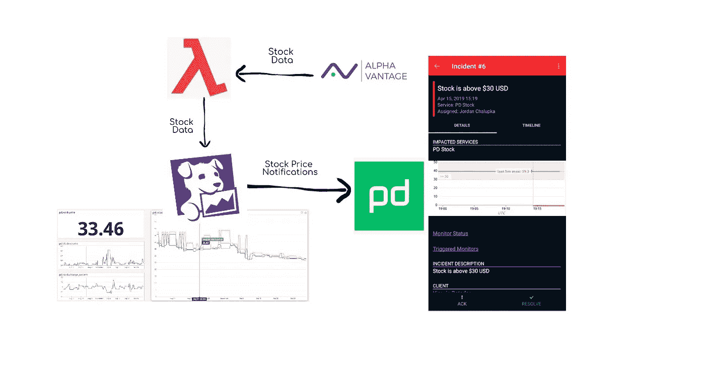
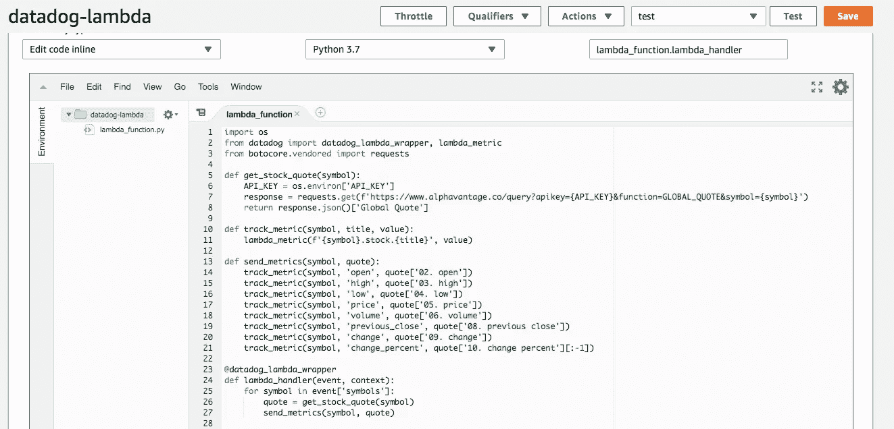
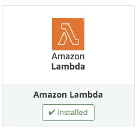
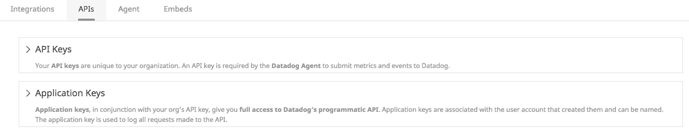
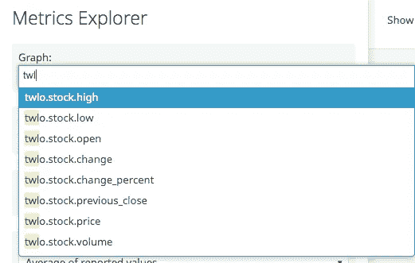
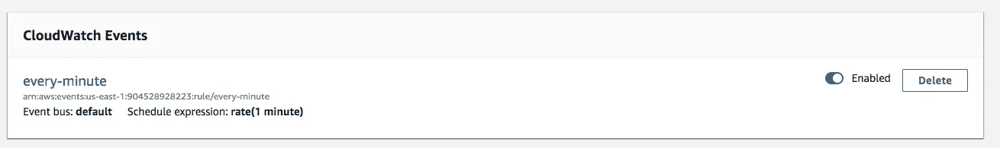
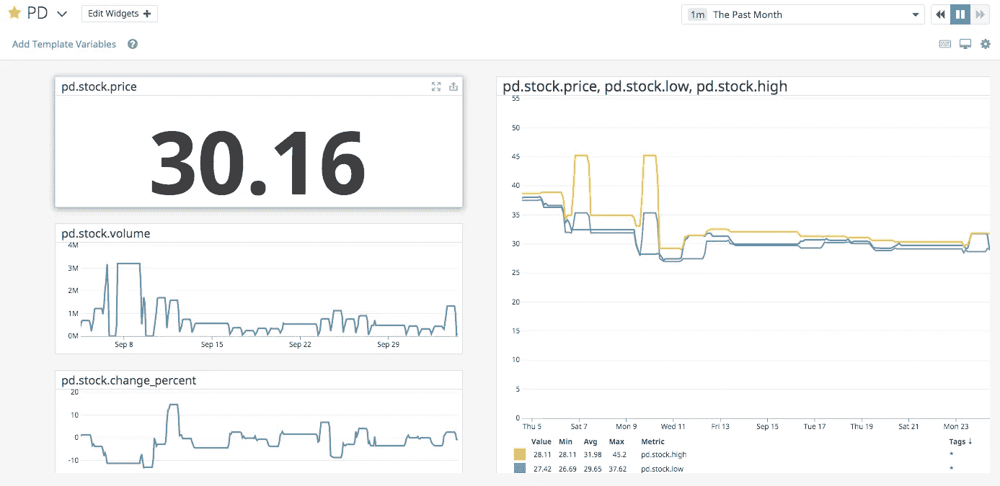
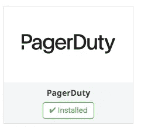
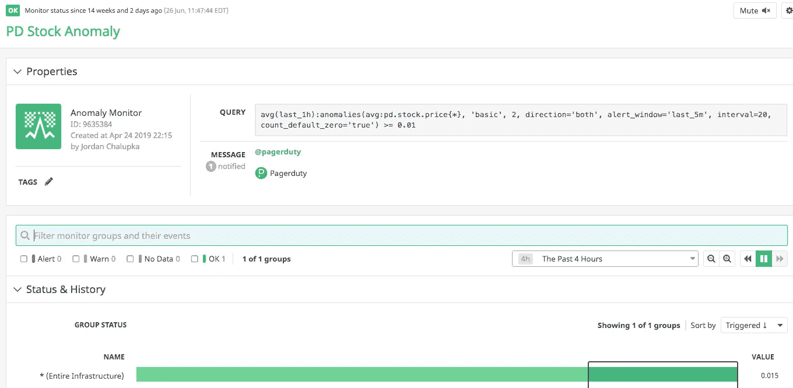
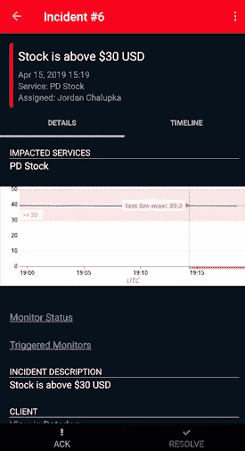

# 跟踪股票并通过 Lambda、DataDog 和 PagerDuty 获得提醒

> 原文：<https://levelup.gitconnected.com/track-stocks-and-get-alerted-with-lambda-datadog-and-pagerduty-e597527ee0a0>

## 我是如何创建一个工具来帮助我跟踪股票价格，并在价格有任何重大变化时得到通知的。

在这篇文章中，我将讲述我是如何使用 [AWS Lambda](https://aws.amazon.com/lambda/) 、 [DataDog](https://www.datadoghq.com/) 、以及[page duty](https://www.pagerduty.com/)来创建一个股票跟踪工具的，并向你展示你是如何构建一个的！

为了让我们开始，下面是我们将要构建的内容:

## 在更高层次上，我们的工具将:

1.  从名为**的 API 供应商处查询一些股票数据**
2.  将股票数据重新格式化并发送到**数据狗**中，在那里我们将能够看到数据的一些可视化
3.  让**寻呼机职责**知道我们的数据是否超过阈值，以便它可以通知我们

首先，我们需要编写一些代码来从 [AlphaVantage](https://www.alphavantage.co/) 中提取股票数据。

功能`get_stock_quote`将允许我们从阿尔法华帝的应用编程接口获取数据。在这里阅读更多关于他们的文档以及如何获得您的 API_KEY [。确保使用命令`export API_KEY="your-api-key"`为`API_KEY`创建一个环境变量，以便该代码运行。](https://www.alphavantage.co/documentation/)

现在是时候想想我们如何能够将收集到的这些精彩的股票数据发送给 DataDog 了。通过阅读 [DataDog](https://www.datadoghq.com/blog/datadog-lambda-layer/) 的这篇博文，我们可以知道他们有两个助手功能可以让我们使用`datadog_lambda_wrapper`和`lambda_metric`。

将这些函数添加到我们的代码中，我们有:

从顶部开始，我们增加了一个新功能`track_metric`。该函数使用我们从 DataDog `lambda_metric`获得的函数发送我们的数据。

接下来，函数`send_metrics`获取股票符号和我们从`get_stock_quote`得到的报价，并将报价映射中的每个度量分解成它自己的`track_metric`调用。

最后，我为我们要调用的 lambda 函数声明了一个 lambda_handler，并将它包装在`datadog_lambda_wrapper`装饰器中。lambda 处理程序期望接收一个股票符号数组。这将允许我们的工具同时监控多个股票符号。

现在我们已经准备好了代码，**让我们把它放到一个 Lambda 中！**

Lambda 控制台

为了让这个函数完全运行，我们必须配置 DataDog 来与我们的 Lambda 一起工作。首先，您需要在 DataDog 中安装 Lambda 集成，以便 DataDog 获得关于我们的 Lambda 函数的信息。

您还需要创建一个 **API 键**和一个**应用程序键**，并将这两个键作为环境变量提供给 Lambda。

一旦你有了这两个设置，运行你的 lambda。您的数据开始出现在 DataDog 中可能需要几分钟，但一旦出现，您将能够在 **Metrics Explorer 选项卡**中看到您的数据。

数据狗度量浏览器

厉害！现在，数据已经流入 DataDog。为了继续向 DataDog 发送数据而无需手动运行 Lambda，您需要设置一个 CloudWatch。这非常简单，可以直接从 Lambda 控制台完成。以下是我如何设置我的 Lambda。

设置 CloudWatch 事件

一旦你收集了长时间的数据，你可能还想把它可视化。DataDog 提供了很多关于如何做到这一点的很好的文档，但是这里有一个例子可以展示这一点！

对于我们工具的最后一部分，我们希望在股票超过某个阈值时收到通知。PagerDuty 是一个很好的工具，它可以很好地与 DataDog 集成。

要添加 page duty，只需像添加 Lambda 集成一样添加 page duty 集成。

在这里，您可以设置监视器，当达到阈值时，它将触发通知。DataDog 有很多不同的方式来设置显示器，所以你的想象力在这里真的是极限。我设置了一个监视器，当股票价格出现“股票异常”时，它会发出警报。

股票异常监视器

寻呼机工作通知

这意味着当一个异常(或我的任何其他监视器)触发时，我将在 PagerDuty 中收到通知！相当酷！

当然，这种精确的模式通常应用于监控软件系统，当一个系统出现故障或表现不正常时，团队会得到通知，但在我看来，以新的有趣的方式应用这些技术是非常酷的。

感谢阅读！