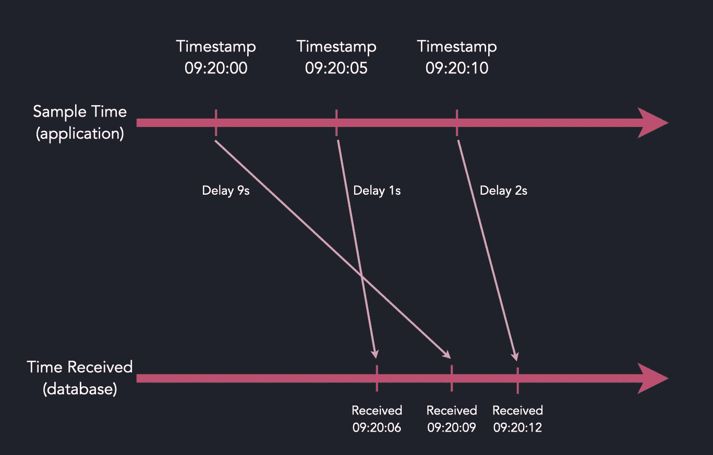
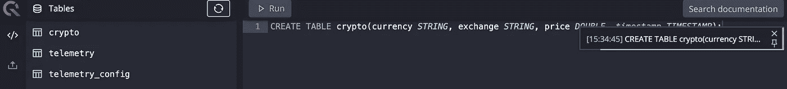
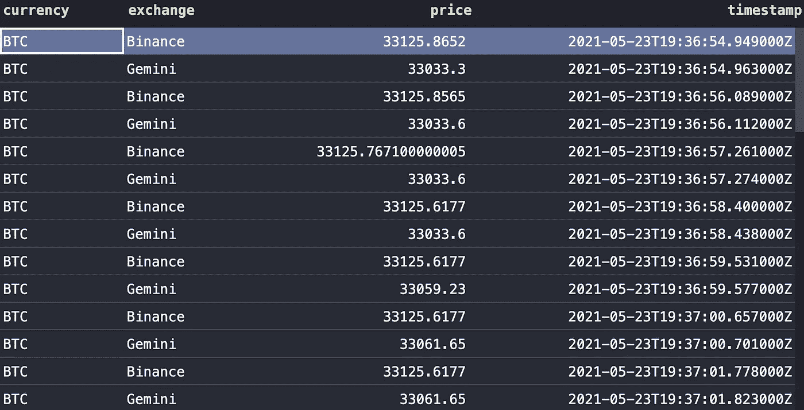

# 使用时间序列数据库跟踪多个加密货币交易

> 原文：<https://levelup.gitconnected.com/tracking-multiple-cryptocurrency-exchanges-using-a-timeseries-database-6b13cc7e8490>

## 利用 QuestDB 通过 InfluxDB 线路协议接收的数据，构建一个高吞吐量的加密货币价格跟踪器，能够即时处理无序记录。


尼克·崇在 [Unsplash](https://unsplash.com?utm_source=medium&utm_medium=referral) 上的照片

随着比特币和其他加密货币的价格暴跌至 2021 年的最低水平，加密投资者在 5 月份目睹了 1 万亿美元的市值蒸发。鉴于这一资产类别的波动性，寻求在市场中导航的交易者需要来自多个交易所的快速可靠的价格数据。今年早些时候，我分享了一种通过 Kafka 和 QuestDB 实时分析加密货币价格趋势的方法。该项目调查了比特币基地 API 的最新价格，并计算了移动平均值，然后将其发送到 timeseries 数据库进行进一步分析。

[](https://medium.com/swlh/realtime-crypto-tracker-with-kafka-and-questdb-b33b19048fc2) [## 使用 Kafka 和 QuestDB 的实时加密跟踪器

### 通过 Kafka 实时分析加密货币的价格趋势，并存储在 timeseries 数据库中以供进一步调查。

medium.com](https://medium.com/swlh/realtime-crypto-tracker-with-kafka-and-questdb-b33b19048fc2) 

利用 Kafka，我能够在接受 QuestDB 之前利用它的可伸缩性和订购保证。然而，由于我使用的是 Postgres wire 协议接口，它并没有针对快速接收进行优化。此外，价格反馈仅限于一个交易所(即比特币基地专业版)，降低了我们对波动性做出快速反应的能力(例如，根据另一个交易所的最佳价格买入/卖出比特币)。幸运的是， [QuestDB 团队发布了一个更新](https://github.com/questdb/questdb/releases)，对他们的 InfluxDB 内联协议进行了重大重写，以实现快速接收并支持乱序数据。所以我决定修改我以前的项目来测试这些功能。

# 无序摄入

随着 v6.0.0 的发布，QuestDB 不再强制时间序列数据按照严格的时间顺序发送。这意味着 QuestDB 可以处理由网络延迟、硬件抖动或不同的交付机制导致的乱序数据，使用时间戳字段而不是依赖于接收时间。如下例所示，如果 QuestDB 在采样时间(分别延迟 9s、1s、2s)后收到消息，QuestDB 可以识别这种延迟，并在将消息提交到数据库之前对其进行重新排序。



图片来源: [QuestDB](https://questdb.io/docs/guides/out-of-order-commit-lag/)

这减轻了程序员设计摄取机制来处理延迟或网络偏斜的负担。尽管 Kafka 保证在一个分区内排序，但我仍然有责任发送消息，以便让代理按时间顺序使用它们。因为我是在轮询单个端点，所以记录被乱序发送的可能性很小。但是通过添加新的交换来轮询来自(例如币安、双子)的信息，API 响应时间和网络延迟成为考虑因素。

# InfluxDB 线路协议

QuestDB 还建议使用 InfluxDB 线路协议作为获得最高性能的主要接收方法。事实上，QuestDB 团队在运行[时间序列基准测试套件](https://github.com/timescale/tsbs)时，使用 AMD Ryzen5 处理器实现了 1.43M 行/秒的[写入速度。](https://questdb.io/blog/2021/05/10/questdb-release-6-0-tsbs-benchmark/#comparing-ingestion-with-clickhouse-influxdb-and-timescaledb)

与使用 Postgres 客户端(如通过 Kafka Connect 在 Kafka 项目中使用的)相比，InfluxDB 线路协议还提供了以下优势:

*   更高的吞吐量
*   从多个来源大量摄入到表中
*   无序数据的可配置提交延迟
*   无模式/不可知的接收(即添加新字段将动态创建新列)

InfluxDB 的消息格式如下:

```
table_name,tag <label>=<value>,<label>=<value> timestamp \n
```

InfluxDB 记录的每一行都作为 QuestDB 中的一个新行被接收。对于这个项目，`table_name`是`crypto`，`tag`将是加密货币的符号(例如`BTC`)，其他标签包括交易所名称和价格列。

# 履行

首先，获取最新版本的 QuestDB (v6.0.1 或更高版本):

```
$ docker pull questdb/questdb:latest
```

在 InfluxDB 端口(9009)打开的情况下运行映像:

```
$ docker run -p 9000:9000 -p 8812:8812 -p 9009:9009 questdb/questdb
```

打开控制台 UI 并创建我们的简单表格:

```
CREATE TABLE crypto(currency STRING, exchange STRING, price DOUBLE, timestamp TIMESTAMP) timestamp(timestamp) PARTITION BY DAY;
```



出于演示的目的，我决定每秒从币安和双子座获取比特币的价格。为了更明显地测试无序摄取，我特意在 Gemini 发送价格数据之前引入了 1-5 秒的随机延迟。

为了检查数据是否按时间顺序提交，我只需查询 crypto 表:

```
select * from crypto;
```

尽管我在 Gemini price feed 上引入了随机网络延迟，但您可以看到两个交易所的比特币价格是按顺序提交的。



# 包扎

在一个更现实的场景中，我们将在云上运行不同的服务，从各种交换中提取数据，而没有故意的网络延迟。一旦我们找到了 API 响应时间或延迟的模式，我们可以通过调整 QuestDB 上的提交延迟变量来进一步优化这个过程。指定这个已知的滞后间隔可以减少 QuestDB 用于排序无序数据的计算资源，然后与持久数据合并以实现更高的吞吐量:

```
# via env variables
docker run -p 8812:8812 -p 9000:9000 -p 9009:9009 -e QDB_CAIRO_MAX_UNCOMMITTED_ROWS=1000 -e QDB_CAIRO_COMMIT_LAG=20000 questdb/questdb# via SQL statements
ALTER TABLE crypto SET PARAM maxUncommittedRows = 10000
```

对于一个需要高吞吐量和高性能的项目，QuestDB 提供了很好的特性，可以两全其美:通过 InfluxDB 线路协议快速接收数据，而不用担心数据丢失或排序，并提供完整的 SQL 支持来分析和处理数据。与 Kafka 项目一样，您可以随意将它与您的帐户连接，使用价格数据执行交易或构建更复杂的统计模型。