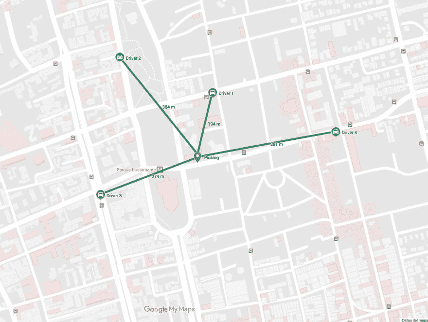

# 使用 Go 和 Redis 跟踪服务

> 原文：<https://levelup.gitconnected.com/tracking-service-with-go-and-redis-efa9f3c1d130>

[第二部分:Go 和 Redis V2 公司的跟踪服务](https://medium.com/@douglasmakey/tracking-service-with-go-and-redis-v2-8701026e0e23)

想象一下，我们在像优步这样的初创公司工作，我们需要创建一个新的服务，在每个给定的时间保存司机的位置并处理它。这样，当有人需要司机时，我们可以找到离我们的上车点最近的司机。

这是我们服务的核心。保存位置并搜索附近的司机。对于这项服务，我们使用 Go 和 Redis。

# 雷迪斯

[Redis](http://redis.io/) 是一个开源的(BSD 许可的)、内存中的数据结构存储，用作数据库、缓存和消息代理。它支持数据结构，如字符串、哈希、列表、集合、带有范围查询的排序集合、位图、超级日志和带有 radius 查询的地理空间索引。

Redis 有多种功能，但是对于本服务的目的，我们将重点关注它的地理空间功能。

首先我们需要安装 Redis。我推荐使用 Docker 运行带有 Redis 的容器。通过简单地执行这个命令，我们将在我们的机器上拥有一个运行 Redis 的容器。

```
docker run -d -p 6379:6379 redis
```

# 让我们开始编码吧

我们将为这个服务编写一个基本的实现，因为我想写一些关于如何改进这个服务的文章。我将把这段代码作为我下一篇文章的基础。

对于这个服务，我们需要使用为 Golang 提供 redis 客户端的包“github.com/go-redis/redis”。

在您的工作目录中创建新项目(文件夹)。在我的例子中，我称之为“跟踪”。首先我们需要安装软件包。

```
go get -u github.com/go-redis/redis
```

然后，我们创建文件“storages/redis.go ”,其中包含的实现将帮助我们获得一个 redis 客户端和一些功能来处理地理空间。

我们现在创建一个包含指向 redis 客户机的指针的结构。这个指针将具有帮助我们使用这个服务的函数，我们还为 redis 中的集合创建一个带有键名的常量。

```
type RedisClient struct { *redis.Client }
const key = "drivers"
```

对于获取 Redis 客户端的函数，我们将在 sync 包及其 Once 的帮助下使用 singleton 模式。做功能。

在软件工程中，单例模式是一种软件设计模式，它将一个类的实例化限制在一个对象上。当只需要一个对象来协调整个系统的动作时，这很有用。如果你想了解更多关于[单身模式](https://en.wikipedia.org/wiki/Singleton_pattern)的信息。

但是`once.Do`是如何工作的呢？struct `sync.Once`有一个原子计数器，当函数被调用时，它使用`atomic.StoreUint32`将值设置为 1，然后使用`atomic.LoadUint32`查看是否需要再次调用。对于这个基本实现，将从两个端点调用 GetRedisClient，但我们只想获得一个实例。

```
var once sync.Once
var redisClient *RedisClientfunc GetRedisClient() *RedisClient {
    once.Do(func() {
        client := redis.NewClient(&redis.Options{
            Addr:     "localhost:6379",
            Password: "", // no password set
            DB:       0,  // use default DB
        }) redisClient = &RedisClient{client}
    }) _, err := redisClient.Ping().Result()
    if err != nil {
        log.Fatalf("Could not connect to redis %v", err)
    } return redisClient
}
```

然后，我们为 RedisClient 创建三个函数。

AddDriverLocation:将指定的地理空间项目(纬度、经度、名称“在这种情况下，名称是驱动程序 id”)添加到指定的键，还记得我们在 Redis 中为我们的集合在开始时定义的键吗？这就是了。

```
func (c *RedisClient) AddDriverLocation(lng, lat float64, id string) {
    c.GeoAdd(
        key,
        &redis.GeoLocation{Longitude: lng, Latitude: lat, Name: id},
    )
}
```

RemoveDriverLocation:客户端 redis 没有函数 GEODEL，因为 GeoDel 命令不存在，所以我们可以使用 ZREM 来删除元素。地理索引结构只是一个有序的集合。

```
func (c *RedisClient) RemoveDriverLocation(id string) {
    c.ZRem(key, id)
}
```

SearchDrivers:函数 GEORADIUS 实现了命令 GeoRadius，该命令返回使用 GEOADD 填充了地理空间信息的排序集的成员，这些成员位于由中心位置和距中心的最大距离(半径)指定的区域的边界内。如果你想了解更多这方面的知识，去 [GEORADIUS](https://redis.io/commands/georadius)

```
func (c *RedisClient) SearchDrivers(limit int, lat, lng, r float64) []redis.GeoLocation {
    /*WITHDIST: Also return the distance of the returned items from    the specified center. The distance is returned in the same unit as the unit specified as the radius argument of the command.

WITHCOORD: Also return the longitude,latitude coordinates of the  matching items.

WITHHASH: Also return the raw geohash-encoded sorted set score of the item, in the form of a 52 bit unsigned integer. This is only useful for low level hacks or debugging and is otherwise of little interest for the general user. */ res, _ := c.GeoRadius(key, lng, lat, &redis.GeoRadiusQuery{
        Radius:      r,
        Unit:        "km",
        WithGeoHash: true,
        WithCoord:   true,
        WithDist:    true,
        Count:       limit,
        Sort:        "ASC",
    }).Result() return res
}
```

接下来，创建一个 main.go

```
package mainimport (
    "net/http"
    "fmt"
    "log"
)func main() {
    // We create a simple httpserver
    server := http.Server{
        Addr:    fmt.Sprint(":8000"),
        Handler: NewHandler(),
    } // Run server
    log.Printf("Starting HTTP Server. Listening at %q", server.Addr)
    if err := server.ListenAndServe(); err != nil {
        log.Printf("%v", err)
    } else {
        log.Println("Server closed ! ")
    }}
```

我们使用 http.Server 创建了一个简单的服务器。

然后，我们创建包含应用程序端点的文件“handler/handler.go”。

```
func NewHandler() *http.ServeMux {
    mux := http.NewServeMux()
    mux.HandleFunc("tracking", tracking)
    mux.HandleFunc("search", search)
    return mux
}
```

我们用 http。为了处理端点，我们为服务创建了两个端点。

第一个端点“跟踪”让我们保存从驱动程序发送的最后一个位置，在这种情况下，我们只想保存最后一个位置。我们可以修改这个端点，以便将以前的位置保存在另一个数据库中

```
func tracking(w http.ResponseWriter, r *http.Request) {
    // crate an anonymous struct for driver data.
    var driver = struct {
        ID string `json:"id"`
        Lat float64 `json:"lat"`
        Lng float64 `json:"lng"`
    }{} rClient := storages.GetRedisClient() if err := json.NewDecoder(r.Body).Decode(&driver); err != nil {
        log.Printf("could not decode request: %v", err)
        http.Error(w, "could not decode request", http.StatusInternalServerError)
        return
    } // Add new location
    // You can save locations in another db
    rClient.AddDriverLocation(driver.Lng, driver.Lat, driver.ID) w.WriteHeader(http.StatusOK)
    return
}
```

第二个端点是“搜索”,利用这个端点，我们可以找到给定点附近的所有驾驶员，

```
// search receives lat and lng of the picking point and searches drivers about this point.
func search(w http.ResponseWriter, r *http.Request) {
    rClient := storages.GetRedisClient() body := struct {
        Lat float64 `json:"lat"`
        Lng float64 `json:"lng"`
        Limit int `json:"limit"`
    }{} if err := json.NewDecoder(r.Body).Decode(&body); err != nil {
        log.Printf("could not decode request: %v", err)
        http.Error(w, "could not decode request", http.StatusInternalServerError)
        return
    } drivers := rClient.SearchDrivers(body.Limit, body.Lat, body.Lng, 15)
    data, err := json.Marshal(drivers)
    if err != nil {
        http.Error(w, err.Error(), http.StatusInternalServerError)
        return
    } w.Header().Set("Content-Type", "application/json")
    w.WriteHeader(http.StatusOK)
    w.Write(data)
    return
}
```

# 让我们测试一下服务

首先，运行服务器。

```
go run main.go
```

接下来，我们需要添加四个驱动程序位置。



我们在地图上添加了四个司机，绿色的线显示了提货点和司机之间的距离。

```
curl -i --header "Content-Type: application/json" --data '{"id": "1", "lat": -33.44091, "lng": -70.6301}' http://localhost:8000/trackingcurl -i --header "Content-Type: application/json" --data '{"id": "2", "lat": -33.44005, "lng": -70.63279}' http://localhost:8000/trackingcurl -i --header "Content-Type: application/json" --data '{"id": "3", "lat": -33.44338, "lng": -70.63335}' http://localhost:8000/trackingcurl -i --header "Content-Type: application/json" --data '{"id": "4", "lat": -33.44186, "lng": -70.62653}' [http://localhost:8000/tracking](http://localhost:8000/tracking)
```

既然我们现在有了司机的位置，我们可以进行空间搜索。

我们将寻找附近的 4 名司机

```
curl -i --header "Content-Type: application/json" --data '{"lat": -33.44262, "lng": -70.63054, "limit": 5}' [http://localhost:8000/search](http://localhost:8000/search)
```

由于您将看到结果与地图匹配，请查看地图中的绿色线条。

```
HTTP/1.1 200 OK
Content-Type: application/json
Date: Wed, 08 Aug 2018 05:07:57 GMT
Content-Length: 456[
    {
        "Name": "1",
        "Longitude": -70.63009768724442,
        "Latitude": -33.44090957099124,
        "Dist": 0.1946,
        "GeoHash": 861185092131738
    },
    {
        "Name": "3",
        "Longitude": -70.63334852457047,
        "Latitude": -33.44338092412159,
        "Dist": 0.2741,
        "GeoHash": 861185074815667
    },
    {
        "Name": "2",
        "Longitude": -70.63279062509537,
        "Latitude": -33.44005030051822,
        "Dist": 0.354,
        "GeoHash": 861185086448695
    },
    {
        "Name": "4",
        "Longitude": -70.62653034925461,
        "Latitude": -33.44186009142599,
        "Dist": 0.3816,
        "GeoHash": 861185081504625
    }
]
```

查找最近的司机

```
curl -i --header "Content-Type: application/json" --data '{"lat": -33.44262, "lng": -70.63054, "limit": 1}' [http://localhost:8000/search](http://localhost:8000/search)
```

结果

```
HTTP/1.1 200 OK
Content-Type: application/json
Date: Wed, 08 Aug 2018 05:12:24 GMT
Content-Length: 115[{"Name":"1","Longitude":-70.63009768724442,"Latitude":-33.44090957099124,"Dist":0.1946,"GeoHash":861185092131738}]
```

[Github 回购](https://github.com/douglasmakey/tracking)