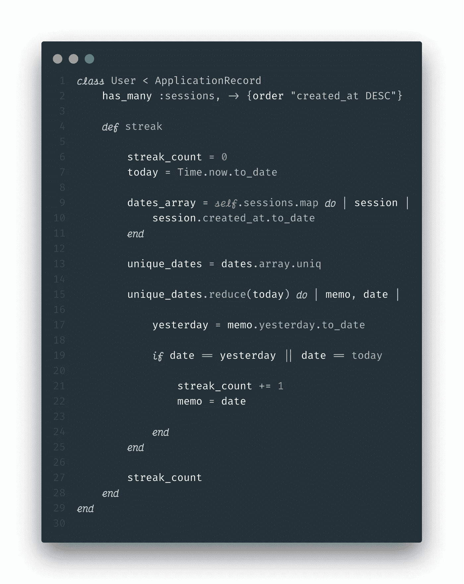
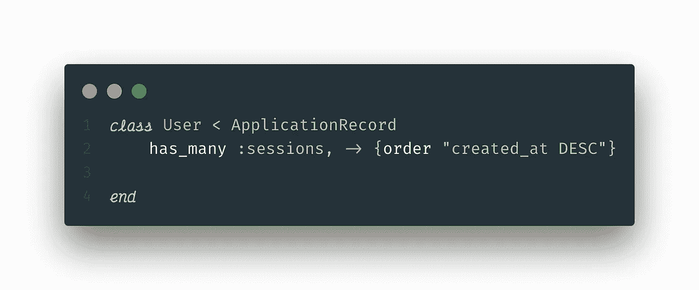
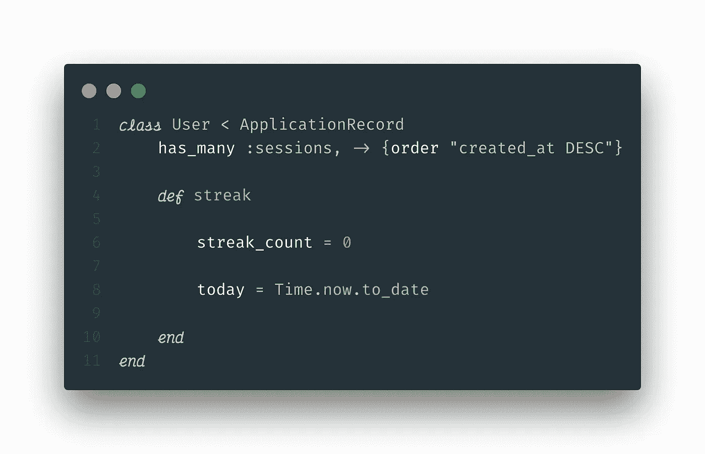
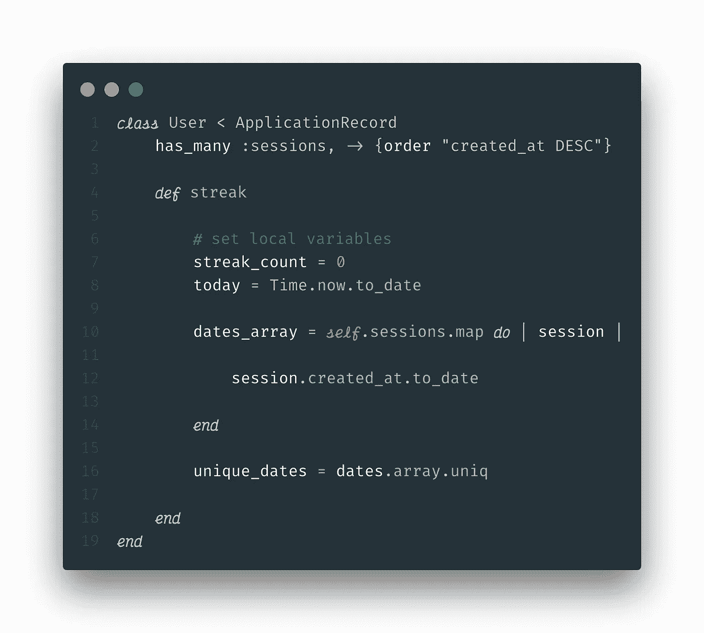
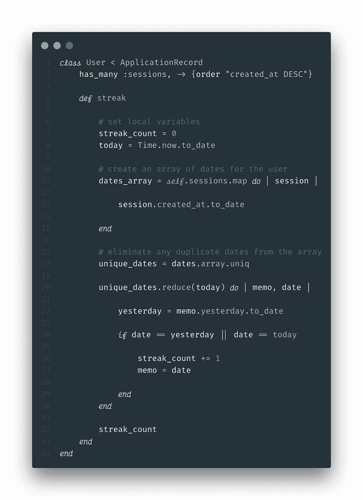
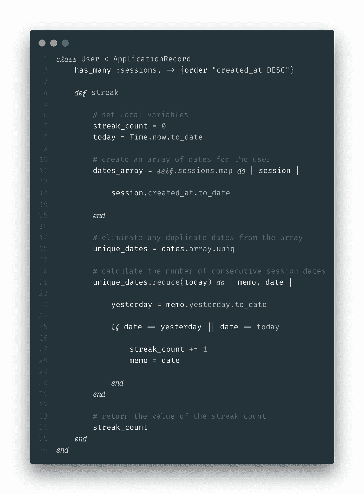

# 在 Ruby 中跟踪用户条纹

> 原文：<https://levelup.gitconnected.com/tracking-user-streaks-in-ruby-a49e90ce46a1>

## 通过日常习惯跟踪保持用户参与度

来自[https://unsplash.com/](https://unsplash.com/)的习惯追踪日志图片

从 Duolingo 到 Headspace，如今许多最受欢迎的应用程序都在追踪用户的“条纹”。通过记录用户连续登录并完成任务的天数，这些应用旨在为用户创造有益的习惯，同时确保活跃的日常用户群。随着习惯追踪应用程序的流行，似乎有证据表明，保持连胜的愿望确实会激励一个人去做一件他们可能不会做的事情。

随着条纹成为如此受欢迎的特征，我和一个朋友决定试着把它整合到我们最近的一个项目中。该应用程序引导用户完成一个[维姆·霍夫](https://www.wimhofmethod.com/)呼吸周期的步骤，我们希望显示他们至少完成一个周期的连续天数。

# 目标

跟踪登录用户完成一个呼吸周期的连续天数，并在我们的应用程序的主页上显示该数字。当用户连续一天第一次完成一个新的会话时，该数字应该立即更新。

# 解决方案

在几次使用 gems 或代码片段的失败尝试后，我们认为编写自己的代码会更容易，也是更好的学习体验。我们还选择跟踪后端的条纹，因为 Ruby 使得日期和时间的处理更加简单。以下是最终版本:

代码示例截图[(https://gist . github . com/shanelonergan/b 86 a 6704 ca 1 e 7d 7 c 9 a 4 a 610 c 8 f 363 ee 6](https://gist.github.com/shanelonergan/b86a6704ca1e7d7c9a4a610c8f363ee6))

# 崩溃

我们的应用程序构建在 ruby-on-rails 后端上，前端是普通的 JavaScript。有两种型号:`User`和`Session`。一个`Session`T16 属于一个`User`，一个`User`T18 有很多个 T5。

## 第一步:建立关系

代码示例的屏幕截图，第 1–2 行

首先，我们需要创建一个用户的 Ruby 类，它继承自`ApplicationRecord`，一个包含[活动记录](https://guides.rubyonrails.org/active_record_basics.html) ORM 的 rails 模型(更多关于对象关系映射器[的信息，请点击](https://blog.bitsrc.io/what-is-an-orm-and-why-you-should-use-it-b2b6f75f5e2a))。然后，我们可以添加一个多对多关系的 ActiveRecord 语法，如第 2 行所示。这允许我们通过在一个`User`的实例中简单地调用`.sessions`来访问一个用户的所有会话。此外，活动记录关系可以接受第二个参数， [scope](https://edgeguides.rubyonrails.org/association_basics.html#scopes-for-belongs-to) ，这允许我们定制 SQL 查询。我们希望我们的数组从最近的日期到最近的日期排序，这可以通过查询 ***降序*** 来实现:

## 步骤 2:定义一个实例方法

代码示例的屏幕截图，第 1-10 行

接下来，我们需要创建一个实例方法`streak`，我们可以调用一个`User`的实例来获得它们的条纹。在这个方法中，我们将声明一对局部变量，我们将在函数中用到它们。首先，让我们将`streak_count`设置为 0。为了可读性，我们还应该定义`today`。Ruby 允许我们使用`Time.now.to_date`轻松找到并格式化当天。`Time.now`将以长格式返回日期:

因为我们只想记录天数，所以我们可以使用`to_date`去掉所有无关的信息。这将返回一个简单易读的日期格式。

## 步骤 3:创建日期数组

代码示例屏幕截图，第 16 行

为了确保同一天的多个会话不会计入连续记录，我们希望创建一个只包含唯一日期的数组。我们将分两步进行:

1.  使用可枚举方法`.map`，我们可以为每个会话创建一个从`created-at`时间戳转换而来的日期数组。

2.对该数组应用`.uniq`以确保它只包含唯一的日期。

最后，我们需要为`streak_count`、`0`建立一个默认值。我们现在有了计算条纹所需的大部分变量！

## 步骤 3:计算条纹

对于这一步，我们将利用 Ruby 的可枚举方法`reduce`。如果你不熟悉 reduce，我推荐你看看这篇[很棒的文章](https://mixandgo.com/learn/what-is-a-ruby-reducer)。

代码示例的屏幕截图，第 1–34 行

让我们浏览一下这个方法。伪代码中 reducer 的基本结构如下所示:

通常，累加器(习惯上称为`memo`)是方法的返回值。例如，如果您正在计算一组数字的总和，它看起来会像这样:

然而，对于我们的方法，我们需要跟踪两个不同的变量:当前条纹值，以及*最后一次连续会话的日期*。这是因为我们从今天的日期开始，按时间倒序计数。让我们来分解一下:

这里，我们对唯一日期数组调用 reduce，并传入我们在步骤 2 中定义的`today`，作为备忘录的起始值。然后我们定义一个本地变量`yesterday`，作为备忘录前一天的重新格式化日期。

最后，我们希望创建一个 *if* 语句，确定何时增加条纹计数。如果用户今天完成了一个会话，那么在数组的第一次迭代中，`date`将等于今天；我们会想要增加。对于接下来的每次迭代，我们想要检查`date`是否等于`yesterday`。如果是，这意味着用户已经连续三天完成了一个会话，因此我们应该再次递增。只要数组中的下一个日期是我们正在迭代的当前日期的前一天，这个值就会继续增加。这是因为我们根据`created_at`属性对`sessions`数组进行了降序排序，如上所述。

**重要提示:**不要忘记在`streak method`结束时返回条纹计数，否则返回值将是我们减速器的最终备忘录。

## 恭喜你。现在可以在 rails 应用程序中计算用户条数了

这段代码应该是可修改的，以便与任何具有 *has_many* 关系的活动记录模型一起工作。祝你好运跟踪所有这些条纹！

下面是最终的代码，包括注释，你可以在这里查看这个为[编写的应用程序。](https://shanelonergan.github.io/breathe/)

带有注释的代码示例的屏幕截图

# GitHub Gist

感谢您的阅读！如果你喜欢这篇文章，请随时在 medium 或 twitter 上关注我。

# 参考

*   [习惯追踪应用是最新的自我提升趋势。但是它们有用吗？](https://www.vox.com/the-goods/2019/1/2/18158989/habit-tracking-apps-new-years-resolutions)
*   [维姆·霍夫法](https://www.wimhofmethod.com/)
*   [活动记录基础知识](https://guides.rubyonrails.org/active_record_basics.html)
*   [什么是 ORM，为什么要使用它](https://blog.bitsrc.io/what-is-an-orm-and-why-you-should-use-it-b2b6f75f5e2a)
*   [什么是红宝石减速器？](https://mixandgo.com/learn/what-is-a-ruby-reducer)
*   [所属范围 _ 归属于](https://edgeguides.rubyonrails.org/association_basics.html#scopes-for-Belongs-to)