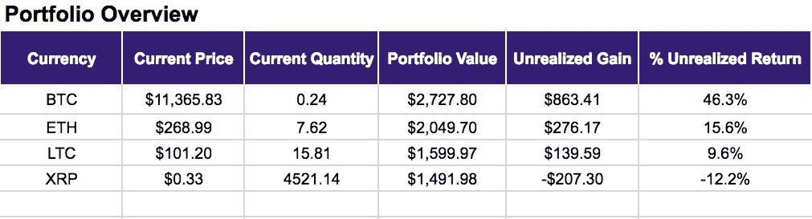
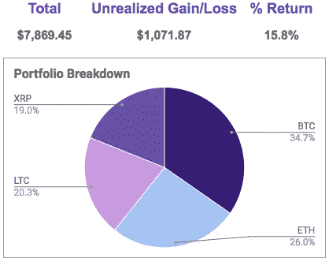
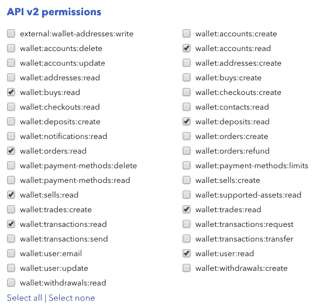
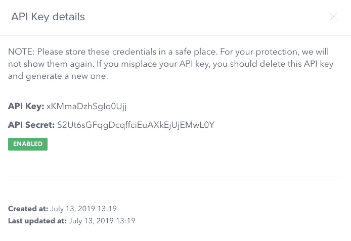
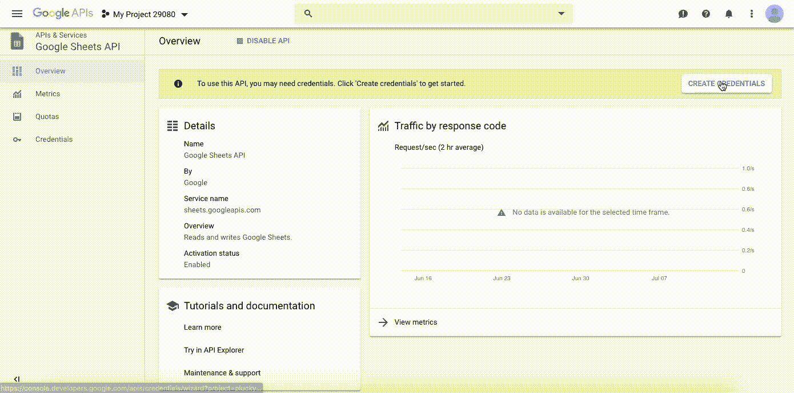
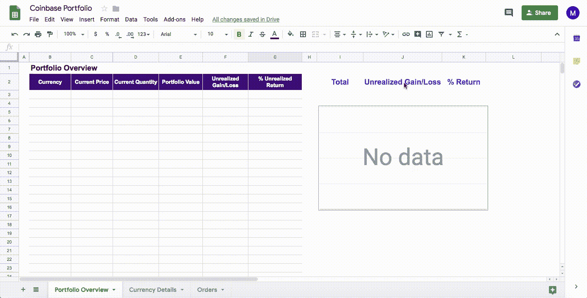
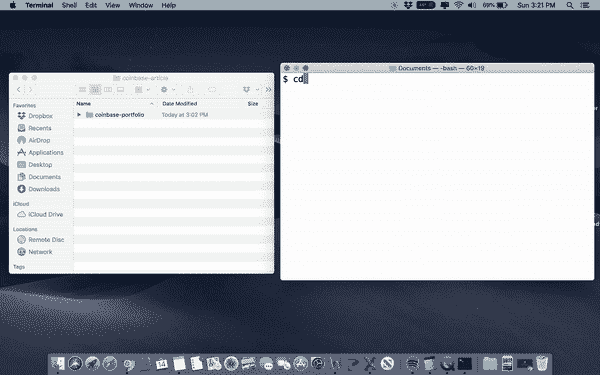
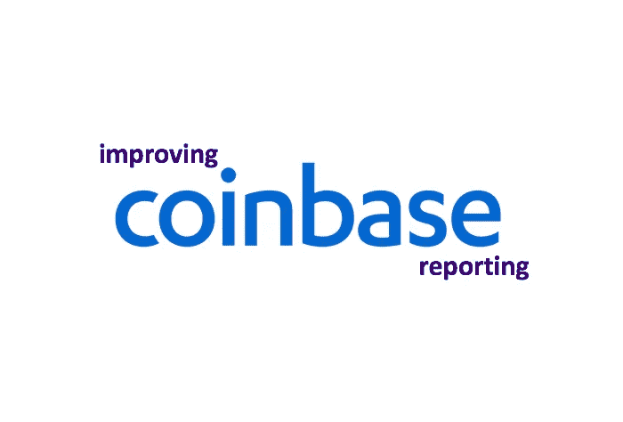

# 使用 Python 和 Google Sheets 在比特币基地跟踪你的投资组合表现

> 原文：<https://levelup.gitconnected.com/tracking-your-coinbase-portfolio-performance-using-python-google-sheets-57d86d687547>

## 这是一个循序渐进的指南，可以帮助任何人在比特币基地追踪他们的加密货币收益/损失(并学习一些编码知识……)

> 注意:所有的图片和视频都是基于虚假数据，不包括任何真实的帐户细节。

随着比特币(BTC)和类似 Ripple (XRP)、莱特币(LTC) & Ethereum (ETH)等替代货币经历高度波动，我的比特币基地账户的表现变得令人头疼。尽管比特币基地的网络界面确实提供了一些投资组合报告，但仍然很难跟踪我的加密货币账户的表现，无论是个人还是整体。以下是我的解决方案:



上面的图片显示了我在 Google Sheets 中创建的仪表板的主页，以帮助我更准确地组织和跟踪这些加密货币投资。[这是它的完整模板](http://bit.ly/30z2TM2)。**如果你喜欢你所看到的，并想自己建立一个，遵循这一步一步的指导，你就可以了！**

无论是初级程序员还是非程序员，都不要担心。这份详细的指南是专门为你设计的！

# **你需要什么:**

*   苹果电脑
*   一个 Gmail 账户
*   一个比特币基地账户(显然)
*   耐心看完整篇文章——我保证，这是值得的！

# **Mac 设置:**

不要担心，我会尽可能让它变得简单！

虽然每台 mac 都已经安装了 python，但是为了设置它，我们需要一些其他编程包的帮助，因此我们需要安装 Python 友好的包管理器“pip”。*如果所有这些对你来说都是胡言乱语，那就忽略我刚才说的，按照以下步骤去做:*

1.  按照[如何在 Mac 上安装 Python3 指南](http://bit.ly/2Y3g3Dc)中的步骤 1“最简单的方法”下载并升级到 Python 3
2.  导航到 mac 的终端(在 mac 上打开“终端”应用程序)
3.  键入以下命令，并在每行后按 enter 键(有关详细信息，请参见下面的视频):

```
python3 --version
curl https://bootstrap.pypa.io/get-pip.py -o get-pip.py
python3 get-pip.py
```


用 Python3 设置 Mac 后安装 Pip

假设这些命令运行顺利，请继续阅读(否则，请随时联系我寻求帮助，我的电子邮件可以在本文底部找到)。

现在我们有了包管理器，pip，让我们也在终端中运行下面的代码—不要忘记在每一行之后按 enter 键(下面的视频):

```
pip install requests
pip install coinbase
pip install oauth2client
pip install gspread
```


使用 pip 安装软件包

好了，终端都完成了(目前…)。接下来，获取您的比特币基地帐户数据，并将其推送到您自己的仪表板上！

# **连接到比特币基地 API:**

为了通过代码从比特币基地获得我们需要的加密货币信息，我们将不得不使用应用程序接口(简称为 API)。为此，我们需要向比特币基地请求一个 API 令牌。前往[Coinbase.com](http://bit.ly/2XFxcDI)并登录。这将带您进入设置页面，然后您可以按照以下步骤操作:

1.  导航到“API 访问”选项卡
2.  选择屏幕右上角附近的“+新 API 密钥”按钮，将出现一个弹出窗口
3.  在帐户下，选择“全部”(除非您只对特定的加密帐户感兴趣)
4.  在权限下，选择以下选项:



API 权限

5.最后，点击“创建”。然后会弹出一个窗口，显示您的 API 凭证(如下所示)。正如窗口中所说，确保这些安全可靠(不要担心，下面的 API 密钥是假的)。抓紧你真正的 API 密匙和 API 秘密，因为我们很快就会用到它们。



API 凭据:这些凭据将用于以编程方式访问比特币基地

# 设置 Google 电子表格仪表板:

还记得我说过你需要一个 gmail 账户吗？好吧，时候到了。我们需要一个 gmail 帐户来连接到谷歌电子表格(是的，通过使用另一个 API…)。Google Spreadsheets 是你的仪表盘所在的地方。

首先，让我们将控制面板复制到您的帐户中:

1.  在浏览器中登录您的 gmail 帐户
2.  转到我创建的[仪表板模板](http://bit.ly/30z2TM2)
3.  选择“文件”->“制作副本”，然后将其命名为“比特币基地文件夹”(如果你不这样命名，它将无法工作)。现在，您的个人 google drive 中应该保存了一个空白版本的仪表板。

最困难的部分…就快到了… *跟着我…*

现在我们将为您的 Google Sheets 创建 API 凭证。首先，导航到 [Google 电子表格 API 页面](http://bit.ly/2Jx2Vy1)并点击蓝色的“启用”按钮。这应该会自动创建一个项目，并带您到一个页面，您会看到在右上角的按钮“创建凭证”。

**警告:** *如果您在右上角没有看到“创建凭证”按钮，您所在的页面很可能会提示您首先创建一个项目。创建一个(随便你怎么命名)，然后它会带你回到有蓝色“启用”按钮的页面。再次点击此按钮，您将最终进入右上角带有“创建凭证”按钮的页面。*

我们到达这里后，单击“创建凭据”并按照视频中的步骤操作(如果您看不清楚，请放大):



正如你在视频结尾看到的，我们现在有一个下载的文件，里面有我们的 Google Sheets API 凭证！确保你也把它存放在一个安全的地方。设置完成后，关闭弹出窗口，这将使您返回到凭证列表。从这里开始，您必须:

1.  单击右侧的蓝色“管理服务帐户”链接，复制与您刚刚创建的密钥相关的电子邮件
2.  导航回您之前保存在 Google Drive 中的官方仪表盘 Google Sheet】(如下所示)
3.  点击右上角的深绿色“分享”按钮。将你刚刚复制的电子邮件粘贴到“输入姓名或电子邮件地址…”的地方，并确保给它“可以编辑”的权限。然后点击发送，瞧！*(如果需要，所有这些都显示在下面)*



现在是魔术…

# Python 代码:将它们结合在一起

好吧，希望你能和我一起走到这一步！评估你目前应该拥有的东西:

*   Google Drive 帐户中的 Google 表单，该表单已与您在上一步中复制的电子邮件共享
*   文件(扩展名为。json)，它包含您的代码将用来访问您的 Google 表单的 Google 凭证

最后一块是获取 python 脚本，可以从这里下载[(*如果你有 Github 账号，这里是*](http://bit.ly/32qfZgf) [*回购/脚本*](http://bit.ly/30to7us) )。一旦你下载了，确保它和谷歌证书文件(如上所述)在一个文件夹中。

现在，用任何文本编辑器打开脚本(默认情况下，Mac 附带“文本编辑”)。因为我们都有不同的凭证，所以您需要对下面几行代码做一些最后的修改。首先，将 key 和 scrt 变量的引号内的内容替换为**您的比特币基地 API 密匙和比特币基地 API 秘密**(这些您应该早些保存在安全的地方)。

```
key = 'YOUR_COINBASE_API_KEY'
scrt = 'YOUR_COINBASE_API_SECRET'
```

然后，您必须更新 Google 凭证的文件名，以便您的计算机也能够找到这些凭证。这一行代码(就在 key 和 scrt 行的下面)如下所示:

```
google_creds = "YOUR_GOOGLE_CREDENTIALS_FILENAME.json"
```

用**您的 Google 凭证文件名**替换引号中的内容(例如“我的项目 29080–4b 4089 d0c 005 . JSON”)。现在保存文件，最后，您终于准备好观看编程魔术了！

## 运行代码:

为了最终运行代码，我们必须执行以下操作:

1.  再次打开我们的终端应用程序。
2.  在提示符下键入“cd”(不要按 enter 键)。
3.  转到 finder，拖动包含 coinbase_tracker.py 文件和您的 Google 凭据的文件夹。json 文件放入终端窗口。按回车键。
4.  最后，输入以下命令:

```
python3 coinbase_tracker.py
```

瞧啊。您应该会看到代码正在运行，并为您提供它正在处理的每一个步骤。一旦完成，检查你的谷歌表，看看仪表板的效果！

如果你在遵循最后这些步骤时遇到困难，请观看下面的视频短片。



每当您想要更新您的帐户信息时，只需重复上面“运行代码”一节中的步骤 1-4。

# **重要:**

*   本指南/准则仅适用于美国的比特币基地& Mac 用户
*   损益是根据每种货币的平均历史买入价计算的
*   已实现和未实现的收益/损失不包括支付给比特币基地的交易手续费

# 奖金:

如果你想冒险进入更深的编码水域，让你的电脑*每小时自动*刷新你的比特币基地数据，请联系我。如果您有任何进一步的问题或只是需要帮助设置您的仪表板，请随时给我发电子邮件:***hi.its.matias@gmail.com。***

*希望你喜欢我的文章*

**