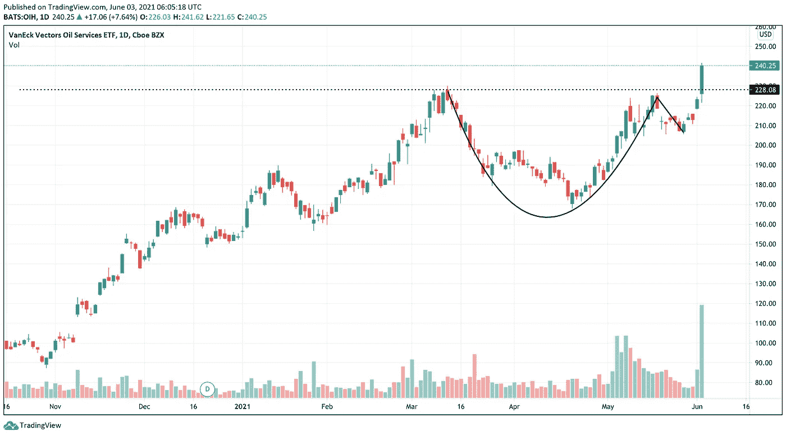
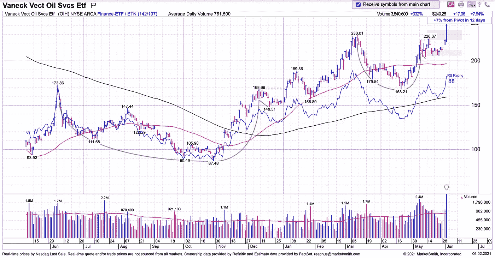
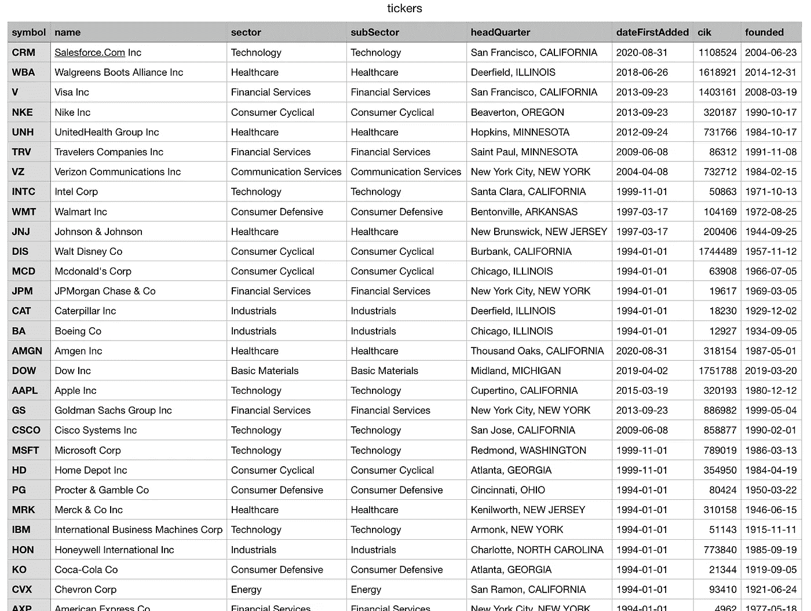
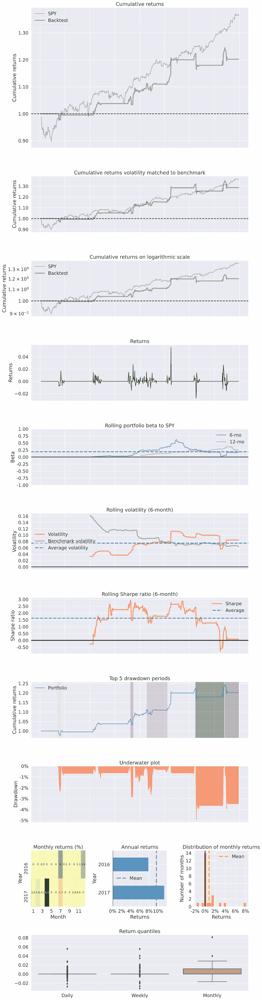

# 带有 MarketSmith 模式识别的交易杯和手柄

> 原文：<https://levelup.gitconnected.com/trading-cup-and-handles-with-marketsmith-pattern-recognition-3b869d0cfe2a>

## 回溯测试威廉·奥尼尔的经典基本模式

Julian Hochgesang 在 [Unsplash](https://unsplash.com?utm_source=medium&utm_medium=referral) 上拍摄的照片

由威廉·奥尼尔开发的“有把手的杯子”是一个技术指标，用来识别经过一段时间的盘整后趋势的延续。[1]它包括一个不太成熟的初始上升趋势，一个 U 形走势(杯子)，接着是另一个剧烈而轻微的震荡(手柄)。价格在反弹后，开始以平滑的斜率盘整，但随后反弹至之前的高点，因为它面临较低价格水平的支撑。

当触及前期高点时，在盘整前买入股票的投资者和其他不太忠诚的投资者卖出股票，最后一次推动股价下跌。最终，价格从第二个支撑位(高于前一个支撑位)开始反转，并突破阻力。交易者使用不同的规则来识别有手柄图案的杯子，并衡量它们的强度，但底部通常持续 6-65 周，深度从 8%到 50%不等。当交易有手柄的杯子时，利润目标通常在初始阻力(支点)以上 20–25%，止损范围在该线以下 5–8%。[2]

[模式识别](https://marketsmith.investors.com/patternrecognition/)，IBD MarketSmith 的高级交易工具包的一部分，在每日和每周的时间周期内识别七种不同的图表模式:带把的杯子和杯子，带把的碟子和碟子，双底，平底，上升底，盘整，IPO 底。本文将重点介绍使用模式识别 API 来识别和交易带手柄模式的杯子。要了解更多关于模式识别的其他属性的信息，请查看其[用户手册](https://marketsmith.investors.com/special/MS_PatternRecManual_1-7-5.pdf)。

# 先决条件

需要对 Python 有一个基本的了解，才能从本文中获得最大的收获。我们将使用`[pydantic](https://pydantic-docs.helpmanual.io/)`来验证和序列化数据，`[zipline-reloaded](https://github.com/stefan-jansen/zipline-reloaded)`和`[pyfolio](https://github.com/quantopian/pyfolio/)`来回溯测试策略，`[pandas](https://pandas.pydata.org/docs/)`来加载和访问数据，`[python-dotenv](https://github.com/theskumar/python-dotenv)`来读取环境变量，`[yfinance](https://pypi.org/project/yfinance/)`来获取基准价格数据，`[requests](https://docs.python-requests.org/)`来进行 API 调用。访问模式识别需要一个 [premium MarketSmith 帐户](https://marketsmith.investors.com/ms-platform/#row7)。符号数据和道琼斯工业平均指数(DJIA)成分列表将从[金融建模准备(FMP) v3 API](https://financialmodelingprep.com/developer/docs/) 中获取。为了检索成分的历史价格数据，您需要[接收一个 zipline 数据包](https://zipline.ml4trading.io/bundles.html)。

请确保使用以下版本:

*   `python` 3.6.12
*   `pyfolio` 0.8.0
*   `pandas` 0.22.0
*   `matplotlib` 3.0.3
*   `numpy` 1.19.5

或者，您需要遵循[这个答案](https://github.com/quantopian/pyfolio/issues/661#issuecomment-742053547)并更新`pyfolio`源代码中的一行代码，使其与最新的堆栈一起工作。

# 加载和存储数据

## DJIA 成分

有了一个免费的 FMP 账户，我们可以从这个端点[访问 DJIA 的名字列表](https://financialmodelingprep.com/api/v3/dowjones_constituent)。首先，创建`src/price/endpoints.py`来存储 FMP 端点。

定义`Constituent`模型来序列化从 FMP API 接收的数据。

定义`load_tickers`来获取和存储数据。

我们首先加载`FMP_API_KEY`环境变量，将其传递给在`constants.py`中定义的端点，并通过调用`.json()`方法将响应转换为字典。然后，我们使用 Pydantic 的`[parse_obj_as](https://pydantic-docs.helpmanual.io/usage/models/#parsing-data-into-a-specified-type)`实用程序方法将响应序列化为一系列`Constituent`实例。最后，数据被转换回字典列表并存储在`data/tickers.csv`中。

确保将`FMP_API_KEY`密钥存储在`.env`文件中，并将其设置为您从 FMP 仪表板收到的密钥。现在我们可以从命令行发送`load_tickers`。如果运行正常，我们将得到一个类似下图的 CSV 文件。

## 带手柄数据的杯子

现在，我们应该为`data/tickers.csv`中的所有符号加载带有手柄图案的杯子历史。让我们首先定义我们要调用的 MarketSmith 端点。

`AuthSession`该类将环境变量传递给 IBD API，以生成经过验证的会话。

我们首先将用户凭证发送到`GET_LOGIN`端点以接收用户对象，然后该用户对象将被传递(连同一个额外的`action`键)到`HANDLE_LOGIN`。该响应包括必要的`[Set-Cookie](https://developer.mozilla.org/en-US/docs/Web/HTTP/Headers/Set-Cookie)`报头，以便为将来的请求验证会话。不要忘记在`.env`中定义`USERNAME`、`PASSWORD`和`API_KEY`值(根据您的 MarketSmith 帐户凭证)。

在获取模式之前，我们需要加载`Instrument`和`User`对象。先说后者。定义`User`模型来序列化我们将从 MarketSmith 后端接收的对象。

`get_user`方法接收经过身份验证的会话，并返回经过身份验证的用户信息。

`[validate_arguments](https://pydantic-docs.helpmanual.io/usage/validation_decorator/)` decorator 在函数被调用之前解析并验证参数。`[arbitrary_types_allowed](https://pydantic-docs.helpmanual.io/usage/types/#arbitrary-types-allowed)`用不扩展 pydantic `BaseModel`类的实例(在本例中是一个`AuthSession`实例)解析参数。

是时候从 MS API 加载仪器数据了。

MS API 使用以下格式传递日期:`/Date(1536303600000–0700)/`–第一个数字是从纪元开始的[毫秒日期，第二个数字是与 GMT 的时区差异。`convert_msdate_to_date`方法将 MS API 日期字符串转换为内置的`datetime.date`对象。](https://en.wikipedia.org/wiki/Unix_time)

`get_instrument`在 MarketSmith 数据库中搜索符号，然后在搜索结果中查找精确匹配。如果符号的精确匹配数不为 1，则引发`AssertionError`。最后，它将接收到的字典序列化为一个`Instrument`实例。

我们正在讨论问题的实质。让我们加载、解析和存储带有句柄模式的 Cup。首先，定义一个模型来序列化数据。

接下来，我们需要一些方法来处理模式的提取和存储。

`get_patterns`向模式端点发出请求，并接收某一特定时期内某一乐器的所有图表模式。注意，如果你想得到周线图的模式，设置`frequency`为 2。

MarketSmith 通过 instrument 对象传递一个`properties`属性，该属性将乐器的自定义属性作为一个列表。因为我们只关心有手柄图案的杯子，并且它们共享相同的属性，所以我们使用`flattern_pattern_properties`通过移除`properties`键并将其列表值的元素添加到我们的初始乐器对象来展平对象。

`filter_cup_with_handles`接收模式对象列表，并返回其中包含手柄模式的杯子。这种方法的一个“问题”是 MS 在`cupWithHandles`键下传递没有把手的杯子和有把手的杯子，但是只有那些`patternType`为 1 的杯子是有把手的杯子(参见上面代码片段中的第 100–102 行)。

最后，`store_patterns`接收一个模式实例列表，并将它们附加到一个本地 CSV 文件中。

最后，编写一些控制器函数来编排所有之前定义的方法。

`convert_csv_to_records`读取 CSV 文件的行并用 pydantic 模型序列化它们。我们稍后将使用它来读取和解析`tickers.csv`文件中的数据。

`extract_patterns`接收一个 ticker、一个模式类型的过滤方法、开始和结束日期以及一个认证的会话。然后，它编排其他方法来获取和序列化过滤后的模式。

`extract_n_store_cup_with_handles`用一列`Constituent`对象接受从 epoch 开始的以毫秒为单位的开始和结束日期，用句柄模式检索它们的 cup，并将这些模式存储在`data/patterns.csv`文件中。现在，使用所需的参数调用该方法。

厉害！我们已经完成了数据收集部分。让我们根据这些模式定义一个交易算法，并评估结果。

# 战略

创建一个 Jupyter 笔记本来开发、回溯测试和分析策略。首先，导入需求。

该算法在每个分笔成交点循环模式，如果满足以下所有条件，则对资产进行排序:

*   当前日期已超过对象的`handleLowDate`属性，但未超过 30 天；
*   现价已突破支点价格水平(杯子第二高点)1%以上；
*   50 天简单移动平均线(SMA)在 200 天 SMA 的上方。

该算法随后会在以下任何情况下平仓:

*   这项交易产生了 15%或更多的利润；
*   交易导致亏损 5%或以上；
*   自开仓以来已过去 21 天或更长时间。

我们用 SPY(标准普尔 500 信托 ETF) 的收益作为基准，运行 2016 年到 2018 年的算法，用一千万美金的资金。让我们将所有这些参数存储在一个单元格中，以便于调整或优化它们。

在定义逻辑之前，我们需要一个实用函数，使 DataFrame 的日期列能够识别时区，这允许我们将`patterns.csv`文件中的日期与`zipline`内置日期进行比较。

滑索需要两个功能:`initialize`和`handle_data`。前者通过接收参数并向其添加全局变量来设置回溯测试上下文。后者在每个分笔成交点被调用，并接受两个参数——`context`(算法的全局上下文)和`data`，后者包括特定于当前分笔成交点的信息——并根据当前市场条件进行交易。通过隐藏未来价格数据，zipline 确保了逻辑中没有前瞻性偏见。

注意，`[zipline.api.symbol](https://zipline.ml4trading.io/api-reference.html#zipline.api.symbol)`方法接收一个 ticker 并返回相应的`[Equity](https://zipline.ml4trading.io/api-reference.html#zipline.assets.Equity)`对象。

首先，`data.history`加载过去 200 个交易日的股票列表的价格数据。然后，该方法遍历模式，找到满足所有需求并且还不在投资组合中的实例。开立新头寸时，使用`zp.api.order_target_percent`在所有头寸之间平均重新分配资金。最后，代码将当前日期存储在`context.position_dates`字典中，以备将来参考。最后，它遍历未结头寸，如果满足任何卖出要求，就卖出资产。

快好了。定义从`yfinance`获取基准价格数据的方法，并将其处理为可接受的`pyfolio`格式(带日期索引的熊猫系列)。

注意，退货是通过调用价格历史数据帧的`Close`列上的`pct_change`方法来计算的。现在我们需要处理算法的分析。

`analyze`接收两个参数:`perf`，zipline `run_algorithm`函数的返回值，以及`bench`，从先前定义的方法中检索的基准返回。`pf.utils.extract_rets_pos_txn_from_zipline`从业绩数据框架中提取日收益、持仓历史以及算法所做的所有交易清单。我们将基准测试和回溯测试结果传递给`pf.create_full_tear_sheet`以生成全面的策略分析。最后还是调用`run_algorithm`检查结果吧。确保将开始和结束日期转换为本地化的 pandas `Timestamp`对象。

# 结果

是时候接受我们应得的报应了。运行`analyze`方法后，pyfolio 生成一个[分析表](https://nbviewer.jupyter.org/format/slides/github/quantopian/pyfolio/blob/master/pyfolio/examples/pyfolio_talk_slides.ipynb#/10)，其中包含几个表格和图表，用于呈现结果的详细分析。

对于 0.08 alpha 和 0.1 beta，该策略似乎过于被动，这可以通过增加观察名单股票的数量来改善。但该策略的风险回报指标看起来很可靠——值得注意的是，夏普、索蒂诺和卡尔马尔比率显示了在低风险下可以接受的回报。您可以在下面找到策略结果的完整列表。

# 丰富

该战略可以在许多方面得到加强；我们来讨论其中的一些。

*   **%**
*   **%[3]**
*   **突破时的成交量**:另一个解决办法是在突破日成交量高于平均水平时买入该名称。
*   **杯子的波动性**:杯子不应该是龌龊的 V 型；使用价格波动的平均真实范围或标准差，我们可以在形成杯子形态的同时衡量价格运动的平稳性。[4]
*   前期上升趋势强度:通过确保形态遵循一个强大的既定上升趋势，利用反弹的高度和长度，我们可以确保一个强大的走势支持基础。

[1] D. Saito-Chung，[何时买入最佳成长股:如何分析一只股票的带柄杯](https://www.investors.com/how-to-invest/investors-corner/the-basics-how-to-analyze-a-stocks-cup-with-handle/) (2020)，投资者商报

[2] [带柄杯子](https://school.stockcharts.com/doku.php?id=chart_analysis:chart_patterns:cup_with_handle_continuation)，股票走势图

[3]莱托宁， [Roku，2019 年的顶级股票之一，在突破之前建造了积累的“摩天大楼”](https://www.investors.com/how-to-invest/investors-corner/how-to-invest-stocks-roku-stock-use-skyscrapers-volume-identify-breakout/) (2019)，投资者商业日报

[4]w . j . O . Neill，[如何在股票中赚钱:在繁荣时期和萧条时期的成功系统](https://www.oreilly.com/library/view/how-to-make/9780071614146/) (2009)

*你可以在这里* *找到源代码* [*。*](https://github.com/HumanRupert/marketsmith_pattern_recognition)