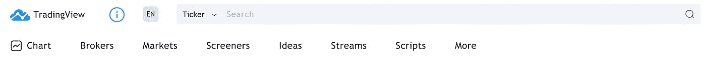
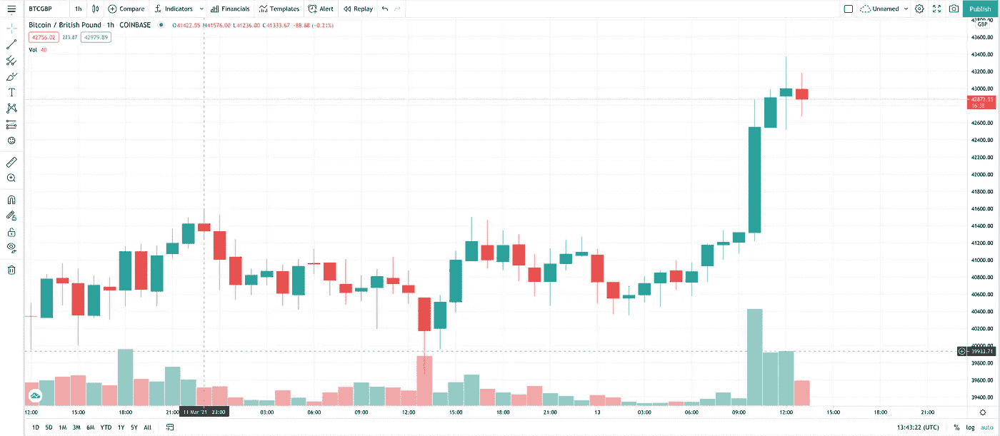
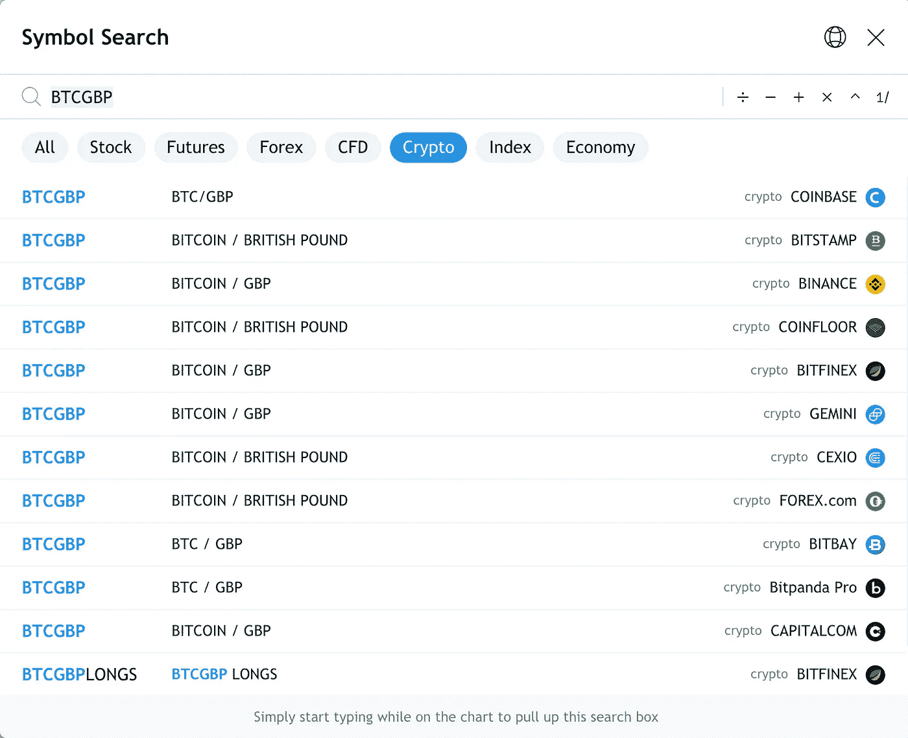
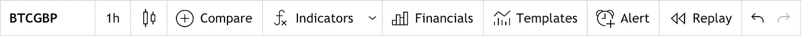
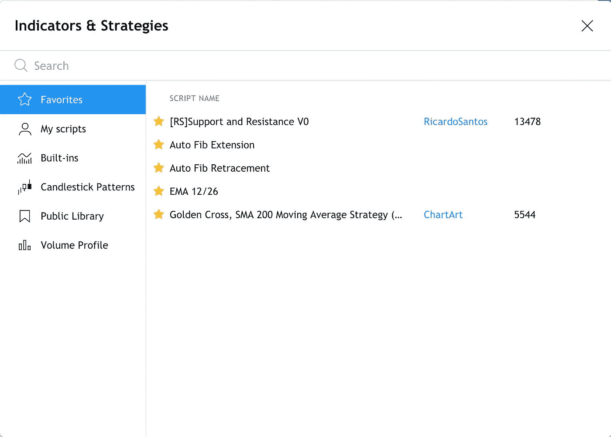
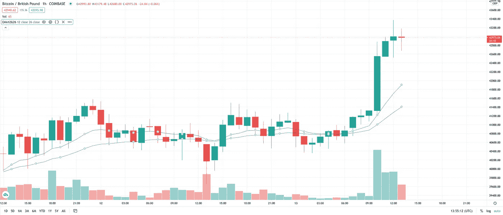
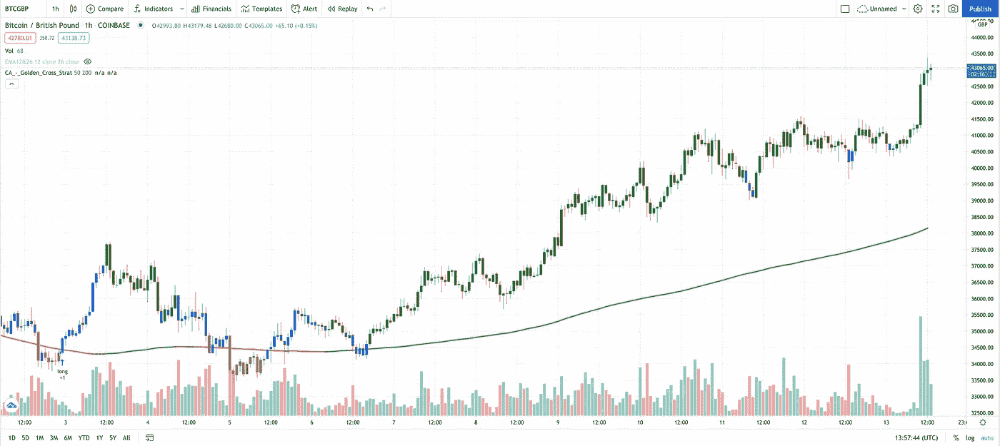
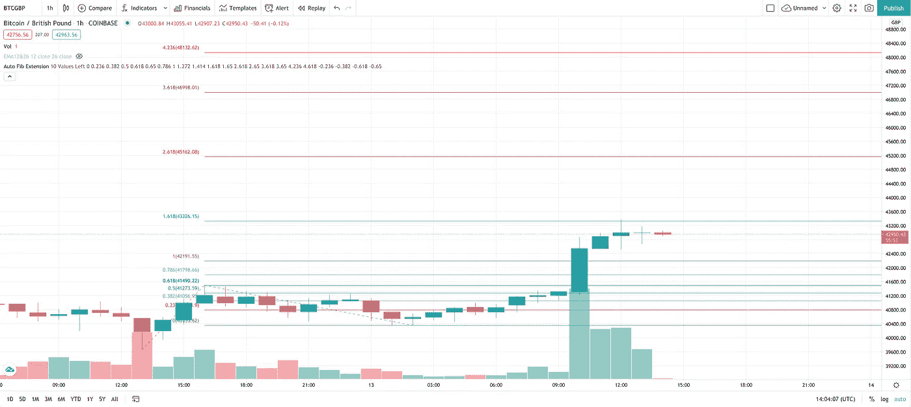
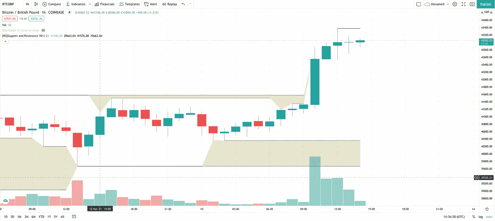

# TradingView.com 图表❤

> 原文：<https://levelup.gitconnected.com/tradingview-com-charts-36a49c9f77ea>

## …而且金融技术分析(大部分)是免费的


Adobe Stock 许可的图像

几周前，我被介绍给 TradingView.com，我非常喜欢它。如果你关注我的其他文章，你会知道我在[比特币基地专业版](https://pro.coinbase.com/)上做了很多加密交易。我仍然不明白一家价值数十亿的公司怎么会有想象中最糟糕的交易界面。我是说这太糟糕了，不真实。不仅是他们的交易界面，他们的支持也是不存在的。这在某种程度上解释了为什么他们价值数十亿，因为他们没有为他们的用户体验投资任何东西。

如果你在[比特币基地专业版](https://pro.coinbase.com/)上交易，你会知道他们只支持在他们的图形上覆盖 EMA12 和 EMA26(只在他们的网络界面上)。实际上只有这两个，这对于孤立的交易者来说是没有用的。我快被逼疯了，我甚至主动提出免费为他们修理，但他们从未回复过我。作为一家只关心底线而不关心他们的品牌和用户体验的公司，这真的让我印象深刻。反正我跑题了…

TradingView.com 是一个免费的资源，基本上是免费的。你可以付费订阅来增强界面和移除广告。实际上订阅也不是一个坏主意，但是目前免费版本已经足够了。当你第一次访问这个网站时，如何使用它可能不是很明显，我想给你一个我如何使用它的简短演示。

首先，您需要登录。他们提供大多数电子邮件和社交媒体登录方法。我猜谷歌可能是最常用的方法。登录后，您需要检查菜单栏上的“图表”。



这将带你到一个交易图表页面。在下图中，我选择了“BTCGBP”市场，但您可以通过单击市场来选择任何传统或加密市场，在我的例子中是“BTCGBP”。



你可以看到很多选择。我通常选择“加密”，然后选择我想要选择的市场，即“BTCGBP”，然后选择该市场所在的交易所。在我的例子中是“比特币基地”。



如果您点击“BTCGBP”市场，它将带您回到上述市场选择。旁边的“1h”是交易区间。你可以在这里选择你喜欢的，但是为了这篇文章的目的，我将只使用“1h”。下一个我想展示的部分是“指标”。



有一个绝对庞大的指标和覆盖数据库，您可以添加到您的图表。请注意，在免费版本中，您一次只能添加 3 个。我在“收藏夹”中添加了一些我喜欢使用的。



上面的 EMA 12/26 实际上是我自己创建的，因为我通常只使用 EMA 12 和 EMA26。还有其他 EMA 选项，但它们不是我想要的。我选择了一个最接近我想要的均线指标，编辑了代码，保存了我定制的新版本。

```
//@version=3
study(title="Exponential Moving Averages 12 & 26", shorttitle="EMA12&26", overlay=true)
len2 = input(12, minval=1, title="Length")
src2 = input(close, title="Source")
out2 = ema(src2, len2)
len = input(26, minval=1, title="Length")
src = input(close, title="Source")
out = ema(src, len)
plot(out, color=blue, title="EMA26")
plot(out2, color=green, title="EMA12")
```

这是我的比特币图表现在的样子，上面覆盖着 EMA12 和 EMA26。



正如你所看到的，一切都很好。EMA12 在 EMA26 之上，价格飞涨。

所以问题是为什么价格会涨这么多。让我们添加黄金十字架/死亡十字架叠加，看看。这是当 SMA50 高于或低于 SMA200 时。通常有金叉的时候，交易真的很好玩，也很赚钱。当死亡交叉发生时，它并不伟大。如果你看看下面，黄金交叉一出现，价格就开始大幅上涨。如果你向左滚动，你会看到每次死亡交叉发生时，价格暴跌。这总是一个值得关注的好指标。



所以我们可以看到价格正在上升到历史最高点，这很好，但是我们怎么知道什么时候我们需要退出呢！这是我使用斐波那契[回撤](https://www.investopedia.com/terms/f/fibonacciretracement.asp) / [延伸](https://www.investopedia.com/terms/f/fibonacciextensions.asp)波段或支撑和阻力的地方(如果你想用和我一样的波段，这是我的“最爱”)。

在牛市条件下，你会想要使用[斐波纳奇延伸](https://www.investopedia.com/terms/f/fibonacciextensions.asp)，在熊市条件下，你会想要使用[斐波纳奇回撤](https://www.investopedia.com/terms/f/fibonacciretracement.asp)。我正在应用下面的[斐波纳契扩展](https://www.investopedia.com/terms/f/fibonacciextensions.asp)。



通常你会看到价格从这些波段反弹，形成支撑位和阻力位。这通常是一个很好的迹象，如果价格上涨将停止。我通常把我的限价卖出放在波段上或稍低一点。如果价格确实从波段反弹并下跌，它很可能会停在波段下方或上方。如果价格确实突破了顶部波段，那么下一次它可能会停止是在它上面的波段。

另一个伟大的指标是我的“收藏夹”中的支持和阻力指标。



正如你在上面看到的，阻力位在 43，368.33 形成。很可能很难突破这一点。“[RS]支撑位和阻力位 V0”指标确实不错。我经常用这个来计算我应该在哪里销售。

你可能知道，我用 Python 开发了一个交易机器人，为你自动完成这一切。


迈克尔·惠特尔

## Python 加密机器人(PyCyptoBot)

[View list](https://whittle.medium.com/list/python-crypto-bot-pycyptobot-201a1aa83271?source=post_page-----36a49c9f77ea--------------------------------)16 stories

它工作得很好，几乎完美地捕捉到了“购买信号”。由于机器人在寻找反转的确认，卖出信号有时会滞后。我最近的机器人代码实际上使用斐波纳契带来帮助最大化卖出信号，以确保你在绝对峰值时抓住卖出。

我经常做的是让 by bot 处理“购买信号”。如果我没有注意正在发生的事情，让他自动卖出。如果是在白天，当我观察正在发生的事情时，我用 TradingView.com 的 T2 来帮助定义何时设置我的限价销售。

我也经常使用“提醒”。这也很有帮助。


这个令人惊叹的服务提供了如此多的功能，我还没有机会充分探索它，但这是我今天使用它的方式，对我来说很有用。

如果有任何我遗漏的东西，你会使用并认为会对其他人有益，请让我在评论中知道，我会把它包括进来。

我希望你喜欢这篇文章。如果你这样做了，请考虑关注我以后的文章，并为这篇文章鼓掌，因为这有助于回报我的努力:)

# 迈克尔·惠特尔

*   ***如果你喜欢这个，请*** [***跟我上媒***](https://whittle.medium.com/)
*   ***更多有趣的文章，请*** [***关注我的刊物***](https://medium.com/trading-data-analysis)
*   ***有兴趣合作吗？*** [***让我们在 LinkedIn 上连线***](https://www.linkedin.com/in/miwhittle/)
*   ***支持我和其他媒体作者*** [***在此报名***](https://whittle.medium.com/membership)
*   ***请别忘了为文章鼓掌:)←谢谢！***