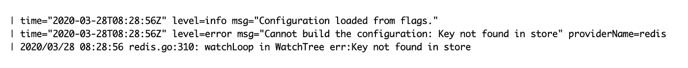
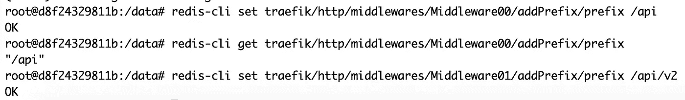
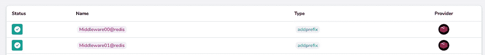

# Traefik 2 高可用模式

> 原文：<https://levelup.gitconnected.com/traefik-2-high-available-mode-d09c9ec36295>

## 运行 Traefik 集群并将流量配置存储在键值存储中


阿德里安·施瓦兹在 [Unsplash](https://unsplash.com?utm_source=medium&utm_medium=referral) 上的照片

> *Traefik 是一款* [*开源*](https://github.com/containous/traefik) 边缘路由器*，让发布服务成为一种有趣而轻松的体验。它代表您的系统接收请求，并找出哪些组件负责处理这些请求。*
> 
> [*https://docs.traefik.io/*](https://docs.traefik.io/)

不建议在生产环境中运行单个 Traefik 实例，因为 Traefik 将成为环境的瓶颈，并且环境将具有高可用性。如果 Traefik 实例关闭，它后面的所有服务都将关闭。

因此，我开始探索在高可用性模式下托管 Traefik 的可用选项，由于我使用 Docker Swarm 来托管 Traefik 后端服务，我想到的第一个想法是用更多副本来扩展**Traefik 服务，或者以全局模式部署它(它将被部署到每个 Swarm 工作节点)。然而，使用这种设置运行 Traefik 会引入由不同实例多次生成 SSL 证书的风险(如果不需要生成 SSL 证书，这种想法足以在 HA 模式下托管 Traefik)。**

经过一番挖掘，我发现 [Traefik 1.7 有一个使用键值存储的测试集群解决方案](https://docs.traefik.io/v1.7/user-guide/cluster/)。然而，我想在最新版本中使用它，但我在最新版本中找不到该解决方案的清晰文档。另一方面，在 Redis、Consul 和 Etcd 等键值存储中存储 Traefik 配置的文档是可用的。

在本文中，我将描述如何使用键值存储运行 Traefik(以 Redis 为例),并强调将键值存储用于 Traefik 配置的局限性和优势。

**我对解决方案的期望**

根据测试版的[文档](https://docs.traefik.io/v1.7/user-guide/cluster/),我期望拥有与 1.7 版相同的特性和一些更高级的特性。下面是我一直在寻找的功能总结。

*   支持高可用模式。
*   将 Traefik CLI 命令存储在键值存储中，并在 Traefik 实例启动时读取它们。
*   将 LetsEncrypt SSL 证书存储在键值存储中，而不是文件中。

**现实&现实&局限**

原来 Traefik 2。x 版本不包括上述所有功能，其中一些功能被[转移到 Traefik 企业版](https://community.containo.us/t/traefik-2-2-features/5078)😢。为了更好地说明这一点，将 CLI 命令存储到键值存储中由于一些错误而被弃用。同时将 SSL 证书存储在仅包含在 Traefik Enterprise Edition 中的键值存储中。

如上所述，高可用模式仅支持存储以下 Traefik 配置类别

*   中间件配置。
*   路由器配置(HTTP、TCP 和 UDP)。
*   服务配置。
*   TLS 配置。

在下面的[链接](https://docs.traefik.io/reference/dynamic-configuration/kv/)中列出了键值存储可以存储和管理的所有配置项的完整列表。

**用 Redis 作为键值存储托管 Traefik】**

尽管我很失望😞由于 Traefik v 2.2 中并没有包含我需要的所有特性，为了评估该特性并检查该特性是否为托管 Traefik 增加了价值，我决定尝试使用键值存储来运行 Traefik。在接下来的步骤中，我将描述使用 Redis 服务器运行 Traefik 的尝试。我选择 Redis 是因为它更易于部署，但是，下面的步骤也适用于其他键值存储。

我尝试用 Redis 托管 Traefik 的第一步是同时部署 Traefik 和 Redis，并将它们连接在一起。幸运的是，这一步很简单，可以使用下面的 docker 堆栈文件来完成。

使用以下 CLI 命令可以连接 Traefik 和 Redis

一旦这两个服务都启动，Traefik 可以连接到 Redis，我们将能够从 Traefik 日志中看到下面的日志消息。



此错误的根本原因是 Redis 服务器没有为 Traefik 存储任何配置。

下一步是尝试创建添加 Traefik 配置到 Redis 存储，并验证 Traefik 是否加载它们。可以使用"***" Redis-CLI "***命令向 Redis 服务器添加密钥，如下图所示。您可以连接到 Redis 容器中的一个 shell，或者从远程服务器使用" ***redis-cli"*** 命令。



一旦上述键被添加到 Redis 存储中，中间件定义就会出现在 Traefik 仪表板上，如下图所示。



使用 Redis 命令行工具手动添加键是不方便的，并且会阻碍 docker 服务及其路由上的变更的自动化部署。因此，我开始寻找自动创建这些密钥的方法。以下是我想到的选择。

*   一旦部署了 Traefik，就创建这些密钥:这个想法要求我们每次更改这些配置时都要部署 Traefik，而且我们还需要更新 Redis docker 映像以包含 Redis 命令行。所以，基于以上原因，我放弃了这个方法。
*   创建一个服务来创建这些密钥:构建一个定制的服务来管理 Traefik 配置可能是一个好主意，但是这需要大量的工作，因此我也放弃了这个选项。
*   让 Redis 引导密钥:由于 Redis Docker 映像已经有了 Redis 命令行工具，它将能够使用回送 IP 与 Redis 服务器通信，我认为使用 Redis 的自定义 Docker 映像会更容易，因为它的入口点允许将数据引导到 Redis 服务器。

要自动创建和维护 Redis 密钥，客户 docker 映像必须支持以下功能

*   为键值文件向 Redis 服务器添加键。为了简单起见，我决定文件中条目的格式应该如下所示。

```
key1,value1
key2,value2
```

使用一个 bash 命令就可以很容易地在 Redis 服务器中从遵循上述模式的文件中导入或设置密钥。下面的函数可以通过读取文件内容并解析它来完成这项工作，然后将其传递给 Redis 命令行来创建密钥。

*   从 Redis 中删除所有不在键值文件中的项目。这在一些定义的路由或中间件被移除并且不再需要时是需要的。使用 bash 和 rails 命令行工具也可以完成这项任务，下面的函数通过比较 Redis 服务器中的所有条目和引导文件中的条目来完成这项任务，并删除文件中不包含的每个键。

*   更新 Redis 中的配置键需要一个 Redis 部署，以便通过入口点执行上述功能😢。为了改进这一点，我决定在 Redis docker 映像中添加一个后台进程，以不断检查引导文件的更新，并在发生任何变化时加载它们。此外，引导文件将作为卷添加，因此可以在 Redis docker 映像或容器之外修改它。下面是 Redis Docker 入口点的完整实现。

Traefik with Redis server 的完整实现可以在 Github 的以下[资源库](https://github.com/wshihadeh/traefik_v2)中找到。要在本地部署堆栈，克隆存储库，并执行以下命令

```
DEPLOY_VERSION=ha make deploy
```

**结论**

Traefik 高可用性特性(如在键值存储中存储 SSL 证书)在企业版中可用，而在开源版本中不可用。但是，可以将一些 Traefik 配置存储在键值存储中，例如中间件、服务和 TCP 配置。