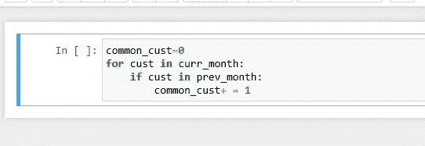
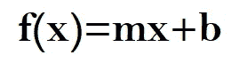

# 线性回归的训练/测试复杂度和空间复杂度

> 原文：<https://levelup.gitconnected.com/train-test-complexity-and-space-complexity-of-linear-regression-26b604dcdfa3>

你曾经面临过这样的情况吗？如果是，那么恭喜您，这意味着您拥有大数据！😎

大数据的挑战体现在推理和计算两个方面。随着我们向更精细的推理迈进，我们面临着做出及时、准确和精确的分析和决策的普遍挑战。

在分析中，**永远没有“充分”的数据**。当你获得越来越多的数据时，你可以开始细分数据以获得更好的洞察力。

> *N 永远不够，因为如果它“足够”的话，你就已经开始下一个需要更多数据的问题了。—安德鲁·盖尔曼*

这种对数据的贪得无厌的需求导致了计算的复杂性。了解这些计算复杂性在机器学习中非常重要。那么，ML 模型的计算复杂度是多少？

计算的复杂性是:

# 1.时间复杂度

在 RAM 中，算法所花费的“时间”是通过算法的基本运算来衡量的。虽然用户和开发人员可能更关心算法训练模型所需的挂钟时间，但使用标准最坏情况计算时间复杂性来比较模型训练所需的时间会更公平。使用计算复杂性的好处是忽略运行时使用的计算机能力和架构以及底层编程语言等差异，允许用户专注于算法基本操作的基本差异。

请注意，在训练和测试期间，时间复杂度可能会有很大的不同。例如，像线性回归这样的参数模型可能需要很长的训练时间，但它们在测试期间是有效的。

# 2.空间复杂性

空间复杂度根据输入大小来衡量算法需要运行多少内存。如果 ML 算法将过多的数据加载到机器的工作存储器中，那么 ML 程序就不能成功运行。

与时间复杂度类似，空间复杂度在决定算法/程序的效率方面也起着至关重要的作用。如果一个算法占用了很多时间，你仍然可以等待，运行/执行它来得到想要的输出。但是，**如果一个程序占用了大量的内存空间，编译器就不会让你运行它**。

在本文中，我将讨论**线性回归**的训练/测试复杂度和空间复杂度。但在此之前，让我们用一些简单的例子来理解时间和空间的复杂性。

# 时间复杂性入门

某公司开始了一项业务，并希望通过将当月的客户列表与上月的列表相比较来跟踪其共同客户。这个任务可以使用两个 python 列表自动完成: *curr_month* 和 *prev_month。*

对于每月大约 2000 名客户的列表，这段代码片段运行了大约 30 秒。当这与大约 2 个 lac 客户的完整列表一起使用时，这几行代码似乎永远运行不完！

是因为 Python 就是慢吗？该不该转 Java/Go 优化？答案是否定的。这是一个非常简单的问题，解决方法甚至更简单，只需大约 1 秒钟。

仔细注意不同之处。区别在于 python *list* 和 *set* 。一个`set`被设计用来快速完成这些`"is this element in"` 操作。即使您将`prev_month_set`中的元素数量增加一倍，操作`cust in prev_month_set`运行的时间也差不多。

另一方面，如果您将`prev_cust`的大小增加一倍，操作`cust in prev_cust`将需要两倍的时间来运行。

# 时间复杂性和大 O

我们知道代码片段之间存在差异，但是我们如何表达这种差异呢？这就是大 O 符号的由来。

虽然大 O 有正式的定义，但你主要可以把它看作是一台机器完成算法所做的“运算”次数的估计。操作的数量与“运行时间”密切相关，它通常与数据的大小有关。

通常，有三个层次需要求解(最佳情况、一般情况和最差情况)，它们被称为渐近符号。这些符号允许我们回答这样的问题:当输入大小增加时，算法是否突然变得非常慢？随着输入大小的增加，它是否主要保持快速运行时间？

让我们快速看一下这三层:

**最佳情况——表示为大ω或ω(n)**

*   Big-Omega 通常写为ω，是给定函数最佳情况的渐近符号。它为我们提供了一个算法运行时增长率的渐近下界。

**平均情况——表示为大θ或θ(n)**

*   θ，通常写为θ，是一种渐近符号，用来表示算法运行时增长率的渐近紧界。

**最坏情况——用大 O 符号或 O(n)表示**

*   Big-O 通常写为 O，是给定函数最坏情况的渐近符号。它为我们提供了一个算法运行时增长率的渐近上界。

**开发人员通常会解决最糟糕的情况，因为你并不期望你的算法在最好甚至是一般的情况下运行。它允许你作出分析性的陈述，比如，“即使在最坏的情况下，我的算法也能很快扩展”。**

现在，让我们再次回到我们之前讨论的例子，找出代码片段的时间复杂度。如果我们查看 [python 关于时间复杂度](https://wiki.python.org/moin/TimeComplexity)的文档，我们可以看到在**的平均情况下，在 s 中具有形式 *x 的***操作采取的步骤等于:

*   如果`s`是一个`list`
*   O(1)如果`s`是一个`set`

现在，让我们再次以 list 为例，找出其案例中的大 O:

仔细看:

1.  我们遍历 curr_month 列表中的 n 个客户。
2.  对于每个客户，我们检查它是否在 prev_month 列表中。根据 python 关于 s 中形式为 *x 的操作的复杂性的文档:如果列表中有 n 个元素，则需要 O(n)个步骤。因为我们遍历 n 个客户，所以需要 n 次操作。*
3.  添加号码只需一步。

因此，循环的每次迭代大约需要 O(n) + O(1)步，并且循环中有 n 次迭代，所以将所有 n(O(n) + O(1)) = O(n)。你可以把 0 相加相乘，当你有几项时，你只需要去掉低阶项和系数。O(n +n) = O(n)。

我们可以用 set 做同样的事情，找到大 o。

1.  根据 python 文档中关于 s 中形式为 *x 的操作的复杂性:如果一个集合中有 n 个元素，则需要 O(1)个步骤。*

综合起来:O(n) + n(O(1) + O(1)) = O(3n) = O(n)。与 list 实现相比，set 非常快。

# 解读大 O

所以我们有一个 O(n)的算法和另一个 O(n)的算法。你对此如何解读？

看待这个问题的一种方式是通过分析数据集的估计值 n 来估计问题的严重程度。如果我们的数据大小为 2 lac，那么 O(n)算法将需要大约 200000⁰运算，大约为 40000000000，这是一个很大的数目。

相同的数据集，但是使用 O(n)算法，将有大约 200000 次操作，这是更容易管理的。

希望你记得，当我们计算大 o 时，我们去掉了低阶项和系数，所以精确的值在这里并不重要。我们只看问题的严重性。看待这个问题的另一种方式是获得两个数据集大小之间的相对比率。

假设有 2000 个客户，列表算法需要 30 秒。如果我们将数据量增加一倍，需要多长时间？所以我们现在有一个大小为 2n 的数据集。那么运行时间将是大约

O((2n) ) = O(4n)

这意味着将 O(n)的数据集大小加倍会使运行时间增加 4 倍。我们预计它将运行 120 秒左右。

另一方面，对于 set 算法，在数据大小加倍时，复杂度变为等于 O(2n ),这意味着数据集加倍仅使运行时间加倍。

性能上的大差异来自于`cust in prev_cust`和`cust in prev_cust_set`的细微差别。这些差异有点难以察觉。

大 O 符号为我们提供了一种方式来总结我们对上述两种算法如何扩展的见解。我们可以比较 O(n)和 O(n ),而不知道每个算法是如何实现的。这正是我们在使用`x in prev_cust_set`是 O(1)这一事实时所做的，而没有描述`set`是如何实现这一点的。大 O 给我们的是一种通过描述运行时间相对于输入大小的一般形状来抽象算法的方法。

如果您知道数据集不是海量的，那么您可以选择使用较慢的算法和模型，这些算法和模型要么给出更好的结果，要么实现和维护更简单。

现在你已经理解了时间复杂性的基础，让我们深入研究线性回归的训练/测试复杂性。

# 线性回归的训练/测试复杂性入门

**线性回归**是寻找给定数据的最佳直线拟合的方法，即寻找自变量和因变量之间的最佳线性关系。
用专业术语来说，线性回归是一种机器学习算法，可以在自变量和因变量之间找到任何给定数据的最佳线性拟合关系。这主要是通过残差平方和的方法来完成的。

*想了解更多关于线性回归的知识，可以登陆我的博客* [*关于线性回归的面试问题*](https://medium.com/analytics-vidhya/preparing-for-interview-on-machine-learning-3145caeea06b) *。*

**最小二乘法&矩阵乘法**

一种接近线性分析的方法是最小二乘法，它使残差平方和最小化。残差是模型拟合值和观测值之间的差异，或者是预测值和实际值之间的差异。最小化这些残差的练习将是“通过”表示这些值的笛卡尔坐标的线的试错拟合。

进行最小二乘法的一种方法是通过矩阵乘法求解。怎么做呢？

对于点(x1，y1)，(x2，y2)，…，(xn，yn)，最小二乘回归线可以由下式给出:

这将最小化平方误差的总和，平方误差是使用回归函数 f(x)来估计真实 y 值时的误差。

在哪里，

y=真 y 值

f(x)=预测的 y 值

让我们看看能否把它建立成一个方程组，然后用矩阵求解。

使用我们的点(x1，y1)，(x2，y2)，…，(xn，yn)，我们将得到下面的方程组。

现在，让我们建立一个矩阵:

这建立了矩阵方程:

其中矩阵 *Y* 包含 Y 值，矩阵 *X* 包含一行 1 以及 X 值，矩阵 *A* 由 Y 截距和斜率组成，矩阵 *E* 是误差。请注意，矩阵 *X* 中的 1 行需要与矩阵 *A* 相乘(分别为 2 行和 2 列)。

然后，我们求解 A，它由下式给出:

E 为误差平方和，由下式给出:

这是最终用于求解线性系统的最小二乘法的矩阵方程。

# **线性回归的训练复杂度**

线性回归计算如下

如果 X 是一个(n×k)矩阵:

I. (X' X)花费 O(n*k)时间，并产生一个(k×k)矩阵。

二。(k×k)矩阵的矩阵求逆需要 O(k)时间。

三。(X' Y)花费 O(n*k)时间并产生一个(k×1)矩阵

四。(k×k)和(k×1)矩阵的最终矩阵乘法需要 O(k )时间

所以 Big-O 训练时间为 O(k *n + k + k*n +k )。

现在，我们知道:

*   k< k³
*   k*n < k²*n

So, asymptotically, the actual Big-O running time is :

***O(k * n+k)*=*O(k(n+k))***

*(进一步参考* [*点击此处*](http://en.wikipedia.org/wiki/Computational_complexity_of_mathematical_operations#Matrix_algebra) *)。)*

因此，训练线性回归模型在计算上过于昂贵。这种解决方案在大多数情况下都能很好地工作，除了在下列情况下，

如上所述，在封闭形式的解决方案失败的情况下，迭代解决方案可以拯救我们。梯度下降等迭代解决方案背后的思想是:

*   从参数的一些初始值开始，慢慢地向局部最小值移动。
*   以某种方式确保每次迭代中的移动都朝着它应该达到的局部最小值。
*   最终确定何时停止进一步迭代并返回解。

梯度下降可以让计算从任意点开始，并且迭代地应用下面的计算，

用于任何维度的梯度下降的通用算法如下，

我们之前讨论的线性回归的平方误差成本函数由下式给出:

因此，如果我们有一个包含 n 个点和 k 个特征的数据集，并且要求我们使用梯度下降来计算时间复杂度，那么，

因此，我们可以看到，使用梯度下降的复杂性降低到 O(kn)。

为了更好地理解这个等式，需要注意以下几点:

1.  在任一给定点的偏导数对应于在给定点接触曲线的直线的斜率。
2.  学习率α确保每次迭代的移动/变化是斜率的一小部分。
3.  不管起始点是什么，斜率的符号都确保了运动的方向朝向预期的解决方案。
4.  斜率值随着我们向局部最优值移动而减小，并且一旦它触及局部最优值(或非常接近局部最优值)就不再进一步改变。因为斜率在曲线中值最小的点上变为零。
5.  学习率决定了算法运行和收敛的速度。

因此，当涉及大量高维数据(即大量特征)时，梯度下降法优于 OLS 法。

# 线性回归的测试/运行时复杂性

运行时复杂性非常重要，因为在训练结束时，我们在看不见的数据上测试我们的模型，并计算我们模型的准确性。在线性回归的情况下，训练模型后，我们得到 w 和 b。w 基本上是一个 k 维的向量。给定任何新点，我们只需执行 W^T * Xi + b 运算。如果我们的模型训练良好，那么预测值和实际值之间的误差平方和将最小。现在，w 是一个大小为 k 的向量。执行 W^T*Xi + b 运算需要 O(k)步，如前所述。加 b 只需 1 步，即 O(1)。因此，线性回归的运行时间复杂度是 O(k)。

因此，我们看到，虽然线性回归有很长的训练时间，但它们在测试期间是有效的。测试/预测时间是 O(k ),其中 k 是数据的特征数/维数。

# 线性回归的空间复杂性

现在，让我们看看训练和测试线性回归的空间复杂度是多少。我们之前已经看到了用于训练线性回归模型的方程组的矩阵表示。

所以，我们需要在内存中保存的是分别为(n x k)和(n x 1)阶的 X 和 Y 矩阵。然后，可以使用前面讨论的下面给出的等式来计算矩阵 A:

因此，训练时的空间复杂度为 O(nk + n)。

在训练模型后，我们只需要在内存中保存 w 和 b，因为给定任何新的点 x，我们必须执行 W^T * X + b 来预测新的 y 值，并检查模型的准确性。因为，b 与输入大小无关，所以在 O(1)中存储 b 所需的空间。现在，W 是一个大小为 k 的向量，所以，W 的空间复杂度是 O(k)。因此，运行时线性回归的空间复杂度大约为 k，即 O(k)。

# 结论:我们应该如何优化我们的代码？

如果我们对一个问题有不同的解决方案，我们可以比较它们的运行时间来得到答案。然而，时间复杂性并不是你应该考虑的唯一因素。您还应该考虑您的代码是否足够易读，以及您的代码将消耗多少内存。

参考资料:

1.  [https://www . thekerneltrip . com/machine/learning/computational-complexity-learning-algorithms/](https://www.thekerneltrip.com/machine/learning/computational-complexity-learning-algorithms/)
2.  [https://stack overflow . com/questions/1955 088/what-the-bigo-of-linear-regression](https://stackoverflow.com/questions/1955088/what-is-the-bigo-of-linear-regression)
3.  [https://www . crayon data . com/blog/machine-learning-linear-regression-gradient-descent-part-1/](https://www.crayondata.com/blog/machine-learning-linear-regression-gradient-descent-part-1/)

*如果你觉得这很有帮助，别忘了点击*👏图标*。谢谢大家！*😊