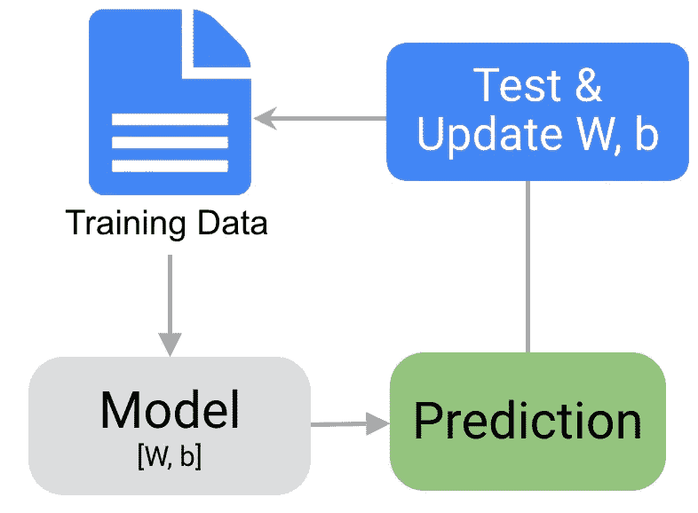
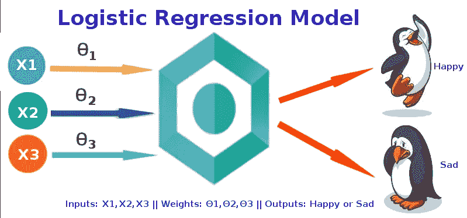
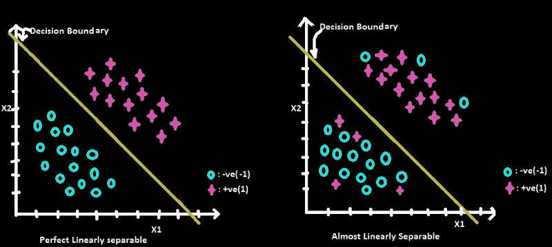
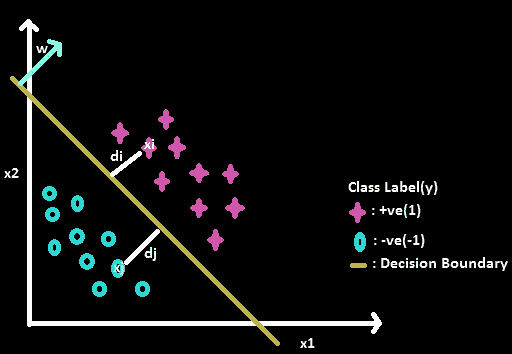
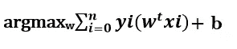

# 逻辑回归的训练/测试复杂度和空间复杂度

> 原文：<https://levelup.gitconnected.com/train-test-complexity-and-space-complexity-of-logistic-regression-2cb3de762054>

任何机器学习算法的工作流程都很简单。然而，如果训练数据似乎永远在运行，这个工作流可能会变得复杂！当您拥有大数据时，就会出现这种情况。大数据的挑战体现在推理和计算两个方面。然而，你不能抛弃数据。在分析中，**永远没有“充足”的数据**。当你获得越来越多的数据时，你可以开始细分数据以获得更好的洞察力。解决这种问题的唯一方法是比较各种机器学习算法的计算复杂性，这些算法可以为您的问题提供解决方案，并在这些算法中找到最好的，可以产生及时、准确和精确的分析和决策。

本文描述了逻辑回归的计算复杂性。逻辑回归用于线性可分数据或几乎线性可分数据的二元分类。在深入研究逻辑回归的计算复杂性之前，我建议你浏览一下我关于[线性回归的训练/测试复杂性和空间复杂性](/train-test-complexity-and-space-complexity-of-linear-regression-26b604dcdfa3)的博客。这篇博客描述了时间和空间的复杂性以及大 O 的概念。您还将了解线性回归的计算复杂性。所以，如果你对这些概念不熟悉，那么在阅读本文之前，你必须先看看我以前的博客。

# 逻辑回归入门

每种机器学习算法在给定的一组条件下工作得最好。确保您的算法符合卓越性能的假设/要求非常重要。你不能在任何条件下使用任何算法。例如:我们不能对分类因变量使用线性回归。因为我们不会因为得到极低的调整后 R 值和 F1 值而得到赞赏。相反，在这种情况下，我们应该尝试使用逻辑回归、决策树、支持向量机(SVM)、随机森林等算法。

**逻辑回归**是一种机器学习分类算法，用于预测分类因变量的概率。在逻辑回归中，因变量是一个二元变量，包含编码为 1 的数据(是，成功，等等)。)或 0(否，失败等。).换句话说，逻辑回归模型预测 P(Y=1)是 x 的函数。

# 平面方程

穿过 3D 空间中的点 A = (x1，y1，z1)的平面的方程，其法向量 n = (a，b，c)定义为:

**a(x-x1)+b(y-y1)+c(z-Z1)+b = 0**

**ax + by + cz + b= 0 其中 b = -(ax1+by1+cz1)**

为了简单起见，我们也可以把它写成:

**w1x1 +w2x2 + w3x3 + b= 0**

这与 **w^t * xi + b= 0** 相同，其中 xi 是第 I 个观测值。

如果平面通过原点，那么方程变成 **w^t *xi = 0。**其中 **w^t(** w 转置 **)** 为行向量 **xi** 为列向量，b(截距)为标量。如果我们有二维空间，那么等式变成 w1x1 + w2x2 + b = 0，如果我们有 n 维空间，那么等式变成 w0 + w1x1 + w2x2 + w3x3 +……..….wnxn = 0。

# 逻辑回归背后的几何直觉

设一个数据集(D)由 x(特征/自变量)和 y(目标/因变量)组成，即 n 个数据点的 D ∈ {xi，易}。每个 xi 是一个实值 d 维特征向量，每个 yi 是 1 或-1。逻辑回归的基本假设是数据几乎是线性可分的(即一些+ve 类点在-ve 类中，反之亦然)或完全线性可分的(没有点与其他类混合)(如下图所示)。我们的主要目标是找到一条线(在 2D 中)或平面/超平面(在 3D 或更多维中),它可以尽可能完美地将两个类点分开，这样当它遇到任何新点时，它可以很容易地分类，它属于哪个类点。由于 x 和 y 是在训练数据中给定的，所以如果我们可以找到 w(法线)和 b (y 截距)，那么我们可以很容易地找到一条线或平面，也称为决策边界，它几乎可以线性地分隔这两个类。这里，我们将只关注两个特性(x1 和 x2 ),这样直觉就变得容易了。

现在，我们取+ve 类的任意一个点，计算一个点到平面的最短距离(如下图所示)。最短距离由下式给出:

**迪= w^t*xi/||w||**

设，||w||=1。然后，

**迪= w^t*xi**

由于 w 和 xi 位于决策边界的同一侧，因此距离将为+ve。现在计算 dj = w^t*xj.因为 xj 是 w 的对边，所以距离是-ve。由此我们可以得出结论，与 w 方向相同的点都是+ve 点，与 w 方向相反的点都是-ve 点。

现在，我们可以很容易地对-ve 和+ve 点进行分类。如果 w^t*xi>0，那么 y =+1，如果 w^t*xi < 0 then y = -1.

**观察:**

查看上图并观察下面列出的所有要点:

*   如果 yi = +1 且 w^t*xi > 0，那么分类器(一种数学函数，由分类算法实现，将输入数据映射到一个类别)将其分类为+ve 个点。那么，如果 yi*w^t*xi > 0，会发生什么？那么它就是正确分类的点，因为两个+ve 数相乘总是大于 0。
*   如果 yi = -1 并且 w^t*xi < 0, then classifier classifies it as -ve point. If yi * w^t*xi > 0，那么它是正确分类的点，因为两个 ve 数相乘将总是大于 0。所以对于+ve 和-ve 点，yi* w^t*xi > 0。这意味着模型正确地对 xi 点进行了分类。
*   如果 yi = +1 并且 w^t*xi < 0, i.e, yi is +ve point but classifier is saying it is -ve then we will get -ve value. Which means actual class label is +ve but it is classified as -ve then this is miss-classified point.
*   If yi = -1 and w^t*xi > 0，这意味着实际类标签是-ve 但是被分类为+ve，那么它是误分类点(yi*w^t*xi < 0).

From above observations, we want our classifier to minimize miss-classification error, i.e, we want yi*w^t*xi to be greater than 0\. Here, xi, yi are fixed because these are coming from data-set. As we change w, and b the sum will change and we want to find such w and b that maximize the sum given below. w and b can be calculated using Gradient Descent.

Now that you have understood Logistic Regression let’s move on to train/test complexity and space complexity of Logistic Regression.

# Train complexity of Logistic Regression

As discussed earlier to train a Logistic Regression model, we just need w and b to find a line(in 2D) or plane/hyperplane(in 3D or more dimension) that can separate both the classes point as perfect as possible so that when it encounter with any new point, it can easily classify, from which class point it belongs to. The value of w and b should be such that it maximize the sum yi*w^t*xi > 0。

现在，让我们用大 O 来计算:

1.  w 是大小为 d 的向量。执行 yi*w^t*xi 运算需要 O(d)步。
2.  在 n 个数据点上迭代并找到最大和需要 n 步。

因此，在训练逻辑回归模型期间的时间复杂度是 n(O(d))=O(nd)。

# 逻辑回归的测试/运行时复杂性

运行时复杂性非常重要，因为在训练结束时，我们在看不见的数据上测试我们的模型，并计算我们模型的准确性。在逻辑回归的情况下，在训练模型后，我们得到 w 和 b。给定任何新的点，我们只需执行 w^t * xi 运算。如果是 w^t*xi>0，点是+ve，如果是 w^t*xi<0，点是负的。由于 w 是一个大小为 d 的向量，如前所述，执行 w^t*xi 运算需要 O(d)步。所以，逻辑回归的运行时间复杂度是 O(d)。因此，逻辑回归非常适用于低延迟应用，即数据规模较小的应用。

# 逻辑回归的空间复杂性

在训练一个逻辑回归模型的过程中，我们需要在内存中存储四样东西:x，y，w 和 b。由于 b 是一个常数，所以存储 b 只是一个步骤，即 O(1)运算。x 和 y 分别是(n×d)和(n×1)阶的两个矩阵。存储这两个矩阵需要 O(nd + n)步。最后，w 是一个大小为 d 的向量，将它存储在内存中需要 O(d)步。所以，训练时的空间复杂度为 O(nd + n +d)。

在训练模型之后，我们只需要在内存中保存 w。我们只需要执行 w^t*x1 来分类这些点。因此，运行时的空间复杂度为 d，即 O(d)。

**结论:** 如果你的数据量很大，选择算法是基于你要解决的问题。如果你对一个问题有不同的解决方案，你可以比较它们的运行时间来得到答案。然而，时间复杂性并不是你应该考虑的唯一因素。您还应该考虑您的代码是否足够易读，以及您的代码将消耗多少内存。

*如果你觉得这很有帮助，别忘了点击*👏图标*。这对你的手指是一个很好的锻炼，并且会帮助其他人看到这个故事。谢谢大家！*😊