# 训练单个感知器

> 原文：<https://levelup.gitconnected.com/training-a-single-perceptron-405026d61f4b>

## 它的学习规则是从零开始的

在我之前的文章中，我介绍了感知器的结构和功能——每一个神经网络的构建模块。我在这篇文章的结尾提醒大家注意这样一个事实，虽然我定义了进入感知器的大多数变量和函数，但我没有提到任何关于权重的事情。嗯，权重本身以及它们如何设置或改变实际上是对 ***训练一个感知机*** 意味着什么的核心。我的目标是解释如何训练一个单一的感知器。如果你明白这是如何在单个感知器上工作的，那么你应该能够建立一个坚实的直觉，知道一个具有更复杂架构的神经网络通常是如何被训练的。

如果你想复习一下或者没有看过我关于感知器的结构和功能的帖子，可以看看下面这篇文章，尽管在开始训练感知器之前我会快速总结一下要点。

 [## 感知器——神经网络的构建模块

### 以及它如何计算一个逻辑语句

blog.usejournal.com](https://blog.usejournal.com/the-perceptron-the-building-block-of-neural-networks-5a428d3f451d) 

注意:这篇文章推荐一些微积分方面的经验。

## 1.先决条件

## 1.1.感知器的快速复习

这张图直接取自我之前的[文章:](https://blog.usejournal.com/the-perceptron-the-building-block-of-neural-networks-5a428d3f451d)

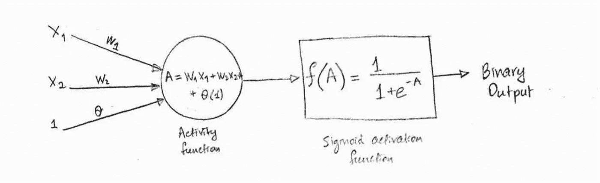

单感知器模型图，其中 x1、x2 是输入，w1 和 w2 是分别将输入 x1 和 x2 连接到感知器的权重(用圆圈表示)，θ是偏差项。A 是活动函数值，f(A)是产生感知器最终二进制输出的激活函数值。这里 f 是 sigmoid 函数。

以下是图表中所显示内容的概述:

1.  这个图是一个二元分类感知器，可以计算简单的逻辑语句。
2.  活动函数 A 是输入变量 x 和一些偏差θ的加权和。它定义了可以将输入空间一分为二的直线或线性边界，从而可以分离二进制数据点。直线能够在空间中分离这样的点的性质叫做 ***线性可分性。***
3.  ***偏置*** 项决定线条在输入空间的垂直位置。
4.  ***激活函数 f*** 是一个以活动值为自变量的函数( ***活动函数 A*** 的输出)，并将其映射为 0 或 1，以保证感知器的最终输出为二进制。

## 1.2.方便的符号

让我们介绍一下上面感知器的一个稍微精炼和一般化的表示:

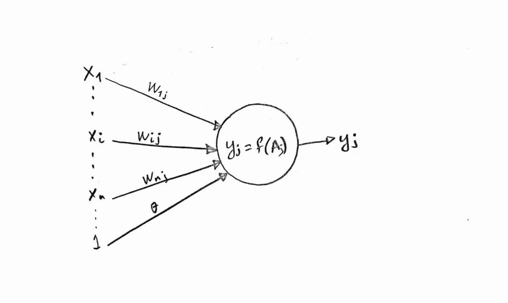

感知器模型的更一般化的图表。

我采用这种新的符号是为了让这篇文章接下来的部分更容易理解。这里我们有以下新的符号:

1.  *w_ij —* 将输入 *x_i* 链接到感知器 *j* 的权重(图中间的节点)。
2.  *y_j —* 感知器 *j* 的输出。

## 1.3.权重——感知机学习的东西

回想一下，组成感知器的组件是输入、权重、偏置、活动函数和激活函数，而输出是取决于所有这些东西的最终量。输入是固定的——它们就是数据！我们不能对数据做任何更改。活度函数和激活函数仅仅是函数，而不是可以改变的量。所以在训练感知器时，我们唯一能控制改变的是 ***权重*** 。这意味着…

> ***…当我们训练一个感知器时，我们迭代地改变权重，直到我们找到最佳的权重集，以便活动函数产生直线的正确斜率和方向，从而利用线性可分性。***

## 1.4.监督学习

让我们在监督学习的背景下考虑一个感知机。假设我们有一个感知器 j 的输出 y_j 需要是什么的标签:让我们称之为我们的 ***期望输出 d_j*** 。这个期望输出 d_j 是基础事实，我们知道感知机应该产生的目标输出。换句话说，这个期望的输出 ***监督我们的感知器应该学习什么样的权重，以便产生某个输出***——因此有监督学习这个术语。

如果我们知道期望的输出是什么，我们可以使用一些数学来定义一些函数，允许我们将期望的输出 d_j 与感知器产生的 ***实际输出 y_j*** 。但是我们也希望这个函数依赖于权重，因为权重是我们在训练感知器时想要更新的。让我们称这个函数为 ***误差函数*** 因为如果实际输出不等于期望输出，那么误差函数的值是非零的，我们可以说感知器出错了！我在这里称它为误差函数，以坚持直观的语言，但这就是通常所说的 ***损失函数*** 。

我们的目标是找到这个函数的最小值——因为误差是我们希望最小化的。

> 我们可以定义一些依赖于权重的函数，这将允许我们将感知器的实际输出与一些期望的输出联系起来。这个函数是误差函数，目标是通过迭代更新权重来最小化它。

一旦误差最小化，我们就可以说感知机已经被训练好了。

## 2.训练感知器

## 2.1.初始化权重并计算实际输出

让我们再来看看感知器:

感知器模型的更一般化的图表。

输入 x_i 乘以随机初始化的权重 w_ij，并与偏差和所有其他加权输入一起被馈送到感知器。在感知器内部，活动函数被应用于输入加上偏差的加权和，然后其值作为参数被馈送到激活函数 f。激活函数的值产生感知器 j 的输出 y_j。

## 2.2.定义并计算误差

在计算误差之前，我们首先需要定义误差。记得我提到过，误差函数必须依赖于权重，并且需要将实际输出 y_j 与期望输出 d_j 相关联，因此我们将其定义为:

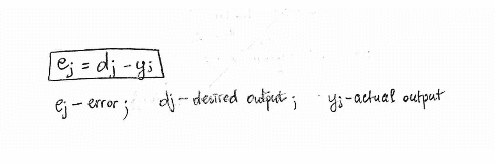

感知器误差函数的先决条件

这个函数 e_j 确实把 d_j 和 y_j 联系起来，事实上它依赖于权重，因为我们知道 y_j 项本身依赖于权重。我们知道需要最小化 e_j，但根据 d_j 和 y_j 的值，我们可能会得到误差 e_j 的负值，因此我们对其求平方，以确保误差始终为正数，并将其定义为

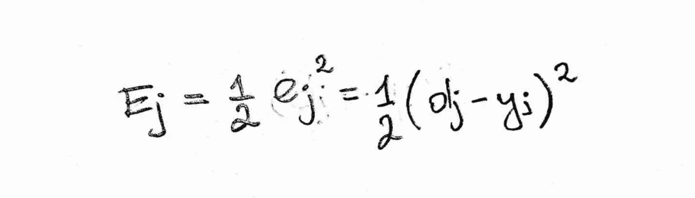

感知器的误差函数

然后，我们重新定义误差函数 e_j 为 E_j，以确保它永远不会为负。但我也包含了 1/2 的因素。正如我最喜欢的一位教授曾经说过的，“我们做数学中方便的事情”。1/2 的因素是为了以后办事方便。我很快会回到这个话题。

## 2.3.梯度下降-更新权重以进一步减少误差

现在我们有了一个误差函数，可以用它来帮助我们确定如何更新 w_ij，这样我们就可以进一步减少误差。让我们基于当前电流和误差函数 E_j 来定义更新后的权重的数学表达式:

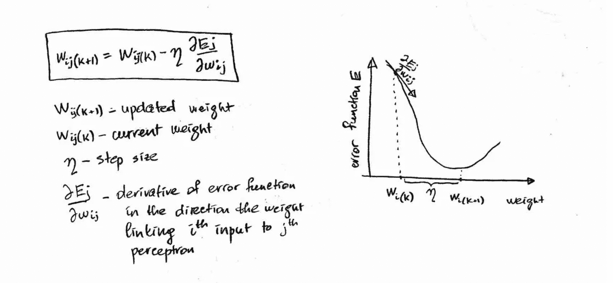

梯度下降的表示

框中的等式是用于使用以下等式找到 ***更新权重 w_ij(k+1)*** 的表达式

1.  ***当前权重 w_ij(k)***
2.  有的 ***步长由希腊字母 ***eta*** 给出***
3.  误差函数 E_j 关于 w_ij 的 ***导数。***

换句话说，这就是 ***梯度下降的公式——***求函数最小值的迭代方法。

## **为什么偏导数？**

**一个问题出现了:为什么我用 ***偏导数*** 表示误差函数的导数？上面的图表是一个误差与一个*单个权重的函数关系图。在更现实的情况下，感知器会有多个权重。例如，如果我们有 2 个权重，误差函数的图形将是 3 维空间中的 3 维表面，因此误差函数的两个偏导数将需要相对于两个权重来计算。更一般地，如果我们有 n 个权重，那么误差函数将是 n+1 维空间中的 n+1 维超曲面，并且其导数将在具有 n 个分量的*梯度向量的帮助下计算，每个分量表示误差函数在单个权重方向上的偏导数。****

****但是让我们回到一个更新的权重 w_ij(k+1)的表达式。由此我们实际上可以推导出在下一次迭代中我们需要改变当前权重的量(增加或减少一定量)以进一步减少 E_j。当前权重的这个改变量在下面的框中用术语***δw _ ij***表示:****

****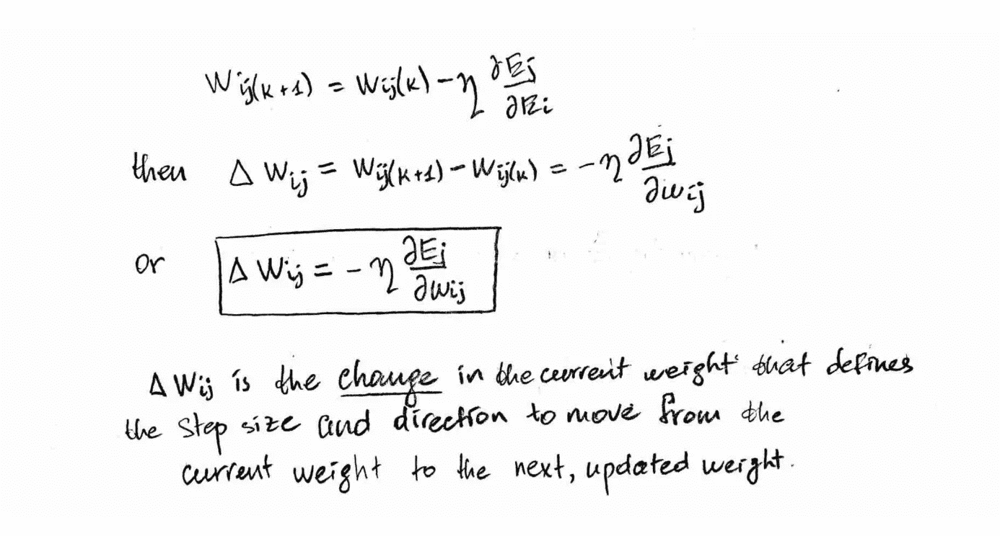****

****权重更新方程****

****上图中的表达式是梯度下降法在感知器环境中的应用，我们试图修改权重以降低误差函数值。****

## ****误差函数的导数和链式法则****

****那么我们如何计算误差函数的导数呢？为了计算这个导数，我们必须承认误差函数 E_j 非常复杂 ***复合函数*** 由函数 e_j 组成，而函数 E _ j 又由另一个函数 y_j 组成，等等。更具体地说，****

****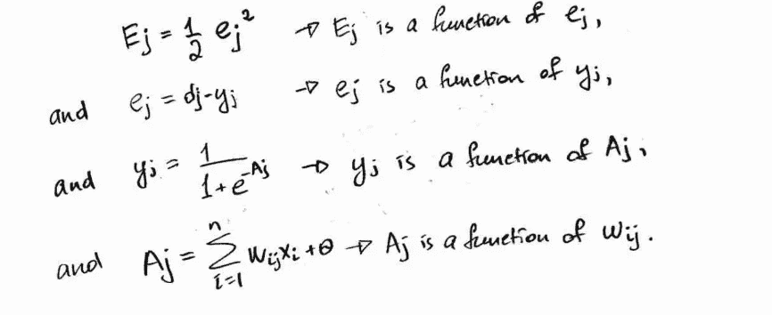****

****误差函数是由其他函数组成的复杂函数，而其他函数又由其他函数组成，因此需要应用链式法则****

****因此，我们需要利用 ***链式法则*** 对 E_j 相对于权重 w_ij 求导。****

****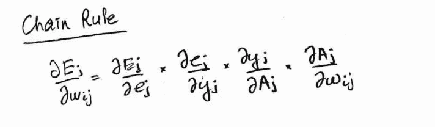****

****应用于误差函数的链式法则****

****接下来，我们需要计算上式右侧的四个偏导数项，但这并不是一个非常困难的任务，因为我们知道 E_j、e_j、y_j 和 A_j:****

****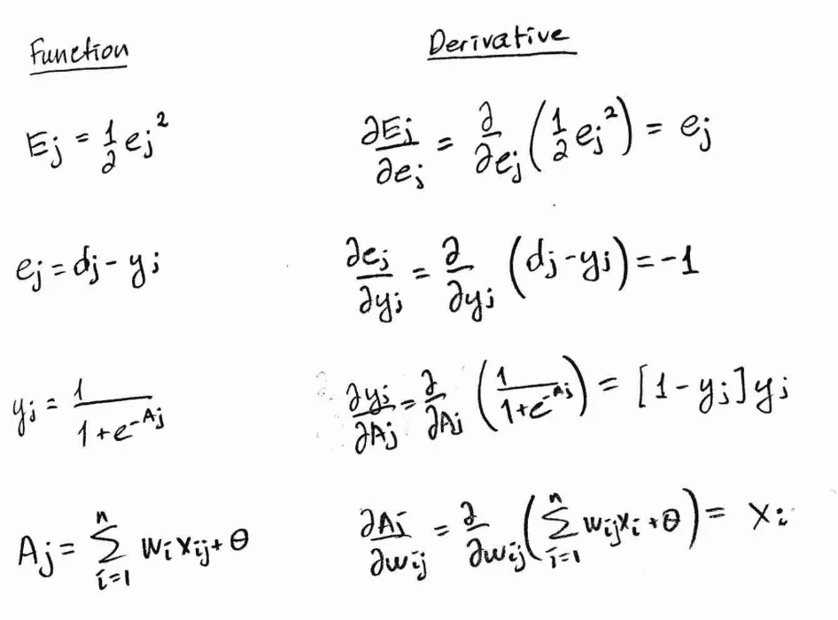****

****构成误差函数梯度向量的各个项****

****现在，我们已经计算了每一项，我们可以将它们插回到 E_j 导数的链式法则方程中，我们将得到以下表达式:****

****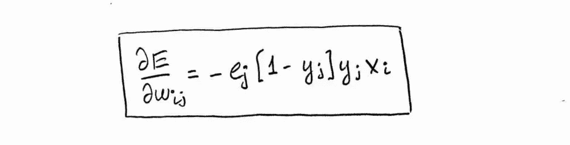****

****用于计算误差函数的梯度向量的清理版本****

## ****2.4.感知器 Delta 函数——把它们放在一起****

****同样，在上述表达式中，权重的下标 i_j 指示这是将输入 I 链接到感知器 j 的权重。这里 E_j 的偏导数仅在权重 w_ij 的方向上，因此该导数仅是感知器 j 的 E_j 的梯度向量的元素之一。注意，除 x_i 之外的所有项都具有相同的下标 j，指示它们都与感知器 j 的输出相关！****

****让我们进一步简化，将具有相同下标的术语分组如下:****

****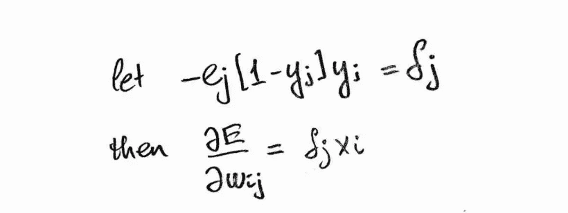****

****并把它代入表达式中得到****

****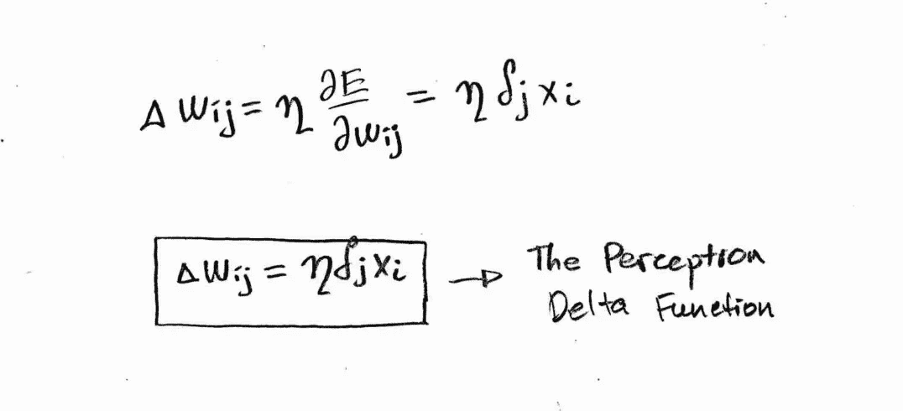****

****感知器 delta 函数****

****框中的表达式是 ***感知器增量函数*** — *一个量化当前权重 w_ij(k)需要改变多少以获得更新的权重 w_ij(k+1)的函数。*****

> ********感知器增量函数* *量化当前权重 w_ij(k)需要改变多少，以便获得更新的权重 w_ij(k+1)，这将有助于进一步减小误差。********

*****反复重复这个过程，直到误差最小化，这就是我们所说的训练感知器的过程。*****

## *****3.多元案例*****

*****上面的计算是针对单个感知器 j 进行的，该感知器使用单个权重 w_ij 对输出 y_j 做出贡献。如果我们有 m 个感知器贡献于某个输出 y_j(例如，在神经网络的输出层中有 m 个感知器),那么误差函数的公式如下*****

*****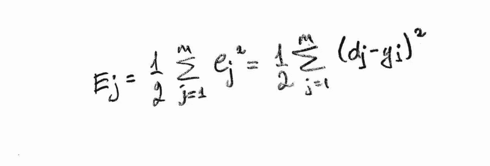*****

*****定义误差函数的多元版本*****

*****此外，如果我们想用将所有 n 个输入与每个感知器连接起来的 n 个权重来计算所有 n 个输入，那么对于上述公式中的每个感知器 j，我们需要使用感知器 delta 函数 n 次来计算 n 个更新的权重，从而计算 E_j 的 n 个偏导数，这些偏导数是 E_j 的梯度向量的分量。因此，您可以看到，一旦我们开始计算更多的权重和更多的感知器，这将变得非常复杂，这证明了神经网络的计算复杂性。*****

## ********4。概括所有的数学难题********

1.  ********训练一个感知器*** 是一个优化问题，它涉及以最小化误差函数的方式迭代更新权重。*****
2.  *****我们导出了 ***误差函数*** ，并且定义了 ***更新的权重*** 应该基于当前权重和在当前迭代中计算的误差。我们使用一个单一权重和一个单一感知器的例子来完成这一切。*****
3.  *****然后，我们推导出 ***感知器增量函数*** ，该函数量化需要添加到当前权重或从当前权重中减去的变化，以达到进一步减小误差的更新后的权重。*****

*****在我的下一篇文章中，我将基于这里导出的数学公式，对 ***前馈反馈比例算法*** 进行一次演练，将其应用于一个简单的多层感知器(MLP)的例子。___________________________________________________________________*****

## *****奖金——为什么使用梯度下降，而不是设置导数为零，以找到最小值？*****

*****出现了一个问题，为什么不简单地通过将其导数设置为零来最小化误差函数。如果权重的数量变大，那么误差函数很快就会变得非常复杂。假设下图是构成曲面的某个三维(三个权重)误差函数的切片或横截面视图。*****

*****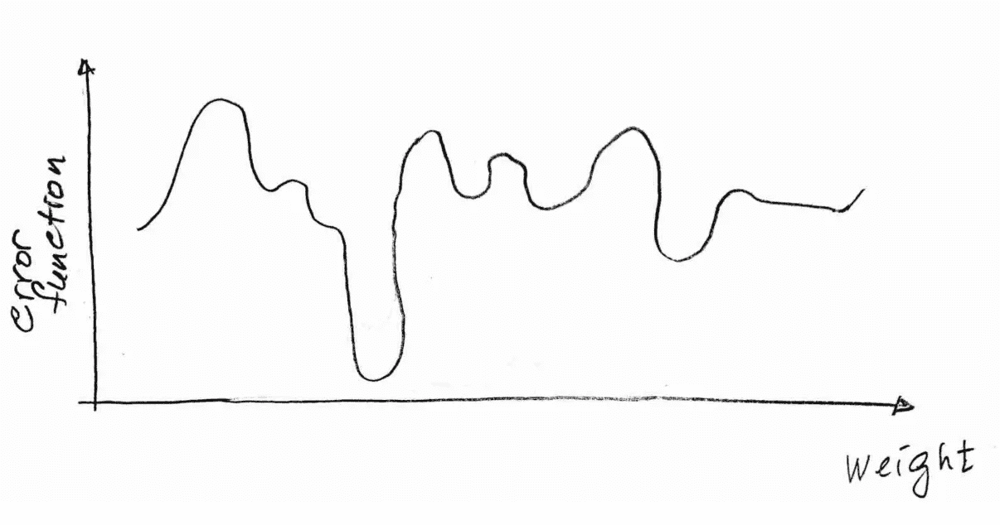*****

*****单个砝码误差函数的简化图。当然，在现实情况下，我们会处理更多的权重。每一个额外的重量都会给这个图增加一个维度*****

*****如你所见，误差函数非常复杂！这种复杂函数的问题是:*****

*****1.我们有许多最小值*****

*****2.这些函数太复杂了，无法用一个简洁的公式进行数学表达*****

*****3.如果没有一个简洁的数学公式，对如此复杂的函数求导可能是不可行的*****

*****4.找到对应于全局最小值的自变量(最优权重)是不现实的。*****

*****通过将函数的导数设置为零来最小化函数是解决优化问题的一种解析方法，但是解析解并不总是对我们可用的。因此，我们可以使用另一种计算方法——这种分析方法的数值近似法。这就是梯度下降-一种通过随机初始化一些权重来查找函数最小值的迭代方法，我们可以从这些权重沿着表面以最陡下降的方向向前或向后移动，直到我们到达对应于表面最小值的权重。*****

*   *****此内容摘自 [*Rojas，Raul (1996):神经网络:系统介绍。柏林:施普林格出版社。ch 4.1–4 . 2 . 5*](http://page.mi.fu-berlin.de/rojas/neural/index.html.html)*摘自约翰霍普金斯大学教授 M. Fleischer 博士的课堂笔记《神经网络导论研究生课程》。******

***** [## 编写面试问题

### 一个完整的平台，在这里我会教你找到下一份工作所需的一切，以及…

技术开发](https://skilled.dev)*****