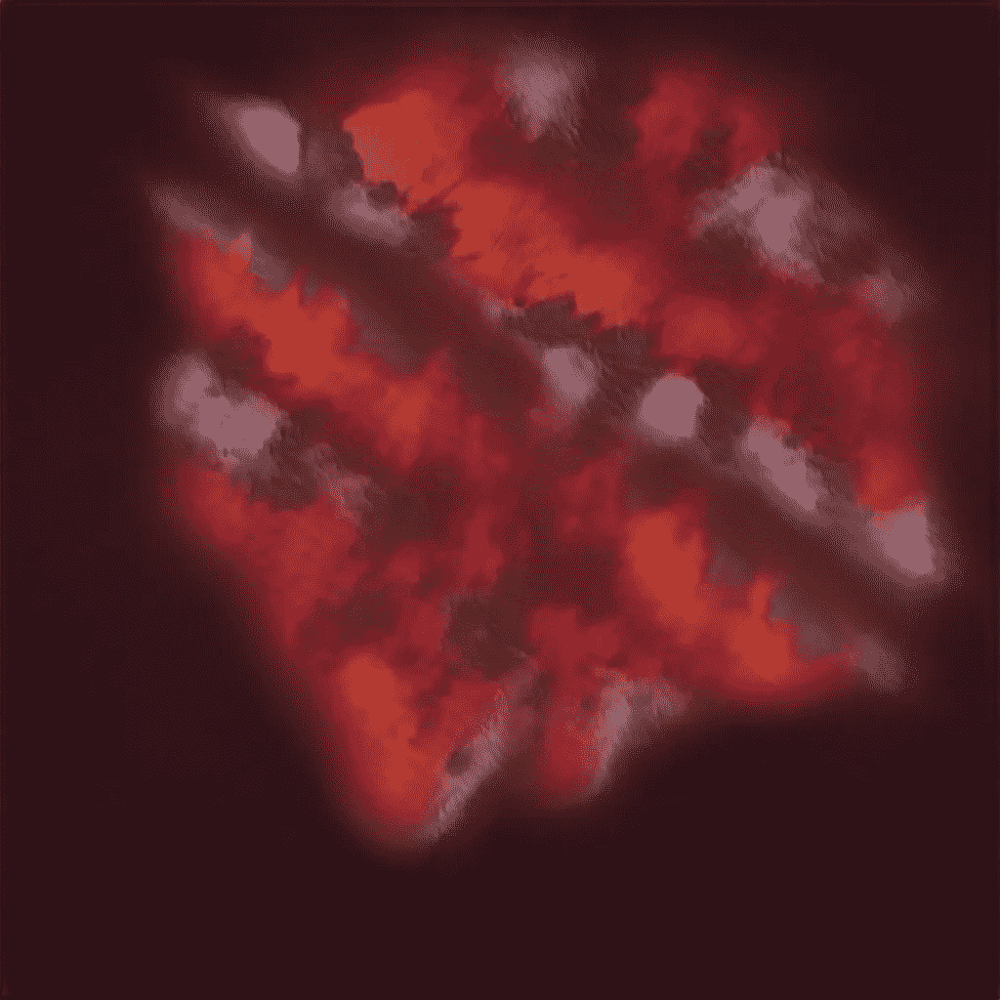
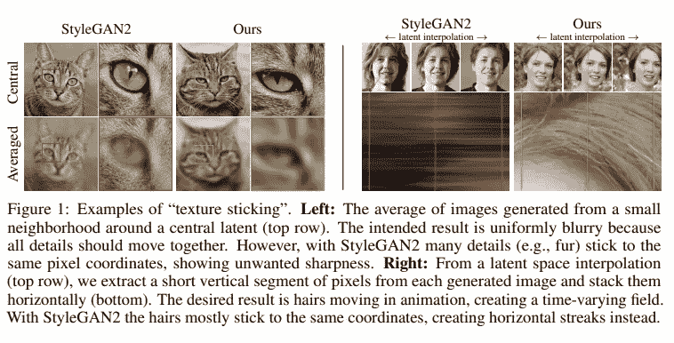
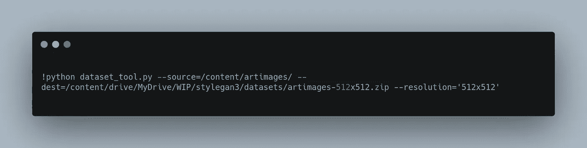
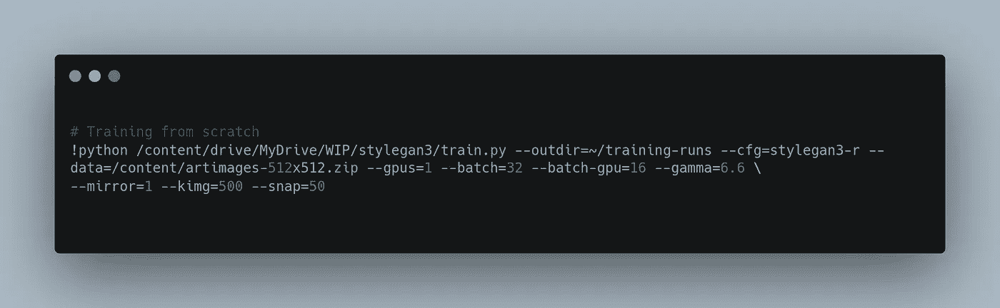
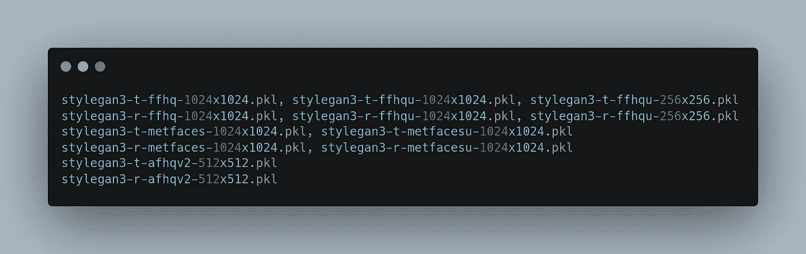
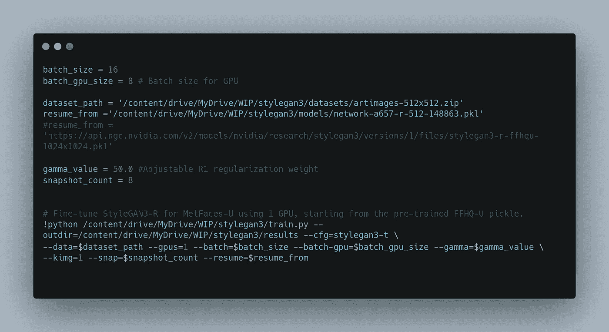
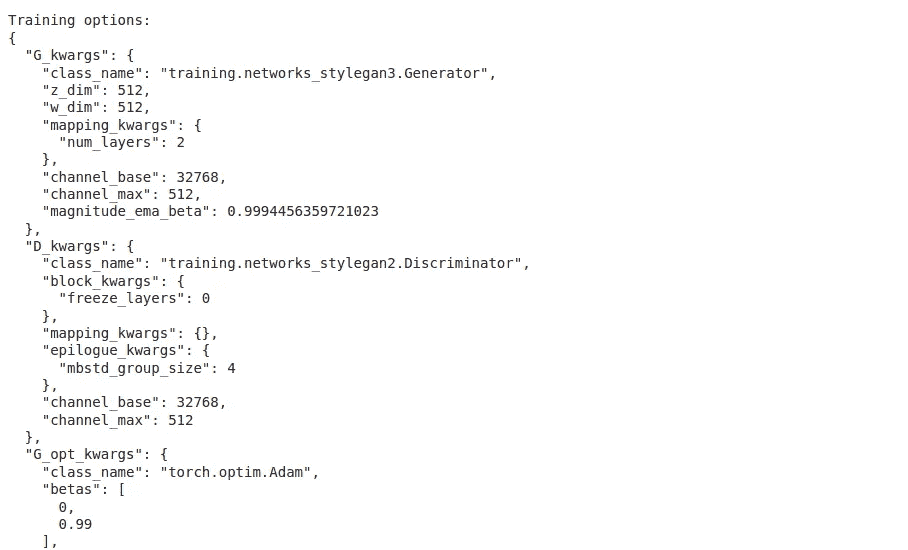
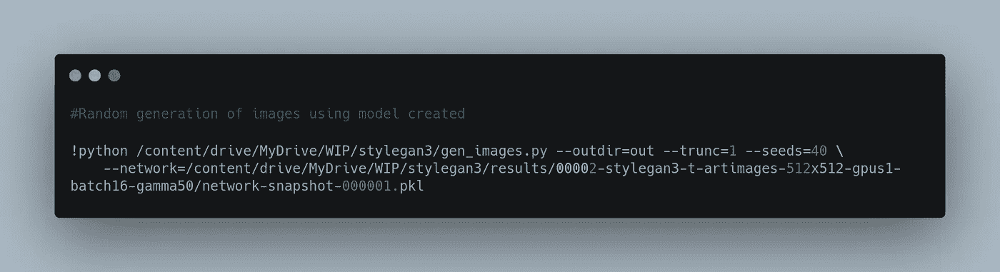
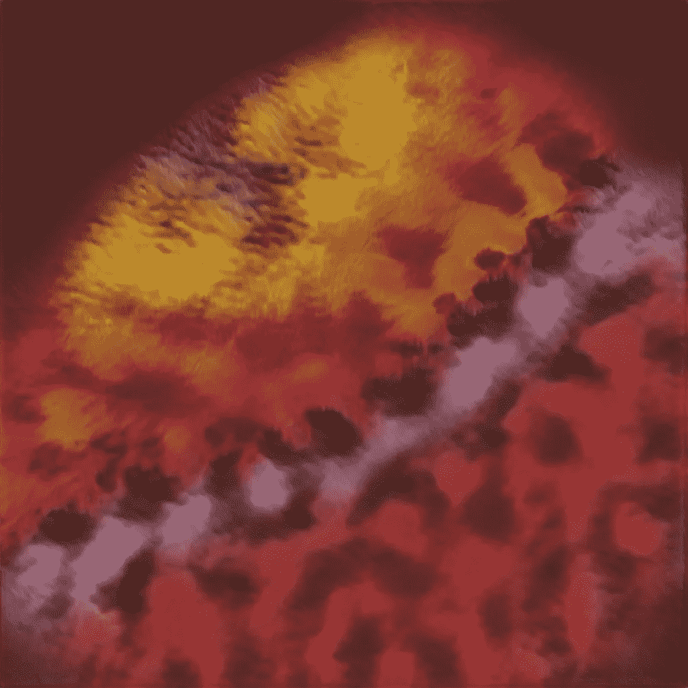

# 在 Colab | GAN 中训练风格 GAN |创建 NFT

> 原文：<https://levelup.gitconnected.com/training-a-stylegan3-in-colab-gan-create-nft-6dd119774644>

# 动机

我们已经知道[生成对立网络](https://en.wikipedia.org/wiki/Generative_adversarial_network)ks(gan)及其用途。NVIDIA 发布的流行 GAN 类型之一是 StyleGAN。最近他们发布了一个名为 StyleGAN3 的新版本。本文将介绍如何在 Google Colab 中微调 stylegan3，并创建新的图像/NFT 的艺术作品

作者的图像——现代艺术

# Stylegan3 有什么新功能？

Stylegan 以创造超现实质量的图像而闻名。它越来越多地用于生成艺术或任何高分辨率的图像。大多数图像是人脸或动物。

根据论文**他们在下面提到。检查粗体字。**

> **我们将根本原因追溯到**粗心的信号处理**，这导致了发电机网络中的混叠。将网络中的所有信号解释为连续的，我们得到普遍适用的、小的架构变化，保证不需要的信息不会泄漏到分层综合过程中。由此产生的网络与 **StyleGAN2 的 FID 相匹配，但其内部表示方式**存在显著差异，即使在亚像素级，它们也完全等变于平移和旋转。我们的结果为更适合视频和动画的**生成模型铺平了道路****

****

**通过评估，该团队在六个数据集(FFHQ-U、FFHQ、METFACES-U、METFACES、AFHQV2 和 BEACHES)上使用了 StyleGAN2 及其无别名 StyleGAN3-T 和 StyleGAN3-R 生成器。结果显示，StyleGAN3-T 和 StyleGAN3-R 在弗雷歇初始距离(FID)图像质量度量方面与 StyleGAN2 保持竞争力，同时还表现出非常高水平的翻译等价性。**

# **在 Google Colab 中训练**

**这些模型非常庞大，需要大量的 GPU。如果你要对模型进行预训练，你需要成为 Google Colab pro 或 pro+会员。它提供了更高的 GPU。**

**用 Colab 提供的 GPU 从头开始训练 StyleGAN 几乎是不可能的。此外，我们不应该试图从零开始训练它。这里，好消息是我们可以使用 StyleGAN2 中使用的任何预训练模型。所以你花在培养时尚达人上的时间没有白费。**

> **StyleGAN3 兼容使用 [stylegan2-ada](https://github.com/NVlabs/stylegan2-ada) 和 [stylegan2-ada-pytorch](https://github.com/NVlabs/stylegan2-ada-pytorch) 创建的旧网络 pickles。(注意:在 StyleGAN3 代码上运行旧的 StyleGAN2 模型将产生与在 style gan 2-ada/style gan 2-ada-py torch 上运行它们相同的结果。**
> 
> **为了从 StyleGAN3 架构中获得真正的好处，**你需要重新培训。****

**所以我们有以下选择。**

1.  **从头开始训练一个模型**
2.  **使用 NVIDIA 的训练在 stylegan2 中提供了预训练模型**
3.  **获取预训练的 stylegan2 模型，并在 stylegan3 上进行微调**

# **设置**

**我们将使用 google colab。我们需要 colab 和一些额外的包，并将其与 google drive 连接，因为有一个会话运行时间限制。**

# **预处理**

**代码带有数据集处理工具。我们需要提到转换后的 zip 文件的目的地，并提供分辨率作为参数。该型号支持 512x512 或 1024x1024 图像尺寸。**

****

**图像预处理**

# **模特培训**

**一旦有了输入数据集，我们就可以开始模型训练过程了。让我们看看一些必需的培训参数**

**outdir —保存结果的位置
cfg —模型的基本配置。可以是 stylegan3-t、stylegan3-r、stylegan2
数据—训练数据图像
gpu—要使用的 GPU 数量
批次—总批次大小
伽马— R1 正则化权重**

**有大量可选参数。我将要求你检查一下 **train.py** 的文档**

## ****从零开始训练一个模型****

**这个选项很简单，我们需要在没有简历的情况下用参数运行它。除非你知道自己在做什么，否则我不会推荐这种方法。**

****

**训练模型**

## **从预训练模型训练模型**

**在这里，我们将使用之前训练过的任何模型，并从 NVIDIA 模型开始。下面是提供的一些模型。**

****

**NVIDIA 提供的型号**

**要使用预先训练的模型，请使用以下方法。这里的 resume_from 是我们需要传递的参数。此外，kimg 是一个重要参数，它涉及 GAN 的总训练持续时间。**

****

**训练模型**

****

**模型训练日志。来源:作者**

## **生成图像**

**一旦你对模型进行了足够长时间的训练，我们就可以生成图像并进行检查。**

****

**生成图像**

****

**生成的图像**

**有了足够的训练和输入数据集，我们可以根据需要创建图像。**

# **最后的想法**

**在本文中，我们看到了如何使用 google colab 环境运行 stylegan3。生成的图像可以在 NFT 等各种地方使用，生成不同的对象，用例是无限的。**

# **密码**

**本文中使用的所有代码都可以在 G [oogle colab](https://colab.research.google.com/drive/1Nal3M-wjv6BeIgyTgvxhaccPFGEP6cbk?usp=sharing) 中找到。**

# **订阅**

***请订阅我的* [***简讯***](https://codesprout.substack.com/welcome) *获取我的* ***文章的更新以及我的文章的免费代码。*****

**我在不同的数据科学相关产品上写作，并通过应用程序尝试新代码。在 [LinkedIn](https://www.linkedin.com/in/shyambv/) 和 [Twitter](https://twitter.com/shyambv) 上联系我。**