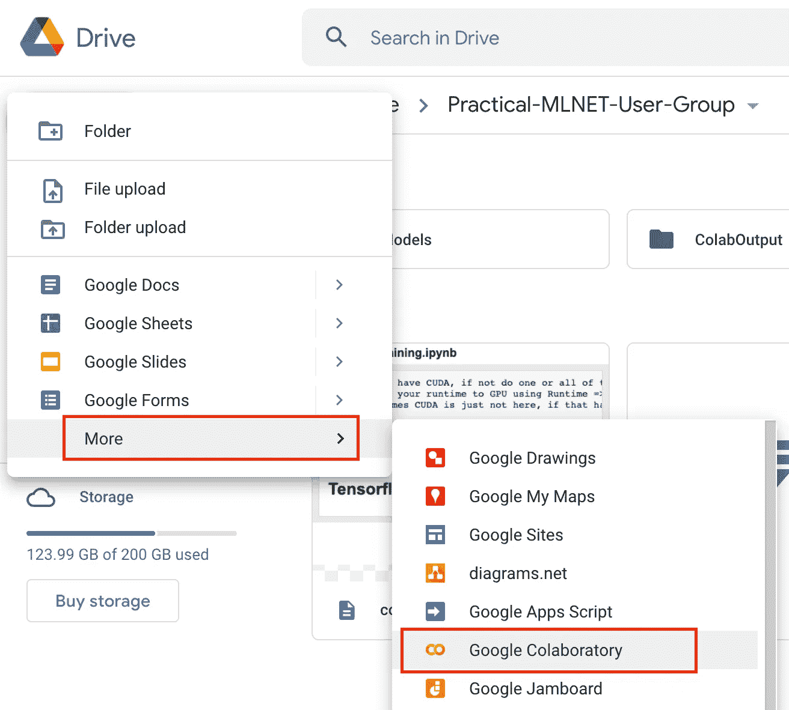
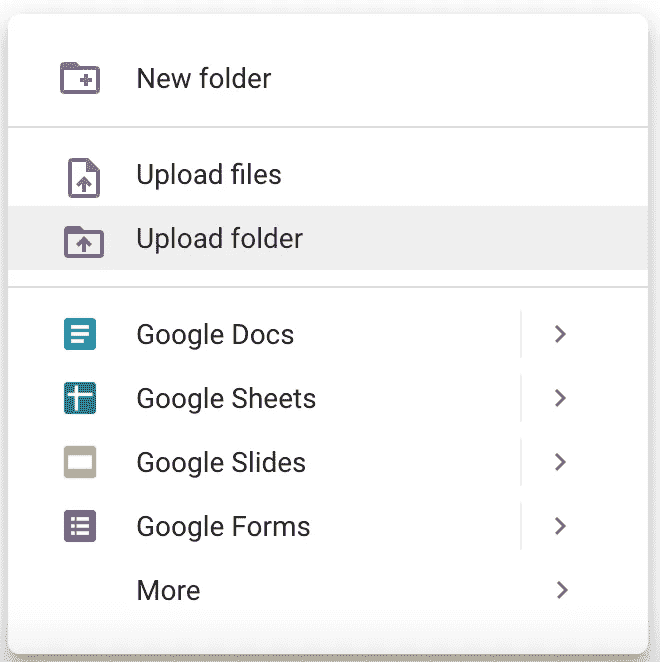
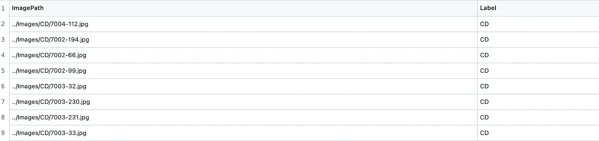
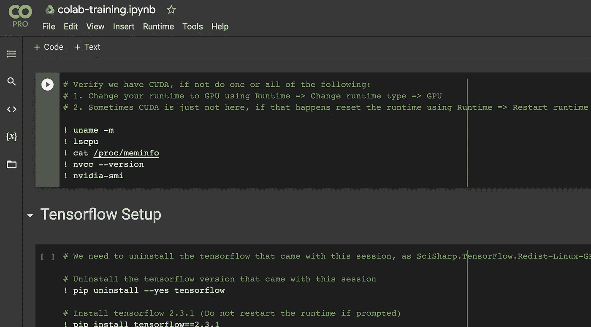
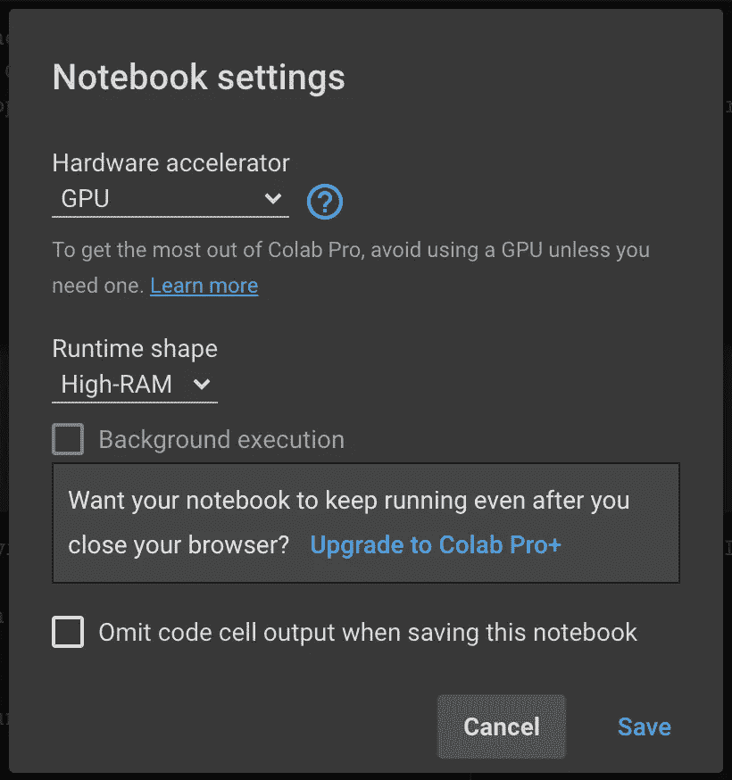
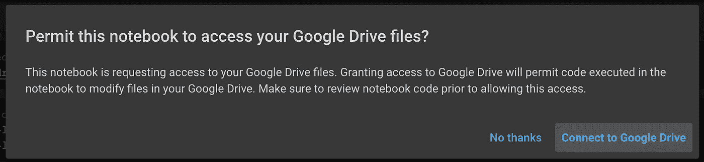
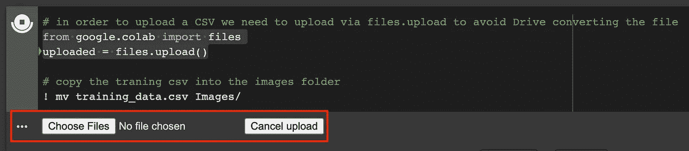

# 使用 Google Colab 在 GPU 上训练 Model 图像分类模型

> 原文：<https://levelup.gitconnected.com/training-an-ml-net-image-classification-model-on-gpus-using-google-colab-ee40b38af7e5>


如果你是一个 ML.NET 用户，并希望在 GPU 上训练你的模型，你可能会发现你有有限的易于使用的选项。如果你的台式机支持 Nvidia GPU 显卡，那么你很幸运！如果你碰巧在一个“普通”的台式机或笔记本电脑上，你会陷入 CPU 训练，这可不好玩。当然有一些选择，比如在云中运行虚拟机或者使用 Azure Machine Learning Studio 之类的服务，但即使这样，也有一些困难需要克服。在本帖中，我们将看看如何利用 Google Colab 不仅训练你的 ML.NET 模型，而且训练得更快。

这篇文章将直接探讨在 Colab 上运行 ML.NET。我们不会考虑您为什么要这样做，尽管有许多很好的理由说明 Colab 对您的 ML.NET 工作负载有意义。

你可以在[实用 ML.NET 用户群 YouTube 页面](https://www.youtube.com/channel/UCyLZieUSKFGLBOibC7xB1zg)找到这篇文章的完整视频。*请喜欢并订阅！* [GitHub 回购可以在这里找到](https://github.com/atkinsonbg/training-mlnet-using-google-colab-on-gpus)。

# ML。Google Colab 快速入门

Colab 与其他一些更受欢迎的免费机器学习平台略有不同，如 Kaggle 或 Gradient Notebooks。Colab 提供了一个稍微宽松的环境，这意味着我们可以安装。NET 和 ML.NET 合并成一个 Colab 会话。例如，这在 Kaggle 或 Gradient 中是不可能的。然而，不要认为你可以在那里安装任何东西。例如，你不能安装 Docker 和运行容器，所以它不是免费的。

如果你是 Colab 的新手，这非常简单明了。一切都是从你的谷歌驱动器上运行的，所以只需打开你的驱动器，从“新建”按钮，从下拉列表中选择“更多”选项，然后选择“谷歌协作”。



这将创造一个新的”。ipynb”笔记本，并在 Colab 中打开它。正在安装。NET 和 ML.NET 就像创建一个新的笔记本并运行以下命令一样简单:

```
! wget -q https://packages.microsoft.com/config/ubuntu/18.04/packages-microsoft-prod.deb -O packages-microsoft-prod.deb \&& dpkg -i packages-microsoft-prod.deb \&& add-apt-repository universe \&& apt-get update \&& apt-get install apt-transport-https \&& apt-get update \&& apt-get install dotnet-sdk-6.0 \&& dotnet tool install -g mlnet
```

这些命令将会安装。在我们的例子中是 NET。NET 6，以及最新版本的 ML.NET。这些应该会成功运行，然后您可以发出一个`dotnet --version`命令来确保一切正常工作。这非常简单，现在，您已经有了一个可以开始做的 Colab 环境。网络工作。例如，如果你只是想开始一些自动 ML 工作，你都准备好了。唯一的缺点是…您只能在 CPU 上这样做。我们希望利用 Colab 中可用的 GPU 的全部能力。因此，让我们深入探讨如何做到这一点。

# GitHub 报告和代码

我们使用的代码报告是来自。NET 机器学习样本 GitHub 报告。该代码基本上将混凝土表面的图像分为两类，有裂缝的和无裂缝的。这是一个简单的二元分类示例，他们的数据集中有大约 400 张图像。你可以[在这里](https://github.com/atkinsonbg/training-mlnet-using-google-colab-on-gpus)查看这个帖子的代码。

我们不会分解代码，因为这篇文章是关于在 GPU 上运行这些代码，而不是实际上写它需要什么。然而，在我的回购和微软的例子之间，你已经准备好学习更好的细节。

# **使用 GPU 的先决条件**

我们将在接下来的部分中简要介绍每个项目，一旦我们查看我们的 Colab 笔记本，您将再次看到它们，它在每个部分中都有详细的注释。

使用 ML.NET 对 GPU 进行培训有几个要求。如上所述，关于 CPU 的培训非常容易，只需安装 ML.NET 并开始。对于 GPU 来说，有几个困难需要克服，幸运的是它们不是太大。

## CUDA v10.1 和 CUDNN v7.6.4

在[图像分类文档](https://docs.microsoft.com/en-us/dotnet/api/microsoft.ml.vision.imageclassificationtrainer?view=ml-dotnet#gpu-support)中，你会发现第一个需求是 CUDA 和 CUDNN。您需要确保在您的环境中安装了 [CUDA v10.1](https://developer.nvidia.com/cuda-10.1-download-archive-update2) 和 [CUDNN v7.6.4](https://developer.nvidia.com/rdp/cudnn-download) 或更高版本。重要的是要注意，这些是最低要求，如果你有一个更高的版本是可以的。例如，在撰写本文时，Google Colab 已经安装了 CUDA 版本 11.2。从 CUDA 文档[来看](https://docs.nvidia.com/deploy/cuda-compatibility/)“驱动程序总是向后兼容 CUDA”。*同样重要的是要注意，这很可能仅在使用 ML.NET API 时出现，因为 Auto ML 似乎对 10.1 有要求，很可能是由于与其相关的* Tensorflow *的版本。*

## SciSharp。TensorFlow.Redist-Linux-GPU

Google Colab 在 Ubuntu 环境下运行，所以我们需要确保我们有正确的 [SciSharp。TensorFlow.Redist 包安装](https://github.com/SciSharp/TensorFlow.NET/tree/master/tensorflowlib#gpu-for-linux)。让我们看看代码的`.csproj`文件:

```
<ItemGroup>
    <!-- CPU version, use on MacOS or Windows without GPU card -->
    <!-- <PackageReference Include="SciSharp.TensorFlow.Redist" Version="2.3.1" /> --><!-- Windows GPU version, use on Windows with GPU card -->
    <!-- <PackageReference Include="SciSharp.TensorFlow.Redist-Windows-GPU" Version="2.6.0" /> --><!-- Linux GPU version, use on Linux with GPU card -->
    <PackageReference Include="SciSharp.TensorFlow.Redist-Linux-GPU" Version="2.5.0" ExcludeAssets="native" />
  </ItemGroup>
```

如你所见，我们引用了 SciSharp 的所有版本。TensorFlow.Redist，主要帮助支持本地开发以及在 Colab 中运行。所有其他版本都被注释掉了，除了`Linux GPU`包，我们需要构建它来在 Colab 中运行。

请注意包参考中的`ExcludeAssets="native"`。这说明。NET 不包括 Tensorflow 的任何版本。这样做的原因是，当您启动一个新的 Colab 会话时，您很可能会在您的环境中获得最新版本的 Tensorflow。在这篇文章发表的时候，我们得到了 Tensorflow 2.7。我们需要控制安装的 Tensorflow 的版本，以匹配 SciSharp 软件包的预期。当没有额外的二进制文件出现时，这样做更容易。我们将在稍后的 Colab 笔记本中对此进行更深入的探讨。

## Libtensorflow C 库

这些库是 SciSharp 正常运行所必需的，并且不会在您的 Colab 环境中自然存在。幸运的是，这些可以很容易地从 [Tensorflow 网站](https://www.tensorflow.org/install/lang_c)下载。一旦我们下载并安装了库，我们必须使用`ldconfig`配置链接器，并设置几个环境变量。

## libgdiplus & libc6-dev

[最后，我们需要确保安装另外两个包](https://github.com/SciSharp/TensorFlow.NET/tree/master/tensorflowlib#run-in-linux)来支持图像分类。幸运的是，libc6-dev 应该已经存在了，但是如果你想再次安装这两个程序，也不会有什么问题。

# 升级我们的代码

在我们深入研究 Colab 笔记本之前，让我们先来讨论一下如何将代码转移到 Colab 中运行。

## 使用 Google Drive

由于我们将使用 Google Colab，所以我们将代码存放在 Google Drive 中也就不足为奇了。正如我们之前看到的那样，从驱动器启动笔记本电脑非常容易，而且将我们的驱动器连接到我们的 Colab 会话也很简单，稍后我们将会看到这一点。你需要登录谷歌并打开你的硬盘。为您的代码创建一个新文件夹，并上传位于此处的笔记本。这是我们将用于代码的培训笔记本。

## 为 Linux 发布

我们需要为我们的 Linux 环境发布我们的训练代码。由于我们将四处移动代码(上传到驱动器)，我更喜欢使用单个文件发布。以下命令将在发布模式下发布单个文件，不带调试符号:

```
dotnet publish -o ColabOutput -c Release -r linux-x64 --self-contained true -p:PublishSingleFile=true /p:DebugType=None /p:DebugSymbols=false
```

这个命令还将发布到一个名为“ColabOutput”的文件夹中，这使得上传更加容易。只需进入驱动器中的新文件夹，右键单击任意位置，然后选择“上传文件夹”。



## 图像数据集

由于我们正在做图像分类训练练习，我们将需要图像！这个[例子需要的所有图像都在这里](https://github.com/atkinsonbg/training-mlnet-using-google-colab-on-gpus/tree/main/App/Data/Images)。这些直接来自。NET 深度学习示例，无需任何修改。只需压缩整个“图像”目录，其中包括 UD 和 CD 的子目录。将这个 zip 文件也上传到您的驱动器，因为我们稍后将在我们的 Colab 笔记本中需要它。

## 图像数据集 CSV

你可以在 repo 中找到一个 Jupyter 笔记本，它被用来创建我们的数据集 CSV 文件，或者简单地使用位于这里的[预建的一个](https://github.com/atkinsonbg/training-mlnet-using-google-colab-on-gpus/blob/main/App/Data/Notebooks/training_data.csv)。笔记本是所有图像及其标签的一个非常简单(非优化)的集合。生成的 CSV 有两列:ImagePath 和 Label。正如您在下面的 ImagePath 列中看到的，所有图像路径都有“../Images ”,所以在这个级别压缩整个“Images”目录很重要。



我们现在不需要将 CSV 上传到 Drive。这样做的原因是，任何通过 Google UI 上传到 Drive 的 CSV 文件都会自动转换成 Google Sheets 格式。这对我们的代码不起作用。幸运的是，Jupyter 笔记本提供了一种上传文件的方式，所以我们可以绕过这一步，轻松发布。

# Colab 笔记本

现在我们的代码已经发布，所有的数据都已经暂存，我们可以进入位于这里的[Colab 笔记本。一旦上传到你的硬盘上，只需右键点击并选择“打开方式= > Google 协同实验室”。这将在 Colab 中启动笔记本，如下所示:](https://github.com/atkinsonbg/training-mlnet-using-google-colab-on-gpus/blob/main/App/Data/Colab/colab-training.ipynb)



## 设置您的环境

在我们在本笔记本中进行任何操作之前，我们需要确保我们设置为使用 GPU。您可以从页面顶部的菜单中选择“运行时= >更改运行时类型”。这将打开如下所示的模式对话框:



在“硬件加速器”下，确保选择了 GPU。您应该有无(CPU)、GPU 和 TPU 的选项。我们需要 GPU，所以选择这个。注意:我使用的是 Colab Pro，它提供了“运行时形状”选项。如果你在免费版上可能看不到这个，但是如果你可以选择"高内存"，我的意思是…为什么不呢？

## 检查您的 CUDA 设置

我们需要做的第一件事是在我们的 Colab 会话中检查我们的 CUDA 设置，我们可以通过运行以下命令来完成:

```
! uname -m! lscpu! cat /proc/meminfo! nvcc --version! nvidia-smi
```

这将向我们展示的不仅仅是 CUDA 版本，如果这是您唯一想看到的，那么您可以简单地运行`! nvidia-smi`进行检查，如果一切安装正确，您应该会看到以下内容:

```
+-----------------------------------------------------------------------------+ | NVIDIA-SMI 495.44       Driver Version: 460.32.03    CUDA Version: 11.2     | |-------------------------------+----------------------+----------------------+ | GPU  Name        Persistence-M| Bus-Id        Disp.A | Volatile Uncorr. ECC | | Fan  Temp  Perf  Pwr:Usage/Cap|         Memory-Usage | GPU-Util  Compute M. | |                               |                      |               MIG M. | |===============================+======================+======================| |   0  Tesla P100-PCIE...  Off  | 00000000:00:04.0 Off |                    0 | | N/A   37C    P0    28W / 250W |      0MiB / 16280MiB |      0%      Default | |                               |                      |                  N/A | +-------------------------------+----------------------+----------------------+                                                                                 +-----------------------------------------------------------------------------+ | Processes:                                                                  | |  GPU   GI   CI        PID   Type   Process name                  GPU Memory | |        ID   ID                                                   Usage      | |=============================================================================| |  No running processes found                                                 | +-----------------------------------------------------------------------------+
```

从这些信息中，我们可以看到我们的 CUDA 版本 11.2，我们也可以访问特斯拉 P100 GPU。如果您没有得到这样的输出，只需进入菜单并选择“Runtime => Reset factory runtime”。这将清除您所做的一切，并重置您的 Colab 会话。这一步非常重要，因为有时环境会启动，CUDA 对您不可用。这是您希望立即发现并解决的问题，而不是在您准备运行培训代码时！

## 移除 Tensorflow 2.7 并安装 Tensorflow 2.3.1

如前所述，我们需要控制环境中安装的 Tensorflow 的版本。在撰写本文时，SciSharp 预计将安装 tensor flow 2 . 3 . 1 版。如果您没有安装 Tensorflow 或安装了不正确的版本，您将在训练过程中得到一个错误，即找不到 Tensorflow。因此，确保您安装了正确的版本非常重要。我们可以使用以下命令来实现这一点:

```
! pip uninstall --yes tensorflow! pip install tensorflow==2.3.1! pip install tensorflow-gpu==2.3.1
```

首先，我们卸载当前安装的 Tensorflow 版本，在我们的例子中是 2.7。一旦完成，我们安装 2.3.1 以及 2.3.1 GPU 版本。运行这些程序后，您可能会收到一条警告消息，提示您需要重新启动才能使用新的 Tensorflow 版本。您可以放心地忽略这一点。我们可以通过运行以下命令来验证这一点:

```
! pip show tensorflowimport tensorflow as tfprint(tf.__version__)print(tf.test.gpu_device_name())print("Num GPUs Available: ", len(tf.config.experimental.list_physical_devices('GPU')))
```

这些命令只是进行健全性检查，以确保安装了正确版本的 Tensorflow。运行这些命令应该会产生以下输出:

```
Name: tensorflow
Version: 2.3.1
Summary: TensorFlow is an open source machine learning framework for everyone.
Home-page: [https://www.tensorflow.org/](https://www.tensorflow.org/)
Author: Google Inc.
Author-email: [packages@tensorflow.org](mailto:packages@tensorflow.org)
License: Apache 2.0
Location: /usr/local/lib/python3.7/dist-packages
Requires: numpy, protobuf, keras-preprocessing, tensorflow-estimator, absl-py, astunparse, tensorboard, h5py, gast, grpcio, six, opt-einsum, wrapt, google-pasta, termcolor, wheel
Required-by: kapre
2.3.1
/device:GPU:0
Num GPUs Available:  1
```

如您所见，我们现在已经安装了版本 2.3.1，并且不需要重新启动我们的会话。这也表明我们有 1 个 GPU 可供使用。现在已经安装了 Tensorflow 的正确版本，我们可以继续了。

## libgdiplus & libc6-dev

如上所述，我们需要安装 libgdiplus & libc6-dev 来进行图像分类，这可以通过以下命令来完成:

```
! sudo apt install libc6-dev! sudo apt install libgdiplus
```

## Libtensorflow C 库

接下来，我们如上所述安装 Libtensorflow C 库。这可以通过以下命令完成:

```
! wget -q https://storage.googleapis.com/tensorflow/libtensorflow/libtensorflow-gpu-linux-x86_64-2.3.1.tar.gz! sudo tar -C /usr/local -xzf libtensorflow-gpu-linux-x86_64-2.3.1.tar.gz! sudo ldconfig%env LIBRARY_PATH=$LIBRARY_PATH:/usr/local%env LD_LIBRARY_PATH=$LD_LIBRARY_PATH:/usr/local
```

首先，我们简单地将压缩库下载到当前目录。接下来，我们将它们解压缩到`/usr/local`目录。你应该可以把它们放在任何你想放的地方，但是这个对我很有效。接下来，我们通过运行`ldconfig`来配置链接器，然后我们将`/user/local`添加到`LIBRARY_PATH`环境变量中，以便 Tensorflow 能够找到它们。至此，我们所有的 Tensorflow 设置都已完成，我们可以继续安装了。NET 和 ML.NET。

## 。NET & ML。网

我们已经看到了这些命令，但为了保持连续性，我们将再次查看它们:

```
! wget -q https://packages.microsoft.com/config/ubuntu/18.04/packages-microsoft-prod.deb -O packages-microsoft-prod.deb \&& dpkg -i packages-microsoft-prod.deb \&& add-apt-repository universe \&& apt-get update \&& apt-get install apt-transport-https \&& apt-get update \&& apt-get install dotnet-sdk-6.0 \&& dotnet tool install -g mlnet
```

# 暂存数据

接下来，我们需要将我们的训练数据转移到我们的 Colab 会话中。我们需要做的第一件事是通过运行以下命令将驱动器装载到会话中:

```
from google.colab import drivedrive.mount('/content/drive')
```

运行该命令将产生一个模式对话框，询问您是否希望允许访问您的 Google Drive 文件:



单击“连接到 Google Drive”选项开始 OAuth 尝试，在这里您需要选择您想要连接的 Google 帐户，并同意 Colab 连接所需的权限。完成后，我们现在可以将图像数据集解压缩到我们的会话中:

```
! unzip -qq /content/drive/MyDrive/YOUR_FOLDER/Images.zip
```

这是一个简单的`unzip`命令，通过`-qq`来避免任何输出，因为这取决于你拥有的图像数量，这可能会很繁琐。由于我们压缩了“Images”目录，这个命令将在我们的 Colab 会话中为我们留下一个相同的“Images”目录，其中包含我们所有的图像。为了进行健全性检查，我们可以对图像进行计数，以确保我们得到了预期的结果:

```
! ls Images/CD/ | wc -l! ls Images/UD/ | wc -l
```

在我们的例子中，这应该输出 200 & 200，因为我们总共有 400 个图像，每个文件夹中有 200 个。现在我们有了图像，让我们把 CSV 文件也放入 Colab。我们可以使用以下命令来实现这一点:

```
from google.colab import filesuploaded = files.upload()
```

这是上传您可能需要的任何附加文件的便捷方式，在我们的例子中，这是绕过 Google Sheets 对`.csv`文件转换的一种方式。运行此命令将打开以下选项来上传文件:



单击“选择文件”按钮，选择包含数据集数据的 CSV。上传后，我们现在需要将`.csv`文件移动到“图像”文件夹中:

```
! mv training_data.csv Images/
```

我们的培训代码希望 CSV 文件位于 Images 文件夹的根目录下，如果您未能移动它，一旦您开始培训，您将得到一个“文件未找到”错误。既然我们的图像和 CSV 文件已经暂存，我们现在可以暂存我们的代码。

# 准备代码

暂存代码非常类似于移动图像数据。由于我们的驱动器连接到我们的 Colab 会话，我们可以发出以下命令:

```
! rm -rf ColabOutput/! cp -a /content/drive/MyDrive/YOUR_FOLDER/ColabOutput/ .! chmod -R 777 ColabOutput/! ls ColabOutput/
```

让我们一个一个地分解这些:

*   首先，我们删除任何以前的暂存代码。在我们的例子中，我们在本地将代码发布到一个名为“ColabOutput”的输出目录中，这是我们将复制到 Colab 中的内容。为了干净和安全，我们发出一个`rm`命令来删除这个目录，如果它已经存在的话。
*   接下来，我们复制整个“ColabOutput”目录，这样对我们自己来说更容易。
*   我们必须执行一个`chmod`,否则当我们试图启动我们的训练代码时，会得到一个“权限被拒绝”的错误。
*   最后，我们用一个`ls`命令执行健全性检查，从视觉上确保我们的所有代码都通过了检查。

# 训练模型

现在我们的数据和代码已经准备好了，我们可以使用下面的命令开始训练:

```
! ./ColabOutput/App --train --folder="Images" --file="training_data.csv"
```

我们的应用程序是一个简单的控制台应用程序，我们可以按需运行来执行培训。我们使用 [CommandLineParser NuGet 包](https://www.nuget.org/packages/CommandLineParser)来简化参数的传递。在这种情况下，我们有以下论点:

*   `train`:这是基本命令，简单地指示代码执行训练。
*   `folder`:表示图像和 CSV 文件所在的目录。
*   `file`:提供 CSV 文件的名称，以防您想要提供具有不同数据的多个 CSV 文件等。

发出此命令将开始训练，我们希望查看一些关键细节，以确保 GPU 训练确实在进行:

```
2021-12-15 17:36:47.138748: I tensorflow/stream_executor/platform/default/dso_loader.cc:48] Successfully opened dynamic library libcudart.so.10.1
2021-12-15 17:36:47.174564: I tensorflow/core/platform/cpu_feature_guard.cc:142] This TensorFlow binary is optimized with oneAPI Deep Neural Network Library (oneDNN)to use the following CPU instructions in performance-critical operations:  AVX2 FMA
To enable them in other operations, rebuild TensorFlow with the appropriate compiler flags.
2021-12-15 17:36:47.188574: I tensorflow/core/platform/profile_utils/cpu_utils.cc:104] CPU Frequency: 2299995000 Hz
2021-12-15 17:36:47.188898: I tensorflow/compiler/xla/service/service.cc:168] XLA service 0x55c2b3c15d40 initialized for platform Host (this does not guarantee that XLA will be used). Devices:
2021-12-15 17:36:47.188924: I tensorflow/compiler/xla/service/service.cc:176]   StreamExecutor device (0): Host, Default Version
2021-12-15 17:36:47.190962: I tensorflow/stream_executor/platform/default/dso_loader.cc:48] Successfully opened dynamic library libcuda.so.1
2021-12-15 17:36:47.195377: I tensorflow/stream_executor/cuda/cuda_gpu_executor.cc:982] successful NUMA node read from SysFS had negative value (-1), but there must be at least one NUMA node, so returning NUMA node zero
2021-12-15 17:36:47.195571: I tensorflow/core/common_runtime/gpu/gpu_device.cc:1716] Found device 0 with properties: 
pciBusID: 0000:00:04.0 name: Tesla P100-PCIE-16GB computeCapability: 6.0
coreClock: 1.3285GHz coreCount: 56 deviceMemorySize: 15.90GiB deviceMemoryBandwidth: 681.88GiB/s
```

您应该会看到许多 Tensorflow 日志开始出现，以及一行关于代码所连接的 GPU 设备的内容。在这种情况下:

```
Tesla P100-PCIE-16GB computeCapability: 6.0
coreClock: 1.3285GHz coreCount: 56 deviceMemorySize: 15.90GiB deviceMemoryBandwidth: 681.88GiB/s
```

假设一切都已准备就绪，您应该开始看到培训日志被打印出来，最终，根据您拥有的数据量，将会构建一个模型。

代码会将最终模型放入名为`ud-cd-classifier.mdl`的“ColabOutput”目录中，您可以使用以下命令将它复制回您的驱动器:

```
! cp -a ColabOutput/ud-cd-classifier.mdl /content/drive/MyDrive/YOUR_FOLDER/Models/ud-cd-classifier.mdl
```

从这里开始，你的 Google Drive 中会有一个 ML.NET 图像分类模型，你可以下载并在任何你喜欢的地方使用它！

# 包装它

在这篇文章中，我们看到了如何利用谷歌 Colab 来执行与 ML.NET 的 GPU 培训。我可以诚实地说，我已经使用这个设置几个星期了，非常满意。肯定有一些困难要克服，但它们不是主要的，对于你所得到的来说，比麻烦更值得。我目前使用的是 Colab Pro，每月支付 10 美元的服务费。很高兴知道这是一个硬成本上限，我几乎可以随时进入并使用它。

这可能不是每个人的正确设置，但对于主要在 MacBook Pro 上工作的我(无法访问 GPU)，这是一个很好的训练选择。

## 参考

*   **谷歌实验室**——【https://research.google.com/colaboratory/ 
*   **ImageClassificationTrainer 类文档**—[https://Docs . Microsoft . com/en-us/dot net/API/Microsoft . ml . vision . ImageClassificationTrainer？view=ml-dotnet](https://docs.microsoft.com/en-us/dotnet/api/microsoft.ml.vision.imageclassificationtrainer?view=ml-dotnet)
*   **SciSharp/TensorFlow。NET Docs**—[https://github.com/SciSharp/TensorFlow.NET/tree/master/tensorflowlib](https://github.com/SciSharp/TensorFlow.NET/tree/master/tensorflowlib)
*   **为 C 文档安装 tensor flow**—[https://www.tensorflow.org/install/lang_c](https://www.tensorflow.org/install/lang_c)
*   **代码示例**—[https://github . com/atkinsonbg/training-mlnet-using-Google-colab-on-GPU](https://github.com/atkinsonbg/training-mlnet-using-google-colab-on-gpus)
*   **YouTube 演示文稿**—[https://www . YouTube . com/channel/ucylzieuskflboibc 7 XB 1 ZG/videos](https://www.youtube.com/channel/UCyLZieUSKFGLBOibC7xB1zg/videos)
*   **GitHub 关于 ExcludeAssets 的问题**—[https://github.com/dotnet/machinelearning/issues/871](https://github.com/dotnet/machinelearning/issues/871)