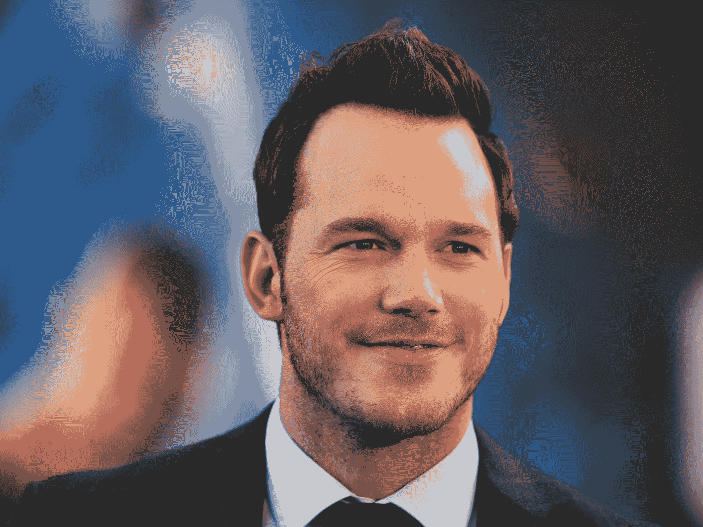

# 训练日:训练图像分类器

> 原文：<https://levelup.gitconnected.com/training-day-training-image-classifiers-97825ac4bfde>

## 计算机视觉导论，第 4 部分

到目前为止，我们已经讨论了[计算机如何“看到”图像](/pixels-arrays-and-images-ef3f03638fe7)、[算法如何检测图像中的对象](/haar-like-features-seeing-in-black-and-white-1a240caaf1e3)，以及[Paul Viola 和 Michael Jones 在 20 年前使用的一种巧妙的快捷方式](/the-integral-image-4df3df5dce35)，它大大减少了训练和运行他们的算法所需的时间和处理能力。我们还没有谈到的是算法如何学习区分对象。毕竟，对计算机来说，图像只不过是一组数字。它是如何分辨出一段数字是人脸，另一段是背景的呢？嗯，都在训练中！

# 直觉

一如既往，我们将从直觉开始。事实证明，训练图像分类器(例如，对象检测算法或模型)非常类似于教婴儿说话和识别对象。所以让我们以此为基础来建立我们的直觉吧！

## 婴儿的第一句话

见见莫蒂奇娅和戈麦斯·亚当斯！

图片来源:[media-amazon.com](https://m.media-amazon.com/images/M/MV5BMTQxNjEwNjkyOF5BMl5BanBnXkFtZTgwMTE3NjU5MTE@._V1_.jpg)

这对美丽的夫妇兴高采烈地看到他们可爱的小男孩普博特即将说出他的第一个单词！在父母的帮助下，他终于学会说“妈妈”。莫蒂奇亚和戈麦斯对他赞不绝口，而普伯特也很喜欢！

图片来源:[Pinterest.com](https://ar.pinterest.com/pin/351421577157025113/?amp_client_id=CLIENT_ID(_)&mweb_unauth_id={{default.session}}&simplified=true)

他太喜欢赞美了，以至于他开始一直说赞美的话！他捡起一块积木，自豪地喊道:“妈妈！”

当发现它很可爱时，莫蒂西亚温柔地说，“不，那是一块，”然后指着自己说，“妈妈！”

由于 Pubert 没有得到大量的赞扬，他本能地意识到自己犯了一个错误。他看着积木，看着他的妈妈。他看到他的母亲指着自己，重复他的词汇中的一个单词。然后他模仿他的母亲，向她伸出手，说:“妈妈”。莫蒂奇娅对他赞不绝口，现在她知道了“妈妈”并不是一个包罗万象的术语，而是一个人。

时光流逝，有一天，戈麦斯路过普贝特的游戏室。普伯特想从他父亲那里得到一些赞扬，所以他制造一些噪音来引起戈麦斯的注意。他伸出手宣布，“妈妈！”同样，这并没有得到他想要的赞扬。

戈麦斯开玩笑地说，“不，不是‘妈妈’，”像他之前的莫蒂西亚一样，指着自己说，“哒哒！”这让小普伯特很困惑。他知道“妈妈”是一个人的标签。看到他的父亲具有一个人的所有*特征*，当然“妈妈”这个标签也适用于他。那么，为什么他没有得到表扬呢？

为了帮助他的儿子，戈麦斯抱起小男孩，打电话给孩子的母亲。他指着他的妻子说，“妈妈”，然后指着自己，重复新单词“哒哒”。

普博特看着他的母亲说，“妈妈，妈妈，”并得到了表扬。他研究她的脸和身材。他回头看着他的父亲，做了同样的事情。正是在这个时候，他开始注意到他的母亲和父亲有不同的特点。莫蒂奇娅身材修长，头发很长。他爸爸中等身材，短发，脸上连毛都有！考虑到这些(相当普遍的)差异，普伯特看着他的父亲说，“哒哒！”他的父母欣喜若狂，用爱浇灌着他。这个男孩不仅把“哒哒”这个词添加到了他不断增长的词典中，而且他还知道了“妈妈”是一个长着黑色长发的苗条的人的标签，“哒哒”是一个留着短发和小胡子的人的标签。

随着时间的推移，普伯特见到了他的妹妹，星期三。她是一个苗条的女孩，留着长长的黑发，所以他叫她。“妈-妈！”他大叫。星期三叫来了他们的母亲，他们一起教他说出他姐姐名字的原始形式，“Wez-day”他又一次得到了他想要的赞美和喜爱。

然后他回头看着他的母亲说，“Wez-day”，以为这个新词只是又长又黑的头发的苗条的人的另一个标签。莫蒂奇娅纠正他说，“不，妈妈！”然后，她把他的注意力引向他的妹妹，像以前一样，说:“星期三。”

就像他在学习“哒哒”这个词时一样，普伯特研究着他的妹妹，试图辨别出她有哪些独特的特征。他注意到星期三比他们的母亲更矮，看起来更年轻。他喊道，“Wez-day”，然后每个人都庆祝！

生活还在继续，普伯特还有很多这样的教训，直到他最终知道“妈妈”是留给他妈妈的标签，“爸爸”是留给他爸爸的，等等..

这是一个相当长的类比，但让我们快速分析一下发生了什么:

1.  普伯特学会了“妈妈”这个词，但并不真正理解这个词的意思。他只知道说出来会得到回报。
2.  因为他不懂事，所以他把一个玩具积木叫做“妈妈”。他的母亲纠正了他，他得知“妈妈”是对*人的称呼。*
3.  后来，他称他的父亲为“妈妈”，因为他的父亲具有一个人的所有品质(特征)。戈麦斯和莫蒂奇娅一起教他“哒哒”这个词，经过一些研究，普伯特了解到他的母亲和父亲之间有一种*差异*，并将这些差异与他们各自的标签联系起来。
4.  然而，普伯特发现*称呼某人为“妈妈”时很重要的*特征仍然过于笼统，他最终也这样称呼他的妹妹。然后，他必须找出什么特征是他妹妹独有的，并提炼出什么特征是用来定义“妈妈”的。

随着普伯特接触的人越来越多，他会从错误中学习，研究是什么让他的母亲与周围的人不同。这个故事对父母来说可能听起来非常相似，因为这是教孩子说话的一个常见过程。好吧，伙计们，信不信由你，但这几乎就是我们训练图像分类器时发生的事情。我们编辑了一大组我们希望算法识别的目标对象的图像，以及不是目标的图像。该算法研究所有的图像，在某种意义上，对它们进行比较，以确定是什么将目标与其他目标区分开来。它一遍又一遍地重复这个过程，直到确定目标对象的*最重要的特征*是什么。

在我们深入细节之前，我们应该学习回顾一下图像分类中的一些关键术语。这些术语是:

True-Positive:分类器正确地识别并标记目标对象(Pubert 看到他的母亲并说:“妈妈”)。

正误:分类器正确地识别出图像不是目标对象(Pubert 看到他的父亲，知道他不是他的母亲，并说，“Dada”)。

假阳性:分类器错误地将一个非目标对象标记为目标(Pubert 看到他的妹妹，叫她“妈妈”)。

假阴性(False-Negative):分类器错误地将目标对象标记为非目标(Pubert 称他的母亲为“Wez-day”)。

抛开这些不谈，让我们深入研究一下图像分类器是如何训练的。

# 准备

你需要图像。很多图像。具体来说，您需要两组图像。一组应该是你希望你的算法检测到的目标物体的图像，你会希望它们在各种设置中显示出来。当我说“设置”时，我的意思是图像不应该都来自相同的背景，在完全相同的角度，用相同的照明，和相同的距离拍摄。一般来说，它应该是不同的，因为在实践中，目标对象很少(如果有的话)处于完全相同的环境中。如果您的所有或大部分图像都是在这种无菌环境下拍摄的，这也会对训练过程产生巨大的影响，这一点我们很快就会谈到。

第二组应该包含任何图像。这一组的整个要点是帮助算法了解目标对象*不是什么*，并缩小目标特有的特征。如果你真的想很好地训练你的算法，大多数(如果不是全部)图像应该与目标对象有相似之处。例如，如果您想创建一个可以检测沃尔玛的算法，您会希望在这个集合中包含 Best Buy、Target 和其他商店的图片。通过这种方式，算法可以了解到沃尔玛不仅仅是一座大型水泥建筑。

## 图像数量

至于每套图像的数量，就看你有多少时间和资源了。图像分类器，如谷歌的 Xception 模型，是在 ImageNet 数据集上训练的，该数据集包含超过 1400 万张图像。这有很多图像，即使有顶级的硬件，也要花很长时间来训练。Viola-Jones 算法在近 5000 张人脸和约 5000 张非人脸上进行了训练。如果你想要一个可靠的模型，你需要每套几百个。此外，强烈建议大致均匀分布(例如，目标图像和非目标图像各占一半)。

## 标记

在每一组图像中，都应该标记图像，以表明它们是否是目标对象的图像(例如，“沃尔玛”或“非沃尔玛”)。虽然这可能会令人痛苦地麻木，但这是至关重要的一步，因为这两个集合将被合并。如果没有标签作为答案，算法将无法评估其预测是否正确。标记数据确保算法的预测是可靠的，并最大限度地减少误报和漏报的数量。

## 图像变换

就像我们在以前的课程中说过的，图像从彩色转换为灰度。无论是训练还是实践都是如此。这使得数学更简单，并有助于算法运行更快。

执行的另一个变换是重新缩放图像分辨率。这通过减少适合图像的 Haar 类特征的总可能数量来降低计算复杂度。Viola 和 Jones 将他们的图像缩小到 24x24 像素，每张图像仍然包含超过 180，000 个特征。然而，这种转变只能在训练中完成。在算法被训练之后，它所使用的图像保持相同的分辨率，但是特征和它们的权重(下面将详细描述)被放大。

## 创建训练集和测试集

标记完所有的图像后，您可以将图像集混洗在一起。经过洗牌后，你将制作一套用于训练，一套较小的用于测试算法。其原因是，一旦算法或机器学习模型经过训练，它就能够识别训练它的数据，因此，它已经知道要预测什么。通过在训练完成后保留一小部分数据(验证或测试集)用于评估，我们能够了解算法实际执行的准确性，因为它以前从未见过这种特定数据。

# 培养

让我们再次参考 Viola-Jones 算法来讨论训练。所以在训练期间，模型被输入各种人脸和非人脸图像。它映射出每张图像中所有可能的 Haar-like 特征，并预测图像中是否包含人脸。假设它首先从乔治·克鲁尼的这张照片开始:

图片来源:[Today.com](https://www.google.com/search?q=george+clooney&tbm=isch&ved=2ahUKEwjs5M6alf7uAhWLoFMKHRPOCvcQ2-cCegQIABAA&oq=george+cloo&gs_lcp=CgNpbWcQARgAMggIABCxAxCDATIFCAAQsQMyBQgAELEDMgUIABCxAzIFCAAQsQMyBQgAELEDMgUIABCxAzIICAAQsQMQgwEyCAgAELEDEIMBMggIABCxAxCDAToECCMQJzoCCAA6BAgAEEM6CggAELEDEIMBEENQncEPWPHmD2D_8A9oAXAAeACAAVqIAeYHkgECMTKYAQCgAQGqAQtnd3Mtd2l6LWltZ8ABAQ&sclient=img&ei=y_0zYKzTA4vBzgKTnKu4Dw&bih=1323&biw=1278#imgrc=yDbDiYNYf372mM)

这是它看到的第一张图片，而且几乎没有其他东西可以模仿。它绘制出图像中类似哈尔的特征，并毫无理由地预测“脸”(有点像婴儿的第一句话)。它是正确的，所以算法对自己说，“好的，我正在寻找看起来完全像这样的东西！”因此，它为该图像中的每一条边、线和四个矩形特征分配了一个**权重**。一个“权重”只是一个数字值，表示**功能有多重要。数字越大，该特性越重要。**

还需要注意的是，当我说每个特性时，我指的是每个特性！在这一点上，对于未经训练的算法，可能检测到的每个单个 Haar-like 特征(即使在背景中)都是公平的游戏。在我们这里的假设场景中，不仅 Georgie boy 的面部被认为是面部，甚至模糊的背景也被认为是面部。为什么？因为，就像一个婴儿，算法不知道任何更好的。这是它迄今为止看到的唯一图像。因此，背景被认为和真实的脸一样重要。

它看到的下一张图片是这样的:

图片来源:[Eater.com](https://www.eater.com/2019/8/9/20799131/seagull-beach-food-stealing-stare-it-in-the-eye)

出于某种奇怪的原因，编辑这些布景的人包括了这幅海鸥的图像。它与克鲁尼照片中的哈尔相似的特征非常少，因此，该算法预测“不是脸”。因为它是正确的，所以算法不会改变它对什么是脸的看法(目前是乔治·克鲁尼的单张照片)。不会因此调整任何权重。这就是为什么在训练中使用的非目标图像应该与目标图像有相似之处。这增加了假阳性的几率。这导致算法对特征权重进行调整，并重新考虑什么特征对最小化假阳性最重要。

它看到的下一张照片是克里斯·帕拉特的照片:

图片来源:[Independent.co.uk](https://www.independent.co.uk/news/people/17-rich-and-famous-people-who-were-once-homeless-a7350941.html)

虽然这肯定比海鸥的照片与克鲁尼的照片有更多的共同特征，但请记住，在这一点上，算法认为“脸”是乔治·克鲁尼的照片，背景模糊(该照片中的每个特征目前都同等重要)。因此，假设我们的算法会预测这不是一张脸。嘣！我们的第一次假阴性！现在，该算法会查看两幅图像有哪些相似之处，并调整它认为最重要的特征的权重。由于每张图片都有模糊的背景，我们会说我们的算法已经注意到两张图片都清晰地勾勒出了头部和肩部，并认为，“好吧，这个形状一定是一张脸。”它调整这些特征的权重，并认为它们是最重要的。

然后它看到了这幅画:

图片来源:[海莉·帕特森](http://haleypatterson.weebly.com/project-3-final-images.html)

我们有了之前看到的轮廓的所有特征，并且由于调整了其他权重，该算法现在有了一点解释的回旋空间，所以假设它预测了“脸”。嘣！假阳性！它对脸仅仅是人体轮廓的定义过于笼统(很像普伯特一开始对“妈妈”的定义)。现在算法重新评估。这又回到了克鲁尼和普拉特共有的特征。他们都有眼睛！也许眼睛是最重要的特征！因此，它会相应地调整权重，并移动到下一张照片。

图片来源:【teenvogue.com 

嗯，这个人没有眼睛，所以不可能是脸！它预测“不是脸”。又一个假阴性。同样，算法重新评估和决定，因为他们都有鼻子，这必须是什么定义了一张脸！

好吧，所以不是鼻子的问题。都是肤色比较浅的！

图片来源:[兰斯·里迪克](https://twitter.com/lancereddick)

你可以明白我的意思。这就是为什么你需要这么多不同的图片来训练。如果所有的目标图像都是相同的，那么该算法只有在完全相同的情况下才有效。然而，通过多样化的训练集，该算法可以学习什么是脸，什么不是脸，并调整在图像中寻找什么样的特征组合，以最小化得到假阳性或假阴性的概率。就像我们类比中的婴儿一样，算法会发现越来越多目标对象独有的特征。

# 摘要

虽然涉及到更多的数学知识(我们将在下周讨论)，但训练图像分类算法的整个过程是非常直观的，本质上几乎是人性化的。