# 在不到 5 分钟的时间内为自定义图像训练 Google Inception

> 原文：<https://levelup.gitconnected.com/training-google-inception-for-custom-images-in-less-than-5-minutes-4a1e136691ab>

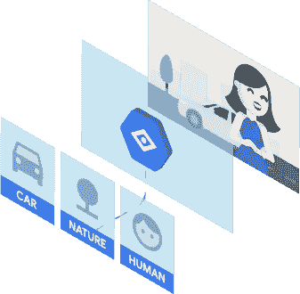

[https://cloud . Google . com/images/products/vision/powerful-image-analysis-isometric . png](https://cloud.google.com/images/products/vision/powerful-image-analysis-isometric.png)

寻找训练你的第一个自定义图像分类器的快速教程？那么 Google Brain 的 Inception API 可以在比喝完一杯咖啡更短的时间内做到这一点。

在本教程中，我将向您展示如何为初始模型创建瓶颈。瓶颈基本上是预训练模型上的自定义层，其神经元数量少于其下的其他层。

在本教程中，我将训练盗梦空间来分类和识别 4 个超级英雄，即(蜘蛛侠，超人，蝙蝠侠和神奇女侠)

这是该系列的第二个教程，如果你还没有读过第一个，请点击这里查看[链接。](https://medium.com/@ankit.bhadoriya/a-ready-to-go-image-classifier-with-transfer-learning-66cca2285342)

好的，让我们从这个项目开始。

## **先决条件:-**

1)**Python**(>>v 3.0)

2) **Tensorflow** (本教程我用的是 v1.7)

您可以使用以下命令下载它。

`**pip install tensorflow**`

而且可以升级到 1.7v

`**pip install --upgrade"tensorflow==1.7.*"**`

3) **Git** (在您的系统上安装“Git”，因为我们将在教程中使用 Git bash)

4)当然，我们需要图像(我们需要大量图像，图像越多，准确性越高。)

为此我使用了 Chrome 扩展( **Fatkun batch** )，你可以在 YouTube [视频](http://(https://www.youtube.com/watch?v=yDLwLo0wKLQ))上看到它的教程，非常简单。

5)最后是一个[回购](https://github.com/googlecodelabs/tensorflow-for-poets-2)，它带有你需要的所有脚本。

我们将执行以下步骤来获得结果:-

## 1.从上面的链接下载[回购](https://github.com/googlecodelabs/tensorflow-for-poets-2)。(我已经将回购文件放在了“(C :) drive”中)

现在制作图像类别的文件夹，并将它们放在 **(tf_files)** 文件夹中。

我在**“TF _ files”**中创建了一个名为**“Super”**的文件夹

然后我把我的图片的标签文件夹放在**【超级】**文件夹里。

a.*C:>tensor flow-for-poets-2>TF _ files*

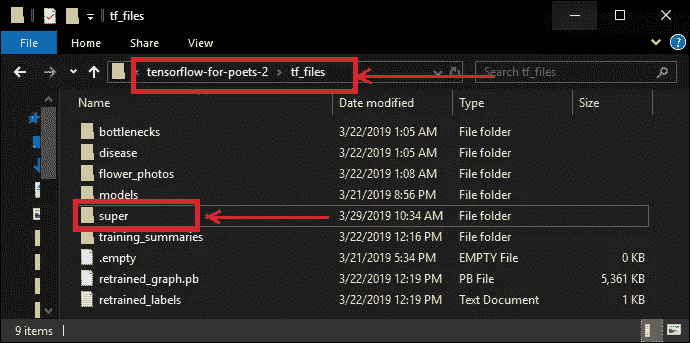

*C:>>tensor flow-for-poets-2>>TF _ files*

b.

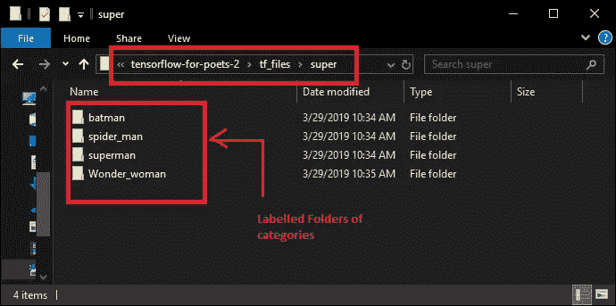

a.c:> > tensor flow-for-poets-2 > > TF _ files > > Super

标签文件夹中的图像。同样，你可以放入任何类别的图片，并给它们贴上适当的标签来训练一个瓶颈。

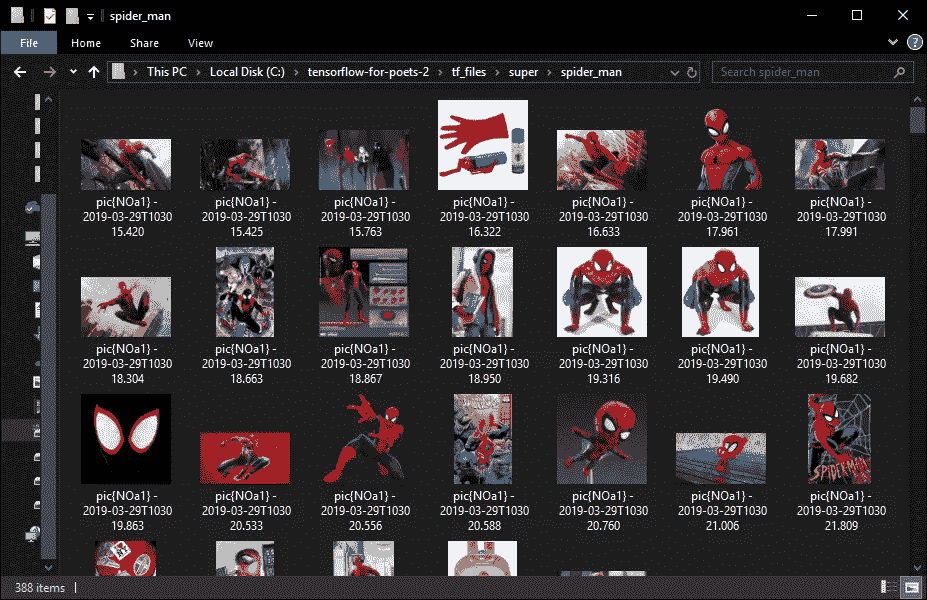

图像集文件夹

## 2.在 GIT Bash 中访问项目目录

现在我们完成了这个，打开你的**“GIT BASH”**

**"tensorflow-for-poets-2"** 文件夹，或者您可以在桌面上打开它并导航到该文件夹。

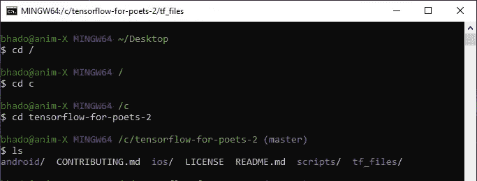

在 git bash 中导航到目标文件夹

## 3.访问再培训. py

一旦你进入文件夹(C:/ tensorflow-for-poets-2)

现在我们将使用**“retrain . py”**脚本来重新训练初始模型。

让我们配置一下[**MobileNet**](https://research.googleblog.com/2017/06/mobilenets-open-source-models-for.html)**。**

(MobileNet 是一个小型高效的卷积神经网络)。

**有两种配置方式。**

输入图像分辨率:128、160、192 或 224px。(*输入更高分辨率的图像会花费更多的处理时间，但会产生更好的分类精度*。)

模型的相对大小为最大 MobileNet 的几分之一:1.0、0.75、0.50 或 0.25。我们将使用 224px 和 0.5。

`**IMAGE_SIZE=224**`

`**ARCHITECTURE="mobilenet_0.50_${IMAGE_SIZE}"**`

4.这一步是可选的。(如果你有足够的好奇心去了解整个过程是如何实施的，并且你希望看到实施的图形、图表和可视化，你应该继续这一步)。

在后台启动**冲浪板**

```
**tensorboard --logdir tf_files/training_summaries &**
```

*( TensorBoard 是 tensorflow 附带的监控和检查工具。)*

## 5.现在我们将运行 ***retrain.py*** 脚本

```
python -m scripts.retrain \--bottleneck_dir=tf_files/bottlenecks \--how_many_training_steps=500 \--model_dir=tf_files/models/ \--summaries_dir=tf_files/training_summaries/"${ARCHITECTURE}" \--output_graph=tf_files/retrained_graph.pb \sim--output_labels=tf_files/retrained_labels.txt \--architecture="${ARCHITECTURE}" \--image_dir=tf_files/super
```

我们已经定义了在 TF _ file/throttle 中创建瓶颈的路径

在下一行中，我们已经定义了将要执行的步骤数。如果删除此行，默认值为 4000 training_ steps。

类似地，我们提供了创建 retrain_graph.pb、retrained _ labels.txt 的路径

在最后一行，我们将图像目录定向为位于 **tf_files 中的文件夹“ **super** ”。**

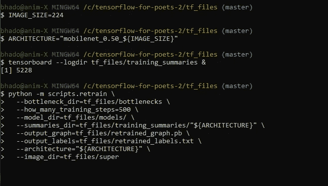

git bash 中访问和执行 retrain.py 的命令

一旦你执行这个程序块，再训练将开始。

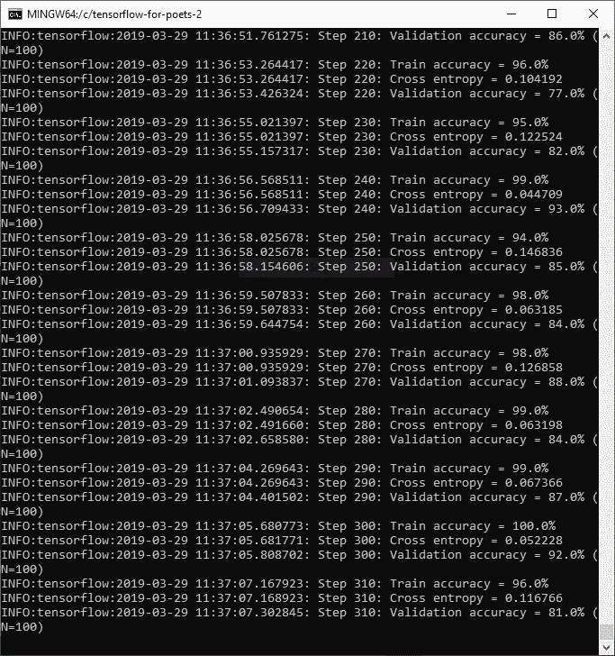

用于提高瓶颈精确度的多个时期。

这需要一段时间。如果它突然停在某个图像上，也不用担心。只需删除图像并再次运行上述代码。

最后，如果一切顺利，你会看到这样的东西

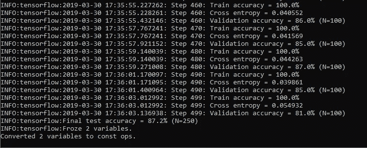

对于 500 个时期(训练步数),准确率为 81.0%

在这里，我只使用了 500 步训练，你可以增加它的精确度。

通过 500 步，我已经达到了 87.92 %的准确率。

## 6.测试

这是最后一步，让我们根据我们的类别测试随机图像的模型。

为了测试，你只需要使用“label.py 脚本”。

将您要测试的图像放在 tf_files 文件夹中。

并确保您给出了正确的名称和图像扩展名。

例如:flower.jpg、superman.jpg 等。

```
**python -m scripts.label_image \****--graph=tf_files/retrained_graph.pb  \****--image=tf_files/{ image_name. (extension) }**
```

以下是我取得的一些成果。

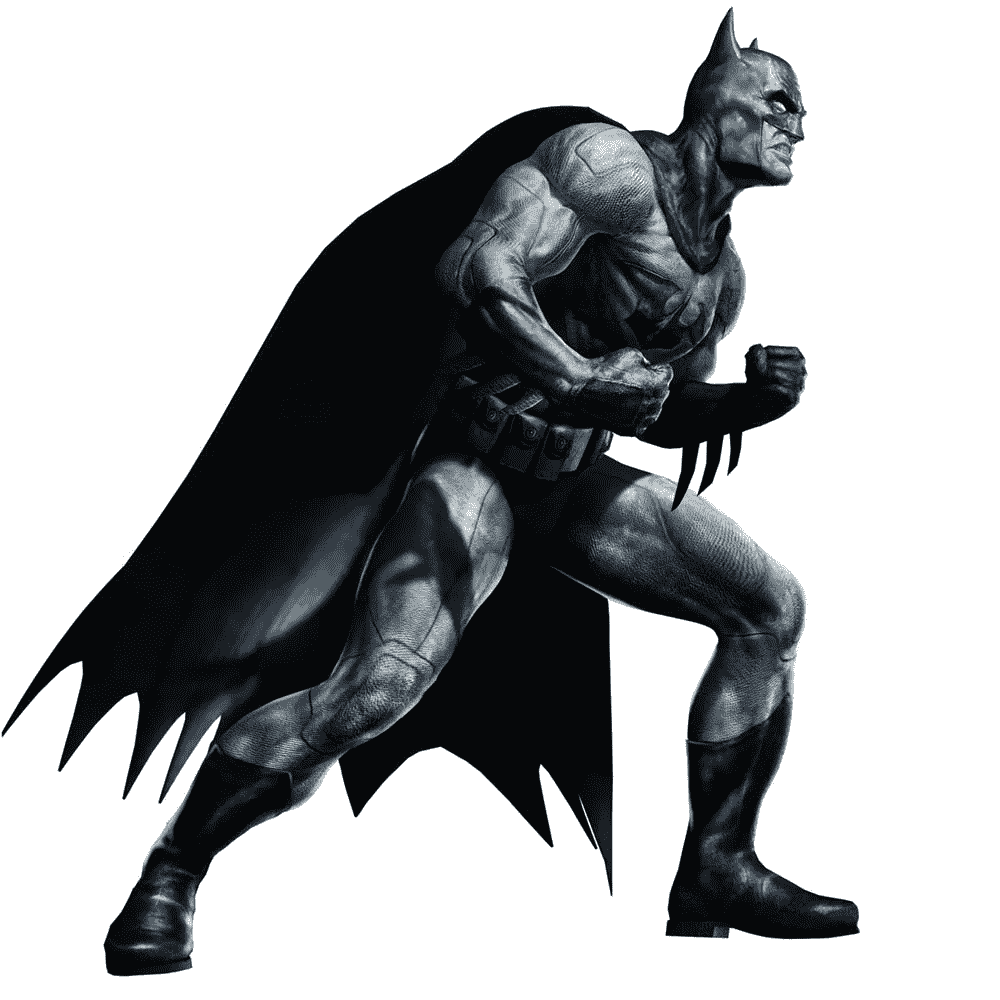

[图片 _ 网址](http://www.cartoonswallpapers.net/batman/batman-image-lumia/)

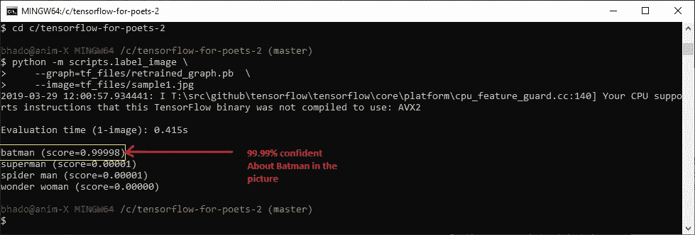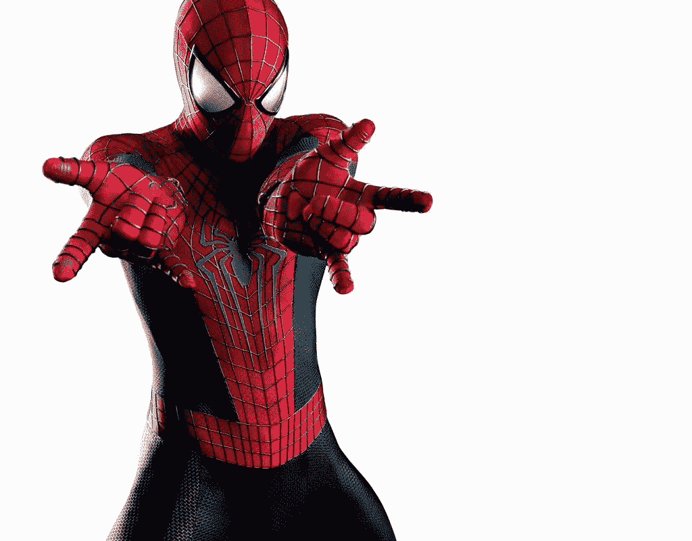

[图片 _ 网址](http://2.bp.blogspot.com/-GK-d4hSfzjk/Ukw87_olUzI/AAAAAAAAClo/VHUh2XS2ebA/s1600/Amazing+Spiderman+2+Desktop+Wallpaper.jpg)

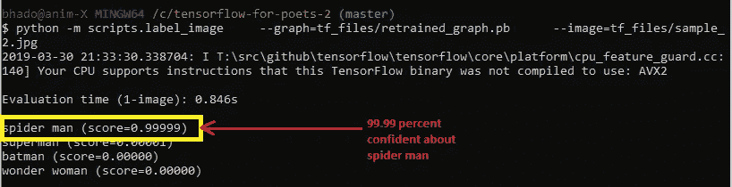

蜘蛛侠图像的结果

所以结果相当不错。现在已经为训练过程创建了图形和图表，您可以去查看在您的 loclhost 端口 8080 上运行的 tensorboard。

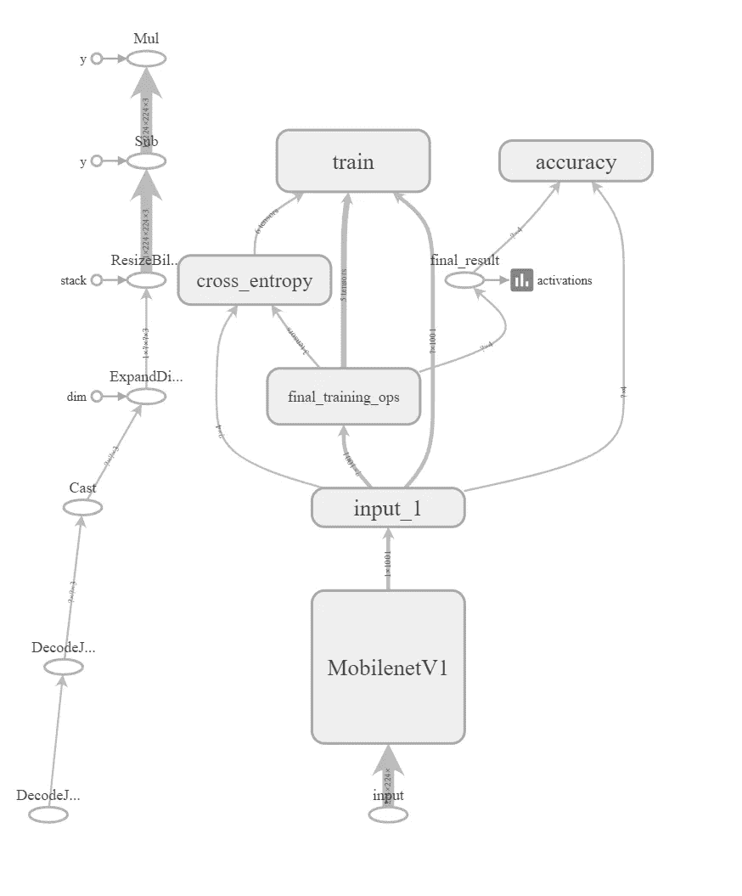

使用 Tensorboard 可视化操作，访问训练瓶颈时生成的图表。

**精度曲线图**

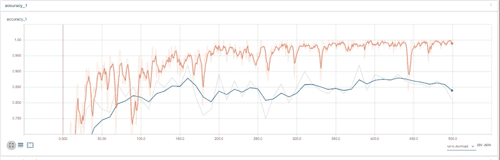

本教程到此结束。我希望你会尝试它，如果你遇到请回来给我你的疑问😊。

[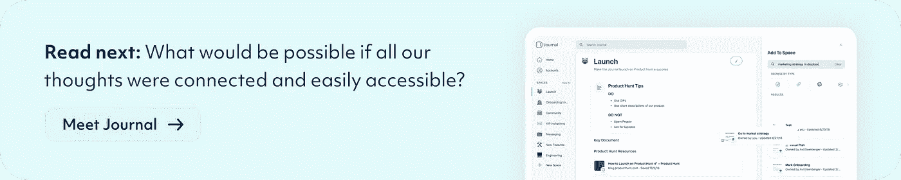](https://usejournal.com/?utm_source=medium.com&utm_medium=noteworthy_blog&utm_campaign=guest_post_image)

📝稍后在[杂志](https://usejournal.com/?utm_source=medium.com&utm_medium=noteworthy_blog&utm_campaign=guest_post_read_later_text)上阅读这个故事。

🗞每周日早上醒来，你的收件箱里会有本周最值得关注的科技故事、观点和新闻:[获取值得关注的时事通讯>](https://usejournal.com/newsletter/?utm_source=medium.com&utm_medium=noteworthy_blog&utm_campaign=guest_post_text)