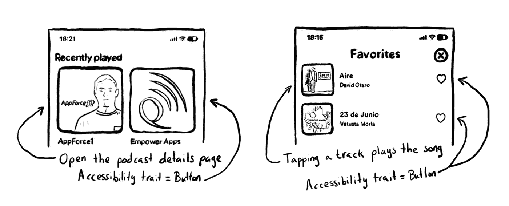
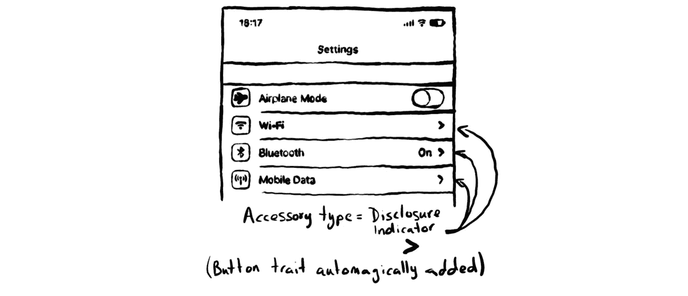
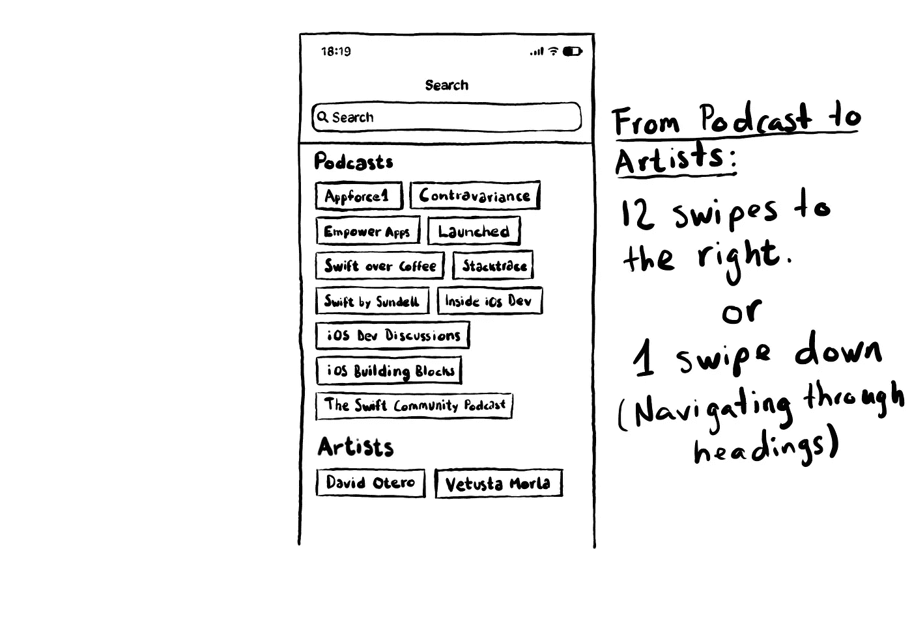
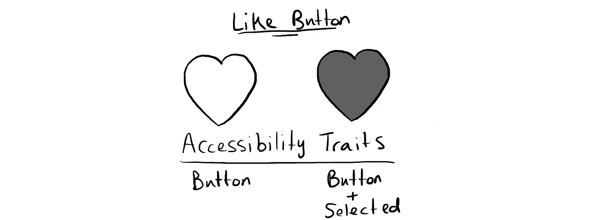
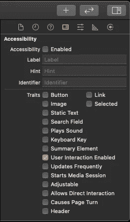

# 一个好的可访问的 iOS 应用程序的特征

> 原文：<https://levelup.gitconnected.com/traits-of-a-good-accessible-ios-app-25266ee08fb9>

您可能知道可以用可访问性标签来配置 UI 组件。可访问性标签是组件的名称。您还可以配置一个可访问性特征。可访问性特征是组件的角色，它为用户提供了如何与组件交互的信息。使用 VoiceOver 时，特征通常在可访问性标签后发声。

应用程序中的每个 UI 控件都有一个 accessibilityTraits 属性(这是 UIAccessibility 协议的一部分)。在底层，它是一个位掩码，定义了哪些不同的可访问性特征可以更好地描述 UI 组件。请原谅，这比听起来容易。

在写这篇文章的时候，有 17 种不同的特性可以用来定义你的 UI 控件。按钮、选中、未启用、可调整…都是一些例子。你可以在苹果的文档中找到完整的列表。但有时，在文档中理解这些特征的真正含义，或者它们如何影响用户体验可能并不简单，所以我认为写一些关于它们的内容是个好主意。

您可以组合这些特征中的一个以上来定义单个组件。为了方便在 Swift 中操作可访问性特征，该属性符合 OptionalSet 协议，该协议符合 SetAlgebra one。这意味着您可以使用像插入和移除这样的操作来更改定义组件的特征。

这可能很容易理解为什么你会插入或添加一个特征。但是去掉它们呢？你为什么要这么做？我们将看到一个带有“选择”特征的例子。

在我们开始之前，我认为这是一个很好的时机来提及，如果您使用 UIKit 组件，很多时候事情将会正常工作，不需要配置额外的可访问性特征。所以请尽可能地依赖原生 UI 组件。

# **按钮**

它让用户知道，当组件拥有 VoiceOver 的焦点时，他们可以通过在屏幕上的任何地方双击来与它进行交互。它还告诉交换机控制它是一个交互组件。一个 *UIButton* 在默认情况下具有按钮特征，那么你为什么需要给一个控件赋予按钮特征呢？

按钮特性经常被忽略的一个最常见的例子是表/集合视图中的一些单元格。很多时候，单元格是触发一个动作的“按钮”，比如播放一些音乐，或将用户带到应用程序中的另一个屏幕。

插入按钮可访问性特征。

左图:带有按钮特征的集合视图单元格。右图:具有按钮特征的表格视图单元格。

但是，如果单元格具有公开指示器附件类型，则不需要添加按钮特征。那样的话，iOS 会为你添加特质…魔法！

具有公开指示器附件类型的单元格不需要可访问性按钮特征。

也有一些应用程序从普通 UIViews 创建自定义按钮组件。他们这样做的一个原因是给按钮添加动画，当它被点击时。

# **表头**

可能是最重要的一个，因为它经常帮助用户以更直观和更快的方式导航应用程序。

从视觉上看，标题有助于快速识别信息组，这样我们就可以快速跳转到我们感兴趣的内容。VoiceOver 用户也可以这样做。通过使用转子，只需在屏幕上向下/向上轻扫一下，您就可以浏览标题并直接跳到屏幕上的下一个/上一个标题。

若要启用转子，当 VoiceOver 打开时，在屏幕上旋转两个手指，就像试图转动一个看不见的旋钮一样。转子将出现在屏幕上，让您在许多导航模式和定制之间进行选择。

使用转子实现航向导航

假设您正在使用 VoiceOver 浏览图片中显示的屏幕。有一个话题云，标题写着“播客”，上面有 11 个条目。下一个话题云是给艺人的。如果没有配置标题，用户必须向右轻击 12 次才能找到艺术家。通过配置标题，用户只需向下滑动一下就可以到达那里。

浏览标题需要一次滑动，从播客标题到艺术家标题。否则用户需要向右滑动 12 次才能到达那里。

为了让用户浏览你的应用程序中的标题，你所要做的就是插入*。header* trait 应用程序中代表标题的任何标签或视图。这就是我所说的速战速决！

# **链接**

这一点可能有点令人困惑，特别是如果你来自 web 开发世界，在那里按钮和链接之间有明显的区别，这似乎并不总是适用于 iOS 应用程序。按钮特性通常是为触发某个动作而配置的，但也是为把用户带到应用程序中其他地方而配置的。链接特征通常适用于打开一些网页内容的东西，它通常出现在内容中，并由带下划线的文本表示。

# **搜索字段**

它不同于文本域，因为它不仅让用户知道他们可以输入一些文本，而且它可能会触发一些变化，在他们输入时显示新的结果。

# **可调**

对于可以改变它们所保存的值的 UI 组件。一个很好的例子是一个评级 UI 组件，它的值可以调整为 1 个拇指向上，2 个拇指向上… 5 个拇指向上。它有时也用在旋转木马上，所以你可以上下滑动来选择旋转木马上的一个项目，向右滑动来跳到屏幕上的下一个元素。大多数时候，我认为旋转木马有标题是一个更好的解决方案。在 [BBC 的设计&工程媒体刊物](https://medium.com/bbc-design-engineering)上有一篇关于这个话题的很好的[博文](https://medium.com/bbc-design-engineering/adding-voiceover-to-carousel-components-3c5e2607fe84)，作者[汉娜·比林斯利-达德](https://medium.com/u/74bbba8c3765?source=post_page-----25266ee08fb9--------------------------------)。

自定义评级 UI 组件的示例。从 1 个拇指向上到 5 个拇指向上。

可调也有点特殊，因为仅仅配置特质可能还不够。要使它正常工作，还需要一个额外的步骤，您需要覆盖并实现 *accessibilityIncrement()* 和 *accessibilityDecrement()* 函数，以指定当用户通过向上/向下滑动来增加/减少组件的值而与组件交互时的行为。

您可以通过向上或向下滑动来指定值需要增加或减少的量。

*UISliders* 默认情况下是可调的，但是您可以使用*accessibilityIncrement()*和*accessibilityDecrement()*来指定滑块的值应该增加或减少多少。想象一个从 0 到 1000 的滑块。你可能不想把它递增 1，100 乘以 100 可能更合理。

# **选中**

有些元素可以选择，也可以不选择。例如，表格视图中的单元格有可能被选中。在这些情况下，您可以使用 selected trait 让用户知道该元素已被选中。它通常用于充当开关的按钮，可以有开或关的状态。

like 按钮具有按钮特性。当它被选中时，我们还会将选中的特征添加到它的可访问性特征中。

但是记住，如果它没有被选中，你也需要删除选中的特征。

# **频繁更新**

这对于更改标签或值的视图很有用，并且您希望在焦点在组件上时更新用户。我认为下载进度条就是一个很好的例子。如果没有这种特性，用户在登陆时只会听到组件的价值。有了这个特征，可访问性特征会不时地轮询更新，并向用户通告任何变化。

下载进度条的示例，该进度条通过。更新频繁可访问性特征。

# **无**

不是很有趣，只是对重置组件的可访问性特征有用。

重置视图的可访问性特征。

# 还有更多！

**未启用**:它使 VoiceOver 在辅助功能标签后说“变暗”，指示用户该组件已被禁用，他们目前不能与之交互。

**开始媒体会话**:如果一个按钮的目的是开始播放一些音乐或视频，这个特性会导致你一与它互动，VoiceOver 通知就会停止。**播放声音**产生类似的效果。

**键盘键**:可用于自定义键盘键，如仅包含数字的自定义 pin 键盘。虽然它阻止 VoiceOver 说出 button，所以可能不太理想。

**允许直接交互**:如果您有一个控制不适合 VoiceOver 的手势，您可以允许用户直接与之交互。我想这类似于当用户启用直接触摸输入模式时发生的事情。在这种情况下，触摸键盘中的一个键会导致该键被激活，而不是需要首先选择它，然后双击它。

# **面向界面构建爱好者**

如果您使用界面构建器来构建应用程序的 UI，您可以配置辅助功能特征，就像“身份”检查器中的许多其他辅助功能属性一样。

界面构建器中的辅助功能配置

# **一言为定！**

我希望这有所帮助，并且你已经在这篇文章中确定了你的应用程序中的一些 UI 控件，它们可能是配置这些特性的很好的候选。我想听听你的意见。你愿意分享你的应用中的例子吗？你认为我错过了什么重要的事情吗？这篇文章中有什么你不知道并且现在可能开始使用的可访问性特征吗？你可以在 Medium post 中写下你的评论/问题/反馈，或者在 Twitter 上用 [@dadederk](https://twitter.com/dadederk) 联系我。感谢阅读！

如果您已经是使用 SwiftUI 的幸运者之一，那么您通常拥有等同的属性和修饰符来添加和删除元素的特征。要了解更多，我完全推荐[罗布·惠特克](https://medium.com/flawless-app-stories/swiftui-accessibility-traits-5fee4b56c272)的这篇博文。

# 资源

[开发可访问的 iOS 应用](https://www.apress.com/gp/book/9781484253076)作者[丹尼尔·德弗萨·德克森-斯塔茨](https://twitter.com/dadederk)

你可以在我的书《开发可访问的 iOS 应用》中找到所有这些技巧，还有更多。

有以下版本可供选择:

*   亚马逊:【https://amzn.to/2PDr9cs 
*   学徒:[https://www.apress.com/gp/book/9781484253076](https://www.apress.com/gp/book/9781484253076)
*   apple Books:[https://Books . apple . com/GB/book/developing-accessible-IOs-apps/id 1490937769](https://books.apple.com/gb/book/developing-accessible-ios-apps/id1490937769)
*   或者你最喜欢的网上书店。

以及我的书《回购》中一些有用的可访问性代码示例:[https://github.com/Apress/developing-accessible-iOS-apps](https://github.com/Apress/developing-accessible-iOS-apps)