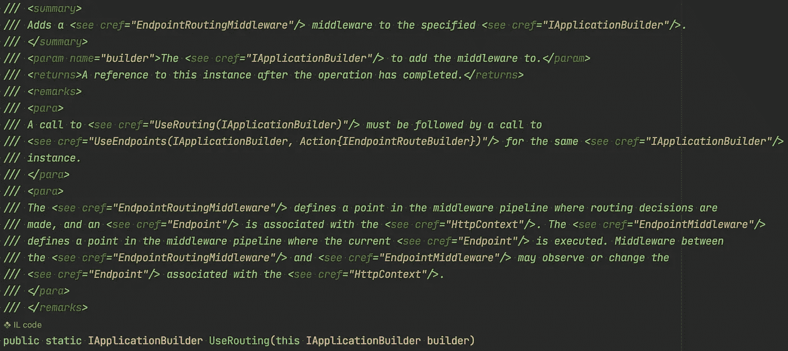

# 伟大的开发人员做对了什么

> 原文：<https://levelup.gitconnected.com/traits-of-the-best-developer-ever-80cf17bcf6b0>

## 建议和意见

## 对设计有敏锐的眼光，优雅地运用模式和方法的人。

尼克拉斯·米勒德的图片。

戴着蓝光眼镜参加满是会议的日子，一手拿着披萨片，一手拿着哑铃，在内啡肽和保持健康之间达到完美的平衡，你想知道最好的开发人员是如何完成工作的。

秘密是，他知道编码只是任何解决方案的最后一英里。

我们都认识一位工程师，他似乎对所有人的问题都有答案，或者更重要的是，他知道如何找出答案。

确切知道如何处理您所面临的困难问题的人，或者可以优雅地对复杂领域建模，并以可读、可理解和可维护的方式实现逻辑的人。

尽管这可能很难，但我会尝试分析有史以来最好的程序员的特征。

## 商业第一的思维模式。

了解业务是任何开发人员的首要工作。

最好的开发人员会开发解决方案并编写代码，他知道这些方案和代码会给企业带来积极的好处。知道了*是什么*和*为什么*就能轻松实现*如何*。

当你知道哪些内部代码质量值得欣赏时，编写优秀的代码就变得更加容易。如果某个特定特性的性能没有被优先考虑或没有必要，那么最好的开发人员不会努力开发出性能最好的代码。

## “一切都是物体”的心态。

最优秀的开发人员显然拥有面向对象的方法，并遵循“一切都是对象”的原则他使用领域模型通过创建概念蓝图来捕捉复杂性，这些概念蓝图是通过领域背景的透镜来观察世界的。

编码是最后一项活动，只有在对领域、其事件以及不同部分如何交互有了透彻的理解之后才能进行。

常见问题通过[裁剪已知的设计模式](/simple-strategy-pattern-using-attributes-880c55988215)来处理，允许它们毫不费力地实现。

“一切都是对象”是一种完美的思维方式，它有助于轻松创建可理解和可维护的应用程序。 [Each else-if 和 switch case 被提取到自己的类中](/replacing-if-else-with-commands-and-handlers-527e0abe2147)。[隐式依赖悬浮到显式](/dependency-injection-has-made-developers-lazy-255afc5bedf7)，接口优先于具体类。对灵活代码的追求永无止境。

## 坚持不懈地接受新任务。

最好的开发人员唯一害怕的任务是那些很少被理解的任务。那些了解不多的问题需要立即得到澄清。假设业务需求总是一个糟糕的想法。

最好的开发人员不会羞于安排与业务人员的会议。尽管意识到了这种耻辱，但当工程师同事们阅读了最新的和伟大的博客帖子时，他们会发出类似“开发人员不应该参加会议”这样的废话。

[项目范围的重构轻而易举](https://betterprogramming.pub/refactoring-rules-of-thumb-for-beginners-to-become-experts-70161c3c4f20):在那里提取一个类，在这里实现一个接口，用一套漂亮的设计模式将混乱变得有序。

每一次重构活动都会让代码库保持一种更干净的状态。

## 有风格有目的的评论。

最好的开发人员不会相信代码必须是自文档化的童话。代码很少是自文档化的。[需要评论](/yes-your-code-need-comments-a96348bf3fb7)。

文档在很大程度上是关于一段代码“为什么”存在，而一个完美命名的类、方法或变量所能捕获的上下文也就那么多。

他不评论语言语义、句法，甚至不评论一个三元变疯。他非常尊重他的同事，认为他们知道如何阅读代码。另一方面，对推理和意图的评论是经过深思熟虑的。每个人都没有相同的思维模式和领域经验。两者都需要理解*为什么*一些代码存在。

下面这个完美的方法说明了我的观点。

aspnet 核心源代码中的完美注释方法。

编写好的代码文档注释需要时间。但是门外汉需要更长的时间来理解为什么有些代码存在。

**Nicklas Millard** 是一名软件开发工程师，供职于一家发展最快的银行，负责构建任务关键型金融服务基础设施。

此前，他是 Big4 的高级技术顾问，为商业客户和政府机构开发软件。

> [新的 YouTube 频道(@Nicklas Millard)](https://www.youtube.com/channel/UCaUy83EAkVdXsZjF3xGSvMw)
> 
> *连接上* [*LinkedIn*](https://www.linkedin.com/in/nicklasmillard/)

任何笑话都有一定的道理。