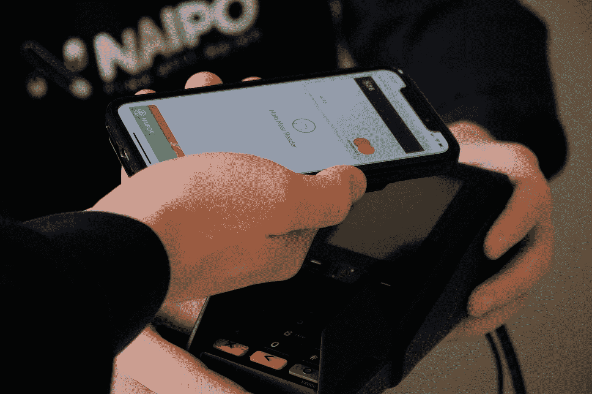

# MS SQL 中的事务隔离级别:后端开发人员终极指南

> 原文：<https://levelup.gitconnected.com/transaction-isolation-levels-in-ms-sql-guide-for-backend-developers-6a5998e34f6c>

照片由 [naipo.de](https://unsplash.com/@naipo_de?utm_source=medium&utm_medium=referral) 在 [Unsplash](https://unsplash.com?utm_source=medium&utm_medium=referral) 上拍摄

选择正确的事务隔离级别是关系数据库设计和开发过程中的一个重要部分，因为它消除了大量的并发问题。

在本文中，我们将重点关注那些使用锁来解决并发问题的事务隔离级别，比如未提交读、提交读、可重复读和可序列化。

[共享(S) vs 排他(x)锁](#4808)
[读未提交](#2a4a)
∘ [脏读问题](#8261)
∘ [读未提交 vs NOLOCK 表提示](#673c)
∘ [什么时候使用读未提交？](#ac08)
[读提交](#7fdb)
∘ [读提交如何解决脏读问题？](#f296)
∘ [不可重复读取问题](#8955)
∘ [丢失更新问题](#b494)
[可重复读取](#21d4)
∘ [可重复读取如何解决不可重复读取问题？](#db97)
∘ [可重复读取如何解决更新丢失问题？](#6eef)
∘ [幻影读取问题](#5ba2)
[可序列化](#647c)
∘ [可序列化如何解决幻影问题？](#4333)
[总结](#ba66)

# 共享锁与独占锁

理解关键的区别，至少是共享锁(S)和排他锁(X)之间的区别，对于理解事务隔离级别是很重要的。

*   读操作(SELECT)获取资源(行、键、表、页等)上的共享锁。)在读取数据之前。
*   数据修改操作(插入、更新、删除)会在修改数据之前获取独占锁。
*   即使资源已经有另一个共享锁，也可以为该资源获取共享锁。一个资源可以有任意多的共享锁，因为并行读取是一种安全的操作。
*   只有当资源还没有共享锁或排他锁时，才能为其获取排他锁，以确保一次只有一个事务可以修改数据。
*   如果无法获取共享锁或独占锁，事务将一直等到锁被释放(不适用于 shapshot 隔离级别)。

# 未提交读取

顾名思义，这种事务隔离级别允许一个事务读取已被另一个事务修改但尚未提交的数据。

Read uncommitted 是 MS SQL Server 中最低的隔离级别，可以导致所有可能类型的并发现象:

*   脏读
*   丢失的更新
*   不可重复读取
*   幻像读取

## 脏读问题

让我们举一个例子，说明为什么脏读问题会发生在未提交读隔离级别。

这是一个并发现象的经典例子，称为**脏读** —第二个事务读取第一个事务没有提交的数据。

第一个事务更新了行，因此它在正在更新的行上放置了一个排他锁(X)。

> 无论事务隔离级别如何，事务总是获得它所修改的数据的独占锁，并持有该锁，直到事务结束。

第二个事务在执行 SELECT 语句之前不获取共享锁(**在 read uncommitted 隔离级别**根本不获取共享锁)，所以没有什么可以阻止第二个事务读取第一个事务最终将回滚的数据。

## 未提交读 vs NOLOCK 表提示

事务隔离级别规则适用于事务中的所有操作。例如，如前所述，如果读隔离级别设置为 read uncommitted，则该事务中的 SELECT 查询都不会获取它们正在访问的资源的共享锁。

NOLOCK 表提示可用于特定的查询。当使用 NOLOCK 提示查询数据时，不会获取共享锁。换句话说，NOLOCK 表提示提供了为特定查询而不是为整个事务设置 read uncommitted 隔离级别的能力。

第二个事务以默认的已提交读级别运行，但是内部 select 查询忽略事务隔离级别，并且由于 NOLOCK 表提示，就像设置了未提交读级别一样运行。

## 何时使用未提交读取？

对事务使用 read uncommitted 隔离级别或对 SELECT 查询使用 NOLOCK 表提示是查询不太可能更改的数据或在创建后实际上从不更改的静态数据的好选择。

读取未提交的隔离级别或 NOLOCK 提示不需要共享锁，这提高了查询数据时的性能。

# 已提交读取

读取提交级别隔离是 MS SQL server 中的默认隔离。提交读取解决了脏读问题，但这些问题仍然会发生:

*   丢失的更新
*   不可重复读取
*   幻像读取

## Read Committed 如何解决脏读问题？

当事务在 read committed 隔离级别执行时，每个 SELECT 查询都必须获取它所访问的资源上的共享锁。

请注意，即使没有显式设置，这两个事务都在读提交级别运行。

为了理解为什么脏读不再是问题，让我们一步一步地分析当两个事务同时执行时会发生什么:

*   第一个事务在运行 UPDATE 语句之前获得一个排他锁(X ),并一直持有该锁，直到事务结束。
*   第二个事务试图获取与第一个事务已经获取了独占锁(X)的记录相同的共享锁(S)。
*   第二个事务必须等待第一个事务完成执行并释放排他锁，因为不能在已经有排他锁的记录上获取共享锁。
*   当第一个事务完成时，第二个事务继续执行并从表中读取一个非脏值。

## 不可重复读取问题

在提交读隔离级别(以及未提交读隔离级别)，可能会出现不可重复的读问题。

两个事务都使用读提交隔离级别。尽管第一个事务中的两个选择查询是相同的，但它们将检索不同的或不可重复的值。

在读提交事务中，共享锁是在执行选择查询之前获得的，这与读未提交事务相反。

然而，在 read committed 事务中，不可重复的读取仍然是可能的，因为一旦 SELECT 查询执行完成，就会释放**共享锁。在提交读隔离级别中，直到事务结束，共享锁才会被持有。**

*   第一个事务在运行第一个 SELECT 查询之前获取表行的共享锁，并在读取数据后释放锁。
*   第二个事务获得一个排它锁(X ),并更新表中的该行。第二个事务可以这样做，因为第一个事务已经释放了共享锁。
*   第二个事务结束并释放独占锁。
*   第一个事务再次获取共享锁以执行第二个 SELECT 查询，并从表中读取新值。

## 更新丢失问题

在提交读取(和未提交读取)事务隔离级别中可能发生的另一个问题是更新丢失。

在本例中，第一个事务会自动覆盖第二个事务的结果。如果执行任何交易之前的初始价格是 500，那么在两个交易都执行之后，价格应该是 3500。但是，最终价格是 1500。第二次交易的价值 2000 丢失。

更新丢失问题的根本原因与不可重复读取的原因相同:一旦 SELECT 查询完成，共享锁就会被释放。

# 可重复读

可重复读取级别隔离可防止脏读取、不可重复读取和更新丢失问题。唯一可能出现的问题是幻像读取。

## 可重复读取如何解决不可重复读取的问题？

为事务设置可重复读取隔离级别可确保该事务中所有相同的查询返回相同的数据。

不可重复读取问题不会发生在可重复读取隔离级别，因为事务持有共享锁，直到事务结束。

整个过程看起来是这样的:

*   第一个事务开始，在执行第一个 SELECT 查询之前获取一个共享锁，并从表中检索值。
*   第二个事务开始并试图获取该行上的独占锁，但必须等到第一个事务释放共享锁。
*   第一个事务执行第二个 SELECT 查询并获得与第一次相同的值，因为第二个事务不能更新它。
*   第一个事务结束并释放共享锁。
*   第二个事务可以获取排他锁并更新该行。

## 可重复读取如何解决更新丢失的问题？

当事务隔离级别设置为可重复读取时，丢失更新的问题不再出现:

丢失更新的问题将不再出现，但会出现死锁问题，因为共享锁会一直保持到事务结束。

现在的情况是这样的:

*   第一个事务开始并获取该行的共享锁。
*   第二个事务开始并获取同一行的共享锁。
*   第二个事务试图在更新行之前获取一个独占锁，但会等到第一个事务释放共享锁。
*   第一个事务试图在更新行之前获取一个独占锁，但会等到第二个事务释放共享锁。
*   MS SQL server 终止了其中一个事务，并显示以下错误:*事务被另一个进程死锁在锁资源上，并已被选为死锁牺牲品。重新运行交易。*
*   获胜的交易成功并更新表中的值。

死锁不可能 100%避免。**对于因死锁而中止的事务，后端逻辑必须有重试机制**。一旦再次执行失败的事务，表中的最终值将是 3500，这是预料中的。

## 幻像读取问题

幻像读取意味着在同一事务中执行的几个相同的 SELECT 查询返回不同数量的行。

幻像读取问题类似于不可重复读取问题。但是，幻像读取意味着在表中插入或删除行，不可重复读取意味着更新表中的值而不改变行数。

下面是示例中发生的情况:

*   第一个事务启动，获取与谓词匹配的行键上的共享锁(2 行)，并读取这些行。
*   第二个事务获取新行键的排他锁，并将该行插入到表中。
*   第一个事务使用与第一次相同的谓词再次读取数据，并在结果中获得一个额外的行。

# 可序列化

这是最高的隔离级别，可以防止 SQL Server 中所有可能的并发现象，但另一方面，可序列化级别会降低性能并增加死锁的可能性。

## Serializable 如何解决幻影问题？

可序列化隔离级别强制带有范围谓词的查询获取范围锁，以避免幻像读取。

让我们分析一下当事务的隔离级别是可序列化时会发生什么:

*   在运行第一个 SELECT 查询之前，第一个事务启动并获取一个共享范围锁(RangeS-S)。共享范围锁不仅锁定现有记录，还锁定可能落入 WHERE 子句中指定的谓词范围内的记录(Id ≥2 的所有记录)。
*   第二个事务试图为它将要插入的行键获取一个排他锁，但是它必须等到第一个事务释放共享范围锁，因为新的行 ID (4)属于谓词范围(Id ≥2)。
*   第一个事务第二次读取相同数量的行，并在事务结束时释放共享范围锁。
*   第二个事务向表中插入一个新行并完成。

# 摘要

*   事务的隔离级别越高，对并发问题的保护越好，但是性能越低。
*   Serializable 是最高的隔离级别，它保护事务免受所有类型的并发现象的影响。
*   可重复读取隔离级别不能保护事务免受幻像读取问题的影响。
*   读提交事务隔离级别不能保护事务免受幻像读取、不可重复读取和更新丢失问题的影响。
*   未提交读取不能保护事务免受幻像读取、不可重复读取、更新丢失和脏读取问题的影响。

## 我的其他文章

 [## 5 种免费提高 C#代码性能的方法

### 慢速代码是可选的。

levelup.gitconnected.com](/5-ways-to-improve-the-performance-of-c-code-for-free-c89188eba5da)  [## 模仿日期时间的 5 种方法。现在用 C#进行单元测试

### 各有利弊。

levelup.gitconnected.com](/5-ways-to-mock-datetime-now-for-unit-testing-in-c-bf0438eab032)  [## 编写优秀单元测试的最佳实践

### 这可以最大化你的单元测试套件的好处。

levelup.gitconnected.com](/top-best-practices-for-writing-brilliant-unit-tests-3af3e9ddce79)