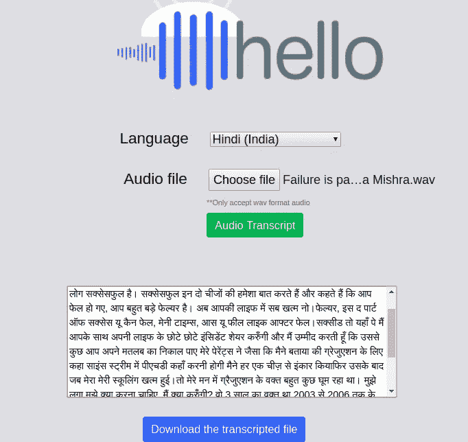
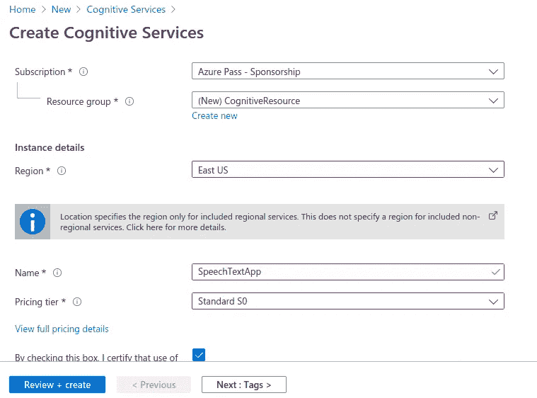
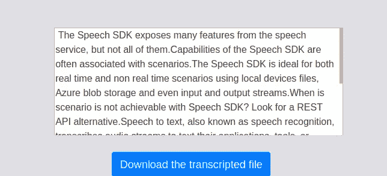
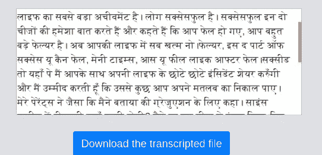
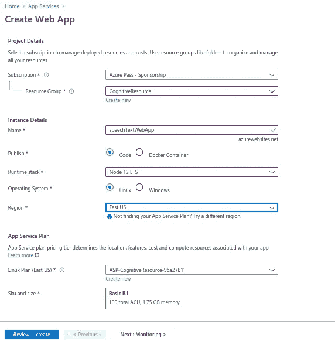
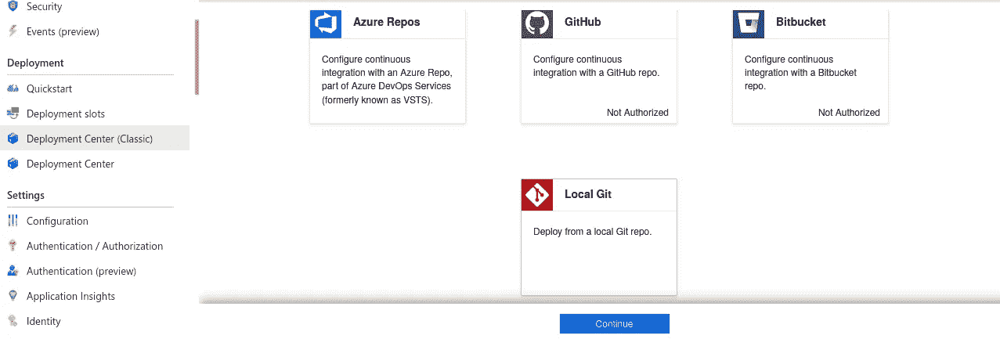
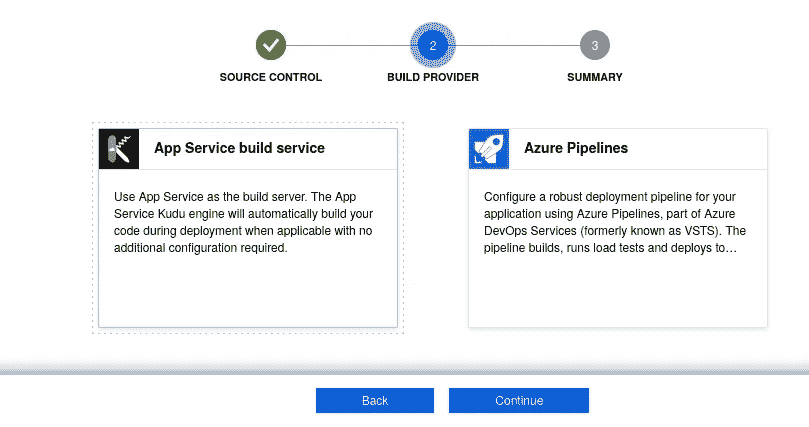
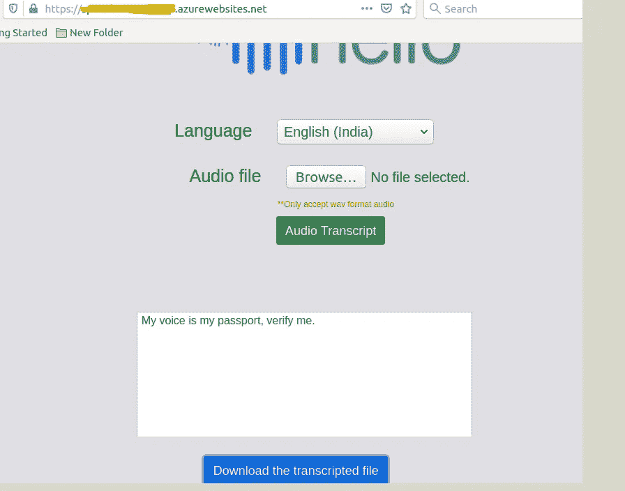

# 使用 Azure 认知服务作为 Web 应用程序将音频文件转录为文本

> 原文：<https://levelup.gitconnected.com/transcribe-the-audio-file-into-a-text-with-azure-cognitive-service-as-a-web-app-ea5d7e745f55>



本文旨在学习如何构建自己的 web 应用程序，在 azure cognitive service(语音到文本)SDK(nodejs)的帮助下将音频文件转换成文本。这里，我们将使用 nodejs 创建一个简单的 web 应用程序，将音频文件上传到服务器，并使用 speech SDK 将音频转录为文本格式，甚至您可以将转录的文本下载为 Docx 格式以供将来使用。

# 先决条件

*   节点:8.11 以上
*   微软-认知服务-语音-sdk: 1.14.0
*   快递:4.17.1
*   Azure 认知服务订阅密钥

# 步骤 1:注册语音认知服务

打开 Azure 门户[并转到“创建资源”部分，搜索“认知服务”](http://portal.azure.com/)

*   创建一个新的认知服务，选择需要的*订阅*和【资源组】。
*   根据您的要求输入 App“*名称*”，免费为“*区域*”提供标准 S0“定价层”。
*   最后勾选复选框后点击*审核+创建*按钮，验证通过后点击*创建*



部署成功后，打开资源，将“*”和“ ***位置*** ”复制成文本文件，以备后用。*

**

# *步骤 2:构建 SpeechText Web 应用程序*

*   *创建一个名为`*SpeechTextApp*`的空目录，现在使用下面的命令转到项目的根终端并启动节点项目。*

****** ***注意:****——必须安装在您系统中的* [*节点环境*](https://nodejs.org/en/download/) *。**

```
*npm init*
```

*   *填写项目初始化所需的信息。*
*   *创建一个名为`*index.js*` 的文件——这个文件将包含我们的应用程序的主要代码。*
*   *启动节点应用程序后，现在我们必须安装这个项目所需的以下软件包。*

```
*npm install microsoft-cognitiveservices-speech-sdk@1.14.0 --save
npm install express@4.17.1 --save  
npm install request@2.88.2 --save
npm install ejs@3.1.5 --save
npm install consolidate@0.16.0 --save
npm install https-proxy-agent@3.0.0 --save
npm install multer@1.4.2 --save
npm install mustache@4.0.1 --save
npm install readline@1.3.0 --save
npm install wavefile@11.0.0 --save*
```

*我们必须从单个页面的 *HTML* 视图开始，让我们在根目录下创建一个名为`*"views”*`的新文件夹。现在创建`*"index.html”*` & `*"404.html”*`文件&复制如下:*

*我们要在根目录下添加`*"public”*`文件夹，添加 app styles css 文件名为`*"project_styles.css”*` &从 github 下载“ [*Bootstrap*](https://github.com/zayedrais/SpeechTextApp/blob/master/public/bootstrap.min.css) ”文件。*

*然后在 public 目录里面添加`*"js”*` & `*"uploads”*`文件夹，在 js 文件夹里面添加“ [*jquery min*](https://github.com/zayedrais/SpeechTextApp/blob/master/public/js/jquery-2.1.1.min.js) ”文件。*

*转到项目的根目录，现在新建一个文件“***index . js***”&按照下面的步骤，它就是我们 *web app* 的*心脏和灵魂*。*

***导入所需模块:-***

```
*var express = require("express");
var bodyParser = require('body-parser');
var multer = require('multer');
var path = require('path');
var fs = require("fs");
var engine = require('consolidate');
const WaveFile = require('wavefile').WaveFile;
var sdk = require("microsoft-cognitiveservices-speech-sdk");
const cons = require("consolidate");*
```

***定义 App 变量&配置:-***

```
*var app = express();
var router = express.Router();
const port = process.env.PORT || 8081;
app.use(bodyParser.json());
app.use(express.static('public'));
app.engine('html', require('ejs').renderFile);
app.set('view engine', 'html');
app.set('views', __dirname + '/views');
var path1 = __dirname + '/views/';
router.use(function (req, res, next) {
next();
});
app.use("/", router);*
```

***添加认知服务密钥和变量:-***

*增加了认知服务`*"subscriptionkey”*`和`*"serviceRegion”*`，你已经在初始步骤中保存了它们。*

```
*var subscriptionKey = "***********************************";
var serviceRegion = "***********";
var selectedlang ;*
```

***声明存储路径:-***

```
*var storage = multer.diskStorage({
destination: function(req, file, callback) {
callback(null, './public/uploads');
},
filename: function(req, file, callback) {
callback(null,"audio.wav");
}});
var upload = multer({storage: storage});*
```

***定义路线:-***

```
*//// Get Method
app.get("/", function (req, res) {
res.sendFile(path1 + "index.html");
});
//// Post method
app.post('/',upload.single('userFile'), function(req, res) {
var htmlBody = req.body;
selectedlang =htmlBody.langsel;
let wav = new WaveFile(fs.readFileSync("./public/uploads/audio.wav"));
wav.toSampleRate(16000); //convert audio wav into 16000
fs.writeFileSync("./public/uploads/16000Hz-file.wav", wav.toBuffer());
var filename ="./public/uploads/16000Hz-file.wav"; // 16000 Hz, Mono
var pushStream = sdk.AudioInputStream.createPushStream();
fs.createReadStream(filename).on('data', function(arrayBuffer) {
pushStream.write(arrayBuffer.slice());
}).on('end', function() {
pushStream.close();
});
var audioConfig = sdk.AudioConfig.fromStreamInput(pushStream);
var speechConfig = sdk.SpeechConfig.fromSubscription(subscriptionKey, serviceRegion);
speechConfig.enableDictation();
speechConfig.speechRecognitionLanguage = selectedlang;
var recognizer = new sdk.SpeechRecognizer(speechConfig, audioConfig);
processmsg =".";
recognizer.recognizing = (s, e) => {
processmsg = processmsg + ".";
console.log("processing ."+processmsg);
};
var outputmsg="" ;
recognizer.recognized = (s, e) => {
outputmsg =outputmsg + e.result.text;
if (e.result.reason == ResultReason.RecognizedSpeech) {
console.log(`RECOGNIZED: Text=${e.result.text}`);
}
else if (e.result.reason == ResultReason.NoMatch) {
console.log("NOMATCH: Speech could not be recognized.");
}};recognizer.sessionStopped = (s, e) => {
console.log("\n    Session stopped event.");
console.log("Final Output : ",outputmsg);
fs.writeFileSync("./public/uploads/output.docx", outputmsg);
console.log("write file");
res.render(__dirname + "/views/index.html", {data: {status:"completed", contents: outputmsg}});
console.log("Send status into html");
recognizer.stopContinuousRecognitionAsync();
};
recognizer.startContinuousRecognitionAsync();
});*
```

*了解语音转文本 sdk 的更多详细信息。请点击以下链接*

*[语音转文本 sdk](https://www.npmjs.com/package/microsoft-cognitiveservices-speech-sdk)*

***服务器激活:-***

*最后，我们必须激活服务器*

```
*app.use("*", function (req, res) {
res.sendFile(path1 + "404.html");
});
app.listen(port, function () {
console.log(`Example app listening on port localhost: ${port} `);
});*
```

*“ ***index.js*** ”的完整代码如下:-*

# *第三步:运行应用程序*

*现在，应用程序已经准备好运行了。*

*从根目录打开终端并运行下面的“命令”*

```
*node index.js*
```

*你甚至可以从 [**Git 库**](https://github.com/zayedrais/SpeechTextApp) 下载完整的项目并运行下面的命令*

```
*npm install*
```

*现在打开你的浏览器，访问:- [localhost:8081](http://localhost:8081) ，用 wav 文件选择音频文件语言。 [***样本音频 wav 文件***](https://github.com/zayedrais/SpeechTextApp/tree/master/sampleAudioFiles)**(印地语音频来源于“*失败是生活的一部分”作者 Poornima Mishra |TEDxPSITKanpur)。**

```
**[http://localhost:8081/](http://localhost:8081/)**
```

********

# **步骤 4:作为 Web 服务部署在 Azure 中**

**由于我们已经构建并测试了我们的应用，现在有时间通过 Azure 应用服务部署应用。**

**打开 [Azure 门户](https://portal.azure.com/)，为节点环境创建一个 app 服务。**

**选择如下图的选项。**

****

**现在必须打开你的 azure 帐户并找到我们已经为部署创建的**应用服务**。然后转到**部署中心(经典)**选项卡，继续选择**本地 Git。****

****

**在下一个屏幕上，继续选择**应用服务构建服务**部分。**

****

**最后，点击**部署凭证**标签，获取本地 Git 的**用户名**和**密码**。并将其保存在文本文件中，我们将使用该文件在部署时进行身份验证。**

****

**在终端上打开项目目录，按照下面的命令进行部署。替换您的" *git 克隆 URL"* 。**

```
**$ git init
$ git add .
$ git commit -m 'Initial commit'
$ git remote add azure "**git clone url**"
$ git push azure master**
```

**跟踪终端上的部署状态，跟踪您的应用服务 url。**

****

**找到该项目的[](https://github.com/zayedrais/SpeechTextApp)**

# ********结论:-********

******在本教程结束时，我们得出结论。这个项目只适用于一个小的音频文件。在未来，我们会做更多的调查，接受长音频文件。******

********参考文献:********

******[语音转文字](https://docs.microsoft.com/en-us/azure/cognitive-services/speech-service/get-started-speech-to-text?pivots=programming-language-javascript&tabs=script%2Cbrowser%2Cwindowsinstall)******

******[Azure Github](https://github.com/Azure-Samples/cognitive-services-speech-sdk/tree/master/samples/js/node)******

******[语音到文本的认知服务](https://azure.microsoft.com/en-us/services/cognitive-services/speech-to-text/)******

# ******别忘了把你的给我们👏 👏 👏！！******