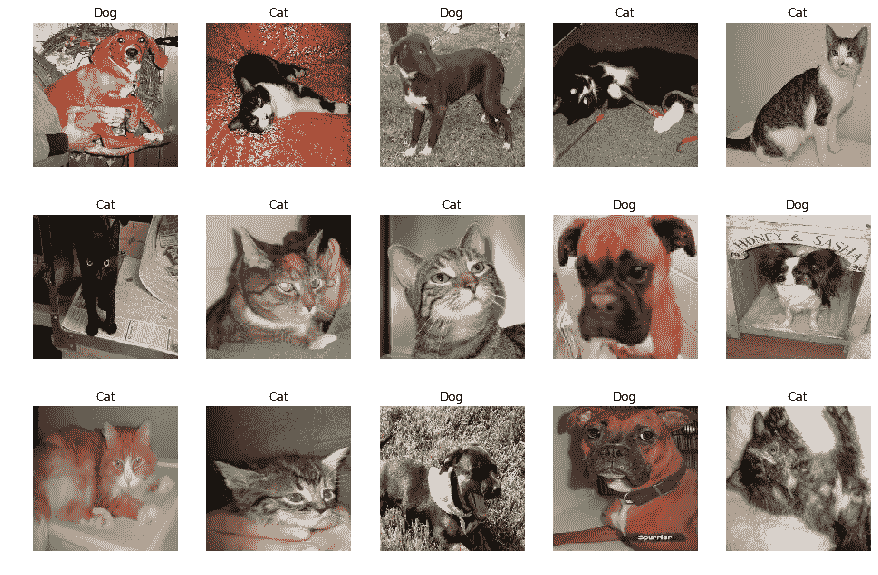
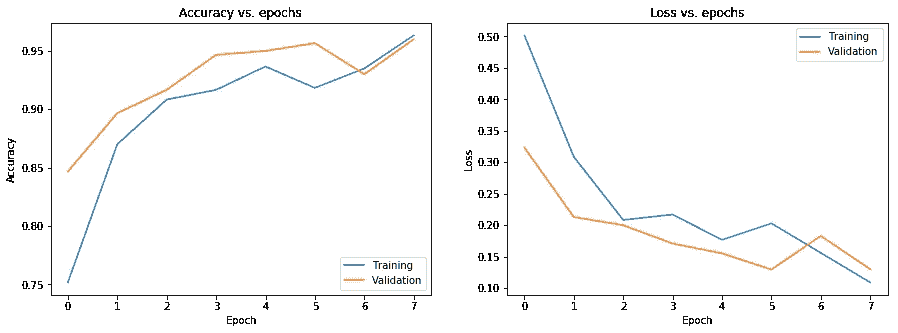

# 基于 Tensorflow 2 的图像迁移学习

> 原文：<https://levelup.gitconnected.com/transfer-learning-on-images-with-tensorflow-2-3476ff5beb61>

## 针对分类问题的图像迁移学习的演练示例



在本教程中，我们将为您提供一个示例，说明如何构建一个强大的神经网络模型，通过将 ImageNet 上训练的预训练模型视为基础模型，使用迁移学习对**猫**和**狗**的图像进行分类，然后我们将为我们的猫和狗分类模型训练额外的新层。

# 数据

我们将使用来自[狗与猫数据集](https://www.kaggle.com/c/dogs-vs-cats/data)的 600 张图像样本，该数据集用于 2013 年的 Kaggle 比赛。

```
import tensorflow as tf
from tensorflow.keras.models import  Sequential, Model, load_model
from tensorflow.keras.layers import Input, Conv2D, MaxPooling2D, Dense, Flatten, Dropout
import numpy as np
import os
import pandas as pd
from sklearn.metrics import confusion_matrix
import matplotlib.pyplot as plt
%matplotlib inline
import seaborn as sns# load the train validation and test datasets
images_train = np.load('data/images_train.npy') / 255.
images_valid = np.load('data/images_valid.npy') / 255.
images_test = np.load('data/images_test.npy') / 255.labels_train = np.load('data/labels_train.npy')
labels_valid = np.load('data/labels_valid.npy')
labels_test = np.load('data/labels_test.npy')
```

输出:

```
600 training data examples
300 validation data examples
300 test data examples
```

显示图像:

```
# Display a few images and labelsclass_names = np.array(['Dog', 'Cat'])plt.figure(figsize=(15,10))
inx = np.random.choice(images_train.shape[0], 15, replace=False)
for n, i in enumerate(inx):
    ax = plt.subplot(3,5,n+1)
    plt.imshow(images_train[i])
    plt.title(class_names[labels_train[i]])
    plt.axis('off')
```


# 加载基本模型

我们的基本模型将是预培训的移动网络 V2 模型。

```
base_model = tf.keras.applications.MobileNetV2()
```

## 使用预先训练的模型作为特征提取器

我们将删除网络的最后一层，并用新的、未经训练的分类器层来代替它。我们将创建一个与 MobileNetV2 模型具有相同输入张量的新模型，并使用名为`global_average_pooling2d_6`的层的输出张量作为模型输出。

```
feature_extractor = Model(inputs=base_model.input, 
                          outputs=base_model.get_layer('global_average_pooling2d_6').output)
```

# 构建最终模型

最终模型将:

*   从我们上面建立的特征提取器模型开始。
*   我们将添加 32 个单位的密集层和 ReLU 激活功能。
*   然后是退出层(50%)。
*   最后一层是 a 1 神经元的密集层，激活函数是 s 形。

```
final_model = Sequential([
                    feature_extractor,
                    Dense(32, activation='relu'),
                    Dropout(0.5),
                    Dense(1, activation='sigmoid')
                    ])final_model.summary()
```

输出:

```
Model: "sequential_1"
_________________________________________________________________
Layer (type)                 Output Shape              Param #   
=================================================================
model_1 (Model)              (None, 1280)              2257984   
_________________________________________________________________
dense_2 (Dense)              (None, 32)                40992     
_________________________________________________________________
dropout_1 (Dropout)          (None, 32)                0         
_________________________________________________________________
dense_3 (Dense)              (None, 1)                 33        
=================================================================
Total params: 2,299,009
Trainable params: 2,264,897
Non-trainable params: 34,112
```

## 冻结预训练模型的权重

我们将冻结预训练特征提取器的权重，以便只有我们添加的新层的权重会在训练期间改变。最后，我们将编译最终的模型。

```
final_model.layers[0].trainable = Falsefinal_model.compile(optimizer=tf.keras.optimizers.RMSprop(0.001),
              loss = 'binary_crossentropy',
              metrics = ['acc'])final_model.summary()
```

输出:

```
Model: "sequential_1"
_________________________________________________________________
Layer (type)                 Output Shape              Param #   
=================================================================
model_1 (Model)              (None, 1280)              2257984   
_________________________________________________________________
dense_2 (Dense)              (None, 32)                40992     
_________________________________________________________________
dropout_1 (Dropout)          (None, 32)                0         
_________________________________________________________________
dense_3 (Dense)              (None, 1)                 33        
=================================================================
Total params: 2,299,009
Trainable params: 41,025
Non-trainable params: 2,257,984
```

注意**不可训练** **参数**如何从 **34，112** 变为 **2，257，984**

# 训练和评估模型

我们将使用`EarlyStopping.`训练模型

```
earlystopping = tf.keras.callbacks.EarlyStopping(patience=2)
history_frozen_new_model = final_model.fit(images_train, labels_train, epochs=10, batch_size=32,
                                                validation_data=(images_valid, labels_valid), 
                                                callbacks=[earlystopping])
```

输出:

```
Train on 600 samples, validate on 300 samples
Epoch 1/10
600/600 [==============================] - 164s 273ms/sample - loss: 0.5017 - acc: 0.7517 - val_loss: 0.3234 - val_acc: 0.8467
Epoch 2/10
600/600 [==============================] - 155s 259ms/sample - loss: 0.3085 - acc: 0.8700 - val_loss: 0.2127 - val_acc: 0.8967
Epoch 3/10
600/600 [==============================] - 154s 256ms/sample - loss: 0.2082 - acc: 0.9083 - val_loss: 0.1998 - val_acc: 0.9167
Epoch 4/10
600/600 [==============================] - 153s 255ms/sample - loss: 0.2168 - acc: 0.9167 - val_loss: 0.1707 - val_acc: 0.9467
Epoch 5/10
600/600 [==============================] - 149s 249ms/sample - loss: 0.1765 - acc: 0.9367 - val_loss: 0.1550 - val_acc: 0.9500
Epoch 6/10
600/600 [==============================] - 152s 253ms/sample - loss: 0.2027 - acc: 0.9183 - val_loss: 0.1293 - val_acc: 0.9567
Epoch 7/10
600/600 [==============================] - 156s 260ms/sample - loss: 0.1557 - acc: 0.9350 - val_loss: 0.1828 - val_acc: 0.9300
Epoch 8/10
600/600 [==============================] - 155s 258ms/sample - loss: 0.1088 - acc: 0.9633 - val_loss: 0.1298 - val_acc: 0.9600
```

## 绘制学习曲线

```
plt.figure(figsize=(15,5))
plt.subplot(121)
try:
    plt.plot(history_frozen_new_model.history['accuracy'])
    plt.plot(history_frozen_new_model.history['val_accuracy'])
except KeyError:
    plt.plot(history_frozen_new_model.history['acc'])
    plt.plot(history_frozen_new_model.history['val_acc'])
plt.title('Accuracy vs. epochs')
plt.ylabel('Accuracy')
plt.xlabel('Epoch')
plt.legend(['Training', 'Validation'], loc='lower right')plt.subplot(122)
plt.plot(history_frozen_new_model.history['loss'])
plt.plot(history_frozen_new_model.history['val_loss'])
plt.title('Loss vs. epochs')
plt.ylabel('Loss')
plt.xlabel('Epoch')
plt.legend(['Training', 'Validation'], loc='upper right')
plt.show()
```



## 评估新模型

```
new_model_test_loss, new_model_test_acc = final_model.evaluate(images_test, labels_test, verbose=0)print("Test loss: {}".format(new_model_test_loss))
print("Test accuracy: {}".format(new_model_test_acc))
```

输出:

```
Test loss: 0.10817002788186074
Test accuracy: 0.9566666483879089
```

我们得到了 96%的准确率。还不错！

# 参考资料:

[1] Coursera [使用 TensorFlow 2 定制您的模型](https://www.coursera.org/learn/customising-models-tensorflow2/home/welcome)

最初发布于[预测黑客](https://predictivehacks.com/transfer-learning-on-images-with-tensorflow-2/)