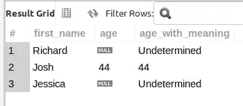
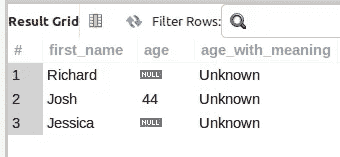
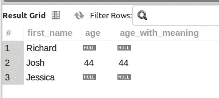

# 用 MySQL COALESCE 函数转换空值

> 原文：<https://levelup.gitconnected.com/transform-null-values-with-the-mysql-coalesce-function-6802033900ee>

如果我们不小心，`NULLs`有可能*破坏*我们的查询结果。学习如何根据手头的业务逻辑上下文使用`IS NULL`或`IS NOT NULL`正确过滤`WHERE`子句中的`NULL`，只是学习处理`NULLs`的一部分。

将`NULLs`作为查询结果的一部分，可以让我们更好地应对遇到`NULL`值的情况(尤其是在计算中)。

图片来自 [Pixabay](https://pixabay.com/?utm_source=link-attribution&utm_medium=referral&utm_campaign=image&utm_content=6475769) 的 [Gerd Altmann](https://pixabay.com/users/geralt-9301/?utm_source=link-attribution&utm_medium=referral&utm_campaign=image&utm_content=6475769)

***OpenLampTech*** ，面向 PHP/MySQL 开发者的简讯。这份时事通讯是你每周策划和原创的 PHP/MySQL 内容。立即订阅，帮助构建社区[！](http://openlamptech.substack.com)

## MySQL COALESCE()函数

像其他主要的 SQL 实现一样，MySQL 支持`COALESCE()`函数。

在本帖中，我们将看到示例查询利用`SELECT`列列表中的`COALESCE()`为那些`NULL’`遇到*的列或表达式提供更有意义的值。*

`COALESCE()`函数的语法是:

`COALESCE(value_1,… value_n)`

`COALESCE()`的一个特点是该函数接受多个参数，而像`IFNULL()`这样的函数只接受 2 个参数。`COALESCE()`返回第*非`NULL`值。如果`COALESCE()`中的所有参数都是`NULL`，则返回`NULL`。*

## *MySQL COALESCE()查询示例*

*在第一个示例查询中，我们只是用字符串“未确定”替换“年龄”列中的任何`NULL`值:*

**

*对于查询结果中返回的每一行，如果“年龄”列值为`NULL`，则`COALESCE()`返回“未确定”。*

*通过[注册电子邮件通知](https://parabollus.medium.com/subscribe)，我每次在媒体上发表博客文章时都会收到通知。如果您还不是该平台的会员，可以考虑通过[我的推荐链接](https://parabollus.medium.com/membership)注册一个中型账户。在不增加你额外费用的情况下，我会收到你会费的一小部分。成为会员后，你可以在平台上无限阅读作者的文章。谢谢你🙏*

## *MySQL COALESCE() —第一个非空值*

*使用`COALESCE()`时要注意，因为它返回的是 ***第一个*** 非`NULL`值。这可能不是你所期望的。为了更好地理解，请参见下一个查询示例:*

**

*尽管“名字”列值“乔希”的行确实具有“年龄”列值 44，并且不是`NULL`，但由于它是`COALESCE()`参数列表中第一个非`NULL`值，因此返回“未知”。因此，如果您在查询中使用`COALESCE()`代替`NULL` *遭遇*的简单替换，理解这种差异是很重要的。*

*需要学习 MySQL 吗？刚刚起步，对如何查询一个表，获取自己需要的数据感到困惑？出于这个特殊的原因，我正在创建优质的 MySQL 初学者内容。来帮助那些想学习 MySQL 基础知识却不知道从何入手的人。在我开发和发布我的高级 MySQL 博客文章和内容时，了解更多信息。*

## *MySQL COALESCE() —只有空值返回空值*

*在`COALESCE()`函数参数列表中没有非`NULL`值的情况下，返回`NULL`，如下例所示:*

**

*`COALESCE()`返回年龄列值为`NULL`的两行的`NULL`。*

*一如既往，如果你有任何问题或看到代码中的任何错误，请通过评论让我知道。建设性的意见有助于我提供准确的博客帖子，我非常感激。感谢您的阅读。*

* [## 使用 MySQL Workbench 将查询结果导出到 CSV

### CSV 文件用于一切。由于 CSV 是如此普遍，是一种友好的交流形式，每个人都明白…

levelup.gitconnected.com](/export-query-results-to-csv-with-mysql-workbench-ed7722180174)  [## 用 MySQL 中的 SUBSTRING()实现递归 CTE

### 虽然这些天我主要在后端 web 开发项目中使用 MySQL/MariaDB，但我正在学习 Oracle SQL…

levelup.gitconnected.com](/recursive-cte-fun-with-substring-in-mysql-3a06fab881cd)  [## MySQL 计数(*)和计数(列或表达式)—差异

### 我写了很多关于 MySQL、PHP 和后端 Web 开发的博客文章。我认为写博客是一种个人成长…

medium.com](https://medium.com/an-idea/mysql-count-and-count-column-or-expression-differences-e480b0db5f43) 

我定期在我的技术博客 [Digital Owl 的散文](http://joshuaotwell.com)上写关于 SQL、PHP 和 CodeIgniter 的文章。关注我那里的类似内容，并确保[注册我的免费每周时事通讯](http://openalamptech.substack.com)、**、 OpenLampTech 、面向 PHP/MySQL 开发人员的时事通讯。谢谢大家！***