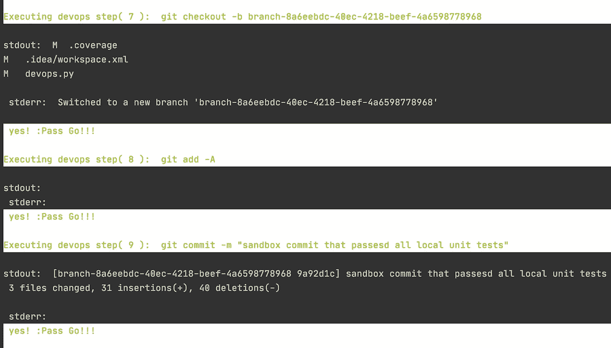
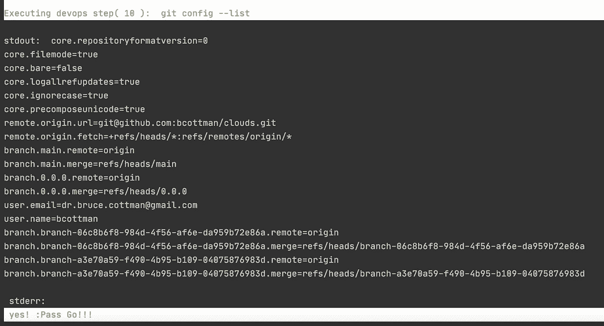

# 将 Python IDE 转换成 DevOps 工具

> 原文：<https://levelup.gitconnected.com/transform-your-favorite-python-ide-into-a-devops-tool-c087fc4418c9>

## 在可定制的 Python 代码中捕获 CI/CD


Shamsudeen Adedokun 在 [Unsplash](https://unsplash.com?utm_source=medium&utm_medium=referral) 上拍摄的照片。

# DevOps 是什么？

> “DevOps 是一套结合了[软件开发](https://en.wikipedia.org/wiki/Software_development) ( *Dev* )和 [IT 运营](https://en.wikipedia.org/wiki/IT_operations) ( *Ops* )的实践。其目的是缩短[系统开发生命周期](https://en.wikipedia.org/wiki/Systems_development_life_cycle)并为[持续交付](https://en.wikipedia.org/wiki/Continuous_delivery)高[软件质量](https://en.wikipedia.org/wiki/Software_quality)。DevOps 是对[敏捷软件开发](https://en.wikipedia.org/wiki/Agile_software_development)的补充；DevOps 的几个方面来自敏捷方法。”— [维基百科](https://en.wikipedia.org/wiki/DevOps)

上面的定义对我来说是错误的。

*   瀑布、敏捷或任何其他方法可能是 DevOps 的补充。方法论可以和 DevOps 工具重叠，但是应该是相互独立的。开发方法论不应该指导 DevOp 工具，DevOps 工具也不应该指导开发方法论。
*   DevOps 工具"[目的]缩短系统开发生命周期。"这是一个症状。相反，手动操作被自动化规范所取代。

在治理中有着至关重要的作用。然而，行动是开始，对这些行动的治理最好是在行动过程成熟的中期，但通常会更晚。

我承认，我对 DevOps 的观点是有争议的。我以行动为中心，很少关注治理。毕竟，为什么要浪费昂贵的精力在过程的治理上，直到过程被证明是可行的？

也许如果我是副总裁或首席执行官，我会更加重视治理。

> “从他们做什么开始，而不是从他们说什么开始。”—匿名

治理“时尚”比工作流变化得更快。我考虑这些治理方法:瀑布、敏捷、Scrum、6-适马、离岸、多时区，以及这十年你最喜欢的治理方法。

我的最爱？软件开发生命周期。永恒。嗯，SDLC 是我最喜欢的术语，直到机器学习应用程序出现，并使数据成为 SDLC 等式的一个活跃部分。

我已经编码超过 30 年，使用超过 9 种语言。在此期间，我参与了 SDLC 框架和工具的许多形式和迭代。

以下是我对“什么是 DevOps？”

> 它是通过规范用自动化代替手工的、重复的开发操作。—布鲁斯·科特曼

# 用 Python 指定的动作定义 DevOps

本文将介绍如何用 Python 代码创建一个完整的开发操作管道(DevOps)规范。您可以使用这段代码将您最喜欢的交互式开发环境(IDE)转换成 DevOps 工具。

我将展示它是基于同事们在本地沙箱中使用的各种 SDLC Python 脚本。

本文中使用的 Python 开发工具在我们最喜欢的 ide 中使用。

[](https://medium.com/better-programming/seventeen-coding-tools-for-your-python-developer-sandbox-35d033c3075a) [## Python 开发者沙盒的 18 种编码工具

### 编写 Pythonic 代码

medium.com](https://medium.com/better-programming/seventeen-coding-tools-for-your-python-developer-sandbox-35d033c3075a) 

# 什么是 CI/CD 步骤？

在我的世界里，SDLC 步骤等同于 SDLC 动作。

“持续开发/持续集成的主要步骤是什么？”没有标准我将提出一个粗粒度的、被广泛接受的定义。

*   构建—代码集在“构建”步骤中编译。请注意，Python 代码的核心是一种解释型语言。它可以被转换(编译)成线程代码形式。然而，这一步对开发人员来说是完全透明的，因此不应该自动化。
*   分析或诊断—我不认为大多数人提到的“分析或诊断**”**步骤是 CI/CD 流程的一部分。我不明白为什么。

事实上，我认识的大多数开发人员都使用 lint，分析，测量复杂性，确定测试的覆盖范围，并执行其他诊断工具。也许“诊断”是“测试”步骤的一部分？

*   测试—代码集在“测试”步骤中用单元测试进行测试。一些开发人员包括样式、文档和集成的或有时有限的安全测试。
*   版本控制—本地代码集被推送到代码的版本控制存储库。通常，这个本地代码集在与项目的总代码集合并之前被验证。在本文中，我不会讨论共享代码集的“验证”步骤。
*   验证和合规性—验证构建的步骤。“验证和符合性”不是开发人员沙箱中的 SDLC 步骤，而是项目发布候选的步骤。
*   部署——将发布项目代码集作为 Python 包推出到共享存储库中。在 Python 的世界里，这是 [PyPi](https://pypi.orghttps//pypi.org) 。“部署”不是开发人员沙箱的 SDLC 步骤。

# 如何执行 CI/CD 步骤

以下 Python 函数显示了如何将 CI/CD 步骤作为 Python 子流程执行。`sp.open(..)`调用将`serial_script_cmd` shell 命令作为异步子进程执行。当子流程对象实例`child`完成执行时，`child.returncode`调用返回。

如果您希望在多核计算机上同时运行子进程，您可以更改`devops_step(...)`。

我添加了`colorama`来给输出着色，使其具有与著名的 DevOps 工具相似的报告格式。

# SDLC 工具

下面的所有 SDLC 工具将在本文中详细介绍:

[](https://medium.com/better-programming/seventeen-coding-tools-for-your-python-developer-sandbox-35d033c3075a) [## Python 开发者沙盒的 18 种编码工具

### 编写 Pythonic 代码

medium.com](https://medium.com/better-programming/seventeen-coding-tools-for-your-python-developer-sandbox-35d033c3075a) 

## 1.黑色代表标准化代码格式

[black](https://pypi.org/project/black/) 是一个基于通用 PEP-8 风格指南的代码格式化工具。

```
nstep = 1
return_code = 0
# black pep-8 formatting
serial_script_cmd = 'black -v tests'
nstep,rc = devops_step(serial_script_cmd, nstep, return_code )
```

输出:


## 2.Python 代码类型提示检查的 Mypy

类型提示只是像 Mypy 这样的第三方工具可以用来指出潜在 bug 的提示。

```
#mypy type checking
serial_script_cmd = 'mypy src'
nstep, rc = devops_step(serial_script_cmd, nstep, return_code)
```

输出:


## 3.用于代码审查的 Pylint

我们使用 Pylint 在我们的沙箱中查找错误和可疑代码。

```
#pylint
serial_script_cmd = 'pylint src -E -v'
nstep, rc = devops_step(serial_script_cmd, nstep, return_code)
```

输出:


## 4.代码单元测试的 pytest

我们决定用 [pytest](https://docs.pytest.org/en/stable/contents.html) 进行单元测试，主要是因为需要最少的样板文件。

```
#pytest for tests
serial_script_cmd = 'pytest -v tests'
nstep, rc = devops_step(serial_script_cmd, nstep, return_code)
```

输出:


## 5–6.测试的代码覆盖率

[Coverage.py](https://coverage.readthedocs.io/en/coverage-5.4/) 是我们用来测量 pytest 框架覆盖的代码量的工具。

```
#coverage
serial_script_cmd = 'coverage run -m pytest tests'
nstep, rc = devops_step(serial_script_cmd, nstep, return_code)serial_script_cmd = 'coverage report'
nstep, rc = devops_step(serial_script_cmd, nstep, return_code)
```

输出:


## 7–10.用于工件版本控制的 Git 命令

我们使用 [Git](https://git-scm.com/) 进行本地文件版本控制。

输出:



## 11.GitHub 版本控制工件共享的 Git 命令

一旦单元测试在一台本地机器上通过，我们就将代码推送到 GitHub 云上的 repo 中。

```
serial_script_cmd = 'git push -u origin ' + pid
nstep, rc = devops_step(serial_script_cmd, nstep, return_code)
```

## 您可能添加或更改的其他步骤

*   创建或添加到 SDLC 脚本，以便持续部署到 PyPI hub。

*注意:以上是 SDLC 项目发布候选动作(步骤)——不是开发者沙盒步骤。*

*   增加一个`serial_script_cmd`用于沙盒代码安全验证。
*   每一步都是同步子流程的线性流程。您可以更改 Python 函数`devops_step`来在多核计算机上并发执行子进程。您决定哪些步骤可以并发运行。
*   哪些步骤可以并发运行？
*   本地沙盒 SDLC 脚本可能比我在这里展示的更长更复杂。我想听听你会添加什么开发工具。

# 摘要

代码在 GitHub 上以`[devops.py](https://github.com/bcottman/DevOps)`的名字开源。完整的脚本是:

看看 SDLC(或我的 DevOps 定义)对您的沙盒来说是多么容易实现？使用任何可以在你喜欢的 IDE 中调用你的操作系统的语言。

我建议在项目级别查看 DevOps 工具的 [CircleCI](https://circleci.com/) 或 [GitHub Actions](https://github.com/features/actions) ，并完成以下连续部署步骤:

*   确认
*   服从
*   部署

编码快乐！