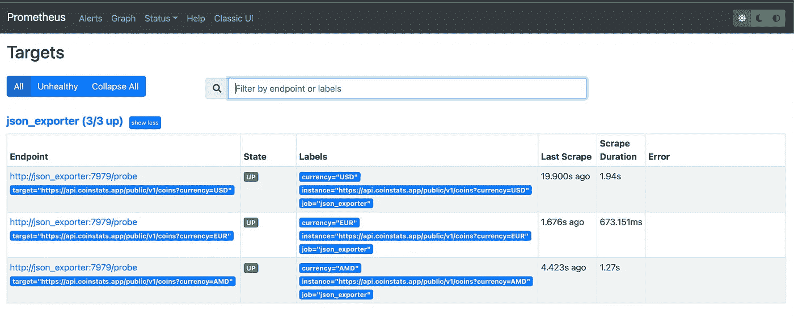
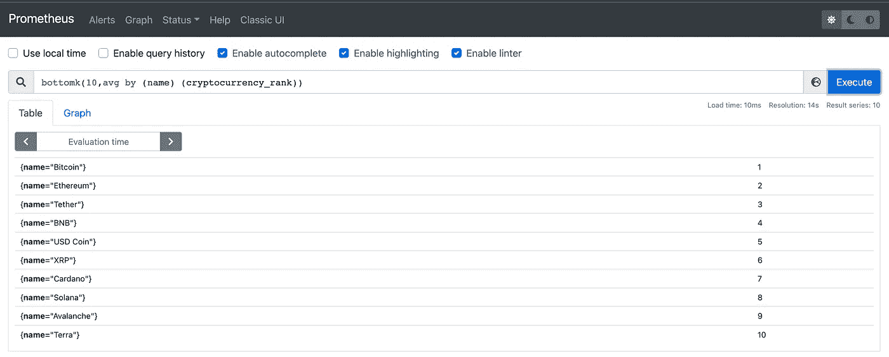
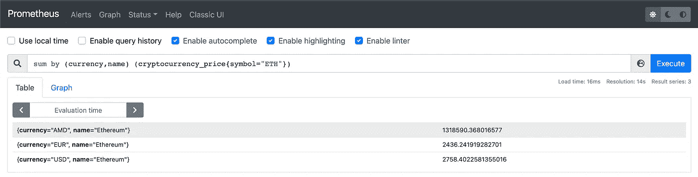

# 将远程 JSON 转换为普罗米修斯指标

> 原文：<https://levelup.gitconnected.com/transforming-remote-json-into-prometheus-metrics-334d772df38a>


图片由 Hayk Davtyan(作者)提供

## 引言。

有没有想过把 JSON 对象变成普罗米修斯格式的度量？这一点可以通过 [prometheus-json-exporter 来实现。](https://github.com/prometheus-community/json_exporter#json_exporter)通过 [JSONPath](https://kubernetes.io/docs/reference/kubectl/jsonpath/) 抓取远程 JSON。

## 关于这个教程。

在本教程中，我们将学习如何为公共 json 端点部署和配置 json_exporter，并在 Prometheus 中使用它。我们将使用的部署方法是 [Docker compose](https://docs.docker.com/compose/) ，尽管它也可以在 Kubernetes 环境中完成。

作为 JSON 端点，我们将使用由 [CoinStats](https://coinstats.app/) 提供的公共 API。正如你已经猜到的，这将是关于加密货币。很酷，是吗？这意味着我们将把 cryptos 的实时信息转化为基于 Prometheus 的指标，这将允许存储历史数据。让我们建造它！

## **为本教程创建工作目录和配置文件。**

我将为这个项目使用`/tmp`目录，请使用另一个目录以避免在重启系统的情况下丢失文件。

```
$ mkdir -p /tmp/json_exporter_tutorial/examples
```

在为服务创建 rest 配置文件之前，让我们看看单个 JSON 对象是怎样的:[*api.coinstats.app/public/v1/coins*](https://api.coinstats.app/public/v1/coins)API。

```
{
  "coins": [
    {
      "id": "bitcoin",
      "icon": "[https://static.coinstats.app/coins/Bitcoin6l39t.png](https://static.coinstats.app/coins/Bitcoin6l39t.png)",
      "name": "Bitcoin",
      "symbol": "BTC",
      "rank": 1,
      "price": 40224.98822527244,
      "priceBtc": 1,
      "volume": 396892467427897.7,
      "marketCap": 762621770614.047,
      "availableSupply": 18958906,
      "totalSupply": 21000000,
      "priceChange1h": 0.58,
      "priceChange1d": 0,
      "priceChange1w": -4.52,
      "websiteUrl": "[http://www.bitcoin.org](http://www.bitcoin.org)",
      "twitterUrl": "[https://twitter.com/bitcoin](https://twitter.com/bitcoin)",
      "exp": [
        "[https://blockchair.com/bitcoin/](https://blockchair.com/bitcoin/)",
        "[https://btc.com/](https://btc.com/)",
        "[https://btc.tokenview.com/](https://btc.tokenview.com/)"
      ]
    }
  ]
}
```

因为我们已经知道了 JSON 对象的结构，所以我们可以告诉 exporter 它应该如何解析整个对象并将它们转换成 Prometheus 时间序列。

定义指标名称和标签。

根据 JSON 对象的不同，每个时间序列中存在的强制标签有:`id`、`name`和`symbol`。这些度量将表示以下关键字的相应值:`rank, price, priceBtc, volume, marketCap, availableSupply, totalSupply, priceChange[1h,1d,1w]`。

因此，我们要创建的指标名称将是:

*   加密货币 _ 排名
*   加密货币 _ 价格
*   加密货币 _ 价格 _as_btc
*   加密货币 _ 卷
*   加密货币 _ 市场 _ 资本
*   加密货币 _ 可用 _ 供应
*   加密货币 _ 合计 _ 供应
*   加密货币 _ 价格 _ 变化 1h
*   加密货币 _ 价格 _ 变化 1d
*   加密货币 _ 价格 _ 变化 1w

使用以下内容为 json_exporter 创建配置文件。

```
$ touch /tmp/json_exporter_tutorial/examples/config.yml
```

json_exporter 的配置文件

下面的配置描述了用 [JSONPath](https://kubernetes.io/docs/reference/kubectl/jsonpath/) 解析 JSON 对象的步骤。

使用以下内容为 Prometheus 创建一个配置文件。

```
$ touch /tmp/json_exporter_tutorial/examples/prometheus.yml
```

Prometheus . yml-Prometheus JSON _ exporter 的作业

正如您所注意到的，我们将使用三个不同于`?currency`查询参数的目标。在上述参数的帮助下，响应将适合于该货币，因此在这种情况下，我们将有三种不同类型货币的时间序列`USD`、`EUR`和`AMD`。下面的`relabel_configs`部分将创建对应于`?currency` HTTP 查询参数值的`currency`标签。

```
- source_labels: [__address__]
  regex: ^http.+currency=([A-Z]{3})
  action: replace
  target_label: currency
  replacement: ${1}
```

我们需要创建的最后一个文件是`docker-compose.yml`。用下面描述的内容创建它。

```
$ touch /tmp/json_exporter_tutorial/docker-compose.yml
```

docker-compose.yml

最后，是时候用 Docker compose 启动服务了。

```
$ cd /tmp/json_exporter_tutorial
$ docker-compose up -d
```

由于服务已经成功启动，让我们打开 Prometheus web 接口[http://localhost:9090/targets](http://localhost:9090/targets)并检查目标的状态。三个目标都实现了，这意味着一切都做对了。



Img。1 普罗米修斯目标

## 做一些查询。

既然普罗米修斯号成功地从目标上擦过，让我们看看时间序列是什么样的。

*   `bottomk(10, avg by (name) (cryptocurrency_rank))` -按排名返回前 10 种加密货币。



Img。2 十大加密货币

*   `sum by (currency,name) (cryptocurrency_price{symbol="ETH"})` -返回每种货币的当前 ETH 价格。



Img。每种货币的当前价格

## **结论**。

毫无疑问，我们可以说 json_exporter 是一个非常有用的工具，它很容易配置和集成 Prometheus 栈。感谢这个导出器的创作者和维护者。

感谢阅读。我希望这个故事是有帮助的。如果你有兴趣，可以看看[我的其他媒体文章](https://hayk96.medium.com/)。