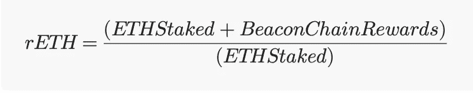
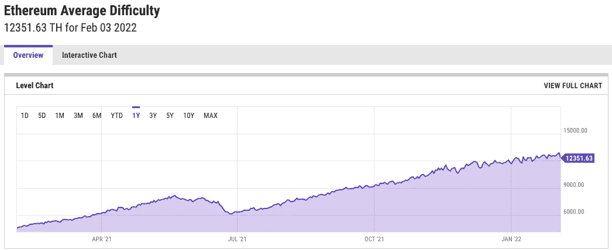

# 从采矿以太坊过渡

> 原文：<https://levelup.gitconnected.com/transitioning-away-from-mining-ethereum-20f7a22c80b>

让我们来讨论以太网的变化

照片由 [Unsplash](https://unsplash.com/@theshubhamdhage?utm_source=unsplash&utm_medium=referral&utm_content=creditCopyText) 上的 GuerrillaBuzz Crypto PR 拍摄

以太坊即将迎来有史以来最大的一次更新。上周，窑测试网发布了，这是最后一个公开的测试网，供开发者为今年主以太网的合并做准备。一旦合并发生，以太坊将正式从工作证明转变为利益证明。这意味着以太坊的开采将会停止，人们将可以用以太坊来保护网络。

这种转变有几个关键的好处，包括能源使用的大量减少和交易费用的潜在减少。在本文中，我们将讨论从工作证明转移到利益证明的意义，一些对以太坊进行利益衡量的最佳方法，以及如何处理您去年可能一直在使用的采矿钻机，以利用轻松获利的优势。

# 证明利害关系的好处

自 2009 年比特币诞生以来，大多数区块链网络都是使用工作证明来保护的。工作证明是一种共识协议，它使用加密技术来确保分散式网络保持安全，并防止不良行为者操纵网络。虽然存在其他共识协议，但 proof of work 非常健壮，并且经过了良好的测试，这使得它非常适合必须保护如此多价值的加密货币。

工作证明的缺点是这是一个极其耗费资源的过程。它的工作原理是让矿工花费计算资源去尝试并成为第一个解决密码难题的人；第一个猜出正确散列的矿工将获得最新交易的铸造权并获得奖励。这种系统使得这些网络难以操纵，因为要获得足够的硬件和支付持续制造街区所需的电力，需要花费巨额资金。然而，让世界各地的矿工不断争先恐后地猜测正确的哈希意味着大量使用的计算能力最终只是被浪费了。在一个气候变化成为主要问题的时代，许多人只是对如此耗能的系统不满意。

这就是利害关系的证据。利益相关证明允许利益相关者将他们自己的硬币放到线上以验证交易，而不是让矿工花费精力和计算能力。一个人可以投入一定数量的硬币来创建一个验证器节点，这些验证器可以对新交易的有效性进行投票。赌注实质上是进入一个彩票能够铸造一个新的块。如果他们被选中，他们可以向网络提出一个新的交易块；如果网络的其余部分同意交易是有效的，那么赌注者将得到奖励，但是如果有欺诈交易，网络将销毁赌注硬币。

该系统允许对工作证明系统的类似威慑，而不需要持续解决加密数学问题的极端能量消耗。如果没有加密技术，这听起来可能不太安全，但这两个协议的最终目标都是让操纵网络的成本高得惊人，而风险证明在这一点上是成功的。为了控制该网络的大部分投票权，一个人需要下注——并冒险——该网络的大部分赌注硬币。

# 立桩以太坊

随着以太坊采矿很快消失，越来越多的人开始关注赌注。以太坊绝不是第一个实现利益证明的加密货币，然而，它将是迄今为止使用它的最大的区块链，也是第一个放弃工作证明而支持它的加密货币。作为下注以太坊帮助验证交易的交换，你通常会获得固定比例的回报。我将在下面的参考资料部分链接一个更深入的关于赌注的解释，但是让我们在这里讨论一些要点。

## 集中

以太坊股权证明的一个潜在缺点是集中化的风险。为了创建一个验证器节点，一个人需要投资 32 ETH，这大约值 96，000 美元。对于普通的加密爱好者来说，这太贵了，他们自己做不了，许多人可能会通过交易所或资金池下注以太坊，而他们自己并不需要拥有 32 ETH。

已经有很多对以太坊感兴趣的人可以使用，然而，它们并不都是平等的。许多交易所和资金池是托管的，这意味着你给一个实体一定数量的 ETH，他们会为你托管。保管赌注的缺点是将 ETH 集中到集中的控制点，个人不再控制他们赌注的硬币的密钥。这意味着网络的投票权被集中到更小的群体中，也可能导致人们被资金池诈骗。

押注加密货币的主要风险是，如果网络确定你的资金池提出的交易是欺诈性的，你的股份将被削减——销毁。这意味着与一个可信的来源打赌是非常重要的，一些池提供了对攻击的保护，而其他的可能没有。

## 液体打桩

有许多池声称提供分散的方法来进行赌注，然而，大多数池仅通过采用称为流动赌注的东西来提供伪分散的方法。液体赌注是一个系统，在这个系统中，你会得到一个你下注的硬币的代币化版本，这些代币可以像你下注的硬币一样被转移、存储或花费。虽然 liquid staking 允许您通过消除任何时间承诺来更加灵活地使用您的赌注硬币，但它并不能从本质上解决许多池面临的集中化和缺乏控制的问题。

这就是火箭池的用武之地。Rocket Pool 想出了一个非常有趣的方法，通过利用以太坊的智能合约来确保您对您所下注的硬币保持控制。虽然对 Rocket Pool 的完整解释属于它自己的帖子，但让我们分解一下关键方面:

*   火箭池允许个人向他们的赌注池中投入少至 0.01 ETH 的赌注，并给予回报。
*   Rocket Pool 通过将个人/组织的 16 ETH 股份与个人在池中的 16 ETH 股份相结合，创建了一个验证器节点。
*   对于以太网来说，这个验证器节点看起来和其他节点一样，但是，它在功能上是一个“小池”。普通验证器节点和小型池之间的唯一区别是它们是如何创建的，以及取款是如何工作的。
*   Rocket Pool 使用智能合同来管理 minipools 所做的一切，这使得系统完全去中心化，并且不需要利益相关者将他们的钥匙交给中央控制点。

这整个系统实际上相当优雅，rETH 令牌的值由以下比率处理:

rETH:ETH 比率(由作者创建)

由于以太坊网络发布一致的奖励，单个 rETH 令牌的价值相对于单个 ETH 硬币的价值总是在增加。这意味着，简单地拥有一个 rETH 令牌允许某人从与 Rocket Pool 的赌注中获益，因为它的价值将随着时间的推移相对于 ETH 而增长。

总的来说，火箭池解决了赌注池的许多问题。它使用智能合同来创建一个真正分散的方法，这将大大有助于防止网络的过度集中。它还通过将削减成本分散到其庞大的资金池中，最大限度地降低了因削减事件而损失股份的风险，而许多其他资金池对此并不十分清楚。甚至比特币基地也开始提供针对砍杀事件的保护，但似乎在 2021 年底放弃了这一承诺。

# 你的采矿设备呢？

如果你还在挖掘以太坊或者另一个工作证明硬币，你可能会想你应该用你的采矿硬件做什么。转换后确实有替代采矿的方法，但是，一旦大量的采矿力量离开以太坊，还不清楚是否会有盈利的选择。

以太坊网络的挖掘能力远远超过所有替代硬币的总和。这意味着当合并发生时，所有的采矿力量要么离线，要么寻找替代硬币来开采。合并发生后有两种可能的情况:

## **场景 1: GPU 采矿消亡**

最有可能的情况是，我们知道的去年盈利的 GPU 挖矿将会停止。替代硬币，如以太坊经典、拉文硬币、Ergo 等。比以太坊网络拥有的哈希表少得多，而且它们中的任何一个似乎都不可能增值到足以吸收以太坊留下的多余哈希表。

矿商不能直接转向另一个目前有利可图的行业的原因与采矿难度有关。困难在于确保以相对一致的速率铸造块的机制。如果网络的哈希速率上升，那么网络会增加挑战，以补偿增加的计算能力。这同样适用于一个网络的 hashrate 的突然下降；如果大量 hashrate 消失，那么网络将降低难度，以确保块继续以恒定的速率铸造。我们可以从去年中国对加密开采的禁令中看到这一点:

资料来源:ycharts.com

随着越来越多的 GPU 上线以利用有利可图的采矿，以太坊的采矿难度总体上一直在稳步增加。然而，当中国禁止采矿，全球哈希表的很大一部分突然消失时，该网络通过暂时降低难度来进行补偿。

当以太坊切换到赌注证明时，反作用将发生在其他可以用 GPU 挖掘的硬币上。难度会暴涨，随着成功解决下一个区块越来越难，盈利能力会急剧下降。

## 场景二:GPU 挖矿找到新宠

虽然我认为这种情况不太可能发生，但有可能的是，专门的采矿社区对这些替代硬币的兴趣将导致它们的价值上升，并使它们对采矿有利可图。我看到这个想法经常在矿业社区讨论，但是，我认为矿商可能高估了他们对整个市场的影响。特别是当我们考虑将退出以太坊网络的采矿力量的绝对数量时，可开采替代品需要看到的增长数量是不太可能的。

## 我认为会发生什么

我认为，去年我们从以太坊获得的利润极高的采矿活动即将结束，但我确实认为，将会有一小群矿工能够使用高效的硬件继续盈利。挖掘难度是一个自我平衡的系统；虽然一开始盈利能力会下降，但随着人们开始销售硬件，总有一天会有一个更小的群体能够盈利。为此，最好的显卡将是效率更高的显卡，而不是散列率最高的显卡，因为电费将比过去更重要。这意味着，如果你打算继续采矿，你可能想把你的 Nvidia 3080s 卖给游戏玩家，而持有你的 3060。

# 包扎

以太坊今年正在经历一些重大变化，虽然我知道有许多矿工对他们不再能够开采以太坊感到失望，但这项技术的整体利益是惊人的。证明区块链技术本身并不需要大量的能量来运行是非常重要的，这样一个大型网络过渡到利益证明将大大有助于证明该协议在保护大量价值方面的有效性。

一旦以太坊的转变发生，看看采矿盈利能力如何表现将是有趣的，但我不会囤积显卡，期待另一枚硬币取而代之。相反，我认为现在可能是时候出售采矿硬件，并寻找新的方式参与加密市场。幸运的话，股权证明将有助于以太坊解决一些交易费用问题，这将意味着去中心化的金融平台可能最终获得发光发热的机会。

> **注意:**如果你喜欢在 Medium 上阅读我和其他人的内容，考虑使用下面的链接订阅，以支持这样的内容创作，并解锁无限的故事！

 [## 用我的推荐链接加入媒体-威尔·诺里斯

### 作为一个媒体会员，你的会员费的一部分会给你阅读的作家，你可以完全接触到每一个故事…

medium.com](https://medium.com/@willmnorris/membership) 

# 资源

*   [以太坊的过渡文档](https://ethereum.org/en/upgrades/)
*   [如何押注加密货币](/how-to-earn-money-staking-crypto-c190f466d2bc)
*   [加密货币用电](/cryptocurrencies-dont-have-to-be-bad-for-the-environment-60949611785)
*   [深入看以太坊 2.0 后的挖掘](/will-mining-die-with-ethereum-2-0-ff6fe851755d)

***免责声明*** *:我不是理财顾问，本文所写的任何内容都不应被视为理财建议。我所有的内容都是个人研究和经验的结果。Crypto.com 赞助了这篇文章的创作，然而，他们并没有影响文章的内容，在向公众发布之前，他们也没有得到批准的副本。*