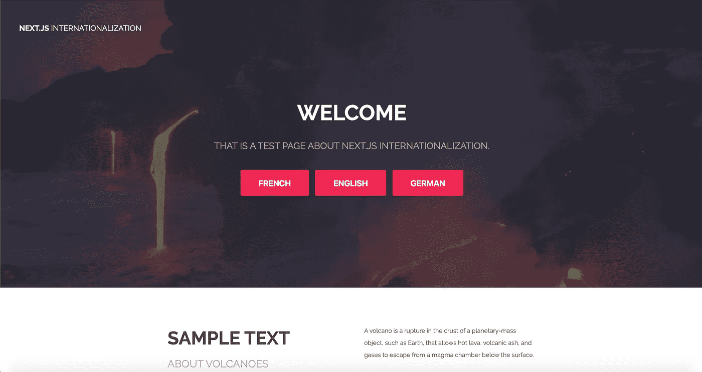
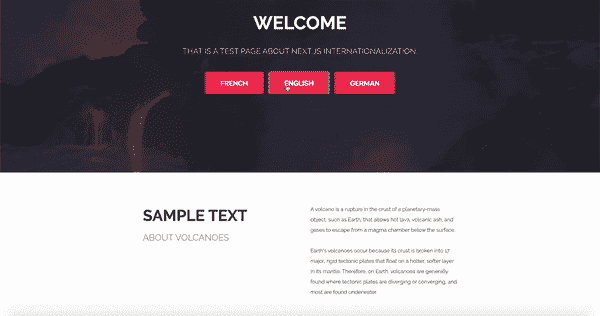

# 将您的 Next.js 应用程序翻译给全世界

> 原文：<https://levelup.gitconnected.com/translate-your-next-js-app-to-the-world-645d100277e>

将多语言引入 Next.js 应用程序的指南。


# 介绍

Next.js 为 React 应用程序提供了服务器端渲染。在本文中，我们将学习如何使用 [next-i18next](https://github.com/isaachinman/next-i18next) 来翻译 Next.js 应用程序中的文本。

我们将看到这些不同的选项:

*   使用 HOC(appwithTranslation，withtransflation)
*   使用钩子(使用翻译)
*   以编程方式更改语言

要阅读这篇文章，我们需要一个 Next.js 应用程序:[阅读 Next.js 文档](https://nextjs.org/learn/basics/getting-started)。

## 设置应用程序

首先，我们需要安装项目的依赖项:

```
yarn add express next next-i18next
```

i18n 需要如下配置文件:

此配置提供不同的翻译文件并设置默认语言。

既然我们已经创建了 i18n 实例，我们可以在我们的项目中使用它。

我们需要修改我们的项目:

*   创建翻译
*   创建 server.js
*   创建应用程序
*   修改/创建 package.json

**创建翻译**

为了翻译我们的应用程序，我们需要将翻译的内容提供给 Next.js. i18n 从静态文件夹下的 JSON 文件加载翻译:

```
project
└── public
    └── static
        └── locales
            ├── en
            |   └── common.json
            └── de
            |    └── common.json
            └── fr
                └── common.json
```

在 JSON 文件中，我们需要添加翻译:

**Create _app.js**

Next.js 中的 _app.js 用于初始化页面。i18n 将在其中通过使用特设的“appWithTranslation”进行初始化。

Your _app.js 应该是这样的:

**创建 server.js**

默认情况下，您的下一个应用程序通过运行以下命令启动:

```
next start
```

这里，我们需要用 Express 创建一个定制服务器来使用 i18n:

**修改 Package.json**

由于我们改变了应用程序的运行方式，我们需要更新“package.json”中的脚本。

现在配置已经完成，我们可以启动我们的应用程序了:

```
yarn run dev
```



示例应用程序

## 翻译应用程序

i18n 已经初始化，我们可以翻译我们的内容了！有两种可能的选择:

*   使用 HOC
*   使用挂钩

**使用悬挂夹具**

我们将使用“with translation”HOC 来翻译横幅组件:

以前，我们通过将文件命名为“common”来构建翻译文件。该名称将是我们在包装组件时使用的名称空间。

一旦用“withTranslation”包装了组件并提供了名称空间，就可以使用 props 中的 i18n 实例了。

**使用挂钩**

已经创建了 React 挂钩来使用 i18n 实例。我们将用它来翻译内容。

获取 i18n 翻译函数:

```
import {useTranslation} from 'react-i18next';
const {t} = useTranslation();
```

## 以编程方式更改语言

i18n 允许我们通过编程来改变语言。例如，通过点击一个按钮，选择…

我们需要让 i18n 对象调用“changeLanguage”函数。

```
import {useTranslation} from 'react-i18next';
const {t, i18n} = useTranslation();
```

我创建了三个按钮在 FR、DE、en 之间切换:

示例:



例子

GitLab 回购:[dmg.link/blog-i18n-next-repo](http://dmg.link/blog-i18n-next-repo)

**你可以在这里** **找到我的其他文章并关注我** [**。感谢阅读，我希望你今天学到了一些新东西🚀**](https://dmg.link/blog)

[](/automate-your-react-native-app-with-fastlane-ea516b4a893) [## 使用浪子自动化您的 React 原生应用程序

### 简化截图、测试版部署、应用商店部署和 React 原生应用的登录🚀

levelup.gitconnected.com](/automate-your-react-native-app-with-fastlane-ea516b4a893) [](https://medium.com/swlh/how-to-use-face-id-with-react-native-or-expo-134231a25fe4) [## 如何在 React Native 或 Expo 中使用 Face ID

### 将生物认证应用到 React Native 或 Expo 应用中。让您的用户使用它登录。

medium.com](https://medium.com/swlh/how-to-use-face-id-with-react-native-or-expo-134231a25fe4)