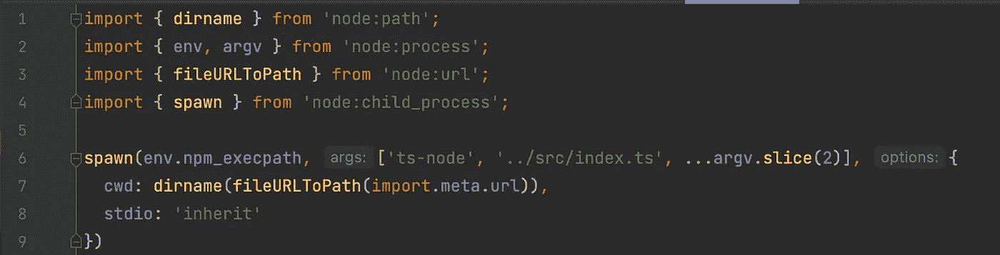

# 将类型脚本转换成双包(CommonJS + ESM)

> 原文：<https://levelup.gitconnected.com/transpiling-typescript-into-double-packages-commonjs-esm-d6b62cfc851c>

# 错误。他们无处不在

写这篇文章的原因是这样的错误:

> 错误[ERR_REQUIRE_ESM]:不支持来自…/file.ts 的 ES 模块…/index.js 的 REQUIRE()。
> 
> 相反，将…/file.ts 中 index.js 的 require 改为所有 CommonJS 模块中都可用的动态导入()。

发生这种情况是因为您试图从 CommonJS 模块连接 ES 模块。唉，近年来，在更新软件包和切换到新版本时，此类错误的数量一直在无情地增长。为什么会出现这样的错误？让我们来了解一下这种现象的本质。要做到这一点，你需要一头扎进 JS 的历史。

# 射流研究…

JS 出生于 1995 年。是在几个月内写成的。它最初是通过标记脚本加载到页面上的。页面上加载的所有 JS 都属于全局范围。因此，当加载多个外部脚本时，会出现冲突、变量重载和其他副作用。没有这样的进出口。虽然语言中保留了关键字。

# Node.js 和 CommonJS

到 2009 年，这项技术变得如此流行，以至于有人问为什么不在后端使用 JS。于是，Node.js 出现了。尽管语法相似，但排列方式略有不同。因为与浏览器不同，run-time Node 缺少 html 和 script 标记，所以加载 JS 需要一些其他机制来加载模块。需要这样一种机制。值得注意的是，require 并不是一个新的语言属性。这种机制内置于运行时。

Require.js 解析一个模块，在其中构建一个语法树，找到与其中其他模块的连接，选择第一个，将其连接到语法树，然后解析下一个模块。这个过程一直持续到整个树构建完成。直到这时，模块才被认为是加载的，也不可能对其进行分析。在解析和构建树之后，require 公开了 module.exports 对象，并提供了一个 API 来使用它，隐藏了实现细节。

还值得注意的是，与浏览器不同，node.js 不能通过 URL 进行搜索，而是通过文件的路径进行搜索，如果没有提供路径，则在本地 node_module 文件夹中搜索模块，如果为空，则在同名但级别更高的文件夹中搜索，以此类推，直到 node.js 到达根文件夹。这种惯例被称为 CommonJS。为了加载外部库，创建了 npm，它在外部共享存储库中或用户指定的存储库中查找包，并将必要的外部库拖到相应的 node_modules 文件夹中。

# Require.js 和 AMD 等

在 Node.js 发布和 require 机制出现一段时间后，来自浏览器世界的人欣赏这种方法，并采取措施将这种方法应用到自己身上。将 1in1 CommonJS 移植到浏览器是不可能的。第一个原因:在 Node.js 内部的 JS 和浏览器的工作中，是浏览器没有访问文件系统的权限，对 url 进行操作，而 node.js 对文件系统进行操作。原因二:运行时可以在脚本中添加任何变量。Module.exports 在浏览器中不可用。因此，在 2010 年，创建了 RequireJS 库。它为名为 AMD 的浏览器提供了 CommonJS 的改编版本。需要注意的是，AMD 和 CommonJS 并没有改变语言本身。

# ES6 和 ESM:

2015 年，ES6 出现了，它包含了很多社区要求的改变。除其他外，它描述了进口和出口。2017 年，这些标准在 Node.js 的 8 版本中实验性地实现。它们是 ESM 标题。ESM 和 CommonJS 之间的主要区别是动态导入，它允许在使用模块的各个部分时加载它们。同时，使用 await import 构造保留了静态导入的可能性，就实现而言，它类似于 CommonJS 中 require 的实现

# 事件年表:

按时间顺序描述的事件可以表示如下。

1995:

*   *浏览器(脚本)*

2009:

*   节点. js
*   CommonJS(节点。JS):要求|模块.导出

2010:

*   AMD(需要。JS | Browser):要求|模块.导出|定义

2015:

*   ES6 标准:导入|导出

2017:

*   ESM (Node.js 8.0.0 2017 实验| Node.js 12 2018):导入|导出

# 以打字打的文件

让我们再增加一层复杂性。从历史上看，Typescript 已经被移植到 CommonJS，并且是 JS 的严格语法超集。也就是说，它支持 JS 语言的所有属性，但同时向该语言添加了自己的语法结构。需要注意的是，浏览器和节点本身不支持 Typescript。要使用 TS，您必须首先将 TS 翻译成节点和浏览器可以理解的语言。第二个要点是，ESM 支持从 2022 年 4 月 8 日开始对 nodeResolution NodeNext 可用。

至此，TS 无法:

*   创建带有扩展名的正确导入；
*   解析 package.json 中的导出和导入部分；文档链接:[https://www . typescriptlang . org/docs/handbook/ESM-node . html # package JSON-exports-imports-and-self-referencing](https://www.typescriptlang.org/docs/handbook/esm-node.html#packagejson-exports-imports-and-self-referencing)

同样需要注意的是，jest 仍然不完全支持 ESM。

# 为什么 CommonJS 和 ESM 之间的过渡会很痛苦

1.  将 CommonJS 包导入 ESM 非常容易。同时，反向移植也伴随着困难。
2.  Node.js 最初面向 CommonJS
3.  有大量用 CommonJS 编写的包。例如，所有工具(ts-node、typescript 等)等。
4.  CommonJS 使得以不同的方式在包中实现模块化成为可能。因此，不同的工具有不同的模块化实现。
5.  CommonJS 允许外部进程修改 node，例如，ts-node 可以在运行时修改 node.js。现在这是不可能的。
6.  ESM 强加了某种模块化，因此平稳过渡是不可能的。

# Node.js 对新鲜包的建议:

需要注意的是，对于新的包，ESM 是包重用代码的官方标准格式。必须使用 import 和 export 语句定义模块。官方文件链接:[https://nodejs.org/api/esm.html](https://nodejs.org/api/esm.html)因此，我们得出结论，这种转变是不可避免的，也是令人不快的。Node.js 的哪些变化让这个过渡在当下更有利？对动态运行 ESM 的实验性支持出现在 Node.js 的另外 14 个版本中，但只有在版本 18 中才变得稳定。除此之外，ts-node 的最新版本引入了动态传输。

# 我们做了什么？

创建了一个库[https://src . align tech . com/projects/CCW/repos/IPL-shared/browse](https://src.aligntech.com/projects/CCW/repos/ipl-shared/browse)我们在它里面创建了一个 ESM 包，在最新的 JS 栈上:NodeJS 18。检查发射。一切都好。我们试图把它拖进基础设施:Jest，Eslint。添加了单元测试。一切正常。我们将包转换为 Typescript，并尝试通过 TS-node 运行它。一切正常。有一个微妙的问题，在早期的第 18 版中，不可能影响其内部结构的工作，因此我们必须编写以下包装程序来运行 Typescript:

但是所有这些机制只能在单一存储库的框架内工作。为什么？因为对于外部包，有必要以 CommonJS 或 ESM 的形式准备一个项目。

当然，我们可以通过静态导入 const X = await import(' Y ')；但是没什么成效。

为此，我们设置 transpiler 来生成 esm 和 commonJS 模块。

下面的结构出来了:

距离/

*   esm/
*   commonJS/

src/

*   Package.json(其中指定了模块类型)

在我们的情况下，我们可以从三个点导入包:

1.  从相邻的工作区通过。/src/index.ts 文件夹

2.当我们从另一个库导入编译后的代码时:

a.来自 ESM

b.来自 CommonJS

该计划正在发挥作用，但遗憾的是，对于全面的工作来说，这还不够。我将用一个例子来说明这个论点:

当然，你可以使用 createRequire 和 await import，但我更愿意用传统的方式连接:从“@ align tech-IPL/translations-core”导入{ something }；const { something } = require(" @ align tech-IPL/translations-core ")；

# 为什么不这样做比较好？

*   进入实现细节
*   人为因素，因为我们添加了潜在的错误，以防包结构发生变化

# 有条件出口

为了简化代码中的导入，我们在 package.json 中使用了两个构造:

*   PublishConfig —此字段包含一个对象，该对象的属性将在为发布而构建包后被替换为同名的属性

结果是这样的:

我给截图补充一些细节:

*   "."是子路径导出。多亏了他，我们可以一路实施不同的出口条件
*   “类型”—允许您根据条件指定不同的类型
*   “默认”是通用的入口点

# 我们还必须做什么？

*   即使在使用条件导出的情况下，我们也必须在 ESM 或 CommonJS 包中将 js 扩展改为 mjs (cjs)。
*   默认情况下，js 文件将由 node.js 根据 package.json 中 type 字段的值进行解释。
*   此外，我们需要将非双重软件包替换为 CommonJS 和 ESM 版本软件包的相应版本。例如，在 ESM 中使用 lodash-es，在 commonJS 中使用 lodash。

# 总结:

*   我们设法建立了终端节点发射
*   飞行中的蒸发证明:
*   与类似的发射相比，测试发射的速度提高了 6-10 倍。
*   原来是设置了双包(commonJS | esm)

# 链接:

*   [https://nodejs.org/docs/latest-v18.x/api/packages.html](https://nodejs.org/docs/latest-v18.x/api/packages.html)
*   [https://medium . com/sung the code/JavaScript-module-module-loader-module-bundler-es6-module-confused-yet-6343510 e 7 bde](https://medium.com/sungthecoder/javascript-module-module-loader-module-bundler-es6-module-confused-yet-6343510e7bde)
*   [https://nodejs . org/API/packages . html # dual-commonjses-module-packages](https://nodejs.org/api/packages.html#dual-commonjses-module-packages)
*   [https://nodejs.org/api/packages.html#conditional-exports](https://nodejs.org/api/packages.html#conditional-exports)
*   [https://www . typescriptlang . org/docs/handbook/release-notes/typescript-4-7 . html # package JSON-exports-imports-and-self-referencing](https://www.typescriptlang.org/docs/handbook/release-notes/typescript-4-7.html#packagejson-exports-imports-and-self-referencing)
*   [https://2ality.com/2019/10/hybrid-npm-packages.html](https://2ality.com/2019/10/hybrid-npm-packages.html)
*   [https://www . typescriptlang . org/docs/handbook/ESM-node . html # package JSON-exports-imports-and-self-referencing](https://www.typescriptlang.org/docs/handbook/esm-node.html#packagejson-exports-imports-and-self-referencing)

# 分级编码

感谢您成为我们社区的一员！在你离开之前:

*   👏为故事鼓掌，跟着作者走👉
*   📰更多内容请查看[升级编码刊物](https://levelup.gitconnected.com/?utm_source=pub&utm_medium=post)
*   🔔关注我们:[推特](https://twitter.com/gitconnected) | [LinkedIn](https://www.linkedin.com/company/gitconnected) | [时事通讯](https://newsletter.levelup.dev)

🚀👉 [**将像你这样的开发人员安置在顶级创业公司和科技公司**](https://jobs.levelup.dev/talent/welcome?referral=true)