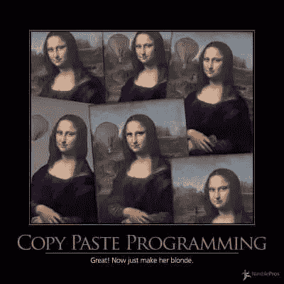

# ctrl + c ctrl + v 编程的陷阱

> 原文：<https://levelup.gitconnected.com/traps-of-ctrl-c-ctrl-v-programming-a075700c79af>

> 如果你在编码时使用复制和粘贴，你可能会犯设计错误。
> 
> 大卫·帕纳斯

当你为软件写代码时，你使用 ctrl + c(复制)和 ctrl + v(粘贴)的频率有多高？—我先来。我做过很多。

复制粘贴编程

对于手头的问题，这可能是一个快速的解决方案，但是我通常认为这是一个反模式，并且伴随着各种长期的缺点。在这篇文章中，我将展示复制粘贴编程的一般意图，为什么它有时不好，以及如何避免它。

复制粘贴编程的主要意图是尽早完成一些技术工作或者不做返工。有时可能是您自己陷入了编写代码的困境，或者您已经知道类似的代码存在于您的代码库中，或者您可以从中复制的任何地方。这听起来像是聪明的工作，但可能会以苦乐参半的经历告终。

# 没有想到一个新的创新解决方案

如果您正在复制的代码是几年前编写的，并且使用旧的做事方法，会怎么样？参考它，但是用创新的工具和技术来写你自己将会改善你的代码的状态，并且将帮助你保持代码简洁，更好的性能和可读性。

# 重复的代码，重复的测试，大量的维护工作

在多个地方复制粘贴代码会产生重复的代码，如果你相信并为你的代码编写测试，你知道会发生什么。您需要为复制粘贴的重复代码编写重复的测试。此外，维护成本也将随之飙升。对于相关代码的任何变更请求，必须在代码存在的地方完成。

> “听说过干原则吗？—复制粘贴内容时，你会忽略这一点。”

在所有引用中寻找重复的代码并不是一件有趣的工作，有时如果遗漏了，可能会有 bug 潜入。这也增加了技术债务，你甚至需要承担一个单独的项目，通过重构和重新设计你的代码来根除它们。

# 无与伦比的标准、原则和最佳实践

盲目地复制粘贴代码将会极大地导致[意大利面条式的代码](https://exceptionnotfound.net/spaghetti-code-the-daily-software-anti-pattern/),这也推翻了你的团队制定的一些标准、原则和最佳实践。随着时间的推移，你的团队的身份将会丢失，它需要一个救世主来恢复你的信仰。

# 成为一名懒惰的程序员

复制代码也会让你加入懒惰程序员的行列，你会成为一个不独立思考，总是寻找代码的人。

懒惰的程序员

寻找一个解决方案一点也不坏，但是不理解它是如何和为什么工作的，或者不独立思考是有问题的。对于一个程序员来说，逻辑思维是拯救一栋着火的房子的最重要的技能。

# 庞大的项目

您复制粘贴的次数越多，项目的大小就越大。大小可以是物理的也可以是逻辑的。从逻辑上讲，代码太多会影响可读性，你会厌倦在多个地方看到相同的代码。

# 很难修复错误

你有一个超级严重的错误需要在接下来的几个小时内修复。你最不想要的是从某处粘贴的代码副本，但是没有人知道它是如何工作的。

修复 bug 很困难

> “通过复制粘贴，不要继承人家的问题”

您可能最终会完全重写代码并以最好的方式修复 bug，或者花几个小时试图理解复制的代码并在此基础上提供修复。无论哪种方式，你必须确保你不是仅仅通过修复已报告的 bug 来引入新的 bug。

在你下次复制粘贴代码之前，我想留给你几个问题？

1.  我可以自己编写这段代码吗？或者我可以想出其他更好的创新解决方案吗？
2.  如果代码已经存在于你的代码库中，你能重构它或者使用正确的设计模式使它通用化并重用代码吗？
3.  你有足够的时间测试代码重复的地方吗？
4.  一个新的变更请求进来了，你需要在它被复制的地方进行变更。你能从你的产品经理那里购买多少时间来做这种疯狂的维护工作？

我们都知道我们会在某个时候继续复制粘贴代码，但是承认这一点并考虑更好的选择会使情况好得多。你有什么复制粘贴代码的经验？—我很想听听你的想法！

**参考文献:**

下面是一些关于重构和复制粘贴编程的优秀参考:

1.  [重构:改进现有代码的设计](https://www.amazon.com/Refactoring-Improving-Design-Existing-Code/dp/0201485672)书
2.  [重构大师网站](https://refactoring.guru/refactoring)
3.  [马丁·福勒关于复制粘贴编程的想法](https://martinfowler.com/bliki/CannotMeasureProductivity.html)